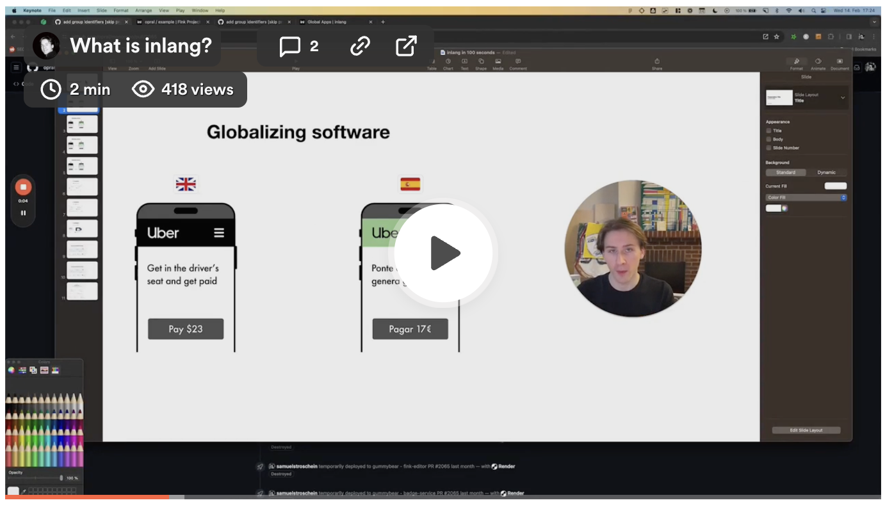

  

  
  
  <h2 align="center">
    The open file format and ecosystem for software localization (i18n)
  </h2>

  

     
    <a href='https://inlang.com/c/apps' target="_blank">🕹️ Apps</a>
    ·
    <a href='https://inlang.com/documentation' target="_blank">📄 Docs</a>
    ·
    <a href='https://discord.gg/gdMPPWy57R' target="_blank">💙 Discord</a>
    ·
    <a href='https://twitter.com/inlangHQ' target="_blank">𝕏 Twitter</a>
  

 

## What is inlang?

Inlang is an open file format to localize software.

The file format enables an ecosystem of interoperable [lix apps](https://lix.opral.com) to build a globalized product.

Every app in the inlang ecosystem shares the same review, automation, and collaboration layer, making cross-team collaboration possible. No syncing, hand-offs, or automation barriers.

#### Example apps

- [Paraglide.js](https://inlang.com/m/gerre34r/library-inlang-paraglideJs) to have a fully translated, typesafe & fast app in minutes
- [Sherlock](https://inlang.com/m/r7kp499g/app-inlang-ideExtension) to translate your app right in the editor
- [Fink](https://inlang.com/m/tdozzpar/app-inlang-finkLocalizationEditor) to translate your app in the browser & invite collaborators to help you
- [Parrot](https://inlang.com/m/gkrpgoir/app-parrot-figmaPlugin) see translations directly in Figma
- [inlang CLI](https://inlang.com/m/2qj2w8pu/app-inlang-cli) to lint your messsages with lint rules or machine translate them & have quality control in CI/CD
- _build your own app / plugin / lint rule_ with the [inlang SDK](https://inlang.com/documentation)
- ...

## Why inlang?

Localizing software is a cross-team effort that involves ensuring compliance, adapting the design, handling different currencies, managing translations, writing different marketing copy, etc.

Existing point solutions such as apps to manage translations (Lokalise, Weglot, Smartling), apps to manage design copy (ditto, translator), or i18n libraries for developers (next-intl, i18next) don’t have interop between each other.

The lack of interop of existing solutions leads every app and team to have its own collaboration layer, review system, and automation capabilities. Cross-team collaboration and automation, which are required to localize software, are difficult to impossible.

## Contributing

There are many ways you can contribute to inlang! Here are a few options:

- Star this repo
- Create issues every time you feel something is missing or goes wrong
- Upvote issues with 👍 reaction so we know what the demand for a particular issue to prioritize it within the roadmap

If you would like to contribute to the development of the project, please refer to our [Contributing guide](https://github.com/opral/monorepo/blob/main/CONTRIBUTING.md).

All contributions are highly appreciated. 🙏
