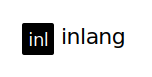

    

        
    

    <h2 align="center">
        Open source localization solution for software build on top of <a href="https://projectfluent.org" target="_blank">Mozilla's Fluent project</a>.
    </h2>
    <h3 align="center" style="padding-top: 0.6rem;">
        <a href="https://inlang.dev/docs/getting-started" target="_blank">Get Started</a> · <a href="https://inlang.dev/docs" target="_blank">Documentation</a> · <a href="https://inlang.dev/blog" target="_blank">Blog</a>
    </h3>

---

## Goals

## Status

[x] Collaboration on translations with non-technical team members or translators.  
[x] Machine translations.  
[x] Linting of translations (in the dashboard).  
[x] Synchronize translations (via the CLI or Copy & Paste).  
[] Over the air updates without releasing a new version of your app.  
[] Self-hostable, see [this discussion](https://github.com/inlang/inlang/discussions/65).

Are you missing a feature? Head over to discussion to [request a new feature](https://github.com/inlang/inlang/discussions).

## Status

[x] Alpha: Stable enough to translate simple apps.  
[ ] Beta: Translate medium sized software projects which require ongoing translations.  
[ ] Release: Production ready.

## Community & Support

- [GitHub Discussions](https://github.com/inlang/inlang/discussions): feedback and questions.
- [GitHub Issues](https://github.com/inlang/inlang/issues): bugs you encounter using inlang.
- [Discord](https://discord.gg/CUkj4fgz5K): contact the maintainers and hang out with the community.
