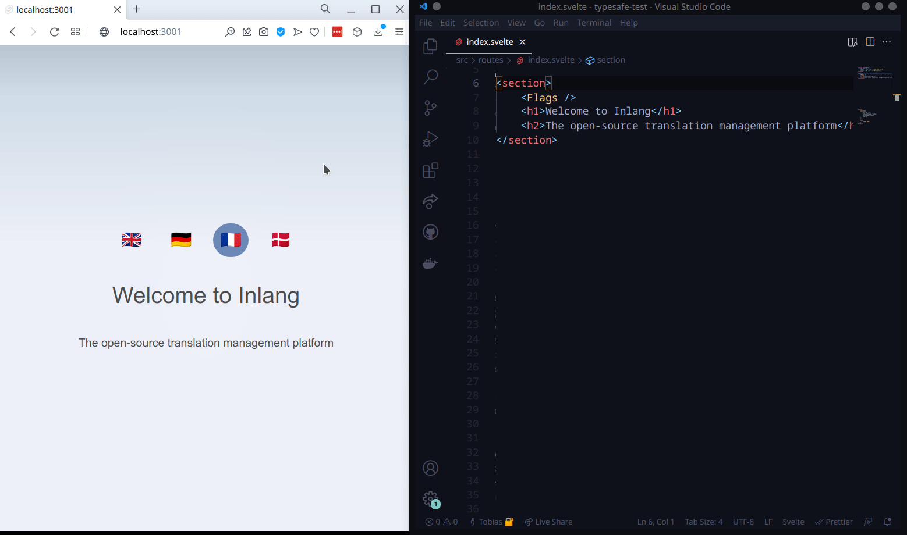
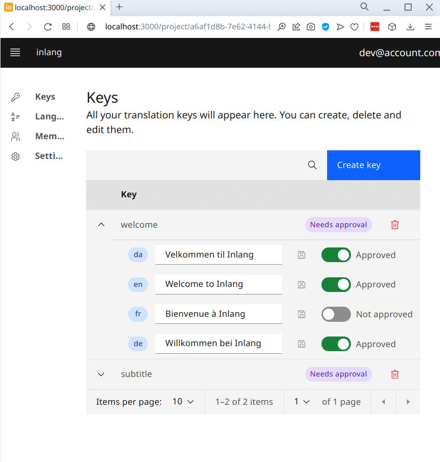
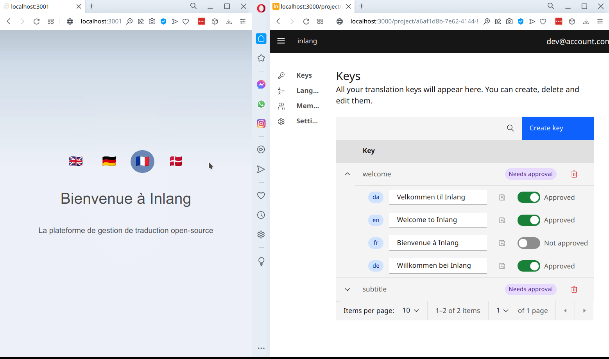

    
    

  Create translations directly in VSCode and invite collaborators via the dashboard.

# inlang

Inlang is an open source localization (translation) solution for mobile and web apps with developer experience (DX) in mind. Don't write translations manyally in JSON files or (ab)use excel spreadsheets to manage translations. With inlang you get collaboration, type safety, machine translations and automatic sync in one tight package.

But that's just the beginning. We want to help you localize your apps with one click. Want to stay up-to-date? [Subscribe to our newsletter](TODO) (no spam!)

**Status**

- [x] Early Alpha: We are testing the solution and need your feedback.
- [ ] Beta: Stable enough for small(er) apps and projects.
- [ ] Release: Production ready.

**Supported Languages**
- [x] TypeScript using [typesafe-i18n](https://github.com/ivanhofer/typesafe-i18n)
- [ ] Dart / Flutter
- [ ] Swift / iOS
- [ ] Kotlin / Android  

**Features**
- [x] Typesafety (no more missing translations/keys)
- [x] Collaboration via the dashboard 
- [x] Sync between dashboard and source code
- [x] Variables / Interpolation
- [ ] OTA (Over the air updates without releasing a new version)
- [ ] Pluralization

Are you missing a feature? Head over to discussion to [request a new feature](https://github.com/inlang/inlang/discussions).

## Getting started

Link to documentation
https://docs.inlang.dev

## Community & Support

- [GitHub Discussions](https://github.com/inlang/inlang/discussions): public feedback and questions.
- [GitHub Issues](https://github.com/inlang/inlang/issues): bugs you encounter using inlang.
- [Discord](https://discord.gg/CUkj4fgz5K): contact the maintainers and hanging out with the community.

## Demo

### Step 1 - Create keys directly in VSCode
Keys are automatically sent to the dashboard, machine translated into all languages and synced with your source code. Bonus on top: typesafety (no more missing translations/none existent keys). 

### Step 2 - Manage translations in the dashboard
Collaborators, or you yourself, can seamlessly edit translations in the dashboard. During development the translations are automatically synced with the source code.

