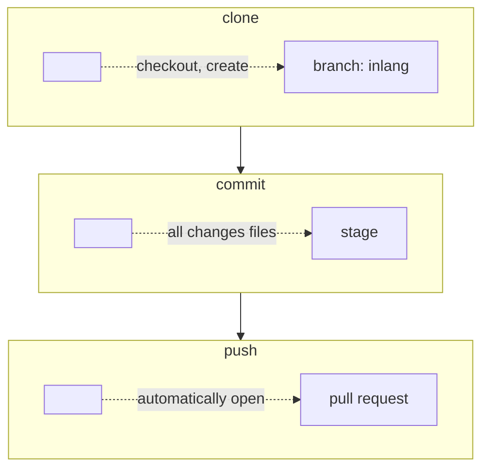

# Git Workflow

The git workflow looks for as following:

1. clone -> open
2. commit -> save (changes)
3. push -> submit (for review)

```mermaid
flowchart TD
   subgraph clone
      d[ ]-.->|checkout, create|branch[branch: inlang]
   end
   clone-->commit
   subgraph commit
      x[ ]-.->|all changes files|stage
   end
   commit-->push
   subgraph push
      p[ ]-.->|automatically open|pull[pull request]
   end

```
