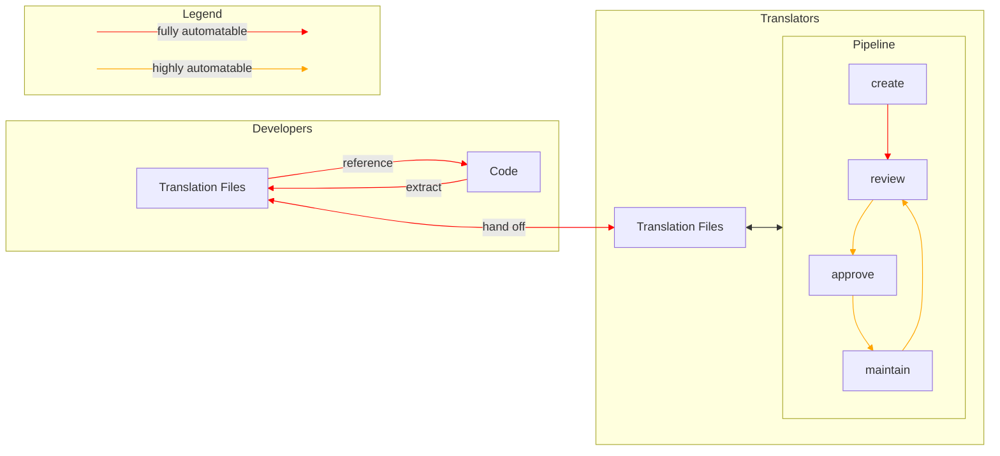

```mermaid

flowchart LR
    TF1<--->|hand off|TF2
    subgraph Translators
        direction LR
        TF2[Translation Files]<-->Pipeline
        subgraph Pipeline
            direction TB
            create-->review
            review-->approve
            approve-->maintain
            maintain-->review
        end
    end
    subgraph Developers
    TF1[Translation Files]-->|reference|Code
    Code-->|extract|TF1
    end
    subgraph Legend
      direction LR
      start1[ ] --->|fully automatable| stop1[ ]
      style start1 height:0px;
      style stop1 height:0px;
      start2[ ] --->|highly automatable| stop2[ ]
      style start2 height:0px;
      style stop2 height:0px; 
    end
    linkStyle 0 stroke:red;
    linkStyle 2 stroke:red;
    linkStyle 3 stroke:orange;
    linkStyle 4 stroke:orange;
    linkStyle 5 stroke:orange;
    linkStyle 6 stroke:red;
    linkStyle 7 stroke:red;
    linkStyle 8 stroke:red;
    linkStyle 9 stroke:orange;

```
