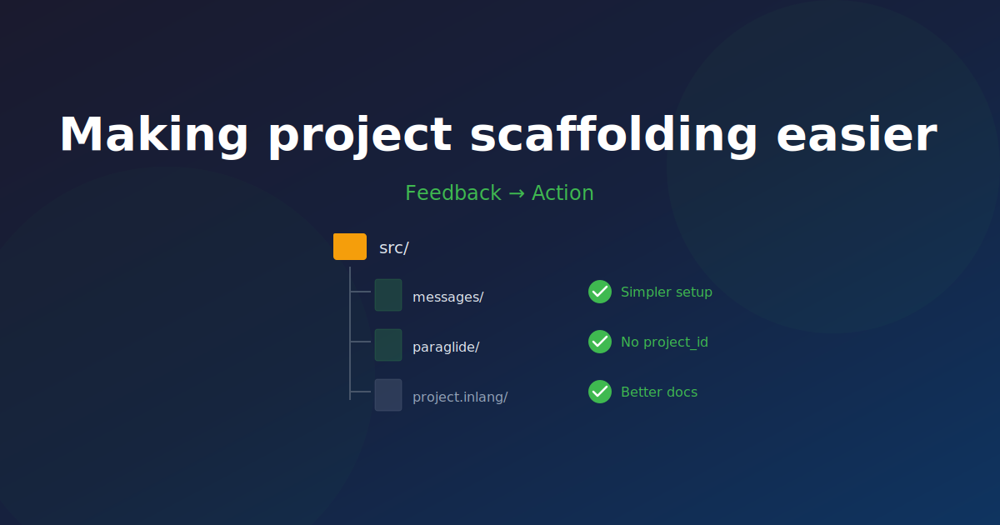

# Making project scaffolding easier

[Pedro Martins](https://nikuscs.com/) wrote a comprehensive guide on [i18n in TanStack Start](https://nikuscs.com/blog/13-tanstackstart-i18n/) where he evaluated Paraglide JS and concluded it wasn't the right fit. After his blog post, we had a conversation where he shared more details:

- **project_id is confusing** — "The scaffolding was weird, it creates a project id (that I'm not really sure what is used for?)"
- **Middleware is opaque** — "If you want to create new ones it's 'opaque' on how you do it and what's the lifecycle."
- **Monorepo setup unclear** — "Not clear how the messages are generated without Vite (in my case was a monorepo)."

This feedback was valuable. Here's what we changed.

## No More project_id

The `project_id` was used for anonymous telemetry and a sync protocol. Both are not needed anymore. Thus, `project_id` is gone.

## Middleware Documentation

New dedicated docs covering:

- How middleware works (it's `Request -> Response`)
- How to customize and extend middleware
- Standalone server usage (Elysia, etc. without Vite)

[Middleware docs →](https://inlang.com/m/gerre34r/library-inlang-paraglideJs/middleware)

## Monorepo Guide

Clear documentation for monorepo setups, including how message compilation and watch mode work outside of Vite contexts.

[Monorepo docs →](https://inlang.com/m/gerre34r/library-inlang-paraglideJs/monorepo)

## CLI Watch Mode

Paraglide JS's CLI now has a `--watch` flag for development in monorepos or non-Vite projects.

[CLI docs →](https://inlang.com/m/gerre34r/library-inlang-paraglideJs/compiling-messages#via-the-paraglide-cli)

## Thank You

Open source thrives on honest feedback. Pedro took time to write a detailed blog post and then spent more time explaining his pain points. That kind of engagement is rare.

If you tried Paraglide JS before and decided the scaffolding was weird, give it another try.

---

_Links:_

- [Paraglide JS Docs](https://inlang.com/m/gerre34r/library-inlang-paraglideJs)
- [Middleware Guide](https://github.com/opral/paraglide-js/blob/main/docs/middleware-guide.md)
- [Monorepo Setup](https://github.com/opral/paraglide-js/blob/main/docs/monorepo.md)
- [Pedro Martins](https://nikuscs.com/)
- [Pedro's original post](https://nikuscs.com/blog/13-tanstackstart-i18n/)

