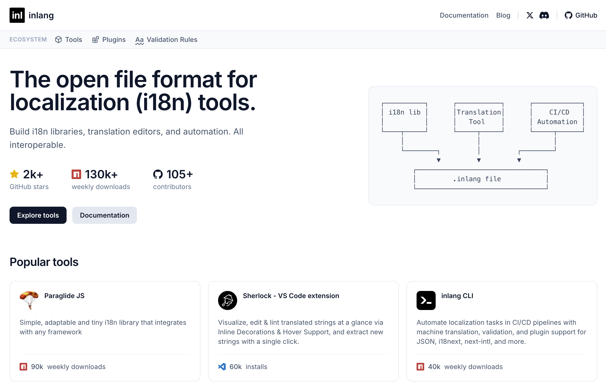
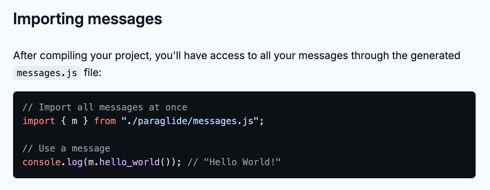
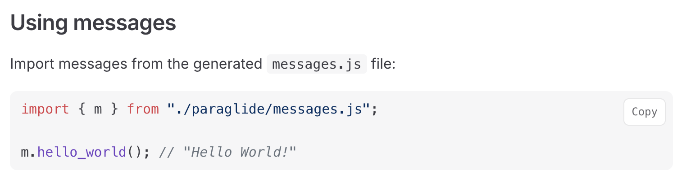
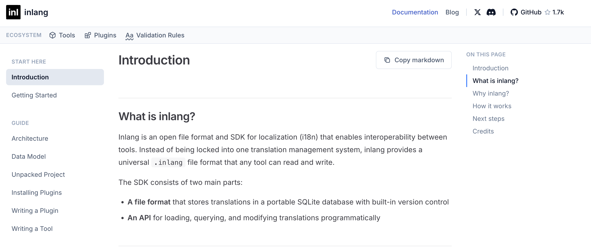
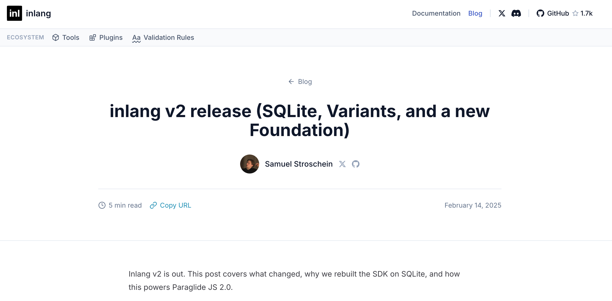
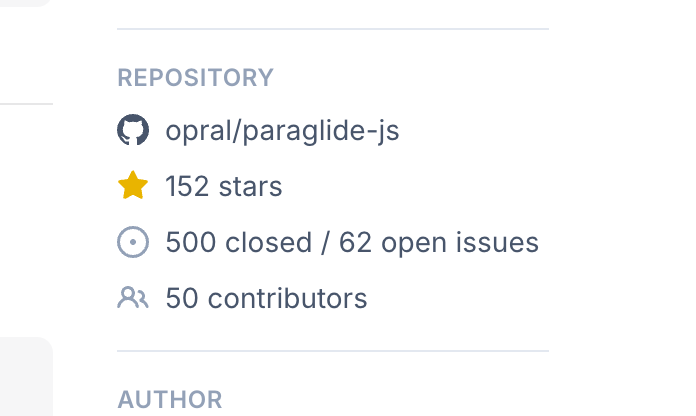

# New website with copy to clipboard, integrated docs, and blog

We rebuilt inlang.com for better DX and SEO. The new site is built on [TanStack Start](https://tanstack.com/start), inspired by [VitePress](https://vitepress.dev/). We couldn't use VitePress directly because tools from the inlang ecosystem embed their documentation on inlang.com, sparing them from building their own docs sites.

## Copy to clipboard

Finally. Code snippets now have a copy button.

Before:

After:

## Integrated docs

Documentation moved from GitHub READMEs to the website with proper navigation and search. Each package now has its own docs section with a sidebar, table of contents, and cross-linking.

## Blog

A place for updates and announcements. Previously there was no way to communicate changes to users.

## Social proof

GitHub stars, npm downloads, and Discord members are now visible on each tool page to help users make faster adoption decisions.

## "App" → "Tool"

We renamed "app" to "tool" for better positioning. A library like Paraglide JS or a CLI isn't an app. "Tool" is more generic and fits any category.
