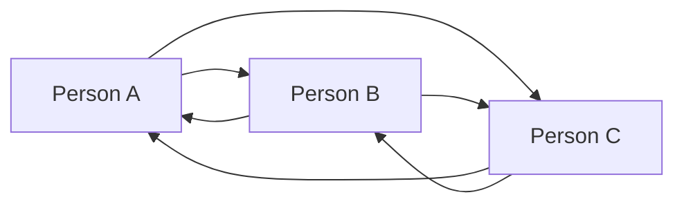
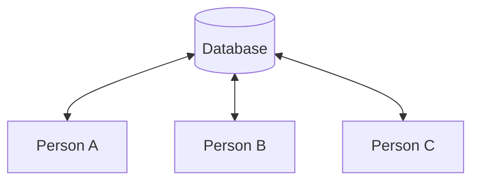
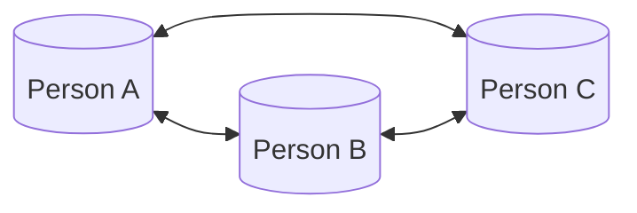
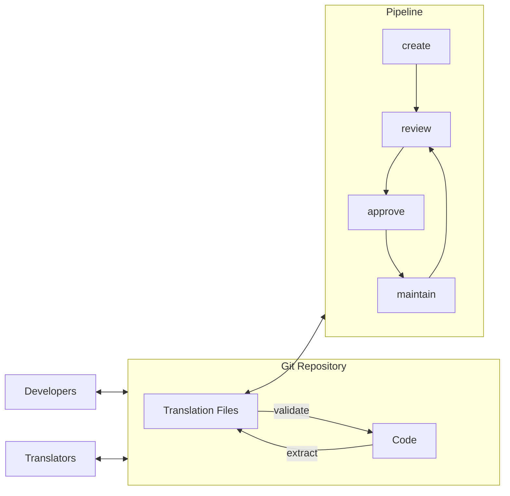
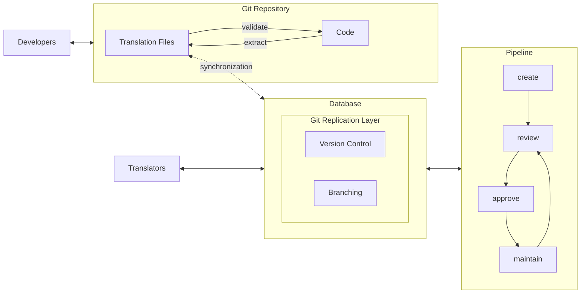

# March 2022: Does a git-based architecture make sense?

This document has been written by me, [@samuelstroschein](https://twitter.com/samuelstroschei), as a note to myself on why a git-based architecture makes sense.

## How exactly does inlang’s architecture work?

Creation Date: March 5, 2022 8:33 PM

**Inlang works with a file system instead of a database.**

Most content, including translations, exists in the form of files. Current solutions (and most SaaS services) are proud of replacing files with a database. They miss the point though. The portability and ease of use of files are unmatched.

**So why are current localization solutions (most startups generally) replacing files with databases?**

Collaboration. Collaboration is the wave most web-app startups ride on. Databases make the implementation of collaboration features easier. Regular files have no version history which makes merging and thus seamless collaboration impossible. Database schemas can be designed to include version history. Furthermore, several actors editing different documents which need to merge are nonexistent with a database approach. Each actor edits the same document, the one in the database. That’s why a constant internet connection is required for apps like Google Docs.

> The document references the problem of synching and merging changes as **the collaboration problem.**

**An interesting observation with translation files.**

Compared to other (content) files, translation files are unique: They are saved directly in the source code. Software engineering has solved the collaboration problem for decades. At first, with a database-like approach (one central server; what most startups are implementing nowadays). But since a decade distributed version control, the frontier being git, took the software engineering world by storm. Over 90% of modern source code is now tracked with [Git](https://en.wikipedia.org/wiki/Git) - based on the 2018 StackOverflow developer survey.

> **Git** is software for tracking changes in any set of [files](https://en.wikipedia.org/wiki/Computer_file), usually used for coordinating work among [programmers](https://en.wikipedia.org/wiki/Programmer) collaboratively developing [source code](https://en.wikipedia.org/wiki/Source_code) during [software development](https://en.wikipedia.org/wiki/Software_development).
> [_https://en.wikipedia.org/wiki/Git_](https://en.wikipedia.org/wiki/Git)

Git solves the collaboration problem without relying on a centralized source of truth. Changes of different actors (persons) are tracked in a special directory/folder called repository. The repository keeps track of changes in all files contained in the repository. The trick: Since repositories keep track of all changes, different repositories (hence files) can be synched and merged, solving the collaboration problem without relying on a single source of truth like a database.

**Inlang is built on top of git and local files**
Translation files are saved in a git repository. Instead of relying on a database, inlang’s localization management platform is a UI (User Interface) on top of already existing git repositories.

Advantages:

- no collaboration problem
- works without accounts
- even works with local files
- no workflows have to be changed
- all features that git offers for free
- every improvement to the localization management platform automatically improves inlang’s developer tools

Disadvantages:

- custom APIs for file formats have to be developed (instead of leveraging auto generating database APIs)
- leveraging git to build applications on top of is a new approach and will lead to some workarounds down the road.

**Existing solutions have an architectual disadvantage.**

Existing solutions choose a centralized database approach and, unbeknown to them, replicated many features of git without the major benefit of eliminating data silos and synchronization.

Their architecture maintains two states. First, the git repository, and second the database. Both states need to be synchronized with each other. To conduct synchronization, version control and branching features of git had to be replicated. This architecture is a typical data silo architecture that gives rise to tools like [Zapier](https://zapier.com/) and “please not yet another tool” remarks.

**Why did existing solutions choose a centralized data silo architecture?**

1. It’s the standard approach to build a SaaS.
   - Weak argument but might be true.
2. The technology was not ready/is emerging.
   - JavaScript became capable to run git in the browser recently [source](https://github.com/isomorphic-git/isomorphic-git) with workers and webassembly.
   - Since early 2022 Chromium-based browsers and Safari have access to the file system [source](). Which already leads to an influx of applications like [vscode.dev](https://vscode.dev/).
3. Using a database is "good enough". There is only one way to find out whether a git-based architecture is breakthrough for localization: try it.
