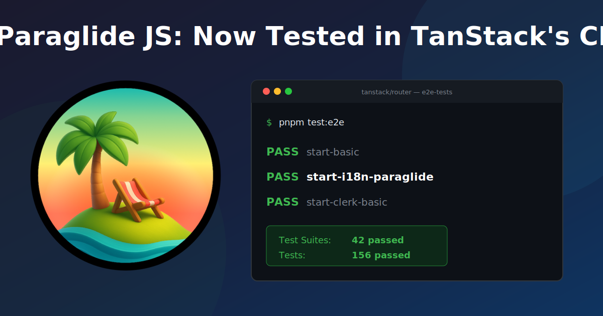

Paraglide JS is now part of TanStack's CI/CD pipeline. Every commit to TanStack Router runs e2e tests against Paraglide. If something breaks, it gets caught before release.

Many thanks to [@juliomuhlbauer](https://github.com/juliomuhlbauer) for creating first class TanStack examples and [@schiller-manuel](https://github.com/schiller-manuel) for integrating Paraglide JS into TanStack's CI/CD pipeline ([TanStack/router#6201](https://github.com/TanStack/router/pull/6201)).

## Background

TanStack Router v1.145+ introduced changes to the middleware and rewrite layer that caused redirect loops when used with Paraglide ([#6089](https://github.com/TanStack/router/issues/6089)). Neither project broke independently — the issue only surfaced when used together.

## Get Started

Check out the [official TanStack i18n example](https://github.com/TanStack/router/tree/main/examples/react/start-i18n-paraglide) or read the [Paraglide JS docs](https://inlang.com/m/gerre34r/library-inlang-paraglideJs).
