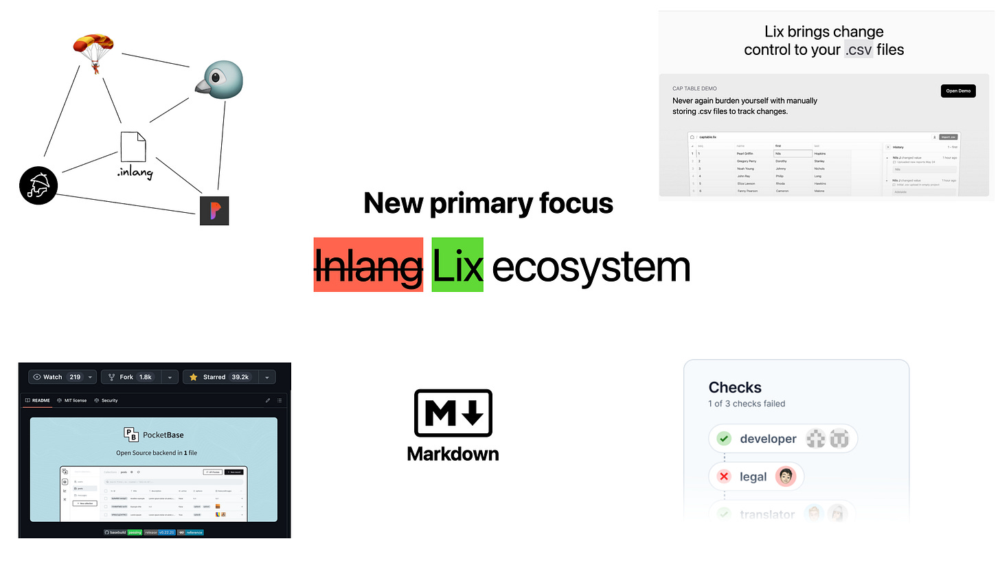
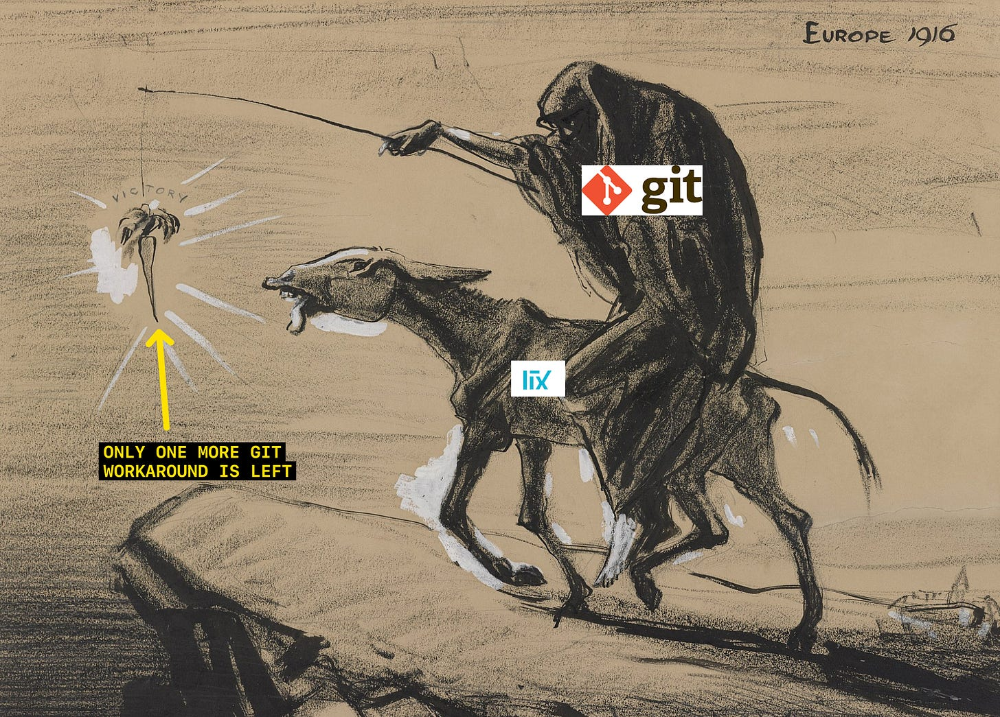

Dear inlang community, 

The release of the inlang SDK v2 (variant support) is blocked until we have a 1.0 release of the lix version control system. We are prioritizing [lix](https://lix.opral.com/) so we can unblock v2. Which means:

- The release of the inlang SDK v2 is likely postponed until Jan/Feb next year.

- We plan to have a lix 1.0 release by mid-December at the latest.

- Until the lix 1.0 release, no new features are added to the inlang SDK or apps.

Subscribe to receive monthly company updates at https://opral.substack.com/t/inlang

## Try out the inlang SDK v2 demo with Fink 

As a sneak peek of what’s coming with v2, check out the Fink v2 demo [https://fink2.onrender.com/](https://fink2.onrender.com/). 

## What is lix?

Unbeknown to many of you, inlang has been built on the lix version control system over the past two years. You probably ask yourself right now: “What is lix?”.

Lix is a version control system, a new technology that allows controlling changes in various file formats, such as .csv, .inlang, music, video, architecture, .cad, and more. Controlling changes refers to workflows like change tracking, automation pipelines (CI/CD), or review systems. 

You can try out a CSV file demo of lix [here](https://csv.lix.opral.com/).

## Inlang needs lix version control to succeed

What makes globalization of software complicated is the required coordination effort. Designers need to know that translators updated translations to adjust their UIs, developers need to redeploy the app if translations change, auditors need to know that a message has changed, … the list goes on. 

It was clear in March 2022 [[RFC 01](https://github.com/opral/monorepo/blob/c3ea483c6b6de65f8f05b211e06cbd53f73054b1/inlang/blog/notes-on-git-based-architecture.md)] that solving globalization of software requires version control to coordinate changes between teams. It was also clear that [git is unsuited for applications](https://github.com/opral/monorepo/blob/c3ea483c6b6de65f8f05b211e06cbd53f73054b1/inlang/blog/git-as-sdk.md#but-git-as-back-end-is-not-perfect), and we would have to develop lix.

Version control is required to reduce the coordination effort and automate globalization pipelines.

## Git slowed lix and inlang down

We [initially built lix on top of Git](https://github.com/opral/monorepo/blob/c3ea483c6b6de65f8f05b211e06cbd53f73054b1/inlang/blog/notes-on-git-based-architecture.md), thinking that we ease adoption and benefit from Git’s decade-long development. That turned out to be false. We delayed building differentiating lix technologies. I gave a [presentation last week that delaying differentiating technology leads to a death trap for startups](https://samuelstroschein.substack.com/p/dont-delay-building-differentiating). A vicious cycle of building around git instead of building what differentiates lix occurred, consuming most engineering resources. Among the workarounds that we did because of git: 

- we [needed to develop a git-compatible persistency layer](https://github.com/opral/monorepo/issues/1844) to deliver multi-variant support (gendering, pluralization, etc). It took more than 6 months and ended up getting canceled. 

- were [about to build a custom database](https://github.com/opral/monorepo/issues/1772) to sync git, filesystem, and app state

We were trapped in a vicious cycle of “only one more git workaround.” A never-ending story of consuming engineering resources without perceivable progress.

## Rebuilding lix on SQLite WASM

Long story short, we are [rebuilding lix from scratch using a WASM build of SQLite](https://opral.substack.com/p/accelerate-by-years-part-iii-lix). 

That will lead to [perceivable progress](https://samuelstroschein.substack.com/p/dont-delay-building-differentiating) for lix, make building inlang faster, and ultimately get to our vision of making globalization of software easy due to version control.

The refactoring will take till the end of the year. Till then, releasing inlang v2 would lead to overhead and distractions. Hence, stay tuned. In the meantime, [try the Fink v2 demo](https://fink2.onrender.com/) to get a feeling of what’s coming.
