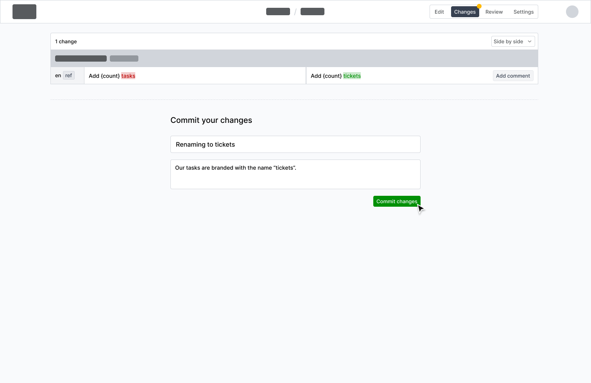
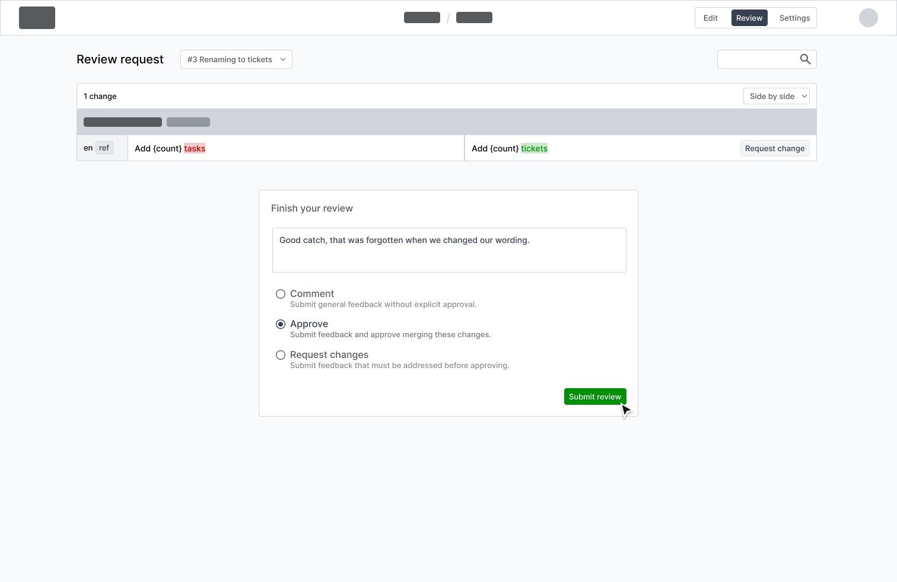
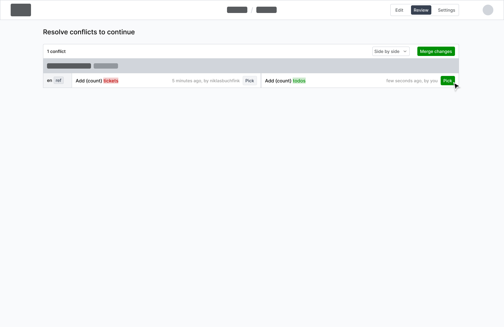
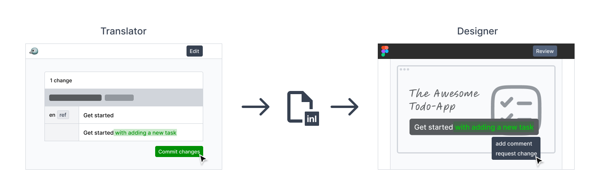

> [!NOTE]
> This blog post is part of ongoing development of [lix.dev](https://lix.dev). A new version control system.

Knowing what, when and how data changed is vital to collaboration. Yet most applications offer no version control. We asked ourselves: How would version control look in Fink?

*Fink is our localization/CAT (computer-assisted translation) editor. You can check it out yourself [here](https://inlang.com/m/tdozzpar/app-inlang-finkLocalizationEditor).*

## Commit Changes

After completing their changes, users can review them and make any necessary adjustments before committing them to the project. Describing the changes in comments is essential for helping other users understand the modifications. 
A commit will trigger a review by those responsible for the language changes.

## Review workflow

Reviews are crucial for version control, as most changes need to be reviewed and approved. All new committed changes that need to be reviewed by a user are listed in the review tab. The differences between the old and new message are highlighted and can be viewed either stacked above each other or in a side-by-side view. If something does not meet the requirements, the reviewer can request the user to update their changes with comments. It is also possible to request changes for single or all messages. The review cycle is completed with the approval of one of the reviewers and the changes are applied.

## Merge changes together

If multiple people edit the same translation, two conflicting changes of the same message exist and can’t be automatically merged. Whenever merge conflicts arise, the user is presented with a list of conflicts and their differences. These conflicts are resolved by selecting the change to continue with or even creating a new change.

## Change History

Alongside each message, we display the historical data about recent changes and their context, including who made them and when. For more details, users can explore the full history of a single message. This detailed history highlights the differences between all changes. And if that’s still insufficient, they know whom to ask about the reasons behind a message change. Additionally, this information allows filtering messages to find recent changes or those committed by a specific user.

## Final thoughts

The concepts demonstrate how version control features could be implemented in apps like Fink. To enhance collaboration across different departments involved in the translation process, these concepts could be generalized and integrated into the apps used by designers, developers and other stakeholders. With version control integrated into the translation project, every app can open the project so that users can review, edit and commit changes within their own environment.

If you now work in a team and ask yourself who changed something and what it was before, you know what is missing: version control.
