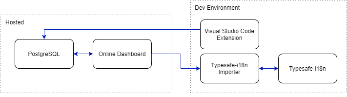

# Architecture

 To ensure the most convenient and painless internationalization and localization setup, inlang provides a host of solutions. Since inlang is open source, we strive to provide solutions as a mix of existing open source tools as well as tools developed from scratch, to bind them all together into a complete localization package.

 

 While other localization providers focus on solely handling the translations, we want to provide an efficient and convenient experience for translators, content writers, developers, etc. Therefore our architecture consists of many different packages which can operate independently to suit the needs of every project.

 The technologies inlang currently operate on is split into two categories; those hosted on a server mainly used by translators, content writers and project leaders, and those used to increase efficiency of developers. The first category is an easy-to-use dashboard with a PostgreSQL database to store all the translations, ensuring that no technical knowledge is required to get started working on the content. The second category consists of a Visual Studio Code extension to export keys with their base translations, as well as an importer connected to [Typesafe-i18n](https://github.com/ivanhofer/typesafe-i18n) that handles the translation key pairs in the source code.