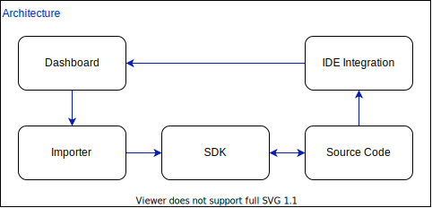

# Architecture

 Inlang is an open source host of solutions that can be split into four distinct blocks. The dashboard hosting the translations, an importer to get translations into the SDK, an SDK which enables translations in your source code and lastly IDE integration to export directly to the dashboard.

 

 All the solutions are either developed by inlang or existing open source that can work independently of each other, but has been tweaked to work out of the box together.