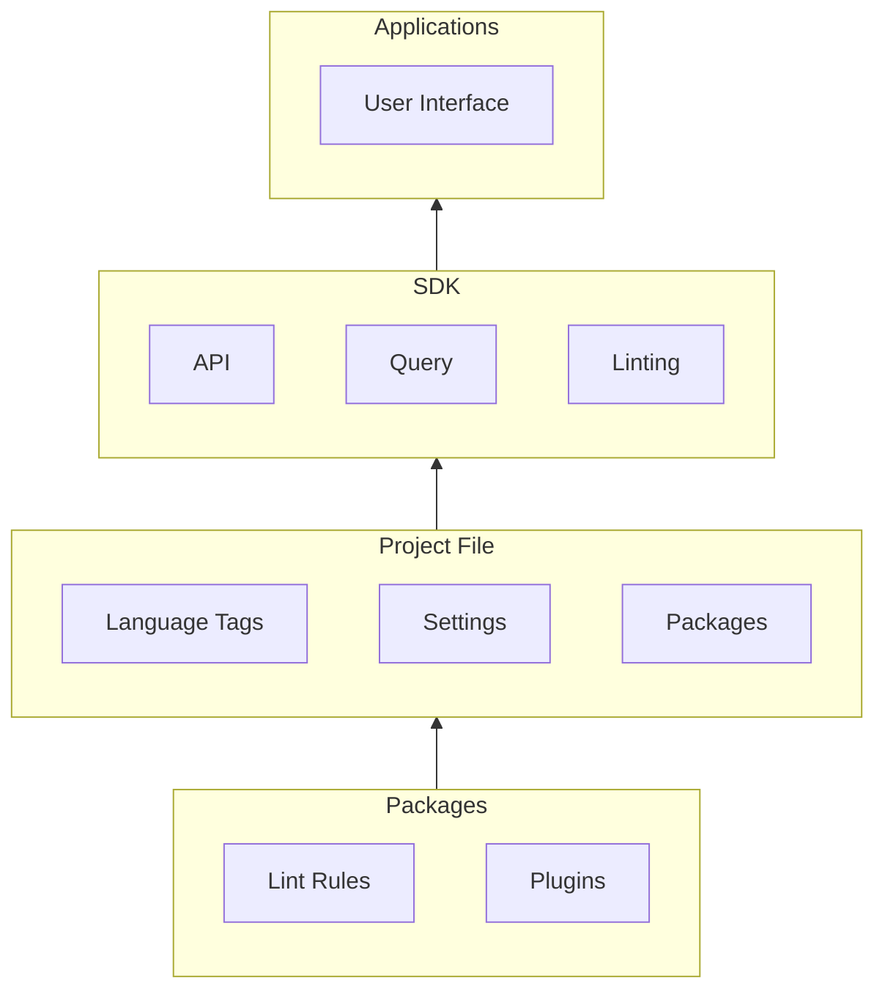

# 

Inlang's architecture consists of four main components:

1. [Applications](/documentation/app) - Provide users with an interface for their projects.
2. [SDK](/documentation/sdk) - Can be used by developers to build inlang apps.
3. [Project file](/documentation/project-file) - Defines the project's settings, which language tags exists and to be imported packages.
4. [Packages](/documentation/package) - Contain plugins and/or lint rules that define the behavior of a project.

