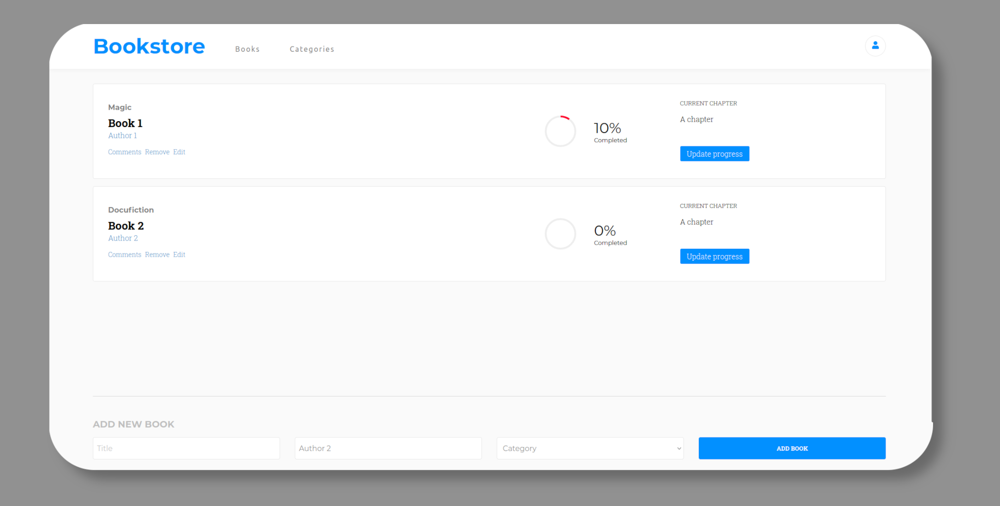

# Bookstore.
> Bookstore application built with REACT, JAVASCRIPT, and SASS. It lets you add and remove books. I also used motion library too create complex animations.

## Live Demo
You can see my page live here: 
- [Check it out!](https://gabrielyea.github.io/bookstore/)

## Screenshots

## Built With 🔨
- HTML
- SCSS
- javaScript
- React

## Getting Started
To get a local copy running follow this steps!
- Press the "Code" button and copy the link.
- Clone it using git command `git clone <link>`.
- Go to the directory `cd <repo-name>`
- `npm install` to install the packages
- `npm run start` to build dist files and run local server.

## Author

👤 *Gabriel Rendon*

- GitHub: [@gabrielyea](https://github.com/gabrielyea)

## 🤝 Contributing

Contributions, issues, and feature requests are welcome!

<!--Feel free to check the [issues page](../../issues/).-->

## Show your support

Give a ⭐️ if you like this project!

<!--## Acknowledgments-->

## 📝 License

This project is [MIT](./MIT.md) licensed.
