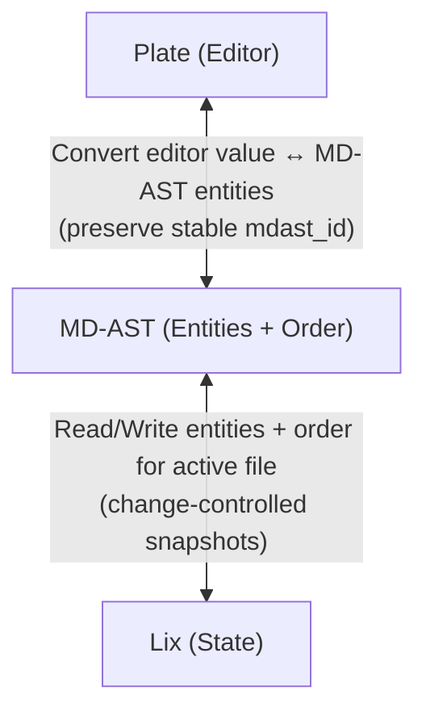

# Flashtype Architecture (packages/md-app)

## Overview

Flashtype is a markdown editor application that uses Plate for rich‑text editing while persisting content as MD‑AST entities directly in Lix state. The application avoids re‑materializing files on each edit by converting between Plate nodes and MD‑AST entities in memory and writing those entities to Lix. Lix then provides change control, diffs (sdiffs), and checkpoints over the entity stream.
At a glance:

- Editor: Plate configured with a rich plugin suite and custom markdown behavior.
- Conversion: Bidirectional bridge between Plate nodes and MD‑AST entities with stable IDs.
- Persistence: Entities and a separate document order are written to/read from Lix state tables.
- Change control: Lix tracks entity snapshots and root order; UI renders diffs and checkpoint history using the markdown plugin.

## High‑Level Data Flow

- Load
  - Query MD‑AST root (order) + node entities from Lix state for the active file.
  - Convert entities → Plate `Descendant[]` while preserving per‑node `mdast_id`.
  - Initialize Plate editor with the converted value.
- Edit
  - On user changes, convert Plate value → MD‑AST entities + root order.
  - Debounce and write entities + order to Lix state in a transaction.
  - Lix records changes (per entity snapshot and root order snapshot) for diffs/checkpoints.
- Inspect
  - Working changes and checkpoint history are read from Lix.
  - The markdown plugin’s diff UI renders sdiffs using before/after snapshots.

## Core Modules

- Editor runtime
  - `packages/md-app/src/components/editor/plate-editor.tsx`
    - Creates Plate instance (`useCreateEditor`).
    - Loads MD‑AST from Lix via `useMdAstState`, converts to Plate value.
    - Handles `onValueChange` → conversion to entities → debounced persistence.
  - `packages/md-app/src/components/editor/use-create-editor.ts`
    - Declares Plate plugins and component mappings (headings, lists, code, media, tables, AI, toolbar, etc.).
    - Registers custom elements (frontmatter, sanitized HTML) and the empty document prompt.
  - `packages/md-app/src/components/editor/plugins/markdown/markdown-plugin.ts`
    - Extends Plate MarkdownPlugin with remark‑gfm and custom rules:
      - Keeps unknown/sanitized blocks as HTML nodes.
      - Special handling for soft breaks and empty paragraphs.
- Conversion bridge
  - `packages/md-app/src/components/editor/mdast-plate-bridge.ts`
    - `mdastEntitiesToPlateValue(entities, order)` → Plate `Descendant[]`.
    - `plateValueToMdastEntities(value)` → `{ entities, order }`.
    - Maps types both ways (`paragraph` ↔ `p`, `heading` ↔ `h1..h6`, lists, code, blockquote, link, image, table, etc.).
    - Preserves node identity:
      - Uses `mdast_id` as Plate `id` and also stores `mdast_id` on Plate elements.
      - Generates new IDs via `nanoId` from Lix when needed.
    - Serialization helper:
      - `serializeMdastEntities(entities, order)` emits a simplified markdown string.
      - Can inject `<!-- mdast_id = ... -->` HTML comments for round‑trip ID preservation.
- State access and persistence
  - `packages/md-app/src/hooks/useMdAstState.ts`
    - Encapsulates loading and writing MD‑AST.
    - `selectMdAstRoot`, `selectMdAstNodes` → state snapshot read.
    - `updateMdAstEntities(lix, file, entities, order)` → transactional writes.
    - Optimistic update pattern at the hook boundary (UI responds quickly; Lix persists).
  - `packages/md-app/src/queries.ts`
    - Query helpers for active file/account, working changes, checkpoints, diffs.
    - MD‑AST entity shape (`MdAstEntity`) and document order shape.
- Lix plugin (markdown)
  - `packages/lix-plugin-md/src/index.ts`
    - Plugin key: `lix_plugin_md`.
    - Schemas: node `lix_plugin_md_node`, root `lix_plugin_md_root`.
    - Functions: `detectChanges`, `applyChanges`, `diffUiComponent` (uses `@lix-js/html-diff`).
- Change control UI
  - `packages/md-app/src/components/ui/sidebar-change-control.tsx` — lists working changes + checkpoints.
  - `packages/md-app/src/components/IntermediateCheckpointComponent.tsx` — shows uncheckpointed changes and “create checkpoint”.
  - `packages/md-app/src/components/CheckpointComponent.tsx` — renders checkpoints and their diffs.
  - `packages/md-app/src/components/ChangeDiffComponent.tsx` — mounts plugin diff UI per plugin key.

## Data Model in Lix

- Node schema: `lix_plugin_md_node` (see `packages/lix-plugin-md/src/schemas/nodes.ts`).
  - Required: `mdast_id`, `type`.
  - Optional: `children` (inline or ID refs), `value`, `depth`, `ordered`, `url`, `alt`, `title`, `lang`, `meta`, alignment, position.
  - In practice, `entity_id` == `mdast_id` for top‑level nodes.
- Root schema: `lix_plugin_md_root` (see `packages/lix-plugin-md/src/schemas/root.ts`).
  - `order: string[]` of top‑level `mdast_id`s.
- All state writes use plugin key `lix_plugin_md`.

## Initialization and Environment

- `initializeLix` opens/creates a Lix DB with `@lix-js/plugin-md` and `OpfsStorage`, and exposes it via `LixProvider`.
- `AppLayout` ensures a file exists, stores the active file in `key_value` (`flashtype_active_file`).
- On route load, `useMdAstState` selects root+nodes and converts them to a Plate value.

## Editing Lifecycle

- Debounced save (500ms) on Plate value changes.
- Convert Plate value → `{ entities, order }` and write in a transaction:
  - Insert node snapshots with schema `lix_plugin_md_node`.
  - Upsert root order snapshot with schema `lix_plugin_md_root`.
- On write error, fallback: serialize Plate → markdown and write to `file.data`.
- ID management: stable `mdast_id`/`entity_id` per node; new IDs via `nanoId({ lix, length: 10 })`; optional HTML ID comments for round‑trip.
- Order management: top‑level only; reorder is captured as a root snapshot change.

## Change Control, Diffs, and Checkpoints

- Working changes: `selectWorkingChanges` returns changes in the active working change set for the active file.
- Checkpoints: `selectCheckpoints` lists checkpointed change sets; `createCheckpoint` snapshots working changes and can attach a thread/comment.
- Diffs (sdiffs): `selectChangeDiffs` returns before/after snapshots per entity; markdown plugin renders HTML diffs, ordered by root order change.

## Error Handling and Fallbacks

- Debounce to reduce write churn; try/catch around conversion and persistence.
- Fallback write to `file.data` when entity persistence fails.
- Note: `mdast-plate-bridge.ts` currently generates IDs via a local `openLix({})` (TODO: use active instance).

## Performance Notes

- No file materialization on edits; all transformations are in memory against entities.
- Debounced writes; simple JSON comparisons to avoid redundant editor value sets.
- Maps keyed by `mdast_id` for efficient lookups during conversion.

## Interfaces and Contracts

- Editor ↔ Bridge: the Plate value is the only dependency; conversion hides editor internals from persistence.
- Bridge ↔ Lix: only entity snapshots and root order are read/written.
- Lix ↔ Change control: snapshots fuel granular sdiffs and checkpoint history; applyChanges can re‑materialize a file view if needed.

## Interfaces & Contracts Diagram

Contract summary: Plate ↔ MD‑AST converts editor value ↔ entities with stable mdast_id; MD‑AST ↔ Lix reads/writes entity snapshots and document order for the active file.

## Markdown Core (markdown-wc)

- Role: Editor-agnostic Markdown core shared by lix-plugin-md and md-app.
- Ast APIs (remark/mdast-based):
  - `parseMarkdown(markdown) → Ast` (mdast-shaped tree)
  - `serializeAst(Ast) → markdown`
- TipTap adapters:
  - `MarkdownWc` (schema-only Extension) to define nodes/marks; apps can add their own behaviors and NodeViews.
  - `astToTiptap(Ast) → ProseMirrorDocJSON`
  - `tiptapToAst(ProseMirrorDocJSON) → Ast`
- HTML utilities (rehype-based; not in the live edit loop):
  - mdast→hast via `remark-rehype` + rehype plugins → HTML (docs/diff)
- Schemas:
  - JSON Schemas for Markdown nodes and `{ order: string[] }` (with optional `x-lix-*` vendor fields). No Lix imports.
- Boundaries:
  - No persistence/change control; no sanitize in hot path; no DOM in `ast/` layer.

## Root Causes of Complexity

- Mixed responsibilities in the hot path:
  - Markdown parse/serialize and sanitize logic present during editing, not only on explicit import/export.
  - Persistence (debounce, diffing, fallback writes) partly lives in the editor component instead of a single state layer.
- Sanitization breadth and maintenance:
  - `sanitizeUnsupported.ts` enforces a large allowlist of node/attribute/child rules and rewrites unknown nodes; this adds cognitive and runtime overhead when used in normal edits.
- Type mapping duplication and drift:
  - Separate mdast↔plate mapping functions to maintain (names, attributes, depth/ordered, etc.).
- Identity and ID generation coupling:
  - The bridge creates IDs via a local `openLix()` usage; this ties pure conversion to environment concerns.
- Storage model variance:
  - `children` may be inline nodes or ID references; conversion code branches to handle both.
- Equality/delta detection strategy:
  - Full `JSON.stringify` comparisons on trees; this is noisy and costly, and can misfire on key ordering.
- Fallbacks increase coupling:
  - Writing markdown directly to `file.data` from the editor on errors mixes concerns and creates multiple persistence paths to reason about.

## Simplification Possibilities

- Make MD‑AST the canonical model; keep the hot path lean:
  - Only MD‑AST ⇄ Plate conversion during editing. No remark/sanitize in keystrokes.
  - Restrict remark/sanitize to explicit import (and optional export) actions.
- Inject an ID provider into the bridge:
  - Replace local `openLix()` with `idProvider: () => string` so conversion stays pure and testable.
- Single mapping table:
  - Define one canonical mdast↔plate type map and derive the inverse at init to avoid drift.
- Normalize children to references:
  - Persist children as ID refs only; resolve to nodes via a map when building Plate. Remove dual-mode code paths.
- Centralize persistence and deltas in the state hook:
  - Move debounce and change detection out of the editor. Track last-saved hashes and write only changed entities and order updates.
  - Provide a single error policy (toast + retry). Remove markdown fallback writes from the editor path.
- Unify types and schemas:
  - Export the `MdAstEntity` type from a single place and reuse it across hook/bridge/queries to prevent drift.
- Simpler equality:
  - Use a stable per-entity content hash (or last revision id) to detect changes rather than full JSON stringification.
- Thin bridge API surface:
  - `toPlate(entities, order, { idToNode? })` and `fromPlate(value, { idProvider })` as the only public bridge calls.

## Minimal WYSIWYG Runtime (Target)

- Hot path: Plate value ↔ MD‑AST entities/order only; IDs preserved.
- Persistence: debounced, delta-only writes to Lix (node snapshots + root order), handled by one hook.
- Import/Export: remark mdast parse/serialize (with sanitize if needed) runs out-of-band.
- Unknown content: carried as mdast `html` (or a minimal pass-through node) and mapped to a safe view in Plate; no sanitize during editing.

## Optional Editor Swap (If Desired Later)

- TipTap (ProseMirror):
  - Define a mdast-aligned schema (node names/attrs), use marks for inline formatting, store `mdast_id` in attrs. A thin mdast↔ProseMirror bridge remains.
- Lexical:
  - Use built-ins + small custom nodes for html/frontmatter/table, carry `mdast_id` in node props. A thin mdast↔Lexical bridge remains.

## Trade-offs and Risks

- Removing runtime sanitize assumes all edits originate from known schema; protect import paths accordingly.
- Delta writes require tracking last-saved state/hashes; adds a small bookkeeping layer but reduces DB churn and change noise.
- Children-as-refs simplifies storage and conversion but requires a one-time migration if inline children are present.
