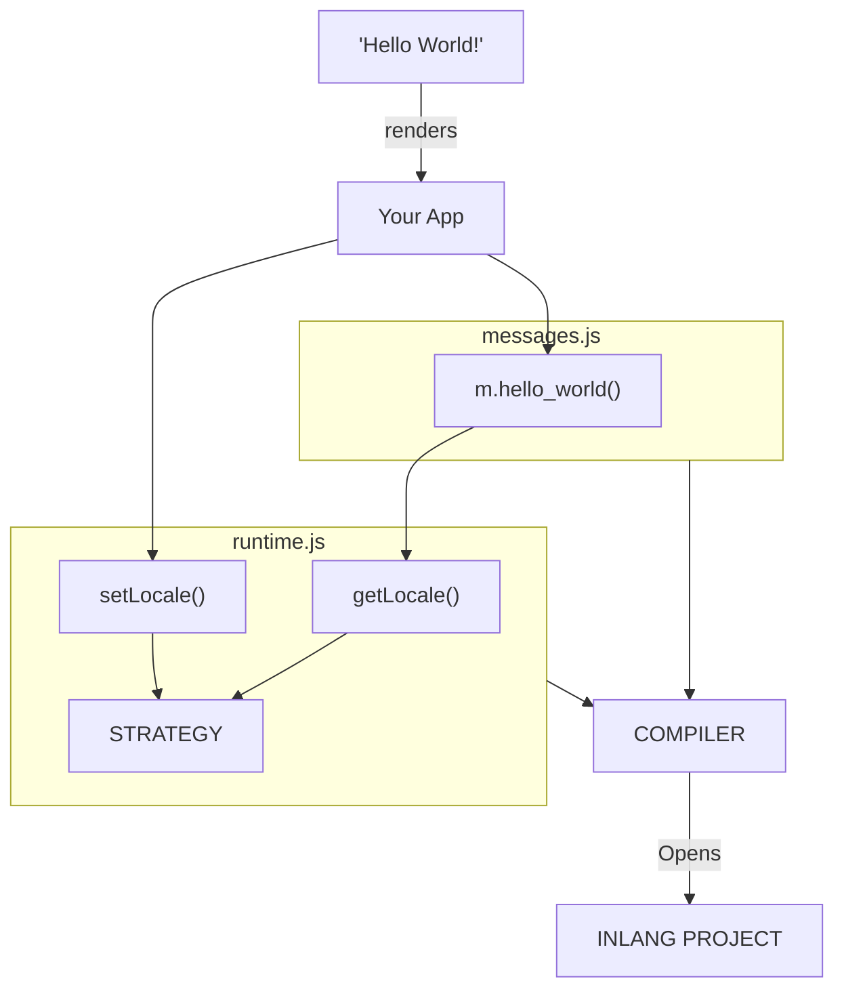

# Architecture

<doc-video src="https://youtu.be/PBhdb5AS0mk"></doc-video>

Paraglide uses a compiler to generate JS functions from your messages. We call these "message functions".

Message Functions are fully typed and TypeScript compatible using JSDoc. They are exported individually from the `messages.js` file making them tree-shakable. When called, they return a translated string. Message functions aren't reactive in any way, if you want a translation in another language you will need to re-call them.

This design avoids many edge cases with reactivity, lazy-loading, and namespacing that other i18n libraries have to work around.

Paraglide consists of four main parts:

| Part         | Description                                              |
| ------------ | -------------------------------------------------------- |
| **Compiler** | Compiles messages into tree-shakable message functions   |
| **Messages** | The compiled tree-shakable message functions             |
| **Runtime**  | A runtime that resolves the locale based on the strategy |
| **Strategy** | The strategy to detect the locale of a user              |

