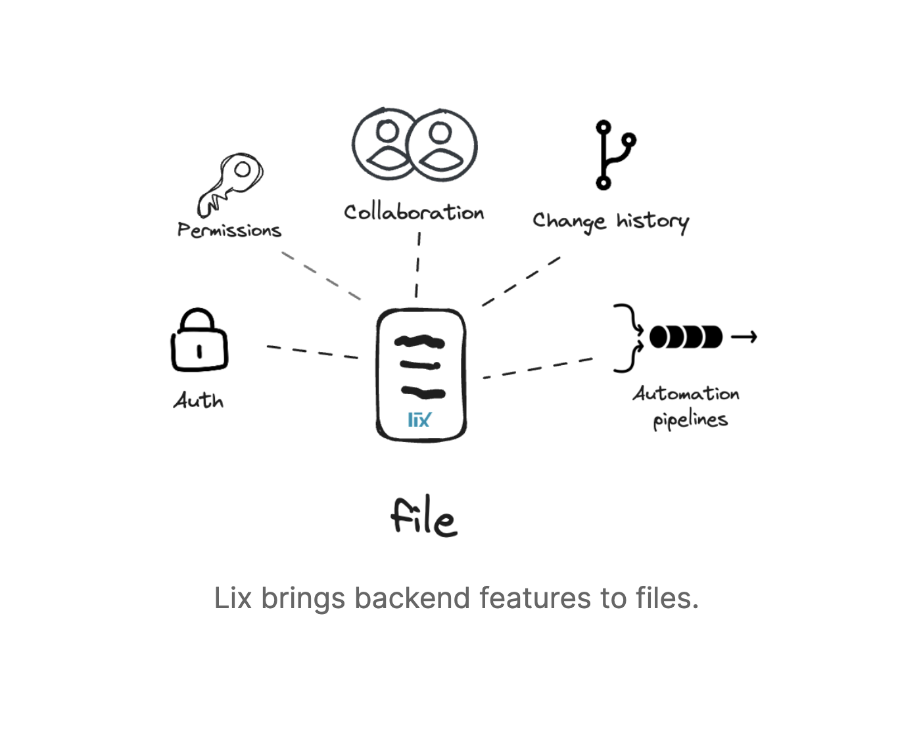

# Lix 

> [!NOTE]  
> Docs soon and release of the SDK coming soon.

> [!NOTE]
> Source code is in [./packages/lix-sdk](./packages/lix-sdk).

Lix is a change control system that runs in the browser and an SDK to build web apps.  

A change control system allows storing, tracking, querying, and reviewing changes in different file formats, e.g., `.xlsx`, `.sqlite`, or `.inlang`. Compared to a version control system, a change control system understands “what” changed in a file, e.g., cell C43 in the financials spreadsheet changed. 

## Community & Support

**[🚩 Issues](https://github.com/opral/lix-sdk/issues)** - Bugs end errors you encounter using inlang.

**[💬 Discussions](https://github.com/orgs/opral/discussions)** - Get help, ask questions, request features, and discuss inlang.

**[🗣️ Discord](https://discord.gg/gdMPPWy57R)** - Hanging out with the community.

## Example use cases

Apps that revolve around changes are prime use cases to be built on lix. Having an “edit -> review -> automate” workflow is a good indicator for an app that revolves around changes:

- document editors (markdown, PDF, etc.)
- accounting solutions (auditing)
- content creation tools (Figma, Adobe Premiere)
- spreadsheets (Excel, Google Sheets)
- CAD software (Fusion 360, Autodesk)
- data science (Jupyter Notebooks)
- dashboards (Analytics, Infrastructure) 

## Lix as backend for web apps 

Developing a web app with lix is reduced to providing a user interface that opens and saves a file.

Backend features like auth, permissions, change control, and automations are solved on a file rather than an application-specific level. Lix knows who the actors are (auth), allows actors to conduct changes (permissions), is aware of how data changes over time (change history), can merge changes (collaboration), and uses the knowledge of changes to trigger automations (automation pipelines).

In contrast, cloud-based apps are substantially more difficult to build because they require:

- Auth (could be solved with a backend as a service)
- Integrations (no interop between apps)
- Ensure data privacy and security
- Scaling complexity of storing all customer data 
- Replicating change control features like history, branching, etc.

### Capabilities

#### Interop

Lix apps operate on (open) files. Any app can open the files and process the data. The need for integrations that transfer data from cloud app A to cloud app B is redundant. App 1 and app 2 can provide different UIs or services while operating on the same data. 

#### Collaboration via change proposals

Lix brings versions and change requests, thereby enabling permissionless collaboration in file formats other than source code. We will see an “open-sourceification” of music, video, architecture, public policy making, fashion, and who knows, maybe even automobiles.  

#### Automation

Lix can trigger automations based on changes in files. This is a powerful feature that allows for a new class of apps that are not possible with cloud-based apps.

