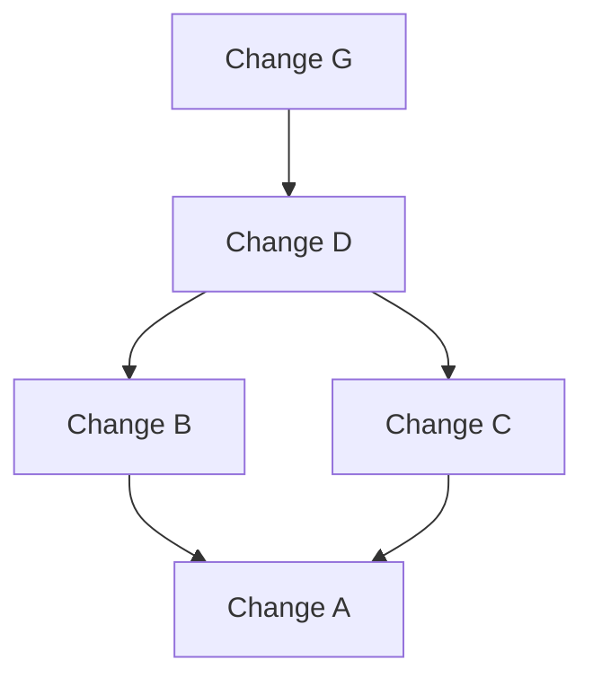

# Change Graph 



## Purpose

Represent the relationships and history of changes. 

## Examples

### Dependencies

Change B depends on Change A.

```mermaid
graph TB
    G["Change G"]:::unhighlight --> F["Change D"]
    F["Change D"]:::unhighlight
    F --> B["Change B"]
    F --> C["Change C"]:::unhighlight
    B --> A["Change A"]
    C --> A
  
classDef unhighlight, opacity:0.5;
```

### Merges

Change C is the result of Change A and Change B.

```mermaid
graph TB
    G["Change G"]:::unhighlight --> F["Change D"]
    F["Change D"]
    F --> B["Change B"]
    F --> C["Change C"]
    B --> A["Change A"]
    C --> A:::unhighlight
  
classDef unhighlight, opacity:0.5;
```

### History

Change G is the result of Changes D, B, C, and A.


## FAQ 

### Why not call it change history?

The term "history" implies a linear sequence of changes which is incorrect. A lix change graph visualizes the relationships between changes, which includes the history but also includes other relationships such as dependencies and merges.
