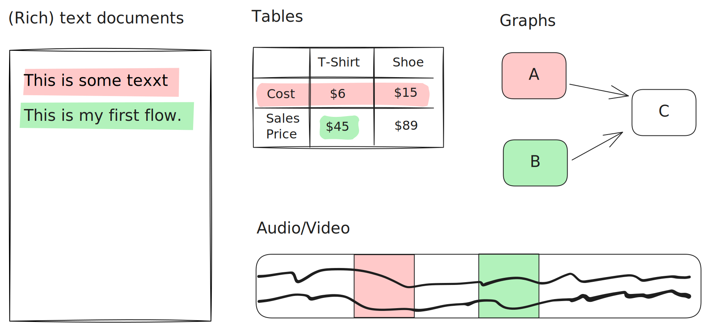

# Diffs



TODOS

- clarify that main value is divergent states
- mention universal diff 
- mention plugin diff


```ts
const lix = await openLix({});
```

```ts
// Get file state at two different change sets for comparison
const before = await lix.db
  .selectFrom("file_history")
  .where("lixcol_change_set_id", "=", beforeChangeSetId)
  .where("id", "=", "document.md")
  .where("lixcol_depth", "=", 0)
  .selectAll()
  .executeTakeFirst();

const after = await lix.db
  .selectFrom("file_history")
  .where("lixcol_change_set_id", "=", afterChangeSetId)
  .where("id", "=", "document.md")
  .where("lixcol_depth", "=", 0)
  .selectAll()
  .executeTakeFirst();
```

```ts
// Compare entity states between change sets
const entityBefore = await lix.db
  .selectFrom("state_history")
  .where("lixcol_change_set_id", "=", beforeChangeSetId)
  .where("entity_id", "=", "para_123")
  .where("schema_key", "=", "markdown_paragraph")
  .selectAll()
  .executeTakeFirst();

const entityAfter = await lix.db
  .selectFrom("state_history")
  .where("lixcol_change_set_id", "=", afterChangeSetId)
  .where("entity_id", "=", "para_123")
  .where("schema_key", "=", "markdown_paragraph")
  .selectAll()
  .executeTakeFirst();
```

