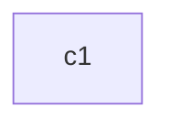
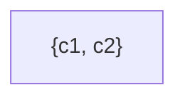
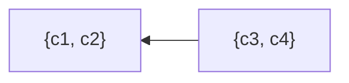
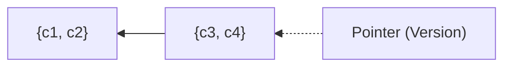
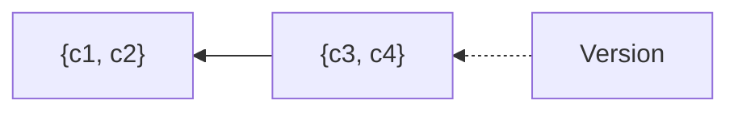
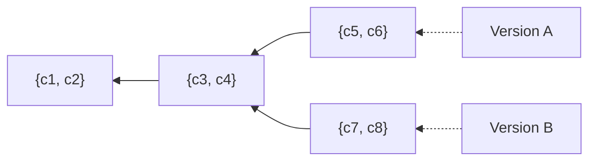
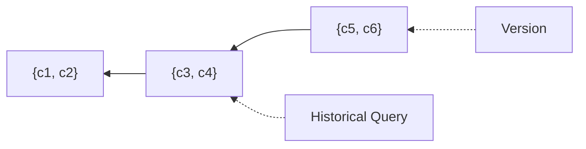
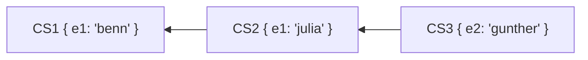

# Architecture

Lix uses changes as the source of truth to track data modifications and materializes state by traversing a global change set graph.

All data modifications are captured as immutable changes that form change sets. These change sets are linked in a global directed acyclic graph (DAG), enabling state materialization at any point in history by traversing the graph and applying leaf changes. 

## Core Data Model

Lix represents all data through four fundamental concepts that build upon each other. 

Changes are the atomic units, which are grouped in change sets, which form a graph, and the graph defines state. This simple hierarchy enables powerful features like [versioning](./features/versions.md) (branching), merging, and time-travel queries.

**Change** A single modification (e.g., `c1`).

**Change Set** A collection of related changes (e.g., `{c1, c2}`).

**Change Set Graph** Multiple change sets linked together showing evolution.

**State** is a pointer to a specific change set in the graph.

> [!NOTE]
> The change set graph in Lix is global and shared across all versions. If the change set graph were version-scoped, versions couldn't agree on what the history of another version is. By having a global graph, all versions share the same understanding of history—each version may have a different lineage, but they all agree on what that lineage contains.

## State

State in Lix is simply a pointer to a specific change set in the graph. To materialize state, lix traverses the graph backward from that change set, applying all leaf changes in the lineage.

### Divergent State

Multiple version pointers can reference different change sets, creating divergent states:

Here, Version A and Version B diverge after CS2, each with their own subsequent changes. This enables:
- Parallel development workflows
- Feature branches
- Experimental changes without affecting other versions

### Historical State

History in Lix is simply pointing to a specific change set in the graph and materializing the state up to that change set. 

In the diagram beneath, the "Historical Query" points to the change set `{c3, c4}`. Lix materializes the state by taking the union of all change sets in the lineage (`{c1, c2} ∪ {c3, c4}`) and then applying only the leaf changes—the latest change for each entity—giving you the exact state at that point in time.

### Materializing State

State materialization can be simplified to the process of taking the union of all change sets in the lineage and filtering for leaf changes. Leaf changes are the latest change for each entity, ensuring that only the most recent modifications are applied.

Consider this example with two entities (`e1`, `e2`). The lineage of change sets might look like this:

1. The union of all change sets in the lineage is taken:
   
   `CS1 ∪ CS2 ∪ CS3 = { e1: "benn", e1: "julia", e2: "gunther" }`

2. Filter for leaf changes, which are the latest changes for each entity:

   - For `e1`, the latest change is `"julia"` from `CS2`.
   - For `e2`, the latest change is `"gunther"` from `CS3`.

3. The resulting state is:
   
   `State = { e1: "julia", e2: "gunther" }`
