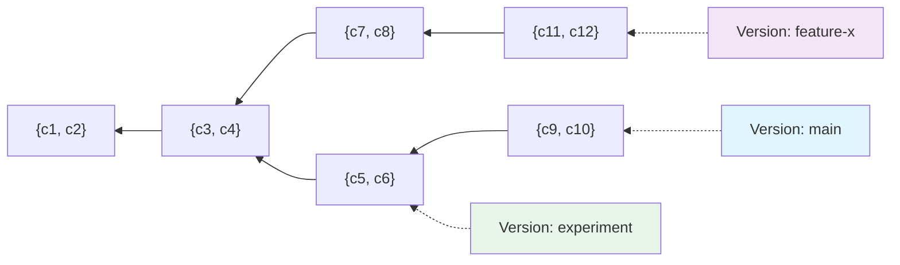

# Architecture

## Core Data Model

Lix represents all data through four fundamental concepts that build upon each other. 

Changes are the atomic units, which are grouped in change sets, which form a graph, and the graph defines state. This simple hierarchy enables powerful features like [versioning](./features/versions.md) (branching), merging, and time-travel queries.

**Change** A single modification (e.g., `c1`).

**Change Set** A collection of related changes (e.g., `{c1, c2}`).

**Change Set Graph** Multiple change sets linked together showing evolution.

**Version** A pointer to a specific change set in the graph.

Multiple versions can point to different change sets, creating divergent versions which can be merged later:

## State

Rather than storing state for every version and historical point, which would require large amounts of storage, Lix stores only the changes. State is then materialized on-demand in a cache by traversing the change set graph and applying the relevant changes.

This approach provides significant storage efficiency: instead of storing multiple complete copies of data, Lix stores each change only once. When state is needed (whether current or historical), it's computed by traversing the graph backward from a change set and applying all leaf changes in the lineage.

### Historical State

History in Lix is simply pointing to a specific change set in the graph and materializing the state up to that change set. Any change set in the graph can be queried, not just those pointed to by versions.

In the diagram beneath, the "Historical Query" points to the change set `{c3, c4}`. Lix materializes the state by taking the union of all change sets in the lineage (`{c1, c2} ∪ {c3, c4}`) and then applying only the leaf changes—the latest change for each entity—providing the exact state at that point in time.

### Materializing State

State materialization can be simplified to the process of taking the union of all change sets in the lineage and filtering for leaf changes. Leaf changes are the latest change for each entity, ensuring that only the most recent modifications are applied.

Consider this example with two entities (`e1`, `e2`). The lineage of change sets might look like this:

1. The union of all change sets in the lineage is taken:
   
   `CS1 ∪ CS2 ∪ CS3 = { e1: "benn", e1: "julia", e2: "gunther" }`

2. Filter for leaf changes, which are the latest changes for each entity:

   - For `e1`, the latest change is `"julia"` from `CS2`.
   - For `e2`, the latest change is `"gunther"` from `CS3`.

3. The resulting state is:
   
   `State = { e1: "julia", e2: "gunther" }`

## Global Change Set Graph

The change set graph in Lix is global and shared across all versions. By having a global graph, all versions share the same understanding of history—each version may have a different lineage, but they all agree on what that lineage contains. If the change set graph were version-scoped, versions couldn't agree on what the history of another version is. 

In the global change set graph above:

- All versions can see and reference any change set
- Version "main" can query the history of Version "feature-x" by traversing from CS6
- Historical queries can point to any change set, even those not currently pointed to by a version (like CS4)