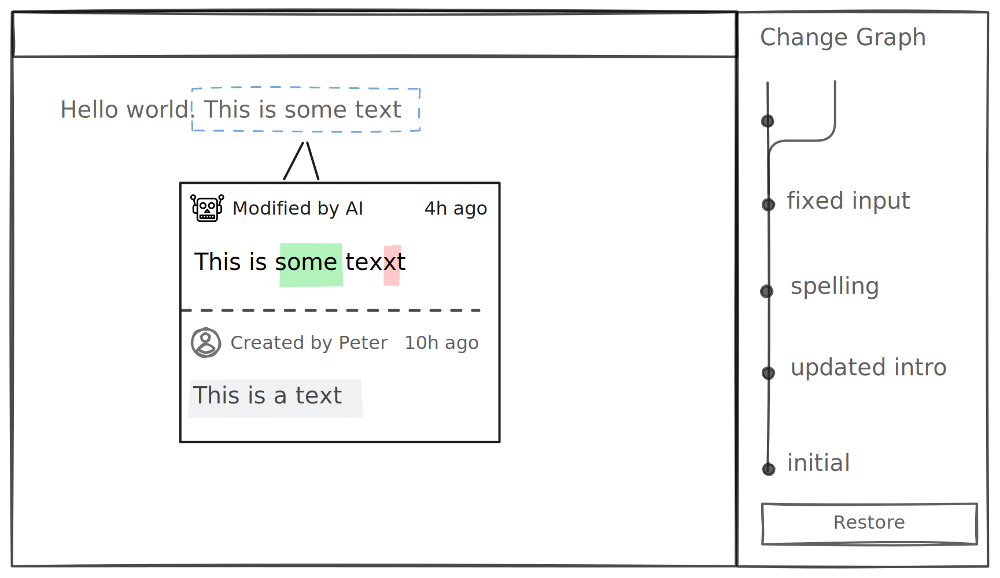

# Attribution (Blame)

Attribution enables seeing who made changes and when, providing transparency and accountability in collaborative environments. Lix surfaces attribution for every modification - from document edits to configuration updates.



## Examples

## Find out who authored a change

When a user selects an element in your application (like a table cell, paragraph, or form field), you can query the attribution for that entity.

```ts
import { openLix, entityIs } from "@lix-js/sdk";

const lix = await openLix({});

// Assume that `selectedEntity` is the entity the user has selected in your application
const selectedEntity = {
  entity_id: "0-jsa9j3",
  schema_key: "csv_cell",
  file_id: "doc_456",
};

// Query the history for the selected entity
const entityHistory = await lix.db
  .selectFrom("state")
  .innerJoin("change_author", "file.lixcol_change_id", "change_author.id")
  .innerJoin("account", "change_author.account_id", "account.id")
  .where(entityIs(selectedEntity))
  .orderBy("created_at", "desc")
  .selectAll()
  .executeTakeFirst();

console.log(
  `Entity ${selectedEntity.entity_id} was last modified by ${entityHistory[0]?.name} at ${entityHistory[0]?.created_at}`
);
```

### File change attribution

```ts
const fileChangeAuthor = await lix.db
  .selectFrom("file")
  .innerJoin("change_author", "file.lixcol_change_id", "change_author.id")
  .innerJoin("account", "change_author.account_id", "account.id")
  .where("file.path", "=", "/example.json")
  .selectAll()
  .executeTakeFirst();

console.log(
  `${fileChangeAuthor?.path} was last modified by ${fileChangeAuthor?.name} at ${fileChangeAuthor?.created_at}`
);
```
