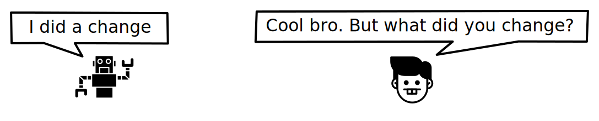
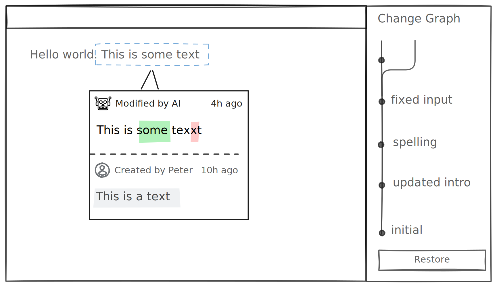

# Blame




```ts
const lix = await openLix({});
```

```ts
const currentlySelectedEntity = { 
  entity_id: "0-jsa9j3",
  schema_key: "csv_cell",
  file_id: "doc_456"
};

const entityHistory = await lix.db
  .selectFrom("state_history")
  .where(entityIs(currentlySelectedEntity))
  .executeTakeFirst();
```
