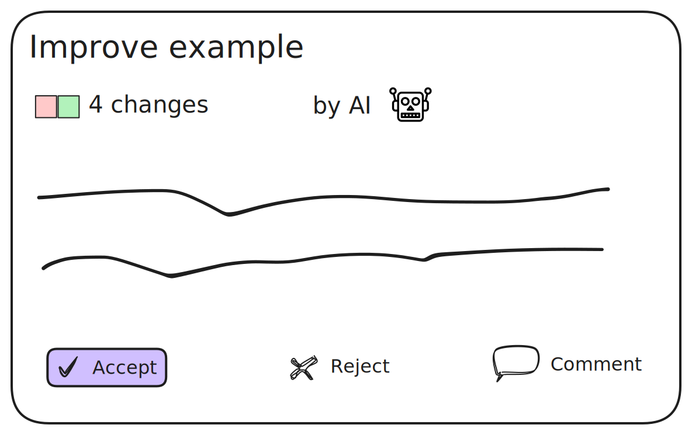

# Change Proposals 

Change proposals let you build review and approval workflows for into your application. This allows users and AI agents to safely suggest, discuss, and approve edits.



## Examples

### Create a change proposal 

```ts
const lix = await openLix({});

const activeVersion = await selectActiveVersion({ lix }).executeTakeFirstOrThrow();

const mainVersion = await lix.db.selectFrom("version")
  .where("name", "=", "main")
  .selectAll()
  .executeTakeFirstOrThrow();

// Create a change proposal (like a pull request)
const proposal = await createChangeProposal({
  lix,
  title: "Fix typos in documentation",
  description: "This proposal fixes several spelling errors",
  sourceVersion: activeVersion,
  targetVersion: mainVersion
});
```

### Accepting or rejecting a proposal

```ts
// Merge the proposal (accepts and merges in one action)
await acceptChangeProposal({
  lix,
  proposal: proposal
});

// Or reject the proposal
await rejectChangeProposal({
  lix,
  proposal: proposal,
  comment: "Needs more work on error handling"
});
```