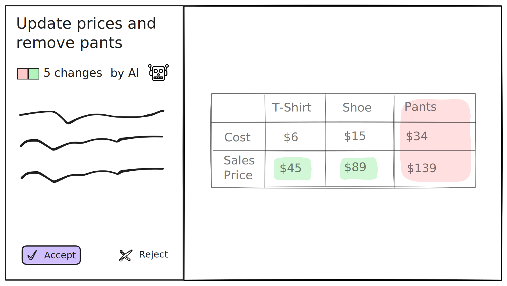

# Change Proposals 

Change proposals let you build review and approval workflows for into your application. This allows users and AI agents to safely suggest, discuss, and approve edits before they are merged.



## Examples

### Create a change proposal 

```ts
import { openLix } from "@lix-js/sdk";

const lix = await openLix({});

const activeVersion = await lix.db.selectFrom("active_version")
  .innerJoin("version", "active_version.version_id", "version.id")
  .select("version.id")
  .executeTakeFirstOrThrow();

const mainVersion = await lix.db.selectFrom("version")
  .where("name", "=", "main")
  .select("id")
  .executeTakeFirstOrThrow();

// Create a change proposal (like a pull request)
const proposal = await createChangeProposal({
  lix,
  title: "Fix typos in documentation",
  description: "This proposal fixes several spelling errors",
  sourceVersion: activeVersion,
  targetVersion: mainVersion
});
```

### Accepting or rejecting a proposal

```ts
import { acceptChangeProposal, rejectChangeProposal } from "@lix-js/sdk";

// Merge the proposal (accepts and merges in one action)
await acceptChangeProposal({
  lix,
  proposal: proposal
});

// Or reject the proposal
await rejectChangeProposal({
  lix,
  proposal: proposal,
  comment: "Needs more work on error handling"
});
```

## Interactive Examples

Explore these interactive examples to see change proposals in action:

<InteractiveExampleCard
  title="Change Proposals Interactive Examples"
  description="Explore interactive examples showing how to create, review, and manage change proposals in your application."
  link="/examples/interactive/change-proposals/"
/>
```