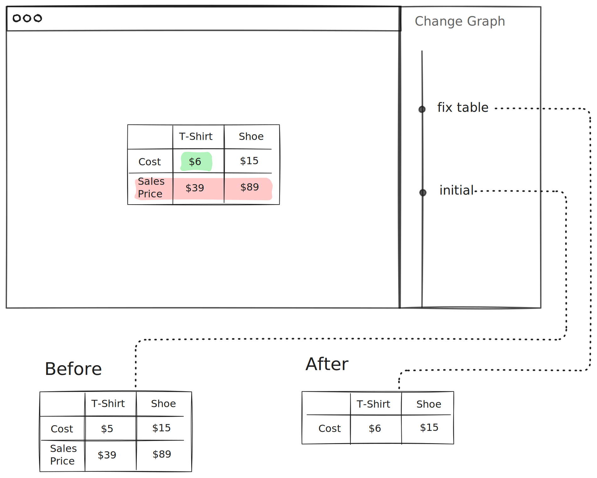

# Diffs

Lix provides APIs to query divergent and historical states, which is the foundation for showing users what has changed. 



The image below illustrates the variety of states you can compare, from entire files to individual entities within them.


Lix plugins for standard file formats like JSON, Markdown, or CSV, may provide ready-to-use diffs. For custom data formats, you have the flexibility to implement your own diffing logic. You can do this by using a dedicated library, like the experimental [universal diff package](https://github.com/opral/monorepo/tree/main/packages/lix/universal-diff), or by writing your own diff logic.

## Code Examples

### Diffing two files

```ts
const lix = await openLix({});

const fileHistory = await lix.db
  .selectFrom("file_history")
  .where("id", "=", "document.md")
  .selectAll()
  .executeTakeFirst();

console.log(
  "File after": fileHistory[0].data,
  "File before": fileHistory[1].data
)
```

### Diffing two entities

```ts
// Compare entity states between change sets
const entityBefore = await lix.db
  .selectFrom("state_history")
  .where("lixcol_change_set_id", "=", beforeChangeSetId)
  .where("entity_id", "=", "para_123")
  .where("schema_key", "=", "markdown_paragraph")
  .selectAll()
  .executeTakeFirst();

const entityAfter = await lix.db
  .selectFrom("state_history")
  .where("lixcol_change_set_id", "=", afterChangeSetId)
  .where("entity_id", "=", "para_123")
  .where("schema_key", "=", "markdown_paragraph")
  .selectAll()
  .executeTakeFirst();

console.log(
  "Entity after": entityAfter.snapshot_content.text,
  "Entity before": entityBefore.snapshot_content.text
);
```
