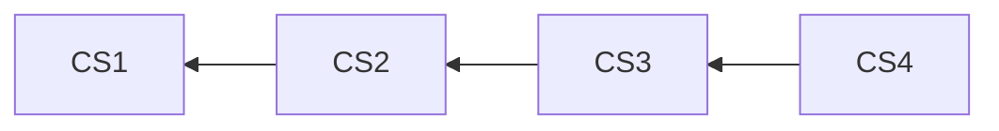

# History

Lix provides history APIs built on automatically captured changes in state. This enables the creation of powerful features like [audit trails](./attribution.md), [version](./versions.md) history, or [restore](./restore.md) functionality.


## Examples

> [!NOTE]
> The change set graph in Lix is global and shared across all versions. This means you don't need to provide a version ID when querying history—you simply query at a specific change set. All versions share the same understanding of history because they all reference the same [global change set graph](../architecture.md#core-data-model).

### Get history for a specific file

This query retrieves all historical records for a file with a given ID, ordered from newest to oldest. This shows every change made to the file across all versions.

```ts
const fileHistory = await lix.db
  .selectFrom("file_history")
  .where("file_id", "=", "README.md")
  .orderBy("lixcol_created_at", "desc")
  .execute();

console.log(fileHistory);
```

The query returns an array of `file_history` objects, each representing a snapshot of the file at a point in time:

```json
[
  {
    "id": "file-history-id-3",
    "file_id": "README.md",
    "snapshot_content": "# Updated README",
    "lixcol_created_at": "2024-07-02T12:00:00Z",
    "lixcol_change_set_id": "change-set-id-3"
  },
  {
    "id": "file-history-id-2",
    "file_id": "README.md",
    "snapshot_content": "# Initial README",
    "lixcol_created_at": "2024-07-01T10:00:00Z",
    "lixcol_change_set_id": "change-set-id-2"
  }
]
```

### Get history for a specific entity

You can also query the history of a single entity, like a paragraph in a Markdown file or a row in a CSV. This is useful for building features like comment threads or fine-grained audit trails.

```ts
const entityHistory = await lix.db
  .selectFrom("state_history")
  .where("entity_id", "=", "para_123")
  .orderBy("lixcol_created_at", "desc")
  .execute();
```

### Get history for a file within a specific version

To get the history of a file for a specific version, you first need to identify the change sets that make up that version's lineage. The example below shows a simplified way to do this.

```ts
// This example assumes `version_change_set_id` is the ID of the latest
// change set for the version you are interested in.

// 1. Get the lineage of change sets for the desired version.
const lineage = await lix.db
  .selectFrom("change_sets")
  .where("id", "=", version_change_set_id)
  .selectLineage() // Custom Kysely utility for traversing history
  .execute();

const lineageChangeSetIds = lineage.map((cs) => cs.id);

// 2. Filter the file history using the version's change set IDs.
const versionFileHistory = await lix.db
  .selectFrom("file_history")
  .where("file_id", "=", "config.json")
  .where("lixcol_change_set_id", "in", lineageChangeSetIds)
  .orderBy("lixcol_created_at", "desc")
  .execute();

console.log(versionFileHistory);
```

This returns only the history for `config.json` that occurred within the specified version's lineage.

## Data Model

History is simply querying state at a specific change set. Because the change set graph is global, no version needs to be specified when querying history. Every change set is part of the same unified structure, allowing you to traverse the history without worrying about which version you are in.

### Example 

Imagine a file, `config.json`, changes over time. Each change creates a new change set that points to its predecessor:

- **CS1:** `config.json` is created with `{ "setting": "A" }`.
- **CS2:** `config.json` is updated to `{ "setting": "B" }`.
- **CS3:** `config.json` is updated to `{ "setting": "C" }`.
- **CS4:** `config.json` is updated to `{ "setting": "D" }`.



Querying the history at change set CS3 entails traversing the graph backward from that point:

```ts
// Query to get the state of config.json up to change set CS3
const fileHistory = await lix.db.selectFrom("file_history")
  .where("file_id", "=", "config.json")
  .where("lixcol_change_set_id", "=", "cs3")
  .select("data")
  .execute();

console.log(fileHistory);
// Output:
[
  { "data": { "setting": "C" } },
  { "data": { "setting": "B" } },
  { "data": { "setting": "A" } }
]
```

Notice that CS4 is not included because it comes after CS3 in the graph.