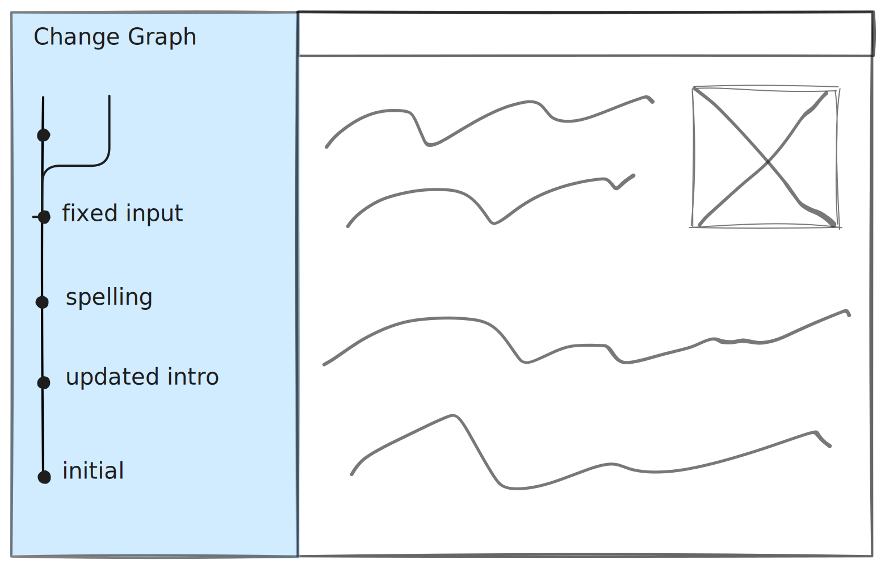
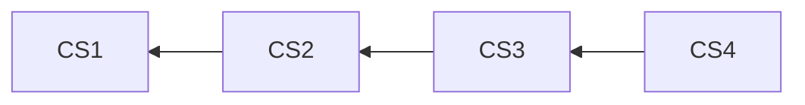

# History

Lix provides history APIs built on automatically captured changes in state. This enables the creation of powerful features like [audit trails](./attribution.md), [version](./versions.md) history, or [restore](./restore.md) functionality.



## Examples

> [!NOTE]
> The change set graph in Lix is global and shared across all versions. This means you don't need to provide a version ID when querying history—you simply query at a specific change set. All versions share the same understanding of history because they all reference the same [global change set graph](../architecture.md#core-data-model).

### Get history for a specific file

To query the history of a file, you need to specify which change set you want to view the history from. The `lixcol_root_change_set_id` field is used to filter the results to a specific point in the change set graph.

```ts
// Get the current change set from the active version
const activeVersion = await lix.db
  .selectFrom("active_version")
  .innerJoin("version", "active_version.version_id", "version.id")
  .select("version.change_set_id")
  .executeTakeFirstOrThrow();

// Query file history from the current change set
const fileHistory = await lix.db
  .selectFrom("file_history")
  .where("path", "=", "/README.md")
  .where("lixcol_root_change_set_id", "=", activeVersion.change_set_id)
  .orderBy("lixcol_depth", "asc")
  .execute();

console.log(fileHistory);
```

The query returns an array of `file_history` objects, each representing a snapshot of the file at different points in history:

```json
[
  {
    "id": "file-id",
    "path": "/README.md",
    "data": "# Updated README",
    "lixcol_change_set_id": "change-set-id-3",
    "lixcol_root_change_set_id": "change-set-id-3",
    "lixcol_depth": 0
  },
  {
    "id": "file-id",
    "path": "/README.md",
    "data": "# Initial README",
    "lixcol_change_set_id": "change-set-id-1",
    "lixcol_root_change_set_id": "change-set-id-3",
    "lixcol_depth": 2
  }
]
```

Note that:
- `lixcol_change_set_id` shows where each state was actually created
- `lixcol_root_change_set_id` shows the change set you queried from (same for all results)
- `lixcol_depth` indicates how far back in history each state is (0 = current, higher = older)

### Get history for a specific entity

You can also query the history of a single entity, like a paragraph in a Markdown file or a row in a CSV. This is useful for building features like comment threads or fine-grained audit trails.

```ts
// Get the current change set from the active version
const activeVersion = await lix.db
  .selectFrom("active_version")
  .innerJoin("version", "active_version.version_id", "version.id")
  .select("version.change_set_id")
  .executeTakeFirstOrThrow();

// Query entity history from the current change set
const entityHistory = await lix.db
  .selectFrom("state_history")
  .where("entity_id", "=", "para_123")
  .where("root_change_set_id", "=", activeVersion.change_set_id)
  .orderBy("depth", "asc")
  .execute();
```

### Get history for a file within a specific version

To get the history of a file for a specific version, you simply query using that version's change set ID as the root. The history view will automatically traverse the change set graph to show all historical states.

```ts
// Get a specific version's change set
const version = await lix.db
  .selectFrom("version")
  .where("name", "=", "feature-branch")
  .select("change_set_id")
  .executeTakeFirstOrThrow();

// Query file history from that version's perspective
const versionFileHistory = await lix.db
  .selectFrom("file_history")
  .where("path", "=", "/config.json")
  .where("lixcol_root_change_set_id", "=", version.change_set_id)
  .orderBy("lixcol_depth", "asc")
  .execute();

console.log(versionFileHistory);
```

This returns the complete history of `/config.json` as seen from the specified version, with each entry showing its original change set ID and depth from the queried version.

## Data Model

History is simply querying state at a specific change set. Because the change set graph is global, no version needs to be specified when querying history. Every change set is part of the same unified structure, allowing you to traverse the history without worrying about which version you are in.

### Example 

Imagine a file, `config.json`, changes over time. Each change creates a new change set that points to its predecessor:

- **CS1:** `config.json` is created with `{ "setting": "A" }`.
- **CS2:** `config.json` is updated to `{ "setting": "B" }`.
- **CS3:** `config.json` is updated to `{ "setting": "C" }`.
- **CS4:** `config.json` is updated to `{ "setting": "D" }`.



Querying the history at change set CS3 entails traversing the graph backward from that point:

```ts
// Query to get the history of config.json from change set CS3's perspective
const fileHistory = await lix.db.selectFrom("file_history")
  .where("path", "=", "/config.json")
  .where("lixcol_root_change_set_id", "=", "CS3")
  .orderBy("lixcol_depth", "asc")
  .execute();

console.log(fileHistory);
// Output:
[
  { 
    "data": { "setting": "C" },
    "lixcol_change_set_id": "CS3",
    "lixcol_root_change_set_id": "CS3",
    "lixcol_depth": 0
  },
  { 
    "data": { "setting": "B" },
    "lixcol_change_set_id": "CS2", 
    "lixcol_root_change_set_id": "CS3",
    "lixcol_depth": 1
  },
  { 
    "data": { "setting": "A" },
    "lixcol_change_set_id": "CS1",
    "lixcol_root_change_set_id": "CS3", 
    "lixcol_depth": 2
  }
]
```

Notice that:
- CS4 is not included because it comes after CS3 in the graph
- Each entry shows its original `lixcol_change_set_id` (where it was created)
- All entries have the same `lixcol_root_change_set_id` (CS3, the query root)
- The `lixcol_depth` increases as we go further back in history