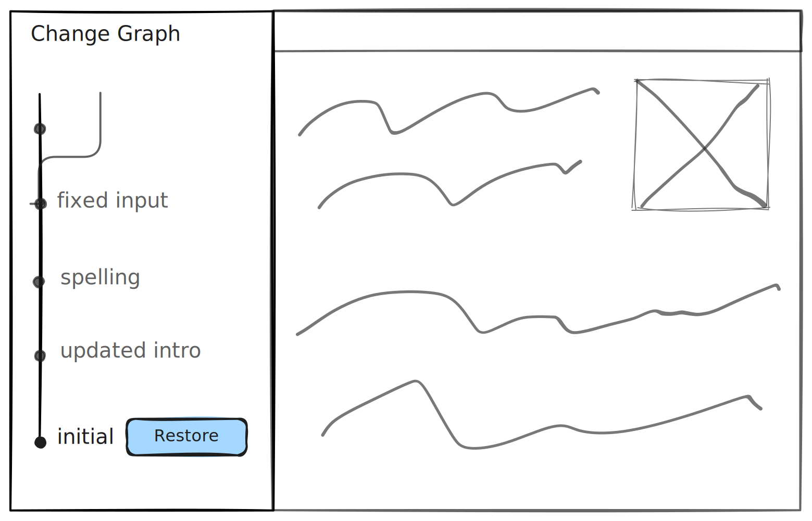

# Restore

Restore enables applications to revert to a previous state using any change set ID, providing a powerful safety net for users. This is especially useful when [working with AI agents](../ai-agent-collaboration.md), as it provides a way to recover from unintended changes.



## Examples

### Restore to the last change set

```ts
const lix = await openLix({});

// Get the most recent change set from the history
const lastChangeSet = await lix.db
  .selectFrom("change_set")
  .orderBy("created_at", "desc")
  .selectAll()
  .executeTakeFirstOrThrow();

// Restore the repository to that change set
await restore({ lix, to: lastChangeSet.id });
```

### Create and use a checkpoint

```ts
// Later, you can easily find and restore to that checkpoint
const checkpoints = await selectCheckpoints({ lix }).execute();
await restore({ lix, to: checkpoints[0].id });
```
