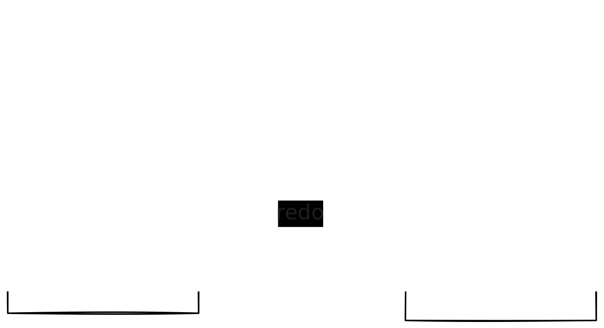

# Undo/Redo



```ts
import { openLix, undo, redo } from "@lix-js/sdk";

const lix = await openLix({});
```

```ts
await undo({ lix });

await redo({ lix });
```


```ts
// Undo multiple steps
await undo({ lix, steps: 3 });

// Redo multiple steps
await redo({ lix, steps: 3 });
```