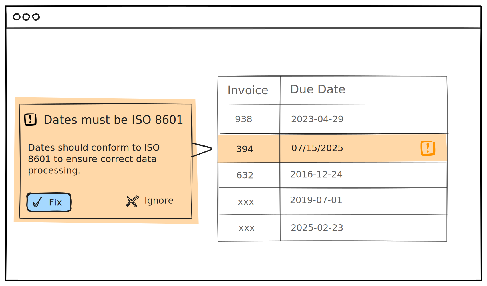

# Validation Rules

Validation rules are automated quality checks that run on every change, similar to lint rules in code. They help maintain data consistency, enforce standards, and enable AI agents to self-correct their mistakes.

**Applications**
  

**AI agents**

> [!NOTE]
> Validation rules are a proposed feature. If you're interested in using validation rules:
>
> - **Upvote the proposal:** [github.com/opral/lix-sdk/issues/239](https://github.com/opral/lix-sdk/issues/239)
> - **Watch the demo:** See validation rules in action in the [issue's demo video](https://github.com/opral/lix-sdk/issues/239)

## Use Cases

- **Localization:** Ensure all messages are translated to required languages
- **Data formats:** Validate dates conform to ISO 8601 in spreadsheets
- **AI agent self-correction:** Enable agents to detect and fix their own mistakes
