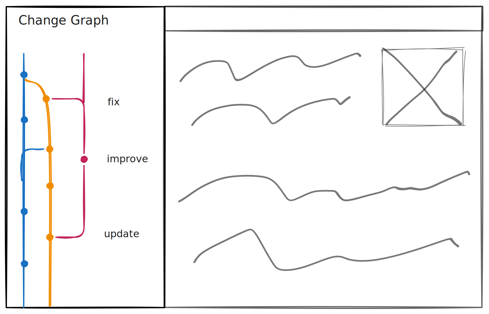

# Versions (Branching)



```ts
const lix = await openLix({});
```

```ts
const activeVersion = await selectActiveVersion({ lix })
  .executeTakeFirstOrThrow();

const newVersion = await createVersion({ lix, from: activeVersion });

await switchVersion({ lix, to: newVersion });
```

```ts
await merge({ lix, source: activeVersion, target: newVersion });
```
