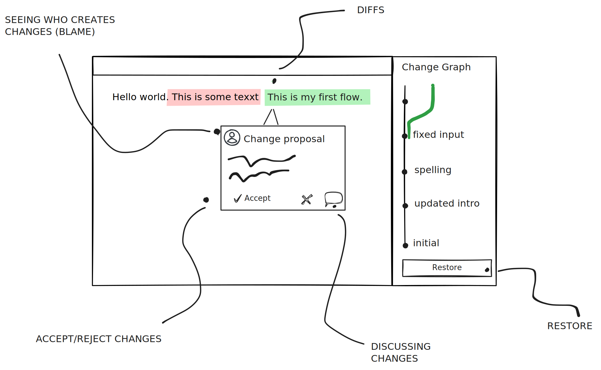

# What is Lix?

TODOS

- [ ] AI collaboration

Lix is a change control system that runs in the browser and provides an SDK to build web applications.

## Understanding Change Control

A change control system allows for storing, tracking, querying, and reviewing changes in different file formats, such as `.xlsx`, `.sqlite`, or `.json`. Unlike version control systems (like Git), a change control system understands *what* specifically changed in a file - for example, cell C43 in a spreadsheet or a specific property in a JSON object.

## Key Differences from Git

Lix is not a Git replacement, nor is it designed primarily for software engineering. Instead, the goal of Lix is to bring change control workflows to industries beyond software engineering, such as:

- Health
- Finance
- Policy making
- Design
- Data science
- And more...

## Key Features

### 📌 Versioning
Create divergent states (similar to branches in Git) to experiment with different changes.

### ⚡ CI/CD Automations
Implement software engineering-like automations for your data workflows.

### 🔀 Change Proposals
Review and discuss changes before they're merged (similar to pull requests).

### 🤝 Collaboration
Built-in sync that enables both asynchronous (Git-like) and real-time (Google Docs-like) collaboration capabilities.

### 🔍 SQL-Based Queries
Query data using SQL through Kysely, a type-safe SQL query builder. No new query language to learn!

### 🌐 Browser-First Architecture
Designed to run in the browser, avoiding Node/Unix dependencies.

## Use Cases

Lix is ideal for applications that revolve around changes and follow an "edit → review → automate" workflow:

- Document editors (markdown, PDF)
- Accounting solutions (auditing)
- Content creation tools (Figma, Adobe Premiere)
- Spreadsheets (Excel, Google Sheets)
- CAD software (Fusion 360, Autodesk)
- Data science tools (Jupyter Notebooks)
- Dashboards (Analytics, Infrastructure)

## Getting Started

Ready to dive in? Check out the [Getting Started](/guide/getting-started) guide to begin using Lix in your applications.