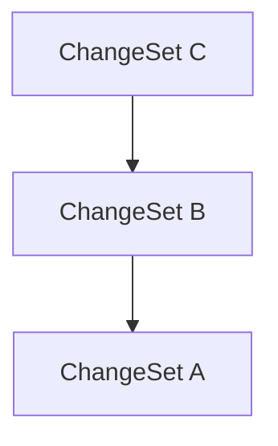

# Lix SDK API Reference

## applyAccountDatabaseSchema

[**@lix-js/sdk**](../README.md)

***

[@lix-js/sdk](../README.md) / applyAccountDatabaseSchema

# Function: applyAccountDatabaseSchema()

> **applyAccountDatabaseSchema**(`sqlite`): `void`

Defined in: [packages/lix-sdk/src/account/schema.ts:16](https://github.com/opral/monorepo/blob/fb8153a2c5d4710eaaabf056fe653be88060a185/packages/lix-sdk/src/account/schema.ts#L16)

## Parameters

### sqlite

`SqliteWasmDatabase`

## Returns

`void`

---

## applyChangeDatabaseSchema

[**@lix-js/sdk**](../README.md)

***

[@lix-js/sdk](../README.md) / applyChangeDatabaseSchema

# Function: applyChangeDatabaseSchema()

> **applyChangeDatabaseSchema**(`sqlite`): `SqliteWasmDatabase`

Defined in: [packages/lix-sdk/src/change/schema.ts:4](https://github.com/opral/monorepo/blob/fb8153a2c5d4710eaaabf056fe653be88060a185/packages/lix-sdk/src/change/schema.ts#L4)

## Parameters

### sqlite

`SqliteWasmDatabase`

## Returns

`SqliteWasmDatabase`

---

## applyChangeSet

[**@lix-js/sdk**](../README.md)

***

[@lix-js/sdk](../README.md) / applyChangeSet

# Function: applyChangeSet()

> **applyChangeSet**(`args`): `Promise`\<`void`\>

Defined in: [packages/lix-sdk/src/change-set/apply-change-set.ts:9](https://github.com/opral/monorepo/blob/fb8153a2c5d4710eaaabf056fe653be88060a185/packages/lix-sdk/src/change-set/apply-change-set.ts#L9)

Applies a change set to the lix.

## Parameters

### args

#### changeSet

`Pick`\<[`ChangeSet`](../type-aliases/ChangeSet.md), `"id"`\>

#### lix

[`Lix`](../type-aliases/Lix.md)

## Returns

`Promise`\<`void`\>

---

## applyChangeSetDatabaseSchema

[**@lix-js/sdk**](../README.md)

***

[@lix-js/sdk](../README.md) / applyChangeSetDatabaseSchema

# Function: applyChangeSetDatabaseSchema()

> **applyChangeSetDatabaseSchema**(`sqlite`): `SqliteWasmDatabase`

Defined in: [packages/lix-sdk/src/change-set/schema.ts:15](https://github.com/opral/monorepo/blob/fb8153a2c5d4710eaaabf056fe653be88060a185/packages/lix-sdk/src/change-set/schema.ts#L15)

## Parameters

### sqlite

`SqliteWasmDatabase`

## Returns

`SqliteWasmDatabase`

---

## applyFileDatabaseSchema

[**@lix-js/sdk**](../README.md)

***

[@lix-js/sdk](../README.md) / applyFileDatabaseSchema

# Function: applyFileDatabaseSchema()

> **applyFileDatabaseSchema**(`lix`): `void`

Defined in: [packages/lix-sdk/src/file/schema.ts:12](https://github.com/opral/monorepo/blob/fb8153a2c5d4710eaaabf056fe653be88060a185/packages/lix-sdk/src/file/schema.ts#L12)

## Parameters

### lix

`Pick`\<[`Lix`](../type-aliases/Lix.md), `"sqlite"` \| `"db"` \| `"plugin"`\>

## Returns

`void`

---

## applyKeyValueDatabaseSchema

[**@lix-js/sdk**](../README.md)

***

[@lix-js/sdk](../README.md) / applyKeyValueDatabaseSchema

# Function: applyKeyValueDatabaseSchema()

> **applyKeyValueDatabaseSchema**(`sqlite`): `void`

Defined in: [packages/lix-sdk/src/key-value/schema.ts:16](https://github.com/opral/monorepo/blob/fb8153a2c5d4710eaaabf056fe653be88060a185/packages/lix-sdk/src/key-value/schema.ts#L16)

## Parameters

### sqlite

`SqliteWasmDatabase`

## Returns

`void`

---

## applyLabelDatabaseSchema

[**@lix-js/sdk**](../README.md)

***

[@lix-js/sdk](../README.md) / applyLabelDatabaseSchema

# Function: applyLabelDatabaseSchema()

> **applyLabelDatabaseSchema**(`sqlite`): `SqliteWasmDatabase`

Defined in: [packages/lix-sdk/src/label/schema.ts:15](https://github.com/opral/monorepo/blob/fb8153a2c5d4710eaaabf056fe653be88060a185/packages/lix-sdk/src/label/schema.ts#L15)

## Parameters

### sqlite

`SqliteWasmDatabase`

## Returns

`SqliteWasmDatabase`

---

## applyLogDatabaseSchema

[**@lix-js/sdk**](../README.md)

***

[@lix-js/sdk](../README.md) / applyLogDatabaseSchema

# Function: applyLogDatabaseSchema()

> **applyLogDatabaseSchema**(`sqlite`): `SqliteWasmDatabase`

Defined in: [packages/lix-sdk/src/log/schema.ts:15](https://github.com/opral/monorepo/blob/fb8153a2c5d4710eaaabf056fe653be88060a185/packages/lix-sdk/src/log/schema.ts#L15)

## Parameters

### sqlite

`SqliteWasmDatabase`

## Returns

`SqliteWasmDatabase`

---

## applySnapshotDatabaseSchema

[**@lix-js/sdk**](../README.md)

***

[@lix-js/sdk](../README.md) / applySnapshotDatabaseSchema

# Function: applySnapshotDatabaseSchema()

> **applySnapshotDatabaseSchema**(`sqlite`): `SqliteWasmDatabase`

Defined in: [packages/lix-sdk/src/snapshot/schema.ts:9](https://github.com/opral/monorepo/blob/fb8153a2c5d4710eaaabf056fe653be88060a185/packages/lix-sdk/src/snapshot/schema.ts#L9)

## Parameters

### sqlite

`SqliteWasmDatabase`

## Returns

`SqliteWasmDatabase`

---

## applyThreadDatabaseSchema

[**@lix-js/sdk**](../README.md)

***

[@lix-js/sdk](../README.md) / applyThreadDatabaseSchema

# Function: applyThreadDatabaseSchema()

> **applyThreadDatabaseSchema**(`sqlite`): `SqliteWasmDatabase`

Defined in: [packages/lix-sdk/src/thread/schema.ts:15](https://github.com/opral/monorepo/blob/fb8153a2c5d4710eaaabf056fe653be88060a185/packages/lix-sdk/src/thread/schema.ts#L15)

## Parameters

### sqlite

`SqliteWasmDatabase`

## Returns

`SqliteWasmDatabase`

---

## applyVersionDatabaseSchema

[**@lix-js/sdk**](../README.md)

***

[@lix-js/sdk](../README.md) / applyVersionDatabaseSchema

# Function: applyVersionDatabaseSchema()

> **applyVersionDatabaseSchema**(`sqlite`): `void`

Defined in: [packages/lix-sdk/src/version/schema.ts:23](https://github.com/opral/monorepo/blob/fb8153a2c5d4710eaaabf056fe653be88060a185/packages/lix-sdk/src/version/schema.ts#L23)

## Parameters

### sqlite

`SqliteWasmDatabase`

## Returns

`void`

---

## changeHasLabel

[**@lix-js/sdk**](../README.md)

***

[@lix-js/sdk](../README.md) / changeHasLabel

# Function: changeHasLabel()

> **changeHasLabel**(`label`): (`eb`) => `ExpressionWrapper`\<[`LixDatabaseSchema`](../type-aliases/LixDatabaseSchema.md), `"change"`, `SqlBool`\>

Defined in: [packages/lix-sdk/src/query-filter/change-has-label.ts:25](https://github.com/opral/monorepo/blob/fb8153a2c5d4710eaaabf056fe653be88060a185/packages/lix-sdk/src/query-filter/change-has-label.ts#L25)

Selects changes that have a label with the given name.

## Parameters

### label

\{ `id`: `string`; `name?`: `string`; \} | \{ `id?`: `string`; `name`: `string`; \}

## Returns

> (`eb`): `ExpressionWrapper`\<[`LixDatabaseSchema`](../type-aliases/LixDatabaseSchema.md), `"change"`, `SqlBool`\>

### Parameters

#### eb

`ExpressionBuilder`\<[`LixDatabaseSchema`](../type-aliases/LixDatabaseSchema.md), `"change"`\>

### Returns

`ExpressionWrapper`\<[`LixDatabaseSchema`](../type-aliases/LixDatabaseSchema.md), `"change"`, `SqlBool`\>

## Examples

```ts
  await lix.db.selectFrom("change")
     .where(changeHasLabel({ name: "checkpoint" }))
     .selectAll()
     .execute();
  ```

You can use eb.not() to negate the filter.

  ```ts
  await lix.db.selectFrom("change")
		.where((eb) => eb.not(changeHasLabel({ name: "checkpoint"})))
		.selectAll()
		.execute();
  ```

---

## changeSetElementInAncestryOf

[**@lix-js/sdk**](../README.md)

***

[@lix-js/sdk](../README.md) / changeSetElementInAncestryOf

# Function: changeSetElementInAncestryOf()

> **changeSetElementInAncestryOf**(`target`, `options?`): (`eb`) => `ExpressionWrapper`\<[`LixDatabaseSchema`](../type-aliases/LixDatabaseSchema.md), `"change_set_element"`, `SqlBool`\>

Defined in: [packages/lix-sdk/src/query-filter/change-set-element-in-ancestry-of.ts:33](https://github.com/opral/monorepo/blob/fb8153a2c5d4710eaaabf056fe653be88060a185/packages/lix-sdk/src/query-filter/change-set-element-in-ancestry-of.ts#L33)

Filters elements that are in the ancestry of the given change set(s).

## Parameters

### target

A target change set object (or its id), or an array of such objects/ids.

`Pick`\<\{ `id`: `string`; `lixcol_created_at`: `string`; `lixcol_file_id`: `string`; `lixcol_inherited_from_version_id`: `null` \| `string`; `lixcol_updated_at`: `string`; `metadata`: `null` \| `Record`\<`string`, `any`\>; \}, `"id"`\> | `Pick`\<\{ `id`: `string`; `lixcol_created_at`: `string`; `lixcol_file_id`: `string`; `lixcol_inherited_from_version_id`: `null` \| `string`; `lixcol_updated_at`: `string`; `metadata`: `null` \| `Record`\<`string`, `any`\>; \}, `"id"`\>[]

### options?

Optional options object (e.g., depth limit)

#### depth?

`number`

## Returns

A Kysely ExpressionBuilder function for filtering.

> (`eb`): `ExpressionWrapper`\<[`LixDatabaseSchema`](../type-aliases/LixDatabaseSchema.md), `"change_set_element"`, `SqlBool`\>

### Parameters

#### eb

`ExpressionBuilder`\<[`LixDatabaseSchema`](../type-aliases/LixDatabaseSchema.md), `"change_set_element"`\>

### Returns

`ExpressionWrapper`\<[`LixDatabaseSchema`](../type-aliases/LixDatabaseSchema.md), `"change_set_element"`, `SqlBool`\>

## Example

```ts
// Elements from the history of cs2 (object)
db.selectFrom("change_set_element")
  .where(changeSetElementInAncestryOf(cs2))
  .selectAll()

// Elements from the history of cs2 (id)
db.selectFrom("change_set_element")
  .where(changeSetElementInAncestryOf(cs2.id))
  .selectAll()

// Elements from the combined history of cs2 and cs4 (divergent branches)
db.selectFrom("change_set_element")
  .where(changeSetElementInAncestryOf([cs2, cs4]))
  .selectAll()
```

---

## changeSetElementInSymmetricDifference

[**@lix-js/sdk**](../README.md)

***

[@lix-js/sdk](../README.md) / changeSetElementInSymmetricDifference

# Function: changeSetElementInSymmetricDifference()

> **changeSetElementInSymmetricDifference**(`a`, `b`): (`eb`) => `ExpressionWrapper`\<[`LixDatabaseSchema`](../type-aliases/LixDatabaseSchema.md), `"change_set_element"`, `SqlBool`\>

Defined in: [packages/lix-sdk/src/query-filter/change-set-element-in-symmetric-difference.ts:20](https://github.com/opral/monorepo/blob/fb8153a2c5d4710eaaabf056fe653be88060a185/packages/lix-sdk/src/query-filter/change-set-element-in-symmetric-difference.ts#L20)

Returns the symmetric difference between two change sets.

The symmetric difference is the set of changes
that exist in either one version but not both.
Modeled after https://developer.mozilla.org/en-US/docs/Web/JavaScript/Reference/Global_Objects/Set/symmetricDifference

## Parameters

### a

`Pick`\<[`ChangeSet`](../type-aliases/ChangeSet.md), `"id"`\>

### b

`Pick`\<[`ChangeSet`](../type-aliases/ChangeSet.md), `"id"`\>

## Returns

> (`eb`): `ExpressionWrapper`\<[`LixDatabaseSchema`](../type-aliases/LixDatabaseSchema.md), `"change_set_element"`, `SqlBool`\>

### Parameters

#### eb

`ExpressionBuilder`\<[`LixDatabaseSchema`](../type-aliases/LixDatabaseSchema.md), `"change_set_element"`\>

### Returns

`ExpressionWrapper`\<[`LixDatabaseSchema`](../type-aliases/LixDatabaseSchema.md), `"change_set_element"`, `SqlBool`\>

## Example

```ts
  await lix.db.selectFrom("change_set_element")
    .where(changeSetElementInSymmetricDifference(a: changeSetA, b: changeSetB))
    .selectAll()
    .execute();
  ```

---

## changeSetElementIsLeafOf

[**@lix-js/sdk**](../README.md)

***

[@lix-js/sdk](../README.md) / changeSetElementIsLeafOf

# Function: changeSetElementIsLeafOf()

> **changeSetElementIsLeafOf**(`target`): (`eb`) => `ExpressionWrapper`\<[`LixDatabaseSchema`](../type-aliases/LixDatabaseSchema.md), `"change_set_element"`, `SqlBool`\>

Defined in: [packages/lix-sdk/src/query-filter/change-set-element-is-leaf-of.ts:34](https://github.com/opral/monorepo/blob/fb8153a2c5d4710eaaabf056fe653be88060a185/packages/lix-sdk/src/query-filter/change-set-element-is-leaf-of.ts#L34)

Filters the leaves of the given change set(s).

An element is considered a **leaf** if no other element in the combined ancestry
of the target change sets redefines the same entity at a later point in the graph.

## Parameters

### target

A target change set object (or its id), or an array of such objects/ids.

`Pick`\<\{ `id`: `string`; `lixcol_created_at`: `string`; `lixcol_file_id`: `string`; `lixcol_inherited_from_version_id`: `null` \| `string`; `lixcol_updated_at`: `string`; `metadata`: `null` \| `Record`\<`string`, `any`\>; \}, `"id"`\> | `Pick`\<\{ `id`: `string`; `lixcol_created_at`: `string`; `lixcol_file_id`: `string`; `lixcol_inherited_from_version_id`: `null` \| `string`; `lixcol_updated_at`: `string`; `metadata`: `null` \| `Record`\<`string`, `any`\>; \}, `"id"`\>[]

## Returns

> (`eb`): `ExpressionWrapper`\<[`LixDatabaseSchema`](../type-aliases/LixDatabaseSchema.md), `"change_set_element"`, `SqlBool`\>

### Parameters

#### eb

`ExpressionBuilder`\<[`LixDatabaseSchema`](../type-aliases/LixDatabaseSchema.md), `"change_set_element"`\>

### Returns

`ExpressionWrapper`\<[`LixDatabaseSchema`](../type-aliases/LixDatabaseSchema.md), `"change_set_element"`, `SqlBool`\>

## Example

```ts
// Find leaves relative to a single change set (object)
db.selectFrom("change_set_element")
  .where(changeSetElementIsLeafOf(cs))
  .selectAll()

// Find leaves relative to a single change set (id)
db.selectFrom("change_set_element")
  .where(changeSetElementIsLeafOf(cs.id))
  .selectAll()

// Find leaves relative to multiple change sets
db.selectFrom("change_set_element")
  .where(changeSetElementIsLeafOf([cs_source, cs_target]))
  .selectAll()
```

---

## changeSetHasLabel

[**@lix-js/sdk**](../README.md)

***

[@lix-js/sdk](../README.md) / changeSetHasLabel

# Function: changeSetHasLabel()

> **changeSetHasLabel**(`label`): (`eb`) => `ExpressionWrapper`\<[`LixDatabaseSchema`](../type-aliases/LixDatabaseSchema.md), `"change_set"`, `SqlBool`\>

Defined in: [packages/lix-sdk/src/query-filter/change-set-has-label.ts:35](https://github.com/opral/monorepo/blob/fb8153a2c5d4710eaaabf056fe653be88060a185/packages/lix-sdk/src/query-filter/change-set-has-label.ts#L35)

Selects change sets that have a label with the given name.

## Parameters

### label

\{ `id`: `string`; `name?`: `string`; \} | \{ `id?`: `string`; `name`: `string`; \}

## Returns

> (`eb`): `ExpressionWrapper`\<[`LixDatabaseSchema`](../type-aliases/LixDatabaseSchema.md), `"change_set"`, `SqlBool`\>

### Parameters

#### eb

`ExpressionBuilder`\<[`LixDatabaseSchema`](../type-aliases/LixDatabaseSchema.md), `"change_set"`\>

### Returns

`ExpressionWrapper`\<[`LixDatabaseSchema`](../type-aliases/LixDatabaseSchema.md), `"change_set"`, `SqlBool`\>

## Examples

```ts
  await lix.db.selectFrom("change_set")
     .where(changeSetHasLabel({ name: "checkpoint" }))
     .selectAll()
     .execute();
  ```

You can use eb.not() to negate the filter.

  ```ts
  await lix.db.selectFrom("change_set")
		.where((eb) => eb.not(changeSetHasLabel({ name: "checkpoint" })))
		.selectAll()
		.execute();
  ```

Id lookup also works:

  ```ts
  await lix.db.selectFrom("change_set")
		.where(changeSetHasLabel({ id: "39j9afj2" }))
		.selectAll()
		.execute();
  ```

---

## changeSetIsAncestorOf

[**@lix-js/sdk**](../README.md)

***

[@lix-js/sdk](../README.md) / changeSetIsAncestorOf

# Function: changeSetIsAncestorOf()

> **changeSetIsAncestorOf**(`changeSet`, `options?`): (`eb`) => `ExpressionWrapper`\<[`LixDatabaseSchema`](../type-aliases/LixDatabaseSchema.md), `"change_set"`, `SqlBool`\>

Defined in: [packages/lix-sdk/src/query-filter/change-set-is-ancestor-of.ts:53](https://github.com/opral/monorepo/blob/fb8153a2c5d4710eaaabf056fe653be88060a185/packages/lix-sdk/src/query-filter/change-set-is-ancestor-of.ts#L53)

Filters change sets that are ancestors of the given change set.

By default, this is **exclusive**, meaning it returns only change sets strictly
*before* the provided change set in the graph.

Traverses the `change_set_edge` graph recursively, starting from the provided change set
(or its parents if exclusive), and returns all change sets reachable via parent edges.

This filter is typically used to scope the graph before applying filters like `changeIsLeaf()`.

⚠️ This filter only defines the traversal scope — it does not filter changes directly.

--- Options ---
- `includeSelf`: If `true`, includes the starting `changeSet` in the results. Defaults to `false`.
- `depth`: Limits the traversal depth. `depth: 1` selects only immediate parents (if exclusive)
  or the starting node and its immediate parents (if inclusive).

--- Examples ---

## Parameters

### changeSet

`Pick`\<[`ChangeSet`](../type-aliases/ChangeSet.md), `"id"`\>

### options?

#### depth?

`number`

#### includeSelf?

`boolean`

## Returns

> (`eb`): `ExpressionWrapper`\<[`LixDatabaseSchema`](../type-aliases/LixDatabaseSchema.md), `"change_set"`, `SqlBool`\>

### Parameters

#### eb

`ExpressionBuilder`\<[`LixDatabaseSchema`](../type-aliases/LixDatabaseSchema.md), `"change_set"`\>

### Returns

`ExpressionWrapper`\<[`LixDatabaseSchema`](../type-aliases/LixDatabaseSchema.md), `"change_set"`, `SqlBool`\>

## Examples

```ts
db.selectFrom("change_set")
  .where(changeSetIsAncestorOf({ id: "cs3" }))
  .selectAll()
```

```ts
db.selectFrom("change_set")
  .where(changeSetIsAncestorOf({ id: "cs3" }, { includeSelf: true }))
  .selectAll()
```

```ts
// Select all change sets between startPoint and endPoint (inclusive)
db.selectFrom("change_set")
  .where(changeSetIsDescendantOf({ id: "startPoint" }))
  .where(changeSetIsAncestorOf({ id: "endPoint" }))
  .selectAll()
```

---

## changeSetIsDescendantOf

[**@lix-js/sdk**](../README.md)

***

[@lix-js/sdk](../README.md) / changeSetIsDescendantOf

# Function: changeSetIsDescendantOf()

> **changeSetIsDescendantOf**(`changeSet`, `options?`): (`eb`) => `ExpressionWrapper`\<[`LixDatabaseSchema`](../type-aliases/LixDatabaseSchema.md), `"change_set"`, `SqlBool`\>

Defined in: [packages/lix-sdk/src/query-filter/change-set-is-descendant-of.ts:46](https://github.com/opral/monorepo/blob/fb8153a2c5d4710eaaabf056fe653be88060a185/packages/lix-sdk/src/query-filter/change-set-is-descendant-of.ts#L46)

Filters change sets that are descendants of the given change set.

By default, this is **exclusive**, meaning it returns only change sets strictly
*after* the provided change set in the graph.

Traverses the `change_set_edge` graph recursively, starting from the provided change set
(or its children if exclusive), and returns all change sets reachable via child edges.

This filter is useful for finding changes made *after* a specific point in time (e.g., a checkpoint).

⚠️ This filter only defines the traversal scope — it does not filter changes directly.

--- Options ---
- `includeSelf`: If `true`, includes the starting `changeSet` in the results. Defaults to `false`.
- `depth`: Limits the traversal depth. `depth: 1` selects only immediate children (if exclusive)
  or the starting node and its immediate children (if includeSelf is true).

--- Examples ---

## Parameters

### changeSet

`Pick`\<[`ChangeSet`](../type-aliases/ChangeSet.md), `"id"`\>

### options?

#### depth?

`number`

#### includeSelf?

`boolean`

## Returns

> (`eb`): `ExpressionWrapper`\<[`LixDatabaseSchema`](../type-aliases/LixDatabaseSchema.md), `"change_set"`, `SqlBool`\>

### Parameters

#### eb

`ExpressionBuilder`\<[`LixDatabaseSchema`](../type-aliases/LixDatabaseSchema.md), `"change_set"`\>

### Returns

`ExpressionWrapper`\<[`LixDatabaseSchema`](../type-aliases/LixDatabaseSchema.md), `"change_set"`, `SqlBool`\>

## Examples

```ts
db.selectFrom("change_set")
  .where(changeSetIsDescendantOf({ id: "cs1" }))
  .selectAll()
```

```ts
// Select all change sets between startPoint and endPoint (inclusive)
db.selectFrom("change_set")
  .where(changeSetIsDescendantOf({ id: "startPoint" }))
  .where(changeSetIsAncestorOf({ id: "endPoint" }))
  .selectAll()
```

---

## closeLix

[**@lix-js/sdk**](../README.md)

***

[@lix-js/sdk](../README.md) / closeLix

# Function: closeLix()

> **closeLix**(`args`): `Promise`\<`void`\>

Defined in: [packages/lix-sdk/src/lix/close-lix.ts:6](https://github.com/opral/monorepo/blob/fb8153a2c5d4710eaaabf056fe653be88060a185/packages/lix-sdk/src/lix/close-lix.ts#L6)

Closes the lix.

## Parameters

### args

#### lix

`Pick`\<[`Lix`](../type-aliases/Lix.md), `"db"`\>

## Returns

`Promise`\<`void`\>

---

## createAccount

[**@lix-js/sdk**](../README.md)

***

[@lix-js/sdk](../README.md) / createAccount

# Function: createAccount()

> **createAccount**(`args`): `Promise`\<\{ `id`: `string`; `lixcol_created_at`: `string`; `lixcol_file_id`: `string`; `lixcol_inherited_from_version_id`: `null` \| `string`; `lixcol_updated_at`: `string`; `name`: `string`; \}\>

Defined in: [packages/lix-sdk/src/account/create-account.ts:5](https://github.com/opral/monorepo/blob/fb8153a2c5d4710eaaabf056fe653be88060a185/packages/lix-sdk/src/account/create-account.ts#L5)

## Parameters

### args

#### id?

`string`

#### lix

`Pick`\<[`Lix`](../type-aliases/Lix.md), `"db"`\>

#### lixcol_version_id?

`string`

#### name

`string`

## Returns

`Promise`\<\{ `id`: `string`; `lixcol_created_at`: `string`; `lixcol_file_id`: `string`; `lixcol_inherited_from_version_id`: `null` \| `string`; `lixcol_updated_at`: `string`; `name`: `string`; \}\>

---

## createChange

[**@lix-js/sdk**](../README.md)

***

[@lix-js/sdk](../README.md) / createChange

# Function: createChange()

> **createChange**(`args`): `Promise`\<\{ `created_at`: `string`; `entity_id`: `string`; `file_id`: `string`; `id`: `string`; `plugin_key`: `string`; `schema_key`: `string`; `schema_version`: `string`; `snapshot_id`: `string`; \}\>

Defined in: [packages/lix-sdk/src/change/create-change.ts:9](https://github.com/opral/monorepo/blob/fb8153a2c5d4710eaaabf056fe653be88060a185/packages/lix-sdk/src/change/create-change.ts#L9)

## Parameters

### args

#### authors?

`Pick`\<\{ `id`: `string`; `lixcol_created_at`: `string`; `lixcol_file_id`: `string`; `lixcol_inherited_from_version_id`: `null` \| `string`; `lixcol_updated_at`: `string`; `name`: `string`; \}, `"id"`\>[]

#### entity_id

`string`

#### file_id

`string`

#### id?

`string`

#### lix

`Pick`\<[`Lix`](../type-aliases/Lix.md), `"db"` \| `"sqlite"`\>

#### plugin_key

`string`

#### schema_key

`string`

#### schema_version

`string`

#### snapshot

`Omit`\<[`NewSnapshot`](../type-aliases/NewSnapshot.md), `"id"`\>

## Returns

`Promise`\<\{ `created_at`: `string`; `entity_id`: `string`; `file_id`: `string`; `id`: `string`; `plugin_key`: `string`; `schema_key`: `string`; `schema_version`: `string`; `snapshot_id`: `string`; \}\>

---

## createChangeSet

[**@lix-js/sdk**](../README.md)

***

[@lix-js/sdk](../README.md) / createChangeSet

# Function: createChangeSet()

> **createChangeSet**(`args`): `Promise`\<`object` & `object`\>

Defined in: [packages/lix-sdk/src/change-set/create-change-set.ts:6](https://github.com/opral/monorepo/blob/fb8153a2c5d4710eaaabf056fe653be88060a185/packages/lix-sdk/src/change-set/create-change-set.ts#L6)

## Parameters

### args

#### elements?

`Omit`\<`object` & `object`, `"change_set_id"`\>[]

#### id?

`string`

#### labels?

`Pick`\<\{ `id`: `string`; `lixcol_created_at`: `string`; `lixcol_file_id`: `string`; `lixcol_inherited_from_version_id`: `null` \| `string`; `lixcol_updated_at`: `string`; `name`: `string`; \}, `"id"`\>[]

#### lix

`Pick`\<[`Lix`](../type-aliases/Lix.md), `"db"`\>

#### lixcol_version_id?

`string`

Version ID where the change set should be stored. Defaults to active version

#### parents?

`Pick`\<\{ `id`: `string`; `lixcol_created_at`: `string`; `lixcol_file_id`: `string`; `lixcol_inherited_from_version_id`: `null` \| `string`; `lixcol_updated_at`: `string`; `metadata`: `null` \| `Record`\<`string`, `any`\>; \}, `"id"`\>[]

Parent change sets that this change set will be a child of

## Returns

`Promise`\<`object` & `object`\>

---

## createCheckpoint

[**@lix-js/sdk**](../README.md)

***

[@lix-js/sdk](../README.md) / createCheckpoint

# Function: createCheckpoint()

> **createCheckpoint**(`args`): `Promise`\<\{ `id`: `string`; \}\>

Defined in: [packages/lix-sdk/src/change-set/create-checkpoint.ts:4](https://github.com/opral/monorepo/blob/fb8153a2c5d4710eaaabf056fe653be88060a185/packages/lix-sdk/src/change-set/create-checkpoint.ts#L4)

## Parameters

### args

#### lix

[`Lix`](../type-aliases/Lix.md)

## Returns

`Promise`\<\{ `id`: `string`; \}\>

---

## createLabel

[**@lix-js/sdk**](../README.md)

***

[@lix-js/sdk](../README.md) / createLabel

# Function: createLabel()

> **createLabel**(`args`): `Promise`\<\{ `id`: `string`; `lixcol_created_at`: `string`; `lixcol_file_id`: `string`; `lixcol_inherited_from_version_id`: `null` \| `string`; `lixcol_updated_at`: `string`; `name`: `string`; \}\>

Defined in: [packages/lix-sdk/src/label/create-label.ts:5](https://github.com/opral/monorepo/blob/fb8153a2c5d4710eaaabf056fe653be88060a185/packages/lix-sdk/src/label/create-label.ts#L5)

## Parameters

### args

#### id?

`string`

#### lix

`Pick`\<[`Lix`](../type-aliases/Lix.md), `"db"`\>

#### lixcol_version_id?

`string`

#### name

`string`

## Returns

`Promise`\<\{ `id`: `string`; `lixcol_created_at`: `string`; `lixcol_file_id`: `string`; `lixcol_inherited_from_version_id`: `null` \| `string`; `lixcol_updated_at`: `string`; `name`: `string`; \}\>

---

## createLog

[**@lix-js/sdk**](../README.md)

***

[@lix-js/sdk](../README.md) / createLog

# Function: createLog()

> **createLog**(`args`): `Promise`\<\{ `created_at`: `string`; `id`: `string`; `key`: `string`; `level`: `string`; `lixcol_created_at`: `string`; `lixcol_file_id`: `string`; `lixcol_inherited_from_version_id`: `null` \| `string`; `lixcol_updated_at`: `string`; `message`: `string`; \}\>

Defined in: [packages/lix-sdk/src/log/create-log.ts:27](https://github.com/opral/monorepo/blob/fb8153a2c5d4710eaaabf056fe653be88060a185/packages/lix-sdk/src/log/create-log.ts#L27)

Directly creates a log entry in the Lix database without applying any filters.

This function inserts the log entry regardless of the `lix_log_levels` setting
in the key-value store. It is the responsibility of the calling application
to implement any desired log level filtering before invoking this function.

It is recommended to use dot notation for log keys (e.g., 'app.module.component').

## Parameters

### args

#### key

`string`

#### level

`string`

#### lix

`Pick`\<[`Lix`](../type-aliases/Lix.md), `"sqlite"` \| `"db"`\>

#### message

`string`

## Returns

`Promise`\<\{ `created_at`: `string`; `id`: `string`; `key`: `string`; `level`: `string`; `lixcol_created_at`: `string`; `lixcol_file_id`: `string`; `lixcol_inherited_from_version_id`: `null` \| `string`; `lixcol_updated_at`: `string`; `message`: `string`; \}\>

A promise that resolves with the created log entry.

## Example

```ts
// Directly log an info message

if (shouldLog) {
  await createLog({
    lix,
    key: 'app.init',
    level: 'info',
    message: 'Application initialized'
});
```

---

## createLspInMemoryEnvironment

[**@lix-js/sdk**](../README.md)

***

[@lix-js/sdk](../README.md) / createLspInMemoryEnvironment

# Function: createLspInMemoryEnvironment()

> **createLspInMemoryEnvironment**(): `LspEnvironment`

Defined in: [packages/lix-sdk/src/server-protocol-handler/environment/create-in-memory-environment.ts:12](https://github.com/opral/monorepo/blob/fb8153a2c5d4710eaaabf056fe653be88060a185/packages/lix-sdk/src/server-protocol-handler/environment/create-in-memory-environment.ts#L12)

Create an in-memory storage.

Great for testing or quick prototyping.

## Returns

`LspEnvironment`

---

## createMergeChangeSet

[**@lix-js/sdk**](../README.md)

***

[@lix-js/sdk](../README.md) / createMergeChangeSet

# Function: createMergeChangeSet()

> **createMergeChangeSet**(`args`): `Promise`\<\{ `id`: `string`; `lixcol_created_at`: `string`; `lixcol_file_id`: `string`; `lixcol_inherited_from_version_id`: `null` \| `string`; `lixcol_updated_at`: `string`; `metadata`: `null` \| `Record`\<`string`, `any`\>; \}\>

Defined in: [packages/lix-sdk/src/change-set/create-merge-change-set.ts:22](https://github.com/opral/monorepo/blob/fb8153a2c5d4710eaaabf056fe653be88060a185/packages/lix-sdk/src/change-set/create-merge-change-set.ts#L22)

Merges two change sets using a "source wins" strategy (until lix models conflicts).

Creates a new change set containing the merged result. If an element
(identified by entity_id, file_id, schema_key) exists in both the source
and target change sets (considering their respective histories), the element
from the source change set's history takes precedence.

## Parameters

### args

The arguments for the merge operation.

#### lix

[`Lix`](../type-aliases/Lix.md)

The Lix instance.

#### source

`Pick`\<[`ChangeSet`](../type-aliases/ChangeSet.md), `"id"`\>

The source change set (only `id` is needed).

#### target

`Pick`\<[`ChangeSet`](../type-aliases/ChangeSet.md), `"id"`\>

The target change set (only `id` is needed).

## Returns

`Promise`\<\{ `id`: `string`; `lixcol_created_at`: `string`; `lixcol_file_id`: `string`; `lixcol_inherited_from_version_id`: `null` \| `string`; `lixcol_updated_at`: `string`; `metadata`: `null` \| `Record`\<`string`, `any`\>; \}\>

A Promise resolving to the newly created ChangeSet representing the merged state.

---

## createServerProtocolHandler

[**@lix-js/sdk**](../README.md)

***

[@lix-js/sdk](../README.md) / createServerProtocolHandler

# Function: createServerProtocolHandler()

> **createServerProtocolHandler**(`args`): `Promise`\<`LixServerProtocolHandler`\>

Defined in: [packages/lix-sdk/src/server-protocol-handler/create-server-protocol-handler.ts:55](https://github.com/opral/monorepo/blob/fb8153a2c5d4710eaaabf056fe653be88060a185/packages/lix-sdk/src/server-protocol-handler/create-server-protocol-handler.ts#L55)

The handler for the lix server protocol.

## Parameters

### args

#### environment

`LspEnvironment`

## Returns

`Promise`\<`LixServerProtocolHandler`\>

## Examples

Usage with a server framework.

  ```ts
	 // any server framework goes
  // here, like express, polka, etc.
  // frameworks that do not use
  // web standard Request and Response
  // objects will need to be mapped.
  const app = new Hono();

  const lspHandler = createServerProtocolHandler({ storage });

  app.use('/lsp/*', async (req) => {
     await lspHandler(req);
  });
  ```

Testing the handler.

  ```ts
  const lspHandler = createServerProtocolHandler({ storage });
  const request = new Request('/lsp/new', {
    method: 'POST',
    body: new Blob(['...']),
  });

  const response = await lspHandler(request);

  expect(response).to(...);
  ```

---

## createSnapshot

[**@lix-js/sdk**](../README.md)

***

[@lix-js/sdk](../README.md) / createSnapshot

# Function: createSnapshot()

> **createSnapshot**(`args`): `Promise`\<\{ `content`: `null` \| `Record`\<`string`, `any`\>; `id`: `string`; \}\>

Defined in: [packages/lix-sdk/src/snapshot/create-snapshot.ts:7](https://github.com/opral/monorepo/blob/fb8153a2c5d4710eaaabf056fe653be88060a185/packages/lix-sdk/src/snapshot/create-snapshot.ts#L7)

## Parameters

### args

#### content

`undefined` \| `null` \| `Record`\<`string`, `any`\>

#### lix

`Pick`\<[`Lix`](../type-aliases/Lix.md), `"db"` \| `"sqlite"`\>

## Returns

`Promise`\<\{ `content`: `null` \| `Record`\<`string`, `any`\>; `id`: `string`; \}\>

---

## createThread

[**@lix-js/sdk**](../README.md)

***

[@lix-js/sdk](../README.md) / createThread

# Function: createThread()

> **createThread**(`args`): `Promise`\<`object` & `object`\>

Defined in: [packages/lix-sdk/src/thread/create-thread.ts:5](https://github.com/opral/monorepo/blob/fb8153a2c5d4710eaaabf056fe653be88060a185/packages/lix-sdk/src/thread/create-thread.ts#L5)

## Parameters

### args

#### comments?

`Pick`\<`object` & `object`, `"body"`\>[]

#### id?

`string`

#### lix

[`Lix`](../type-aliases/Lix.md)

#### versionId?

`string`

defaults to global

## Returns

`Promise`\<`object` & `object`\>

---

## createThreadComment

[**@lix-js/sdk**](../README.md)

***

[@lix-js/sdk](../README.md) / createThreadComment

# Function: createThreadComment()

> **createThreadComment**(`args`): `Promise`\<\{ `body`: \{ `content`: (\{ `children`: `object`[]; `metadata?`: \{[`key`: `string`]: `unknown`; \}; `style`: `string`; `type`: `"zettel_text_block"`; `zettel_key`: `string`; \} \| `object` & `object`)[]; `type`: `"zettel_doc"`; \}; `id`: `string`; `lixcol_created_at`: `string`; `lixcol_file_id`: `string`; `lixcol_inherited_from_version_id`: `null` \| `string`; `lixcol_updated_at`: `string`; `parent_id`: `null` \| `string`; `thread_id`: `string`; \}\>

Defined in: [packages/lix-sdk/src/thread/create-thread-comment.ts:5](https://github.com/opral/monorepo/blob/fb8153a2c5d4710eaaabf056fe653be88060a185/packages/lix-sdk/src/thread/create-thread-comment.ts#L5)

## Parameters

### args

`object` & `object` & `object`

## Returns

`Promise`\<\{ `body`: \{ `content`: (\{ `children`: `object`[]; `metadata?`: \{[`key`: `string`]: `unknown`; \}; `style`: `string`; `type`: `"zettel_text_block"`; `zettel_key`: `string`; \} \| `object` & `object`)[]; `type`: `"zettel_doc"`; \}; `id`: `string`; `lixcol_created_at`: `string`; `lixcol_file_id`: `string`; `lixcol_inherited_from_version_id`: `null` \| `string`; `lixcol_updated_at`: `string`; `parent_id`: `null` \| `string`; `thread_id`: `string`; \}\>

---

## createTransitionChangeSet

[**@lix-js/sdk**](../README.md)

***

[@lix-js/sdk](../README.md) / createTransitionChangeSet

# Function: createTransitionChangeSet()

> **createTransitionChangeSet**(`args`): `Promise`\<\{ `id`: `string`; `lixcol_created_at`: `string`; `lixcol_file_id`: `string`; `lixcol_inherited_from_version_id`: `null` \| `string`; `lixcol_updated_at`: `string`; `metadata`: `null` \| `Record`\<`string`, `any`\>; \}\>

Defined in: [packages/lix-sdk/src/change-set/create-transition-change-set.ts:17](https://github.com/opral/monorepo/blob/fb8153a2c5d4710eaaabf056fe653be88060a185/packages/lix-sdk/src/change-set/create-transition-change-set.ts#L17)

Creates a change set that enables a transition from a source state
(defined by `sourceChangeSet`) to a target state (defined by `targetChangeSet`).

Applying the returned change set to the source state will result in a state
that matches the target state.

- switch between state (switching versions, checkpoints, etc.)
- restore old state (applying the transition set on top of current state)

## Parameters

### args

#### lix

[`Lix`](../type-aliases/Lix.md)

#### sourceChangeSet

`Pick`\<[`ChangeSet`](../type-aliases/ChangeSet.md), `"id"`\>

#### targetChangeSet

`Pick`\<[`ChangeSet`](../type-aliases/ChangeSet.md), `"id"`\>

## Returns

`Promise`\<\{ `id`: `string`; `lixcol_created_at`: `string`; `lixcol_file_id`: `string`; `lixcol_inherited_from_version_id`: `null` \| `string`; `lixcol_updated_at`: `string`; `metadata`: `null` \| `Record`\<`string`, `any`\>; \}\>

---

## createUndoChangeSet

[**@lix-js/sdk**](../README.md)

***

[@lix-js/sdk](../README.md) / createUndoChangeSet

# Function: createUndoChangeSet()

> **createUndoChangeSet**(`args`): `Promise`\<\{ `id`: `string`; `lixcol_created_at`: `string`; `lixcol_file_id`: `string`; `lixcol_inherited_from_version_id`: `null` \| `string`; `lixcol_updated_at`: `string`; `metadata`: `null` \| `Record`\<`string`, `any`\>; \}\>

Defined in: [packages/lix-sdk/src/change-set/create-undo-change-set.ts:26](https://github.com/opral/monorepo/blob/fb8153a2c5d4710eaaabf056fe653be88060a185/packages/lix-sdk/src/change-set/create-undo-change-set.ts#L26)

Creates a "reverse" change set that undoes the changes made by the specified change set.

## Parameters

### args

#### changeSet

`Pick`\<[`ChangeSet`](../type-aliases/ChangeSet.md), `"id"`\>

#### labels?

`Pick`\<\{ `id`: `string`; `lixcol_created_at`: `string`; `lixcol_file_id`: `string`; `lixcol_inherited_from_version_id`: `null` \| `string`; `lixcol_updated_at`: `string`; `name`: `string`; \}, `"id"`\>[]

#### lix

[`Lix`](../type-aliases/Lix.md)

## Returns

`Promise`\<\{ `id`: `string`; `lixcol_created_at`: `string`; `lixcol_file_id`: `string`; `lixcol_inherited_from_version_id`: `null` \| `string`; `lixcol_updated_at`: `string`; `metadata`: `null` \| `Record`\<`string`, `any`\>; \}\>

The newly created change set that contains the undo operations

## Example

```ts
  const undoChangeSet = await createUndoChangeSet({
    lix,
    changeSet: targetChangeSet
  });

  await applyChangeSet({
    lix,
    changeSet: undoChangeSet
  });
  ```

---

## createVersion

[**@lix-js/sdk**](../README.md)

***

[@lix-js/sdk](../README.md) / createVersion

# Function: createVersion()

> **createVersion**(`args`): `Promise`\<\{ `change_set_id`: `string`; `id`: `string`; `inherits_from_version_id`: `null` \| `string`; `lixcol_created_at`: `string`; `lixcol_file_id`: `string`; `lixcol_inherited_from_version_id`: `null` \| `string`; `lixcol_updated_at`: `string`; `name`: `string`; `working_change_set_id`: `string`; \}\>

Defined in: [packages/lix-sdk/src/version/create-version.ts:15](https://github.com/opral/monorepo/blob/fb8153a2c5d4710eaaabf056fe653be88060a185/packages/lix-sdk/src/version/create-version.ts#L15)

Creates a new version.

The changeSet can be any change set e.g. another version, a checkpoint, etc.

## Parameters

### args

#### changeSet?

`Pick`\<\{ `id`: `string`; `lixcol_created_at`: `string`; `lixcol_file_id`: `string`; `lixcol_inherited_from_version_id`: `null` \| `string`; `lixcol_updated_at`: `string`; `metadata`: `null` \| `Record`\<`string`, `any`\>; \}, `"id"`\>

#### id?

`string`

#### inherits_from_version_id?

`null` \| `string`

#### lix

[`Lix`](../type-aliases/Lix.md)

#### name?

`string`

## Returns

`Promise`\<\{ `change_set_id`: `string`; `id`: `string`; `inherits_from_version_id`: `null` \| `string`; `lixcol_created_at`: `string`; `lixcol_file_id`: `string`; `lixcol_inherited_from_version_id`: `null` \| `string`; `lixcol_updated_at`: `string`; `name`: `string`; `working_change_set_id`: `string`; \}\>

## Example

```ts
const version = await createVersion({ lix, changeSet: otherVersion.change_set_id });
```

---

## executeSync

[**@lix-js/sdk**](../README.md)

***

[@lix-js/sdk](../README.md) / executeSync

# Function: executeSync()

> **executeSync**(`args`): `any`[]

Defined in: [packages/lix-sdk/src/database/execute-sync.ts:21](https://github.com/opral/monorepo/blob/fb8153a2c5d4710eaaabf056fe653be88060a185/packages/lix-sdk/src/database/execute-sync.ts#L21)

Execute a query synchronously.

⚠️  MAJOR WARNING: This function is a PURE SQL LAYER without transformations!

- JSON columns return as RAW JSON STRINGS, not parsed objects
- You must manually parse/stringify JSON data
- No automatic type conversions happen
- Results are raw SQLite values

Only use this for triggers, database functions, or when you specifically
need synchronous database access and understand you're working with raw SQL.

## Parameters

### args

#### lix

`Pick`\<[`Lix`](../type-aliases/Lix.md), `"sqlite"`\>

#### query

`any`

## Returns

`any`[]

## Example

```ts
// JSON columns are returned as strings - you must parse manually:
  const result = executeSync({ lix, query });
  result[0].metadata = JSON.parse(result[0].metadata);
```

---

## jsonArrayFrom

[**@lix-js/sdk**](../README.md)

***

[@lix-js/sdk](../README.md) / jsonArrayFrom

# Function: jsonArrayFrom()

> **jsonArrayFrom**\<`O`\>(`expr`): `RawBuilder`\<`Simplify`\<`O`\>[]\>

Defined in: node\_modules/.pnpm/kysely@0.27.4/node\_modules/kysely/dist/esm/helpers/sqlite.d.ts:58

A SQLite helper for aggregating a subquery into a JSON array.

NOTE: This helper only works correctly if you've installed the `ParseJSONResultsPlugin`.
Otherwise the nested selections will be returned as JSON strings.

The plugin can be installed like this:

```ts
const db = new Kysely({
  dialect: new SqliteDialect(config),
  plugins: [new ParseJSONResultsPlugin()]
})
```

### Examples

```ts
const result = await db
  .selectFrom('person')
  .select((eb) => [
    'id',
    jsonArrayFrom(
      eb.selectFrom('pet')
        .select(['pet.id as pet_id', 'pet.name'])
        .whereRef('pet.owner_id', '=', 'person.id')
        .orderBy('pet.name')
    ).as('pets')
  ])
  .execute()

result[0].id
result[0].pets[0].pet_id
result[0].pets[0].name
```

The generated SQL (SQLite):

```sql
select "id", (
  select coalesce(json_group_array(json_object(
    'pet_id', "agg"."pet_id",
    'name', "agg"."name"
  )), '[]') from (
    select "pet"."id" as "pet_id", "pet"."name"
    from "pet"
    where "pet"."owner_id" = "person"."id"
    order by "pet"."name"
  ) as "agg"
) as "pets"
from "person"
```

## Type Parameters

### O

`O`

## Parameters

### expr

`SelectQueryBuilderExpression`\<`O`\>

## Returns

`RawBuilder`\<`Simplify`\<`O`\>[]\>

---

## jsonObjectFrom

[**@lix-js/sdk**](../README.md)

***

[@lix-js/sdk](../README.md) / jsonObjectFrom

# Function: jsonObjectFrom()

> **jsonObjectFrom**\<`O`\>(`expr`): `RawBuilder`\<`null` \| `Simplify`\<`O`\>\>

Defined in: node\_modules/.pnpm/kysely@0.27.4/node\_modules/kysely/dist/esm/helpers/sqlite.d.ts:114

A SQLite helper for turning a subquery into a JSON object.

The subquery must only return one row.

NOTE: This helper only works correctly if you've installed the `ParseJSONResultsPlugin`.
Otherwise the nested selections will be returned as JSON strings.

The plugin can be installed like this:

```ts
const db = new Kysely({
  dialect: new SqliteDialect(config),
  plugins: [new ParseJSONResultsPlugin()]
})
```

### Examples

```ts
const result = await db
  .selectFrom('person')
  .select((eb) => [
    'id',
    jsonObjectFrom(
      eb.selectFrom('pet')
        .select(['pet.id as pet_id', 'pet.name'])
        .whereRef('pet.owner_id', '=', 'person.id')
        .where('pet.is_favorite', '=', true)
    ).as('favorite_pet')
  ])
  .execute()

result[0].id
result[0].favorite_pet.pet_id
result[0].favorite_pet.name
```

The generated SQL (SQLite):

```sql
select "id", (
  select json_object(
    'pet_id', "obj"."pet_id",
    'name', "obj"."name"
  ) from (
    select "pet"."id" as "pet_id", "pet"."name"
    from "pet"
    where "pet"."owner_id" = "person"."id"
    and "pet"."is_favorite" = ?
  ) as obj
) as "favorite_pet"
from "person";
```

## Type Parameters

### O

`O`

## Parameters

### expr

`SelectQueryBuilderExpression`\<`O`\>

## Returns

`RawBuilder`\<`null` \| `Simplify`\<`O`\>\>

---

## mockJsonSnapshot

[**@lix-js/sdk**](../README.md)

***

[@lix-js/sdk](../README.md) / mockJsonSnapshot

# Function: mockJsonSnapshot()

> **mockJsonSnapshot**(`content`): `object`

Defined in: [packages/lix-sdk/src/snapshot/mock-json-snapshot.ts:9](https://github.com/opral/monorepo/blob/fb8153a2c5d4710eaaabf056fe653be88060a185/packages/lix-sdk/src/snapshot/mock-json-snapshot.ts#L9)

Util function for tests that creates a snapshot that looks like one you got returned from the database after inserting

## Parameters

### content

`Record`\<`string`, `any`\>

## Returns

`object`

### content

> **content**: `null` \| `Record`\<`string`, `any`\>

### id

> **id**: `string`

---

## newLixFile

[**@lix-js/sdk**](../README.md)

***

[@lix-js/sdk](../README.md) / newLixFile

# Function: newLixFile()

> **newLixFile**(): `Promise`\<`Blob`\>

Defined in: [packages/lix-sdk/src/lix/new-lix.ts:36](https://github.com/opral/monorepo/blob/fb8153a2c5d4710eaaabf056fe653be88060a185/packages/lix-sdk/src/lix/new-lix.ts#L36)

Creates a new lix file.

The app is responsible for saving the project "whereever"
e.g. the user's computer, cloud storage, or OPFS in the browser.

## Returns

`Promise`\<`Blob`\>

---

## openLix

[**@lix-js/sdk**](../README.md)

***

[@lix-js/sdk](../README.md) / openLix

# Function: openLix()

> **openLix**(`args`): `Promise`\<[`Lix`](../type-aliases/Lix.md)\>

Defined in: [packages/lix-sdk/src/lix/open-lix.ts:34](https://github.com/opral/monorepo/blob/fb8153a2c5d4710eaaabf056fe653be88060a185/packages/lix-sdk/src/lix/open-lix.ts#L34)

Common setup between different lix environments.

## Parameters

### args

#### account?

\{ `id`: `string`; `name`: `string`; \}

The account that is opening this lix.

Lix will automatically set the active account to the provided account.

**Example**

```ts
const account = localStorage.getItem("account")
  const lix = await openLix({ account })
```

#### account.id

`string`

#### account.name

`string`

#### database

`SqliteWasmDatabase`

#### keyValues?

`object` & `object`[]

Set the key values when opening the lix.

**Example**

```ts
const lix = await openLix({ keyValues: [{ key: "lix_sync", value: "false" }] })
```

#### providePlugins?

[`LixPlugin`](../type-aliases/LixPlugin.md)[]

Usecase are lix apps that define their own file format,
like inlang (unlike a markdown, csv, or json plugin).

(+) avoids separating app code from plugin code and
    resulting bundling logic.

(-) such a file format must always be opened with the
    file format sdk. the file is not portable

**Example**

```ts
const lix = await openLixInMemory({ providePlugins: [myPlugin] })
```

## Returns

`Promise`\<[`Lix`](../type-aliases/Lix.md)\>

---

## openLixInMemory

[**@lix-js/sdk**](../README.md)

***

[@lix-js/sdk](../README.md) / openLixInMemory

# Function: openLixInMemory()

> **openLixInMemory**(`args`): `Promise`\<`Promise`\<[`Lix`](../type-aliases/Lix.md)\>\>

Defined in: [packages/lix-sdk/src/lix/open-lix-in-memory.ts:9](https://github.com/opral/monorepo/blob/fb8153a2c5d4710eaaabf056fe653be88060a185/packages/lix-sdk/src/lix/open-lix-in-memory.ts#L9)

Opens a lix in memory.

## Parameters

### args

`object` & `Omit`\<\{ `account?`: \{ `id`: `string`; `name`: `string`; \}; `database`: `SqliteWasmDatabase`; `keyValues?`: `object` & `object`[]; `providePlugins?`: [`LixPlugin`](../type-aliases/LixPlugin.md)[]; \}, `"database"`\>

## Returns

`Promise`\<`Promise`\<[`Lix`](../type-aliases/Lix.md)\>\>

---

## populateLabelRecords

[**@lix-js/sdk**](../README.md)

***

[@lix-js/sdk](../README.md) / populateLabelRecords

# Function: populateLabelRecords()

> **populateLabelRecords**(`sqlite`): `SqliteWasmDatabase`

Defined in: [packages/lix-sdk/src/label/schema.ts:31](https://github.com/opral/monorepo/blob/fb8153a2c5d4710eaaabf056fe653be88060a185/packages/lix-sdk/src/label/schema.ts#L31)

## Parameters

### sqlite

`SqliteWasmDatabase`

## Returns

`SqliteWasmDatabase`

---

## switchAccount

[**@lix-js/sdk**](../README.md)

***

[@lix-js/sdk](../README.md) / switchAccount

# Function: switchAccount()

> **switchAccount**(`args`): `Promise`\<`void`\>

Defined in: [packages/lix-sdk/src/account/switch-account.ts:23](https://github.com/opral/monorepo/blob/fb8153a2c5d4710eaaabf056fe653be88060a185/packages/lix-sdk/src/account/switch-account.ts#L23)

Switch the current account to the provided account.

## Parameters

### args

#### lix

`Pick`\<[`Lix`](../type-aliases/Lix.md), `"db"`\>

#### to

`Pick`\<\{ `id`: `string`; `name`: `string`; \}, `"id"` \| `"name"`\>[]

## Returns

`Promise`\<`void`\>

## Examples

One active account

  ```ts
  await switchAccount({ lix, to: [otherAccount] });
  ```

Multiple active accounts

  ```ts
  await switchAccount({ lix, to: [account1, account2] });
  ```

---

## switchVersion

[**@lix-js/sdk**](../README.md)

***

[@lix-js/sdk](../README.md) / switchVersion

# Function: switchVersion()

> **switchVersion**(`args`): `Promise`\<`void`\>

Defined in: [packages/lix-sdk/src/version/switch-version.ts:24](https://github.com/opral/monorepo/blob/fb8153a2c5d4710eaaabf056fe653be88060a185/packages/lix-sdk/src/version/switch-version.ts#L24)

Switches the current Version to the given Version.

The Version must already exist before calling this function.

## Parameters

### args

#### lix

[`Lix`](../type-aliases/Lix.md)

#### to

`Pick`\<[`LixVersion`](../type-aliases/LixVersion.md), `"id"`\>

## Returns

`Promise`\<`void`\>

## Examples

```ts
  await switchVersion({ lix, to: otherVersion });
  ```

Switching to a newly created version.

  ```ts
  await lix.db.transaction().execute(async (trx) => {
     const newVersion = await createVersion({ lix: { db: trx }, changeSet: { id: currentVersion.change_set_id } });
     await switchVersion({ lix: { db: trx }, to: newVersion });
  });
  ```

---

## toBlob

[**@lix-js/sdk**](../README.md)

***

[@lix-js/sdk](../README.md) / toBlob

# Function: toBlob()

> **toBlob**(`args`): `Promise`\<`Blob`\>

Defined in: [packages/lix-sdk/src/lix/to-blob.ts:10](https://github.com/opral/monorepo/blob/fb8153a2c5d4710eaaabf056fe653be88060a185/packages/lix-sdk/src/lix/to-blob.ts#L10)

Convert the lix to a blob.

## Parameters

### args

#### lix

`Pick`\<[`Lix`](../type-aliases/Lix.md), `"db"` \| `"sqlite"`\>

## Returns

`Promise`\<`Blob`\>

## Example

```ts
const blob = await toBlob({ lix })
```

---

## Account

[**@lix-js/sdk**](../README.md)

***

[@lix-js/sdk](../README.md) / Account

# Type Alias: Account

> **Account** = `Selectable`\<[`AccountView`](AccountView.md)\>

Defined in: [packages/lix-sdk/src/account/schema.ts:94](https://github.com/opral/monorepo/blob/fb8153a2c5d4710eaaabf056fe653be88060a185/packages/lix-sdk/src/account/schema.ts#L94)

---

## AccountAllView

[**@lix-js/sdk**](../README.md)

***

[@lix-js/sdk](../README.md) / AccountAllView

# Type Alias: AccountAllView

> **AccountAllView** = `object` & `StateEntityAllView`

Defined in: [packages/lix-sdk/src/account/schema.ts:82](https://github.com/opral/monorepo/blob/fb8153a2c5d4710eaaabf056fe653be88060a185/packages/lix-sdk/src/account/schema.ts#L82)

## Type declaration

### id

> **id**: `Generated`\<`string`\>

### name

> **name**: `string`

---

## AccountHistoryView

[**@lix-js/sdk**](../README.md)

***

[@lix-js/sdk](../README.md) / AccountHistoryView

# Type Alias: AccountHistoryView

> **AccountHistoryView** = `object` & `StateEntityHistoryView`

Defined in: [packages/lix-sdk/src/account/schema.ts:88](https://github.com/opral/monorepo/blob/fb8153a2c5d4710eaaabf056fe653be88060a185/packages/lix-sdk/src/account/schema.ts#L88)

## Type declaration

### id

> **id**: `Generated`\<`string`\>

### name

> **name**: `string`

---

## AccountUpdate

[**@lix-js/sdk**](../README.md)

***

[@lix-js/sdk](../README.md) / AccountUpdate

# Type Alias: AccountUpdate

> **AccountUpdate** = `Updateable`\<[`AccountView`](AccountView.md)\>

Defined in: [packages/lix-sdk/src/account/schema.ts:96](https://github.com/opral/monorepo/blob/fb8153a2c5d4710eaaabf056fe653be88060a185/packages/lix-sdk/src/account/schema.ts#L96)

---

## AccountView

[**@lix-js/sdk**](../README.md)

***

[@lix-js/sdk](../README.md) / AccountView

# Type Alias: AccountView

> **AccountView** = `object` & `StateEntityView`

Defined in: [packages/lix-sdk/src/account/schema.ts:76](https://github.com/opral/monorepo/blob/fb8153a2c5d4710eaaabf056fe653be88060a185/packages/lix-sdk/src/account/schema.ts#L76)

## Type declaration

### id

> **id**: `Generated`\<`string`\>

### name

> **name**: `string`

---

## ActiveAccount

[**@lix-js/sdk**](../README.md)

***

[@lix-js/sdk](../README.md) / ActiveAccount

# Type Alias: ActiveAccount

> **ActiveAccount** = `Selectable`\<[`ActiveAccountTable`](ActiveAccountTable.md)\>

Defined in: [packages/lix-sdk/src/account/schema.ts:104](https://github.com/opral/monorepo/blob/fb8153a2c5d4710eaaabf056fe653be88060a185/packages/lix-sdk/src/account/schema.ts#L104)

---

## ActiveAccountTable

[**@lix-js/sdk**](../README.md)

***

[@lix-js/sdk](../README.md) / ActiveAccountTable

# Type Alias: ActiveAccountTable

> **ActiveAccountTable** = `object`

Defined in: [packages/lix-sdk/src/account/schema.ts:99](https://github.com/opral/monorepo/blob/fb8153a2c5d4710eaaabf056fe653be88060a185/packages/lix-sdk/src/account/schema.ts#L99)

## Properties

### id

> **id**: `string`

Defined in: [packages/lix-sdk/src/account/schema.ts:100](https://github.com/opral/monorepo/blob/fb8153a2c5d4710eaaabf056fe653be88060a185/packages/lix-sdk/src/account/schema.ts#L100)

***

### name

> **name**: `string`

Defined in: [packages/lix-sdk/src/account/schema.ts:101](https://github.com/opral/monorepo/blob/fb8153a2c5d4710eaaabf056fe653be88060a185/packages/lix-sdk/src/account/schema.ts#L101)

---

## ActiveAccountUpdate

[**@lix-js/sdk**](../README.md)

***

[@lix-js/sdk](../README.md) / ActiveAccountUpdate

# Type Alias: ActiveAccountUpdate

> **ActiveAccountUpdate** = `Updateable`\<[`ActiveAccountTable`](ActiveAccountTable.md)\>

Defined in: [packages/lix-sdk/src/account/schema.ts:106](https://github.com/opral/monorepo/blob/fb8153a2c5d4710eaaabf056fe653be88060a185/packages/lix-sdk/src/account/schema.ts#L106)

---

## ActiveVersion

[**@lix-js/sdk**](../README.md)

***

[@lix-js/sdk](../README.md) / ActiveVersion

# Type Alias: ActiveVersion

> **ActiveVersion** = `Selectable`\<[`ActiveVersionTable`](ActiveVersionTable.md)\>

Defined in: [packages/lix-sdk/src/version/schema.ts:120](https://github.com/opral/monorepo/blob/fb8153a2c5d4710eaaabf056fe653be88060a185/packages/lix-sdk/src/version/schema.ts#L120)

---

## ActiveVersionTable

[**@lix-js/sdk**](../README.md)

***

[@lix-js/sdk](../README.md) / ActiveVersionTable

# Type Alias: ActiveVersionTable

> **ActiveVersionTable** = `object`

Defined in: [packages/lix-sdk/src/version/schema.ts:115](https://github.com/opral/monorepo/blob/fb8153a2c5d4710eaaabf056fe653be88060a185/packages/lix-sdk/src/version/schema.ts#L115)

## Properties

### version\_id

> **version\_id**: `string`

Defined in: [packages/lix-sdk/src/version/schema.ts:116](https://github.com/opral/monorepo/blob/fb8153a2c5d4710eaaabf056fe653be88060a185/packages/lix-sdk/src/version/schema.ts#L116)

---

## ActiveVersionUpdate

[**@lix-js/sdk**](../README.md)

***

[@lix-js/sdk](../README.md) / ActiveVersionUpdate

# Type Alias: ActiveVersionUpdate

> **ActiveVersionUpdate** = `Updateable`\<[`ActiveVersionTable`](ActiveVersionTable.md)\>

Defined in: [packages/lix-sdk/src/version/schema.ts:122](https://github.com/opral/monorepo/blob/fb8153a2c5d4710eaaabf056fe653be88060a185/packages/lix-sdk/src/version/schema.ts#L122)

---

## Change

[**@lix-js/sdk**](../README.md)

***

[@lix-js/sdk](../README.md) / Change

# Type Alias: Change

> **Change** = `Selectable`\<[`ChangeView`](ChangeView.md)\>

Defined in: [packages/lix-sdk/src/change/schema.ts:71](https://github.com/opral/monorepo/blob/fb8153a2c5d4710eaaabf056fe653be88060a185/packages/lix-sdk/src/change/schema.ts#L71)

---

## ChangeSet

[**@lix-js/sdk**](../README.md)

***

[@lix-js/sdk](../README.md) / ChangeSet

# Type Alias: ChangeSet

> **ChangeSet** = `Selectable`\<[`ChangeSetView`](ChangeSetView.md)\>

Defined in: [packages/lix-sdk/src/change-set/schema.ts:105](https://github.com/opral/monorepo/blob/fb8153a2c5d4710eaaabf056fe653be88060a185/packages/lix-sdk/src/change-set/schema.ts#L105)

---

## ChangeSetAllView

[**@lix-js/sdk**](../README.md)

***

[@lix-js/sdk](../README.md) / ChangeSetAllView

# Type Alias: ChangeSetAllView

> **ChangeSetAllView** = `object` & `StateEntityAllView`

Defined in: [packages/lix-sdk/src/change-set/schema.ts:93](https://github.com/opral/monorepo/blob/fb8153a2c5d4710eaaabf056fe653be88060a185/packages/lix-sdk/src/change-set/schema.ts#L93)

## Type declaration

### id

> **id**: `Generated`\<`string`\>

### metadata

> **metadata**: `Record`\<`string`, `any`\> \| `null`

---

## ChangeSetEdge

[**@lix-js/sdk**](../README.md)

***

[@lix-js/sdk](../README.md) / ChangeSetEdge

# Type Alias: ChangeSetEdge

> **ChangeSetEdge** = `Selectable`\<[`ChangeSetEdgeView`](ChangeSetEdgeView.md)\>

Defined in: [packages/lix-sdk/src/change-set/schema.ts:232](https://github.com/opral/monorepo/blob/fb8153a2c5d4710eaaabf056fe653be88060a185/packages/lix-sdk/src/change-set/schema.ts#L232)

---

## ChangeSetEdgeAllView

[**@lix-js/sdk**](../README.md)

***

[@lix-js/sdk](../README.md) / ChangeSetEdgeAllView

# Type Alias: ChangeSetEdgeAllView

> **ChangeSetEdgeAllView** = `object` & `StateEntityAllView`

Defined in: [packages/lix-sdk/src/change-set/schema.ts:220](https://github.com/opral/monorepo/blob/fb8153a2c5d4710eaaabf056fe653be88060a185/packages/lix-sdk/src/change-set/schema.ts#L220)

## Type declaration

### child\_id

> **child\_id**: `string`

### parent\_id

> **parent\_id**: `string`

---

## ChangeSetEdgeHistoryView

[**@lix-js/sdk**](../README.md)

***

[@lix-js/sdk](../README.md) / ChangeSetEdgeHistoryView

# Type Alias: ChangeSetEdgeHistoryView

> **ChangeSetEdgeHistoryView** = `object` & `StateEntityHistoryView`

Defined in: [packages/lix-sdk/src/change-set/schema.ts:226](https://github.com/opral/monorepo/blob/fb8153a2c5d4710eaaabf056fe653be88060a185/packages/lix-sdk/src/change-set/schema.ts#L226)

## Type declaration

### child\_id

> **child\_id**: `string`

### parent\_id

> **parent\_id**: `string`

---

## ChangeSetEdgeUpdate

[**@lix-js/sdk**](../README.md)

***

[@lix-js/sdk](../README.md) / ChangeSetEdgeUpdate

# Type Alias: ChangeSetEdgeUpdate

> **ChangeSetEdgeUpdate** = `Updateable`\<[`ChangeSetEdgeView`](ChangeSetEdgeView.md)\>

Defined in: [packages/lix-sdk/src/change-set/schema.ts:234](https://github.com/opral/monorepo/blob/fb8153a2c5d4710eaaabf056fe653be88060a185/packages/lix-sdk/src/change-set/schema.ts#L234)

---

## ChangeSetEdgeView

[**@lix-js/sdk**](../README.md)

***

[@lix-js/sdk](../README.md) / ChangeSetEdgeView

# Type Alias: ChangeSetEdgeView

> **ChangeSetEdgeView** = `object` & `StateEntityView`

Defined in: [packages/lix-sdk/src/change-set/schema.ts:214](https://github.com/opral/monorepo/blob/fb8153a2c5d4710eaaabf056fe653be88060a185/packages/lix-sdk/src/change-set/schema.ts#L214)

## Type declaration

### child\_id

> **child\_id**: `string`

### parent\_id

> **parent\_id**: `string`

---

## ChangeSetElement

[**@lix-js/sdk**](../README.md)

***

[@lix-js/sdk](../README.md) / ChangeSetElement

# Type Alias: ChangeSetElement

> **ChangeSetElement** = `Selectable`\<[`ChangeSetElementView`](ChangeSetElementView.md)\>

Defined in: [packages/lix-sdk/src/change-set/schema.ts:180](https://github.com/opral/monorepo/blob/fb8153a2c5d4710eaaabf056fe653be88060a185/packages/lix-sdk/src/change-set/schema.ts#L180)

---

## ChangeSetElementAllView

[**@lix-js/sdk**](../README.md)

***

[@lix-js/sdk](../README.md) / ChangeSetElementAllView

# Type Alias: ChangeSetElementAllView

> **ChangeSetElementAllView** = `object` & `StateEntityAllView`

Defined in: [packages/lix-sdk/src/change-set/schema.ts:162](https://github.com/opral/monorepo/blob/fb8153a2c5d4710eaaabf056fe653be88060a185/packages/lix-sdk/src/change-set/schema.ts#L162)

## Type declaration

### change\_id

> **change\_id**: `string`

### change\_set\_id

> **change\_set\_id**: `string`

### entity\_id

> **entity\_id**: `string`

### file\_id

> **file\_id**: `string`

### schema\_key

> **schema\_key**: `string`

---

## ChangeSetElementHistoryView

[**@lix-js/sdk**](../README.md)

***

[@lix-js/sdk](../README.md) / ChangeSetElementHistoryView

# Type Alias: ChangeSetElementHistoryView

> **ChangeSetElementHistoryView** = `object` & `StateEntityHistoryView`

Defined in: [packages/lix-sdk/src/change-set/schema.ts:171](https://github.com/opral/monorepo/blob/fb8153a2c5d4710eaaabf056fe653be88060a185/packages/lix-sdk/src/change-set/schema.ts#L171)

## Type declaration

### change\_id

> **change\_id**: `string`

### change\_set\_id

> **change\_set\_id**: `string`

### entity\_id

> **entity\_id**: `string`

### file\_id

> **file\_id**: `string`

### schema\_key

> **schema\_key**: `string`

---

## ChangeSetElementUpdate

[**@lix-js/sdk**](../README.md)

***

[@lix-js/sdk](../README.md) / ChangeSetElementUpdate

# Type Alias: ChangeSetElementUpdate

> **ChangeSetElementUpdate** = `Updateable`\<[`ChangeSetElementView`](ChangeSetElementView.md)\>

Defined in: [packages/lix-sdk/src/change-set/schema.ts:182](https://github.com/opral/monorepo/blob/fb8153a2c5d4710eaaabf056fe653be88060a185/packages/lix-sdk/src/change-set/schema.ts#L182)

---

## ChangeSetElementView

[**@lix-js/sdk**](../README.md)

***

[@lix-js/sdk](../README.md) / ChangeSetElementView

# Type Alias: ChangeSetElementView

> **ChangeSetElementView** = `object` & `StateEntityView`

Defined in: [packages/lix-sdk/src/change-set/schema.ts:153](https://github.com/opral/monorepo/blob/fb8153a2c5d4710eaaabf056fe653be88060a185/packages/lix-sdk/src/change-set/schema.ts#L153)

## Type declaration

### change\_id

> **change\_id**: `string`

### change\_set\_id

> **change\_set\_id**: `string`

### entity\_id

> **entity\_id**: `string`

### file\_id

> **file\_id**: `string`

### schema\_key

> **schema\_key**: `string`

---

## ChangeSetHistoryView

[**@lix-js/sdk**](../README.md)

***

[@lix-js/sdk](../README.md) / ChangeSetHistoryView

# Type Alias: ChangeSetHistoryView

> **ChangeSetHistoryView** = `object` & `StateEntityHistoryView`

Defined in: [packages/lix-sdk/src/change-set/schema.ts:99](https://github.com/opral/monorepo/blob/fb8153a2c5d4710eaaabf056fe653be88060a185/packages/lix-sdk/src/change-set/schema.ts#L99)

## Type declaration

### id

> **id**: `Generated`\<`string`\>

### metadata

> **metadata**: `Record`\<`string`, `any`\> \| `null`

---

## ChangeSetLabel

[**@lix-js/sdk**](../README.md)

***

[@lix-js/sdk](../README.md) / ChangeSetLabel

# Type Alias: ChangeSetLabel

> **ChangeSetLabel** = `Selectable`\<[`ChangeSetLabelView`](ChangeSetLabelView.md)\>

Defined in: [packages/lix-sdk/src/change-set/schema.ts:288](https://github.com/opral/monorepo/blob/fb8153a2c5d4710eaaabf056fe653be88060a185/packages/lix-sdk/src/change-set/schema.ts#L288)

---

## ChangeSetLabelAllView

[**@lix-js/sdk**](../README.md)

***

[@lix-js/sdk](../README.md) / ChangeSetLabelAllView

# Type Alias: ChangeSetLabelAllView

> **ChangeSetLabelAllView** = `object` & `StateEntityAllView`

Defined in: [packages/lix-sdk/src/change-set/schema.ts:274](https://github.com/opral/monorepo/blob/fb8153a2c5d4710eaaabf056fe653be88060a185/packages/lix-sdk/src/change-set/schema.ts#L274)

## Type declaration

### change\_set\_id

> **change\_set\_id**: `string`

### label\_id

> **label\_id**: `string`

### metadata

> **metadata**: `Record`\<`string`, `any`\> \| `null`

---

## ChangeSetLabelHistoryView

[**@lix-js/sdk**](../README.md)

***

[@lix-js/sdk](../README.md) / ChangeSetLabelHistoryView

# Type Alias: ChangeSetLabelHistoryView

> **ChangeSetLabelHistoryView** = `object` & `StateEntityHistoryView`

Defined in: [packages/lix-sdk/src/change-set/schema.ts:281](https://github.com/opral/monorepo/blob/fb8153a2c5d4710eaaabf056fe653be88060a185/packages/lix-sdk/src/change-set/schema.ts#L281)

## Type declaration

### change\_set\_id

> **change\_set\_id**: `string`

### label\_id

> **label\_id**: `string`

### metadata

> **metadata**: `Record`\<`string`, `any`\> \| `null`

---

## ChangeSetLabelUpdate

[**@lix-js/sdk**](../README.md)

***

[@lix-js/sdk](../README.md) / ChangeSetLabelUpdate

# Type Alias: ChangeSetLabelUpdate

> **ChangeSetLabelUpdate** = `Updateable`\<[`ChangeSetLabelView`](ChangeSetLabelView.md)\>

Defined in: [packages/lix-sdk/src/change-set/schema.ts:290](https://github.com/opral/monorepo/blob/fb8153a2c5d4710eaaabf056fe653be88060a185/packages/lix-sdk/src/change-set/schema.ts#L290)

---

## ChangeSetLabelView

[**@lix-js/sdk**](../README.md)

***

[@lix-js/sdk](../README.md) / ChangeSetLabelView

# Type Alias: ChangeSetLabelView

> **ChangeSetLabelView** = `object` & `StateEntityView`

Defined in: [packages/lix-sdk/src/change-set/schema.ts:267](https://github.com/opral/monorepo/blob/fb8153a2c5d4710eaaabf056fe653be88060a185/packages/lix-sdk/src/change-set/schema.ts#L267)

## Type declaration

### change\_set\_id

> **change\_set\_id**: `string`

### label\_id

> **label\_id**: `string`

### metadata

> **metadata**: `Record`\<`string`, `any`\> \| `null`

---

## ChangeSetThread

[**@lix-js/sdk**](../README.md)

***

[@lix-js/sdk](../README.md) / ChangeSetThread

# Type Alias: ChangeSetThread

> **ChangeSetThread** = `Selectable`\<[`ChangeSetThreadView`](ChangeSetThreadView.md)\>

Defined in: [packages/lix-sdk/src/change-set/schema.ts:340](https://github.com/opral/monorepo/blob/fb8153a2c5d4710eaaabf056fe653be88060a185/packages/lix-sdk/src/change-set/schema.ts#L340)

---

## ChangeSetThreadAllView

[**@lix-js/sdk**](../README.md)

***

[@lix-js/sdk](../README.md) / ChangeSetThreadAllView

# Type Alias: ChangeSetThreadAllView

> **ChangeSetThreadAllView** = `object` & `StateEntityAllView`

Defined in: [packages/lix-sdk/src/change-set/schema.ts:328](https://github.com/opral/monorepo/blob/fb8153a2c5d4710eaaabf056fe653be88060a185/packages/lix-sdk/src/change-set/schema.ts#L328)

## Type declaration

### change\_set\_id

> **change\_set\_id**: `string`

### thread\_id

> **thread\_id**: `string`

---

## ChangeSetThreadHistoryView

[**@lix-js/sdk**](../README.md)

***

[@lix-js/sdk](../README.md) / ChangeSetThreadHistoryView

# Type Alias: ChangeSetThreadHistoryView

> **ChangeSetThreadHistoryView** = `object` & `StateEntityHistoryView`

Defined in: [packages/lix-sdk/src/change-set/schema.ts:334](https://github.com/opral/monorepo/blob/fb8153a2c5d4710eaaabf056fe653be88060a185/packages/lix-sdk/src/change-set/schema.ts#L334)

## Type declaration

### change\_set\_id

> **change\_set\_id**: `string`

### thread\_id

> **thread\_id**: `string`

---

## ChangeSetThreadUpdate

[**@lix-js/sdk**](../README.md)

***

[@lix-js/sdk](../README.md) / ChangeSetThreadUpdate

# Type Alias: ChangeSetThreadUpdate

> **ChangeSetThreadUpdate** = `Updateable`\<[`ChangeSetThreadView`](ChangeSetThreadView.md)\>

Defined in: [packages/lix-sdk/src/change-set/schema.ts:342](https://github.com/opral/monorepo/blob/fb8153a2c5d4710eaaabf056fe653be88060a185/packages/lix-sdk/src/change-set/schema.ts#L342)

---

## ChangeSetThreadView

[**@lix-js/sdk**](../README.md)

***

[@lix-js/sdk](../README.md) / ChangeSetThreadView

# Type Alias: ChangeSetThreadView

> **ChangeSetThreadView** = `object` & `StateEntityView`

Defined in: [packages/lix-sdk/src/change-set/schema.ts:322](https://github.com/opral/monorepo/blob/fb8153a2c5d4710eaaabf056fe653be88060a185/packages/lix-sdk/src/change-set/schema.ts#L322)

## Type declaration

### change\_set\_id

> **change\_set\_id**: `string`

### thread\_id

> **thread\_id**: `string`

---

## ChangeSetUpdate

[**@lix-js/sdk**](../README.md)

***

[@lix-js/sdk](../README.md) / ChangeSetUpdate

# Type Alias: ChangeSetUpdate

> **ChangeSetUpdate** = `Updateable`\<[`ChangeSetView`](ChangeSetView.md)\>

Defined in: [packages/lix-sdk/src/change-set/schema.ts:107](https://github.com/opral/monorepo/blob/fb8153a2c5d4710eaaabf056fe653be88060a185/packages/lix-sdk/src/change-set/schema.ts#L107)

---

## ChangeSetView

[**@lix-js/sdk**](../README.md)

***

[@lix-js/sdk](../README.md) / ChangeSetView

# Type Alias: ChangeSetView

> **ChangeSetView** = `object` & `StateEntityView`

Defined in: [packages/lix-sdk/src/change-set/schema.ts:87](https://github.com/opral/monorepo/blob/fb8153a2c5d4710eaaabf056fe653be88060a185/packages/lix-sdk/src/change-set/schema.ts#L87)

## Type declaration

### id

> **id**: `Generated`\<`string`\>

### metadata

> **metadata**: `Record`\<`string`, `any`\> \| `null`

---

## ChangeUpdate

[**@lix-js/sdk**](../README.md)

***

[@lix-js/sdk](../README.md) / ChangeUpdate

# Type Alias: ChangeUpdate

> **ChangeUpdate** = `Updateable`\<[`ChangeView`](ChangeView.md)\>

Defined in: [packages/lix-sdk/src/change/schema.ts:73](https://github.com/opral/monorepo/blob/fb8153a2c5d4710eaaabf056fe653be88060a185/packages/lix-sdk/src/change/schema.ts#L73)

---

## ChangeView

[**@lix-js/sdk**](../README.md)

***

[@lix-js/sdk](../README.md) / ChangeView

# Type Alias: ChangeView

> **ChangeView** = `object`

Defined in: [packages/lix-sdk/src/change/schema.ts:74](https://github.com/opral/monorepo/blob/fb8153a2c5d4710eaaabf056fe653be88060a185/packages/lix-sdk/src/change/schema.ts#L74)

## Properties

### created\_at

> **created\_at**: `Generated`\<`string`\>

Defined in: [packages/lix-sdk/src/change/schema.ts:82](https://github.com/opral/monorepo/blob/fb8153a2c5d4710eaaabf056fe653be88060a185/packages/lix-sdk/src/change/schema.ts#L82)

***

### entity\_id

> **entity\_id**: `string`

Defined in: [packages/lix-sdk/src/change/schema.ts:76](https://github.com/opral/monorepo/blob/fb8153a2c5d4710eaaabf056fe653be88060a185/packages/lix-sdk/src/change/schema.ts#L76)

***

### file\_id

> **file\_id**: `string`

Defined in: [packages/lix-sdk/src/change/schema.ts:79](https://github.com/opral/monorepo/blob/fb8153a2c5d4710eaaabf056fe653be88060a185/packages/lix-sdk/src/change/schema.ts#L79)

***

### id

> **id**: `Generated`\<`string`\>

Defined in: [packages/lix-sdk/src/change/schema.ts:75](https://github.com/opral/monorepo/blob/fb8153a2c5d4710eaaabf056fe653be88060a185/packages/lix-sdk/src/change/schema.ts#L75)

***

### plugin\_key

> **plugin\_key**: `string`

Defined in: [packages/lix-sdk/src/change/schema.ts:80](https://github.com/opral/monorepo/blob/fb8153a2c5d4710eaaabf056fe653be88060a185/packages/lix-sdk/src/change/schema.ts#L80)

***

### schema\_key

> **schema\_key**: `string`

Defined in: [packages/lix-sdk/src/change/schema.ts:77](https://github.com/opral/monorepo/blob/fb8153a2c5d4710eaaabf056fe653be88060a185/packages/lix-sdk/src/change/schema.ts#L77)

***

### schema\_version

> **schema\_version**: `string`

Defined in: [packages/lix-sdk/src/change/schema.ts:78](https://github.com/opral/monorepo/blob/fb8153a2c5d4710eaaabf056fe653be88060a185/packages/lix-sdk/src/change/schema.ts#L78)

***

### snapshot\_id

> **snapshot\_id**: `string`

Defined in: [packages/lix-sdk/src/change/schema.ts:81](https://github.com/opral/monorepo/blob/fb8153a2c5d4710eaaabf056fe653be88060a185/packages/lix-sdk/src/change/schema.ts#L81)

---

## DetectedChange

[**@lix-js/sdk**](../README.md)

***

[@lix-js/sdk](../README.md) / DetectedChange

# Type Alias: DetectedChange\<T\>

> **DetectedChange**\<`T`\> = `object`

Defined in: [packages/lix-sdk/src/plugin/lix-plugin.ts:97](https://github.com/opral/monorepo/blob/fb8153a2c5d4710eaaabf056fe653be88060a185/packages/lix-sdk/src/plugin/lix-plugin.ts#L97)

A detected change that lix ingests in to the database.

- If the `snapshot` is `undefined`, the change is considered to be a deletion.
- The `schema` type can be narrowed by providing a change schema.

## Example

Type narrowing with a change schema:

  ```
	 const FooV1Schema = {
    key: "plugin-name-foo-v1",
    type: "json",
    schema: {
      type: "object",
      properties: {
        name: { type: "string" },
		   }
    }
  } as const satisfies ChangeSchema;

  const detectedChange: DetectedChange<typeof FooV1Schema>

  detectedChange.snapshot.name // string
  ```

## Type Parameters

### T

`T` = `any`

## Properties

### entity\_id

> **entity\_id**: `string`

Defined in: [packages/lix-sdk/src/plugin/lix-plugin.ts:98](https://github.com/opral/monorepo/blob/fb8153a2c5d4710eaaabf056fe653be88060a185/packages/lix-sdk/src/plugin/lix-plugin.ts#L98)

***

### schema

> **schema**: [`LixSchemaDefinition`](LixSchemaDefinition.md)

Defined in: [packages/lix-sdk/src/plugin/lix-plugin.ts:99](https://github.com/opral/monorepo/blob/fb8153a2c5d4710eaaabf056fe653be88060a185/packages/lix-sdk/src/plugin/lix-plugin.ts#L99)

***

### snapshot\_content

> **snapshot\_content**: `T` \| `null`

Defined in: [packages/lix-sdk/src/plugin/lix-plugin.ts:103](https://github.com/opral/monorepo/blob/fb8153a2c5d4710eaaabf056fe653be88060a185/packages/lix-sdk/src/plugin/lix-plugin.ts#L103)

The change is considered a deletion if `snapshot_content` is `null`.

---

## FromLixSchemaDefinition

[**@lix-js/sdk**](../README.md)

***

[@lix-js/sdk](../README.md) / FromLixSchemaDefinition

# Type Alias: FromLixSchemaDefinition\<T\>

> **FromLixSchemaDefinition**\<`T`\> = `FromSchema`\<`T`\>

Defined in: [packages/lix-sdk/src/schema-definition/definition.ts:150](https://github.com/opral/monorepo/blob/fb8153a2c5d4710eaaabf056fe653be88060a185/packages/lix-sdk/src/schema-definition/definition.ts#L150)

## Type Parameters

### T

`T` *extends* [`LixSchemaDefinition`](LixSchemaDefinition.md)

---

## GraphTraversalMode

[**@lix-js/sdk**](../README.md)

***

[@lix-js/sdk](../README.md) / GraphTraversalMode

# Type Alias: GraphTraversalMode

> **GraphTraversalMode** = [`GraphTraversalModeDirect`](GraphTraversalModeDirect.md) \| [`GraphTraversalModeRecursive`](GraphTraversalModeRecursive.md)

Defined in: [packages/lix-sdk/src/database/graph-traversal-mode.ts:10](https://github.com/opral/monorepo/blob/fb8153a2c5d4710eaaabf056fe653be88060a185/packages/lix-sdk/src/database/graph-traversal-mode.ts#L10)

Describes how to traverse a graph structure (such as a change set graph).

- `direct`: [GraphTraversalModeDirect](GraphTraversalModeDirect.md)
- `recursive`: [GraphTraversalModeRecursive](GraphTraversalModeRecursive.md)

This is used throughout Lix to determine how much of the graph should be included
during operations like applying, merging, or analyzing change sets.

---

## GraphTraversalModeDirect

[**@lix-js/sdk**](../README.md)

***

[@lix-js/sdk](../README.md) / GraphTraversalModeDirect

# Type Alias: GraphTraversalModeDirect

> **GraphTraversalModeDirect** = `object`

Defined in: [packages/lix-sdk/src/database/graph-traversal-mode.ts:37](https://github.com/opral/monorepo/blob/fb8153a2c5d4710eaaabf056fe653be88060a185/packages/lix-sdk/src/database/graph-traversal-mode.ts#L37)

Direct mode: Only the specified node is included.

No parent or child traversal is performed.



Selected node: A
Included: only A

## Example

```ts
const mode: GraphTraversalMode = { type: "direct" };
```

## Properties

### type

> **type**: `"direct"`

Defined in: [packages/lix-sdk/src/database/graph-traversal-mode.ts:38](https://github.com/opral/monorepo/blob/fb8153a2c5d4710eaaabf056fe653be88060a185/packages/lix-sdk/src/database/graph-traversal-mode.ts#L38)

---

## GraphTraversalModeRecursive

[**@lix-js/sdk**](../README.md)

***

[@lix-js/sdk](../README.md) / GraphTraversalModeRecursive

# Type Alias: GraphTraversalModeRecursive

> **GraphTraversalModeRecursive** = `object`

Defined in: [packages/lix-sdk/src/database/graph-traversal-mode.ts:67](https://github.com/opral/monorepo/blob/fb8153a2c5d4710eaaabf056fe653be88060a185/packages/lix-sdk/src/database/graph-traversal-mode.ts#L67)

Recursive mode: Includes the specified node and all transitive parents (or children).

Optionally limits depth of traversal.


## Example

```ts
const mode: GraphTraversalMode = { type: "recursive" };
const mode: GraphTraversalMode = { type: "recursive", depth: 1 };
```

Selected node: C
Included:
- If `depth` is undefined: C → B → A
- If `depth` is 1: C → B only

## Properties

### depth?

> `optional` **depth**: `number`

Defined in: [packages/lix-sdk/src/database/graph-traversal-mode.ts:74](https://github.com/opral/monorepo/blob/fb8153a2c5d4710eaaabf056fe653be88060a185/packages/lix-sdk/src/database/graph-traversal-mode.ts#L74)

Optional maximum depth to traverse.
- `depth = 0` includes direct parents/children only.
- `undefined` includes full ancestry/descendants.

***

### type

> **type**: `"recursive"`

Defined in: [packages/lix-sdk/src/database/graph-traversal-mode.ts:68](https://github.com/opral/monorepo/blob/fb8153a2c5d4710eaaabf056fe653be88060a185/packages/lix-sdk/src/database/graph-traversal-mode.ts#L68)

---

## InternalChange

[**@lix-js/sdk**](../README.md)

***

[@lix-js/sdk](../README.md) / InternalChange

# Type Alias: InternalChange

> **InternalChange** = `Selectable`\<[`InternalChangeTable`](InternalChangeTable.md)\>

Defined in: [packages/lix-sdk/src/change/schema.ts:58](https://github.com/opral/monorepo/blob/fb8153a2c5d4710eaaabf056fe653be88060a185/packages/lix-sdk/src/change/schema.ts#L58)

---

## InternalChangeTable

[**@lix-js/sdk**](../README.md)

***

[@lix-js/sdk](../README.md) / InternalChangeTable

# Type Alias: InternalChangeTable

> **InternalChangeTable** = `object`

Defined in: [packages/lix-sdk/src/change/schema.ts:60](https://github.com/opral/monorepo/blob/fb8153a2c5d4710eaaabf056fe653be88060a185/packages/lix-sdk/src/change/schema.ts#L60)

## Properties

### created\_at

> **created\_at**: `Generated`\<`string`\>

Defined in: [packages/lix-sdk/src/change/schema.ts:68](https://github.com/opral/monorepo/blob/fb8153a2c5d4710eaaabf056fe653be88060a185/packages/lix-sdk/src/change/schema.ts#L68)

***

### entity\_id

> **entity\_id**: `string`

Defined in: [packages/lix-sdk/src/change/schema.ts:62](https://github.com/opral/monorepo/blob/fb8153a2c5d4710eaaabf056fe653be88060a185/packages/lix-sdk/src/change/schema.ts#L62)

***

### file\_id

> **file\_id**: `string`

Defined in: [packages/lix-sdk/src/change/schema.ts:65](https://github.com/opral/monorepo/blob/fb8153a2c5d4710eaaabf056fe653be88060a185/packages/lix-sdk/src/change/schema.ts#L65)

***

### id

> **id**: `Generated`\<`string`\>

Defined in: [packages/lix-sdk/src/change/schema.ts:61](https://github.com/opral/monorepo/blob/fb8153a2c5d4710eaaabf056fe653be88060a185/packages/lix-sdk/src/change/schema.ts#L61)

***

### plugin\_key

> **plugin\_key**: `string`

Defined in: [packages/lix-sdk/src/change/schema.ts:66](https://github.com/opral/monorepo/blob/fb8153a2c5d4710eaaabf056fe653be88060a185/packages/lix-sdk/src/change/schema.ts#L66)

***

### schema\_key

> **schema\_key**: `string`

Defined in: [packages/lix-sdk/src/change/schema.ts:63](https://github.com/opral/monorepo/blob/fb8153a2c5d4710eaaabf056fe653be88060a185/packages/lix-sdk/src/change/schema.ts#L63)

***

### schema\_version

> **schema\_version**: `string`

Defined in: [packages/lix-sdk/src/change/schema.ts:64](https://github.com/opral/monorepo/blob/fb8153a2c5d4710eaaabf056fe653be88060a185/packages/lix-sdk/src/change/schema.ts#L64)

***

### snapshot\_id

> **snapshot\_id**: `string`

Defined in: [packages/lix-sdk/src/change/schema.ts:67](https://github.com/opral/monorepo/blob/fb8153a2c5d4710eaaabf056fe653be88060a185/packages/lix-sdk/src/change/schema.ts#L67)

---

## InternalSnapshot

[**@lix-js/sdk**](../README.md)

***

[@lix-js/sdk](../README.md) / InternalSnapshot

# Type Alias: InternalSnapshot

> **InternalSnapshot** = `Selectable`\<[`InternalSnapshotTable`](InternalSnapshotTable.md)\>

Defined in: [packages/lix-sdk/src/snapshot/schema.ts:63](https://github.com/opral/monorepo/blob/fb8153a2c5d4710eaaabf056fe653be88060a185/packages/lix-sdk/src/snapshot/schema.ts#L63)

---

## InternalSnapshotTable

[**@lix-js/sdk**](../README.md)

***

[@lix-js/sdk](../README.md) / InternalSnapshotTable

# Type Alias: InternalSnapshotTable

> **InternalSnapshotTable** = `object`

Defined in: [packages/lix-sdk/src/snapshot/schema.ts:65](https://github.com/opral/monorepo/blob/fb8153a2c5d4710eaaabf056fe653be88060a185/packages/lix-sdk/src/snapshot/schema.ts#L65)

## Properties

### content

> **content**: `Record`\<`string`, `any`\> \| `null`

Defined in: [packages/lix-sdk/src/snapshot/schema.ts:67](https://github.com/opral/monorepo/blob/fb8153a2c5d4710eaaabf056fe653be88060a185/packages/lix-sdk/src/snapshot/schema.ts#L67)

***

### id

> **id**: `Generated`\<`string`\>

Defined in: [packages/lix-sdk/src/snapshot/schema.ts:66](https://github.com/opral/monorepo/blob/fb8153a2c5d4710eaaabf056fe653be88060a185/packages/lix-sdk/src/snapshot/schema.ts#L66)

---

## JSONType

[**@lix-js/sdk**](../README.md)

***

[@lix-js/sdk](../README.md) / JSONType

# Type Alias: JSONType

> **JSONType** = `string` \| `number` \| `boolean` \| `null` \| `JSONType`[] \| \{[`key`: `string`]: `JSONType`; \}

Defined in: [packages/lix-sdk/src/schema-definition/json-type.ts:1](https://github.com/opral/monorepo/blob/fb8153a2c5d4710eaaabf056fe653be88060a185/packages/lix-sdk/src/schema-definition/json-type.ts#L1)

---

## KeyValue

[**@lix-js/sdk**](../README.md)

***

[@lix-js/sdk](../README.md) / KeyValue

# Type Alias: KeyValue

> **KeyValue** = `Selectable`\<[`KeyValueView`](KeyValueView.md)\>

Defined in: [packages/lix-sdk/src/key-value/schema.ts:72](https://github.com/opral/monorepo/blob/fb8153a2c5d4710eaaabf056fe653be88060a185/packages/lix-sdk/src/key-value/schema.ts#L72)

---

## KeyValueAllView

[**@lix-js/sdk**](../README.md)

***

[@lix-js/sdk](../README.md) / KeyValueAllView

# Type Alias: KeyValueAllView

> **KeyValueAllView** = `object` & `StateEntityAllView`

Defined in: [packages/lix-sdk/src/key-value/schema.ts:60](https://github.com/opral/monorepo/blob/fb8153a2c5d4710eaaabf056fe653be88060a185/packages/lix-sdk/src/key-value/schema.ts#L60)

## Type declaration

### key

> **key**: `KeyValueKeys`

### value

> **value**: `any`

---

## KeyValueHistoryView

[**@lix-js/sdk**](../README.md)

***

[@lix-js/sdk](../README.md) / KeyValueHistoryView

# Type Alias: KeyValueHistoryView

> **KeyValueHistoryView** = `object` & `StateEntityHistoryView`

Defined in: [packages/lix-sdk/src/key-value/schema.ts:66](https://github.com/opral/monorepo/blob/fb8153a2c5d4710eaaabf056fe653be88060a185/packages/lix-sdk/src/key-value/schema.ts#L66)

## Type declaration

### key

> **key**: `KeyValueKeys`

### value

> **value**: `any`

---

## KeyValueUpdate

[**@lix-js/sdk**](../README.md)

***

[@lix-js/sdk](../README.md) / KeyValueUpdate

# Type Alias: KeyValueUpdate

> **KeyValueUpdate** = `Updateable`\<[`KeyValueView`](KeyValueView.md)\>

Defined in: [packages/lix-sdk/src/key-value/schema.ts:74](https://github.com/opral/monorepo/blob/fb8153a2c5d4710eaaabf056fe653be88060a185/packages/lix-sdk/src/key-value/schema.ts#L74)

---

## KeyValueView

[**@lix-js/sdk**](../README.md)

***

[@lix-js/sdk](../README.md) / KeyValueView

# Type Alias: KeyValueView

> **KeyValueView** = `object` & `StateEntityView`

Defined in: [packages/lix-sdk/src/key-value/schema.ts:43](https://github.com/opral/monorepo/blob/fb8153a2c5d4710eaaabf056fe653be88060a185/packages/lix-sdk/src/key-value/schema.ts#L43)

## Type declaration

### key

> **key**: `KeyValueKeys`

The key of the key-value pair.

Lix prefixes its keys with "lix_" to avoid conflicts with user-defined keys.
Provides autocomplete for predefined keys while allowing custom keys.

#### Example

```ts
"lix_id"
  "lix_sync"
  "namespace_cool_key"
```

### value

> **value**: `any`

---

## Label

[**@lix-js/sdk**](../README.md)

***

[@lix-js/sdk](../README.md) / Label

# Type Alias: Label

> **Label** = `Selectable`\<[`LabelView`](LabelView.md)\>

Defined in: [packages/lix-sdk/src/label/schema.ts:102](https://github.com/opral/monorepo/blob/fb8153a2c5d4710eaaabf056fe653be88060a185/packages/lix-sdk/src/label/schema.ts#L102)

---

## LabelAllView

[**@lix-js/sdk**](../README.md)

***

[@lix-js/sdk](../README.md) / LabelAllView

# Type Alias: LabelAllView

> **LabelAllView** = `object` & `StateEntityAllView`

Defined in: [packages/lix-sdk/src/label/schema.ts:90](https://github.com/opral/monorepo/blob/fb8153a2c5d4710eaaabf056fe653be88060a185/packages/lix-sdk/src/label/schema.ts#L90)

## Type declaration

### id

> **id**: `Generated`\<`string`\>

### name

> **name**: `string`

---

## LabelHistoryView

[**@lix-js/sdk**](../README.md)

***

[@lix-js/sdk](../README.md) / LabelHistoryView

# Type Alias: LabelHistoryView

> **LabelHistoryView** = `object` & `StateEntityHistoryView`

Defined in: [packages/lix-sdk/src/label/schema.ts:96](https://github.com/opral/monorepo/blob/fb8153a2c5d4710eaaabf056fe653be88060a185/packages/lix-sdk/src/label/schema.ts#L96)

## Type declaration

### id

> **id**: `Generated`\<`string`\>

### name

> **name**: `string`

---

## LabelUpdate

[**@lix-js/sdk**](../README.md)

***

[@lix-js/sdk](../README.md) / LabelUpdate

# Type Alias: LabelUpdate

> **LabelUpdate** = `Updateable`\<[`LabelView`](LabelView.md)\>

Defined in: [packages/lix-sdk/src/label/schema.ts:104](https://github.com/opral/monorepo/blob/fb8153a2c5d4710eaaabf056fe653be88060a185/packages/lix-sdk/src/label/schema.ts#L104)

---

## LabelView

[**@lix-js/sdk**](../README.md)

***

[@lix-js/sdk](../README.md) / LabelView

# Type Alias: LabelView

> **LabelView** = `object` & `StateEntityView`

Defined in: [packages/lix-sdk/src/label/schema.ts:84](https://github.com/opral/monorepo/blob/fb8153a2c5d4710eaaabf056fe653be88060a185/packages/lix-sdk/src/label/schema.ts#L84)

## Type declaration

### id

> **id**: `Generated`\<`string`\>

### name

> **name**: `string`

---

## Lix

[**@lix-js/sdk**](../README.md)

***

[@lix-js/sdk](../README.md) / Lix

# Type Alias: Lix

> **Lix** = `object`

Defined in: [packages/lix-sdk/src/lix/open-lix.ts:12](https://github.com/opral/monorepo/blob/fb8153a2c5d4710eaaabf056fe653be88060a185/packages/lix-sdk/src/lix/open-lix.ts#L12)

## Properties

### db

> **db**: `Kysely`\<[`LixDatabaseSchema`](LixDatabaseSchema.md)\>

Defined in: [packages/lix-sdk/src/lix/open-lix.ts:24](https://github.com/opral/monorepo/blob/fb8153a2c5d4710eaaabf056fe653be88060a185/packages/lix-sdk/src/lix/open-lix.ts#L24)

***

### plugin

> **plugin**: `object`

Defined in: [packages/lix-sdk/src/lix/open-lix.ts:25](https://github.com/opral/monorepo/blob/fb8153a2c5d4710eaaabf056fe653be88060a185/packages/lix-sdk/src/lix/open-lix.ts#L25)

#### getAll()

> **getAll**: () => `Promise`\<[`LixPlugin`](LixPlugin.md)[]\>

##### Returns

`Promise`\<[`LixPlugin`](LixPlugin.md)[]\>

#### getAllSync()

> **getAllSync**: () => [`LixPlugin`](LixPlugin.md)[]

##### Returns

[`LixPlugin`](LixPlugin.md)[]

***

### sqlite

> **sqlite**: `SqliteWasmDatabase`

Defined in: [packages/lix-sdk/src/lix/open-lix.ts:23](https://github.com/opral/monorepo/blob/fb8153a2c5d4710eaaabf056fe653be88060a185/packages/lix-sdk/src/lix/open-lix.ts#L23)

The raw SQLite instance.

Required for advanced use cases that can't be
expressed with the db API.

Use with caution, automatic transformation of
results like parsing json (similar to the db API)
is not guaranteed.

---

## LixAccount

[**@lix-js/sdk**](../README.md)

***

[@lix-js/sdk](../README.md) / LixAccount

# Type Alias: LixAccount

> **LixAccount** = [`FromLixSchemaDefinition`](FromLixSchemaDefinition.md)\<*typeof* [`LixAccountSchema`](../variables/LixAccountSchema.md)\>

Defined in: [packages/lix-sdk/src/account/schema.ts:73](https://github.com/opral/monorepo/blob/fb8153a2c5d4710eaaabf056fe653be88060a185/packages/lix-sdk/src/account/schema.ts#L73)

---

## LixChangeSet

[**@lix-js/sdk**](../README.md)

***

[@lix-js/sdk](../README.md) / LixChangeSet

# Type Alias: LixChangeSet

> **LixChangeSet** = [`FromLixSchemaDefinition`](FromLixSchemaDefinition.md)\<*typeof* [`LixChangeSetSchema`](../variables/LixChangeSetSchema.md)\>

Defined in: [packages/lix-sdk/src/change-set/schema.ts:84](https://github.com/opral/monorepo/blob/fb8153a2c5d4710eaaabf056fe653be88060a185/packages/lix-sdk/src/change-set/schema.ts#L84)

---

## LixChangeSetEdge

[**@lix-js/sdk**](../README.md)

***

[@lix-js/sdk](../README.md) / LixChangeSetEdge

# Type Alias: LixChangeSetEdge

> **LixChangeSetEdge** = [`FromLixSchemaDefinition`](FromLixSchemaDefinition.md)\<*typeof* [`LixChangeSetEdgeSchema`](../variables/LixChangeSetEdgeSchema.md)\>

Defined in: [packages/lix-sdk/src/change-set/schema.ts:209](https://github.com/opral/monorepo/blob/fb8153a2c5d4710eaaabf056fe653be88060a185/packages/lix-sdk/src/change-set/schema.ts#L209)

---

## LixChangeSetElement

[**@lix-js/sdk**](../README.md)

***

[@lix-js/sdk](../README.md) / LixChangeSetElement

# Type Alias: LixChangeSetElement

> **LixChangeSetElement** = [`FromLixSchemaDefinition`](FromLixSchemaDefinition.md)\<*typeof* [`LixChangeSetElementSchema`](../variables/LixChangeSetElementSchema.md)\>

Defined in: [packages/lix-sdk/src/change-set/schema.ts:148](https://github.com/opral/monorepo/blob/fb8153a2c5d4710eaaabf056fe653be88060a185/packages/lix-sdk/src/change-set/schema.ts#L148)

---

## LixChangeSetLabel

[**@lix-js/sdk**](../README.md)

***

[@lix-js/sdk](../README.md) / LixChangeSetLabel

# Type Alias: LixChangeSetLabel

> **LixChangeSetLabel** = [`FromLixSchemaDefinition`](FromLixSchemaDefinition.md)\<*typeof* [`LixChangeSetLabelSchema`](../variables/LixChangeSetLabelSchema.md)\>

Defined in: [packages/lix-sdk/src/change-set/schema.ts:262](https://github.com/opral/monorepo/blob/fb8153a2c5d4710eaaabf056fe653be88060a185/packages/lix-sdk/src/change-set/schema.ts#L262)

---

## LixChangeSetThread

[**@lix-js/sdk**](../README.md)

***

[@lix-js/sdk](../README.md) / LixChangeSetThread

# Type Alias: LixChangeSetThread

> **LixChangeSetThread** = [`FromLixSchemaDefinition`](FromLixSchemaDefinition.md)\<*typeof* [`LixChangeSetThreadSchema`](../variables/LixChangeSetThreadSchema.md)\>

Defined in: [packages/lix-sdk/src/change-set/schema.ts:317](https://github.com/opral/monorepo/blob/fb8153a2c5d4710eaaabf056fe653be88060a185/packages/lix-sdk/src/change-set/schema.ts#L317)

---

## LixDatabaseSchema

[**@lix-js/sdk**](../README.md)

***

[@lix-js/sdk](../README.md) / LixDatabaseSchema

# Type Alias: LixDatabaseSchema

> **LixDatabaseSchema** = `object`

Defined in: [packages/lix-sdk/src/database/schema.ts:123](https://github.com/opral/monorepo/blob/fb8153a2c5d4710eaaabf056fe653be88060a185/packages/lix-sdk/src/database/schema.ts#L123)

## Properties

### account

> **account**: [`AccountView`](AccountView.md)

Defined in: [packages/lix-sdk/src/database/schema.ts:128](https://github.com/opral/monorepo/blob/fb8153a2c5d4710eaaabf056fe653be88060a185/packages/lix-sdk/src/database/schema.ts#L128)

***

### account\_all

> **account\_all**: [`AccountAllView`](AccountAllView.md)

Defined in: [packages/lix-sdk/src/database/schema.ts:129](https://github.com/opral/monorepo/blob/fb8153a2c5d4710eaaabf056fe653be88060a185/packages/lix-sdk/src/database/schema.ts#L129)

***

### account\_history

> **account\_history**: [`AccountHistoryView`](AccountHistoryView.md)

Defined in: [packages/lix-sdk/src/database/schema.ts:130](https://github.com/opral/monorepo/blob/fb8153a2c5d4710eaaabf056fe653be88060a185/packages/lix-sdk/src/database/schema.ts#L130)

***

### active\_account

> **active\_account**: [`ActiveAccountTable`](ActiveAccountTable.md)

Defined in: [packages/lix-sdk/src/database/schema.ts:131](https://github.com/opral/monorepo/blob/fb8153a2c5d4710eaaabf056fe653be88060a185/packages/lix-sdk/src/database/schema.ts#L131)

***

### active\_version

> **active\_version**: [`ActiveVersionTable`](ActiveVersionTable.md)

Defined in: [packages/lix-sdk/src/database/schema.ts:191](https://github.com/opral/monorepo/blob/fb8153a2c5d4710eaaabf056fe653be88060a185/packages/lix-sdk/src/database/schema.ts#L191)

***

### change

> **change**: [`ChangeView`](ChangeView.md)

Defined in: [packages/lix-sdk/src/database/schema.ts:145](https://github.com/opral/monorepo/blob/fb8153a2c5d4710eaaabf056fe653be88060a185/packages/lix-sdk/src/database/schema.ts#L145)

***

### change\_author

> **change\_author**: `ChangeAuthorView`

Defined in: [packages/lix-sdk/src/database/schema.ts:146](https://github.com/opral/monorepo/blob/fb8153a2c5d4710eaaabf056fe653be88060a185/packages/lix-sdk/src/database/schema.ts#L146)

***

### change\_author\_all

> **change\_author\_all**: `ChangeAuthorAllView`

Defined in: [packages/lix-sdk/src/database/schema.ts:147](https://github.com/opral/monorepo/blob/fb8153a2c5d4710eaaabf056fe653be88060a185/packages/lix-sdk/src/database/schema.ts#L147)

***

### change\_author\_history

> **change\_author\_history**: `ChangeAuthorHistoryView`

Defined in: [packages/lix-sdk/src/database/schema.ts:148](https://github.com/opral/monorepo/blob/fb8153a2c5d4710eaaabf056fe653be88060a185/packages/lix-sdk/src/database/schema.ts#L148)

***

### change\_set

> **change\_set**: [`ChangeSetView`](ChangeSetView.md)

Defined in: [packages/lix-sdk/src/database/schema.ts:155](https://github.com/opral/monorepo/blob/fb8153a2c5d4710eaaabf056fe653be88060a185/packages/lix-sdk/src/database/schema.ts#L155)

***

### change\_set\_all

> **change\_set\_all**: [`ChangeSetAllView`](ChangeSetAllView.md)

Defined in: [packages/lix-sdk/src/database/schema.ts:156](https://github.com/opral/monorepo/blob/fb8153a2c5d4710eaaabf056fe653be88060a185/packages/lix-sdk/src/database/schema.ts#L156)

***

### change\_set\_edge

> **change\_set\_edge**: [`ChangeSetEdgeView`](ChangeSetEdgeView.md)

Defined in: [packages/lix-sdk/src/database/schema.ts:161](https://github.com/opral/monorepo/blob/fb8153a2c5d4710eaaabf056fe653be88060a185/packages/lix-sdk/src/database/schema.ts#L161)

***

### change\_set\_edge\_all

> **change\_set\_edge\_all**: [`ChangeSetEdgeAllView`](ChangeSetEdgeAllView.md)

Defined in: [packages/lix-sdk/src/database/schema.ts:162](https://github.com/opral/monorepo/blob/fb8153a2c5d4710eaaabf056fe653be88060a185/packages/lix-sdk/src/database/schema.ts#L162)

***

### change\_set\_edge\_history

> **change\_set\_edge\_history**: [`ChangeSetEdgeHistoryView`](ChangeSetEdgeHistoryView.md)

Defined in: [packages/lix-sdk/src/database/schema.ts:163](https://github.com/opral/monorepo/blob/fb8153a2c5d4710eaaabf056fe653be88060a185/packages/lix-sdk/src/database/schema.ts#L163)

***

### change\_set\_element

> **change\_set\_element**: [`ChangeSetElementView`](ChangeSetElementView.md)

Defined in: [packages/lix-sdk/src/database/schema.ts:158](https://github.com/opral/monorepo/blob/fb8153a2c5d4710eaaabf056fe653be88060a185/packages/lix-sdk/src/database/schema.ts#L158)

***

### change\_set\_element\_all

> **change\_set\_element\_all**: [`ChangeSetElementAllView`](ChangeSetElementAllView.md)

Defined in: [packages/lix-sdk/src/database/schema.ts:159](https://github.com/opral/monorepo/blob/fb8153a2c5d4710eaaabf056fe653be88060a185/packages/lix-sdk/src/database/schema.ts#L159)

***

### change\_set\_element\_history

> **change\_set\_element\_history**: [`ChangeSetElementHistoryView`](ChangeSetElementHistoryView.md)

Defined in: [packages/lix-sdk/src/database/schema.ts:160](https://github.com/opral/monorepo/blob/fb8153a2c5d4710eaaabf056fe653be88060a185/packages/lix-sdk/src/database/schema.ts#L160)

***

### change\_set\_history

> **change\_set\_history**: [`ChangeSetHistoryView`](ChangeSetHistoryView.md)

Defined in: [packages/lix-sdk/src/database/schema.ts:157](https://github.com/opral/monorepo/blob/fb8153a2c5d4710eaaabf056fe653be88060a185/packages/lix-sdk/src/database/schema.ts#L157)

***

### change\_set\_label

> **change\_set\_label**: [`ChangeSetLabelView`](ChangeSetLabelView.md)

Defined in: [packages/lix-sdk/src/database/schema.ts:164](https://github.com/opral/monorepo/blob/fb8153a2c5d4710eaaabf056fe653be88060a185/packages/lix-sdk/src/database/schema.ts#L164)

***

### change\_set\_label\_all

> **change\_set\_label\_all**: [`ChangeSetLabelAllView`](ChangeSetLabelAllView.md)

Defined in: [packages/lix-sdk/src/database/schema.ts:165](https://github.com/opral/monorepo/blob/fb8153a2c5d4710eaaabf056fe653be88060a185/packages/lix-sdk/src/database/schema.ts#L165)

***

### change\_set\_label\_history

> **change\_set\_label\_history**: [`ChangeSetLabelHistoryView`](ChangeSetLabelHistoryView.md)

Defined in: [packages/lix-sdk/src/database/schema.ts:166](https://github.com/opral/monorepo/blob/fb8153a2c5d4710eaaabf056fe653be88060a185/packages/lix-sdk/src/database/schema.ts#L166)

***

### change\_set\_thread

> **change\_set\_thread**: [`ChangeSetThreadView`](ChangeSetThreadView.md)

Defined in: [packages/lix-sdk/src/database/schema.ts:167](https://github.com/opral/monorepo/blob/fb8153a2c5d4710eaaabf056fe653be88060a185/packages/lix-sdk/src/database/schema.ts#L167)

***

### change\_set\_thread\_all

> **change\_set\_thread\_all**: [`ChangeSetThreadAllView`](ChangeSetThreadAllView.md)

Defined in: [packages/lix-sdk/src/database/schema.ts:168](https://github.com/opral/monorepo/blob/fb8153a2c5d4710eaaabf056fe653be88060a185/packages/lix-sdk/src/database/schema.ts#L168)

***

### change\_set\_thread\_history

> **change\_set\_thread\_history**: [`ChangeSetThreadHistoryView`](ChangeSetThreadHistoryView.md)

Defined in: [packages/lix-sdk/src/database/schema.ts:169](https://github.com/opral/monorepo/blob/fb8153a2c5d4710eaaabf056fe653be88060a185/packages/lix-sdk/src/database/schema.ts#L169)

***

### file

> **file**: [`LixFileView`](LixFileView.md)

Defined in: [packages/lix-sdk/src/database/schema.ts:140](https://github.com/opral/monorepo/blob/fb8153a2c5d4710eaaabf056fe653be88060a185/packages/lix-sdk/src/database/schema.ts#L140)

***

### file\_all

> **file\_all**: [`LixFileAllView`](LixFileAllView.md)

Defined in: [packages/lix-sdk/src/database/schema.ts:141](https://github.com/opral/monorepo/blob/fb8153a2c5d4710eaaabf056fe653be88060a185/packages/lix-sdk/src/database/schema.ts#L141)

***

### file\_history

> **file\_history**: [`LixFileHistoryView`](LixFileHistoryView.md)

Defined in: [packages/lix-sdk/src/database/schema.ts:142](https://github.com/opral/monorepo/blob/fb8153a2c5d4710eaaabf056fe653be88060a185/packages/lix-sdk/src/database/schema.ts#L142)

***

### key\_value

> **key\_value**: [`KeyValueView`](KeyValueView.md)

Defined in: [packages/lix-sdk/src/database/schema.ts:172](https://github.com/opral/monorepo/blob/fb8153a2c5d4710eaaabf056fe653be88060a185/packages/lix-sdk/src/database/schema.ts#L172)

***

### key\_value\_all

> **key\_value\_all**: [`KeyValueAllView`](KeyValueAllView.md)

Defined in: [packages/lix-sdk/src/database/schema.ts:173](https://github.com/opral/monorepo/blob/fb8153a2c5d4710eaaabf056fe653be88060a185/packages/lix-sdk/src/database/schema.ts#L173)

***

### key\_value\_history

> **key\_value\_history**: [`KeyValueHistoryView`](KeyValueHistoryView.md)

Defined in: [packages/lix-sdk/src/database/schema.ts:174](https://github.com/opral/monorepo/blob/fb8153a2c5d4710eaaabf056fe653be88060a185/packages/lix-sdk/src/database/schema.ts#L174)

***

### label

> **label**: [`LabelView`](LabelView.md)

Defined in: [packages/lix-sdk/src/database/schema.ts:135](https://github.com/opral/monorepo/blob/fb8153a2c5d4710eaaabf056fe653be88060a185/packages/lix-sdk/src/database/schema.ts#L135)

***

### label\_all

> **label\_all**: [`LabelAllView`](LabelAllView.md)

Defined in: [packages/lix-sdk/src/database/schema.ts:136](https://github.com/opral/monorepo/blob/fb8153a2c5d4710eaaabf056fe653be88060a185/packages/lix-sdk/src/database/schema.ts#L136)

***

### label\_history

> **label\_history**: [`LabelHistoryView`](LabelHistoryView.md)

Defined in: [packages/lix-sdk/src/database/schema.ts:137](https://github.com/opral/monorepo/blob/fb8153a2c5d4710eaaabf056fe653be88060a185/packages/lix-sdk/src/database/schema.ts#L137)

***

### log

> **log**: [`LogView`](LogView.md)

Defined in: [packages/lix-sdk/src/database/schema.ts:194](https://github.com/opral/monorepo/blob/fb8153a2c5d4710eaaabf056fe653be88060a185/packages/lix-sdk/src/database/schema.ts#L194)

***

### log\_all

> **log\_all**: [`LogAllView`](LogAllView.md)

Defined in: [packages/lix-sdk/src/database/schema.ts:195](https://github.com/opral/monorepo/blob/fb8153a2c5d4710eaaabf056fe653be88060a185/packages/lix-sdk/src/database/schema.ts#L195)

***

### log\_history

> **log\_history**: [`LogHistoryView`](LogHistoryView.md)

Defined in: [packages/lix-sdk/src/database/schema.ts:196](https://github.com/opral/monorepo/blob/fb8153a2c5d4710eaaabf056fe653be88060a185/packages/lix-sdk/src/database/schema.ts#L196)

***

### snapshot

> **snapshot**: [`SnapshotView`](SnapshotView.md)

Defined in: [packages/lix-sdk/src/database/schema.ts:134](https://github.com/opral/monorepo/blob/fb8153a2c5d4710eaaabf056fe653be88060a185/packages/lix-sdk/src/database/schema.ts#L134)

***

### state

> **state**: `StateView`

Defined in: [packages/lix-sdk/src/database/schema.ts:124](https://github.com/opral/monorepo/blob/fb8153a2c5d4710eaaabf056fe653be88060a185/packages/lix-sdk/src/database/schema.ts#L124)

***

### state\_active

> **state\_active**: `StateView`

Defined in: [packages/lix-sdk/src/database/schema.ts:125](https://github.com/opral/monorepo/blob/fb8153a2c5d4710eaaabf056fe653be88060a185/packages/lix-sdk/src/database/schema.ts#L125)

***

### state\_history

> **state\_history**: `StateHistoryView`

Defined in: [packages/lix-sdk/src/database/schema.ts:126](https://github.com/opral/monorepo/blob/fb8153a2c5d4710eaaabf056fe653be88060a185/packages/lix-sdk/src/database/schema.ts#L126)

***

### stored\_schema

> **stored\_schema**: `StoredSchemaView`

Defined in: [packages/lix-sdk/src/database/schema.ts:150](https://github.com/opral/monorepo/blob/fb8153a2c5d4710eaaabf056fe653be88060a185/packages/lix-sdk/src/database/schema.ts#L150)

***

### stored\_schema\_all

> **stored\_schema\_all**: `StoredSchemaAllView`

Defined in: [packages/lix-sdk/src/database/schema.ts:151](https://github.com/opral/monorepo/blob/fb8153a2c5d4710eaaabf056fe653be88060a185/packages/lix-sdk/src/database/schema.ts#L151)

***

### stored\_schema\_history

> **stored\_schema\_history**: `StoredSchemaHistoryView`

Defined in: [packages/lix-sdk/src/database/schema.ts:152](https://github.com/opral/monorepo/blob/fb8153a2c5d4710eaaabf056fe653be88060a185/packages/lix-sdk/src/database/schema.ts#L152)

***

### thread

> **thread**: [`ThreadView`](ThreadView.md)

Defined in: [packages/lix-sdk/src/database/schema.ts:180](https://github.com/opral/monorepo/blob/fb8153a2c5d4710eaaabf056fe653be88060a185/packages/lix-sdk/src/database/schema.ts#L180)

***

### thread\_all

> **thread\_all**: [`ThreadAllView`](ThreadAllView.md)

Defined in: [packages/lix-sdk/src/database/schema.ts:181](https://github.com/opral/monorepo/blob/fb8153a2c5d4710eaaabf056fe653be88060a185/packages/lix-sdk/src/database/schema.ts#L181)

***

### thread\_comment

> **thread\_comment**: [`ThreadCommentView`](ThreadCommentView.md)

Defined in: [packages/lix-sdk/src/database/schema.ts:183](https://github.com/opral/monorepo/blob/fb8153a2c5d4710eaaabf056fe653be88060a185/packages/lix-sdk/src/database/schema.ts#L183)

***

### thread\_comment\_all

> **thread\_comment\_all**: [`ThreadCommentAllView`](ThreadCommentAllView.md)

Defined in: [packages/lix-sdk/src/database/schema.ts:184](https://github.com/opral/monorepo/blob/fb8153a2c5d4710eaaabf056fe653be88060a185/packages/lix-sdk/src/database/schema.ts#L184)

***

### thread\_comment\_history

> **thread\_comment\_history**: [`ThreadCommentHistoryView`](ThreadCommentHistoryView.md)

Defined in: [packages/lix-sdk/src/database/schema.ts:185](https://github.com/opral/monorepo/blob/fb8153a2c5d4710eaaabf056fe653be88060a185/packages/lix-sdk/src/database/schema.ts#L185)

***

### thread\_history

> **thread\_history**: [`ThreadHistoryView`](ThreadHistoryView.md)

Defined in: [packages/lix-sdk/src/database/schema.ts:182](https://github.com/opral/monorepo/blob/fb8153a2c5d4710eaaabf056fe653be88060a185/packages/lix-sdk/src/database/schema.ts#L182)

***

### version

> **version**: [`VersionView`](VersionView.md)

Defined in: [packages/lix-sdk/src/database/schema.ts:188](https://github.com/opral/monorepo/blob/fb8153a2c5d4710eaaabf056fe653be88060a185/packages/lix-sdk/src/database/schema.ts#L188)

***

### version\_all

> **version\_all**: [`VersionAllView`](VersionAllView.md)

Defined in: [packages/lix-sdk/src/database/schema.ts:189](https://github.com/opral/monorepo/blob/fb8153a2c5d4710eaaabf056fe653be88060a185/packages/lix-sdk/src/database/schema.ts#L189)

***

### version\_history

> **version\_history**: [`VersionHistoryView`](VersionHistoryView.md)

Defined in: [packages/lix-sdk/src/database/schema.ts:190](https://github.com/opral/monorepo/blob/fb8153a2c5d4710eaaabf056fe653be88060a185/packages/lix-sdk/src/database/schema.ts#L190)

---

## LixFile

[**@lix-js/sdk**](../README.md)

***

[@lix-js/sdk](../README.md) / LixFile

# Type Alias: LixFile

> **LixFile** = `Selectable`\<[`LixFileView`](LixFileView.md)\>

Defined in: [packages/lix-sdk/src/file/schema.ts:345](https://github.com/opral/monorepo/blob/fb8153a2c5d4710eaaabf056fe653be88060a185/packages/lix-sdk/src/file/schema.ts#L345)

Kysely operation types for the file view.

These use the "Lix" prefix to avoid collision with JavaScript's built-in File type
and to clearly distinguish them as Lix-specific database view operations rather
than pure business logic types.

---

## LixFileAllView

[**@lix-js/sdk**](../README.md)

***

[@lix-js/sdk](../README.md) / LixFileAllView

# Type Alias: LixFileAllView

> **LixFileAllView** = `object`

Defined in: [packages/lix-sdk/src/file/schema.ts:301](https://github.com/opral/monorepo/blob/fb8153a2c5d4710eaaabf056fe653be88060a185/packages/lix-sdk/src/file/schema.ts#L301)

## Properties

### data

> **data**: `Uint8Array`

Defined in: [packages/lix-sdk/src/file/schema.ts:313](https://github.com/opral/monorepo/blob/fb8153a2c5d4710eaaabf056fe653be88060a185/packages/lix-sdk/src/file/schema.ts#L313)

***

### id

> **id**: `Generated`\<`string`\>

Defined in: [packages/lix-sdk/src/file/schema.ts:302](https://github.com/opral/monorepo/blob/fb8153a2c5d4710eaaabf056fe653be88060a185/packages/lix-sdk/src/file/schema.ts#L302)

***

### lixcol\_created\_at

> **lixcol\_created\_at**: `Generated`\<`string`\>

Defined in: [packages/lix-sdk/src/file/schema.ts:317](https://github.com/opral/monorepo/blob/fb8153a2c5d4710eaaabf056fe653be88060a185/packages/lix-sdk/src/file/schema.ts#L317)

***

### lixcol\_inherited\_from\_version\_id

> **lixcol\_inherited\_from\_version\_id**: `Generated`\<`string` \| `null`\>

Defined in: [packages/lix-sdk/src/file/schema.ts:316](https://github.com/opral/monorepo/blob/fb8153a2c5d4710eaaabf056fe653be88060a185/packages/lix-sdk/src/file/schema.ts#L316)

***

### lixcol\_updated\_at

> **lixcol\_updated\_at**: `Generated`\<`string`\>

Defined in: [packages/lix-sdk/src/file/schema.ts:318](https://github.com/opral/monorepo/blob/fb8153a2c5d4710eaaabf056fe653be88060a185/packages/lix-sdk/src/file/schema.ts#L318)

***

### lixcol\_version\_id

> **lixcol\_version\_id**: `Generated`\<`string`\>

Defined in: [packages/lix-sdk/src/file/schema.ts:315](https://github.com/opral/monorepo/blob/fb8153a2c5d4710eaaabf056fe653be88060a185/packages/lix-sdk/src/file/schema.ts#L315)

***

### metadata

> **metadata**: `Record`\<`string`, `any`\> \| `null`

Defined in: [packages/lix-sdk/src/file/schema.ts:314](https://github.com/opral/monorepo/blob/fb8153a2c5d4710eaaabf056fe653be88060a185/packages/lix-sdk/src/file/schema.ts#L314)

***

### path

> **path**: `string`

Defined in: [packages/lix-sdk/src/file/schema.ts:312](https://github.com/opral/monorepo/blob/fb8153a2c5d4710eaaabf056fe653be88060a185/packages/lix-sdk/src/file/schema.ts#L312)

The path of the file.

The path is currently defined as a subset of RFC 3986.
Any path can be tested with the `isValidFilePath()` function.

#### Example

```ts
- `/path/to/file.txt`
```

---

## LixFileHistoryView

[**@lix-js/sdk**](../README.md)

***

[@lix-js/sdk](../README.md) / LixFileHistoryView

# Type Alias: LixFileHistoryView

> **LixFileHistoryView** = `object` & `StateEntityHistoryView`

Defined in: [packages/lix-sdk/src/file/schema.ts:322](https://github.com/opral/monorepo/blob/fb8153a2c5d4710eaaabf056fe653be88060a185/packages/lix-sdk/src/file/schema.ts#L322)

## Type declaration

### data

> **data**: `Uint8Array`

### id

> **id**: `Generated`\<`string`\>

### metadata

> **metadata**: `Record`\<`string`, `any`\> \| `null`

### path

> **path**: `string`

The path of the file.

The path is currently defined as a subset of RFC 3986.
Any path can be tested with the `isValidFilePath()` function.

#### Example

```ts
- `/path/to/file.txt`
```

---

## LixFileType

[**@lix-js/sdk**](../README.md)

***

[@lix-js/sdk](../README.md) / LixFileType

# Type Alias: LixFileType

> **LixFileType** = [`FromLixSchemaDefinition`](FromLixSchemaDefinition.md)\<*typeof* [`LixFileSchema`](../variables/LixFileSchema.md)\>

Defined in: [packages/lix-sdk/src/file/schema.ts:278](https://github.com/opral/monorepo/blob/fb8153a2c5d4710eaaabf056fe653be88060a185/packages/lix-sdk/src/file/schema.ts#L278)

Pure business logic type inferred from the LixFileSchema.

Uses "Type" suffix to avoid collision with JavaScript's built-in File type,
while maintaining consistency with our naming pattern where schema-derived
types represent the pure business logic without database infrastructure columns.

---

## LixFileUpdate

[**@lix-js/sdk**](../README.md)

***

[@lix-js/sdk](../README.md) / LixFileUpdate

# Type Alias: LixFileUpdate

> **LixFileUpdate** = `Updateable`\<[`LixFileView`](LixFileView.md)\>

Defined in: [packages/lix-sdk/src/file/schema.ts:347](https://github.com/opral/monorepo/blob/fb8153a2c5d4710eaaabf056fe653be88060a185/packages/lix-sdk/src/file/schema.ts#L347)

---

## LixFileView

[**@lix-js/sdk**](../README.md)

***

[@lix-js/sdk](../README.md) / LixFileView

# Type Alias: LixFileView

> **LixFileView** = `object`

Defined in: [packages/lix-sdk/src/file/schema.ts:281](https://github.com/opral/monorepo/blob/fb8153a2c5d4710eaaabf056fe653be88060a185/packages/lix-sdk/src/file/schema.ts#L281)

## Properties

### data

> **data**: `Uint8Array`

Defined in: [packages/lix-sdk/src/file/schema.ts:293](https://github.com/opral/monorepo/blob/fb8153a2c5d4710eaaabf056fe653be88060a185/packages/lix-sdk/src/file/schema.ts#L293)

***

### id

> **id**: `Generated`\<`string`\>

Defined in: [packages/lix-sdk/src/file/schema.ts:282](https://github.com/opral/monorepo/blob/fb8153a2c5d4710eaaabf056fe653be88060a185/packages/lix-sdk/src/file/schema.ts#L282)

***

### lixcol\_created\_at

> **lixcol\_created\_at**: `Generated`\<`string`\>

Defined in: [packages/lix-sdk/src/file/schema.ts:296](https://github.com/opral/monorepo/blob/fb8153a2c5d4710eaaabf056fe653be88060a185/packages/lix-sdk/src/file/schema.ts#L296)

***

### lixcol\_inherited\_from\_version\_id

> **lixcol\_inherited\_from\_version\_id**: `Generated`\<`string` \| `null`\>

Defined in: [packages/lix-sdk/src/file/schema.ts:295](https://github.com/opral/monorepo/blob/fb8153a2c5d4710eaaabf056fe653be88060a185/packages/lix-sdk/src/file/schema.ts#L295)

***

### lixcol\_updated\_at

> **lixcol\_updated\_at**: `Generated`\<`string`\>

Defined in: [packages/lix-sdk/src/file/schema.ts:297](https://github.com/opral/monorepo/blob/fb8153a2c5d4710eaaabf056fe653be88060a185/packages/lix-sdk/src/file/schema.ts#L297)

***

### metadata

> **metadata**: `Record`\<`string`, `any`\> \| `null`

Defined in: [packages/lix-sdk/src/file/schema.ts:294](https://github.com/opral/monorepo/blob/fb8153a2c5d4710eaaabf056fe653be88060a185/packages/lix-sdk/src/file/schema.ts#L294)

***

### path

> **path**: `string`

Defined in: [packages/lix-sdk/src/file/schema.ts:292](https://github.com/opral/monorepo/blob/fb8153a2c5d4710eaaabf056fe653be88060a185/packages/lix-sdk/src/file/schema.ts#L292)

The path of the file.

The path is currently defined as a subset of RFC 3986.
Any path can be tested with the `isValidFilePath()` function.

#### Example

```ts
- `/path/to/file.txt`
```

---

## LixInternalDatabaseSchema

[**@lix-js/sdk**](../README.md)

***

[@lix-js/sdk](../README.md) / LixInternalDatabaseSchema

# Type Alias: LixInternalDatabaseSchema

> **LixInternalDatabaseSchema** = [`LixDatabaseSchema`](LixDatabaseSchema.md) & `object`

Defined in: [packages/lix-sdk/src/database/schema.ts:97](https://github.com/opral/monorepo/blob/fb8153a2c5d4710eaaabf056fe653be88060a185/packages/lix-sdk/src/database/schema.ts#L97)

## Type declaration

### internal\_change

> **internal\_change**: [`InternalChangeTable`](InternalChangeTable.md)

### internal\_change\_in\_transaction

> **internal\_change\_in\_transaction**: `InternalChangeInTransactionTable`

### internal\_snapshot

> **internal\_snapshot**: [`InternalSnapshotTable`](InternalSnapshotTable.md)

### internal\_state\_cache

> **internal\_state\_cache**: `InternalStateCacheTable`

---

## LixKeyValue

[**@lix-js/sdk**](../README.md)

***

[@lix-js/sdk](../README.md) / LixKeyValue

# Type Alias: LixKeyValue

> **LixKeyValue** = [`FromLixSchemaDefinition`](FromLixSchemaDefinition.md)\<*typeof* [`LixKeyValueSchema`](../variables/LixKeyValueSchema.md)\>

Defined in: [packages/lix-sdk/src/key-value/schema.ts:40](https://github.com/opral/monorepo/blob/fb8153a2c5d4710eaaabf056fe653be88060a185/packages/lix-sdk/src/key-value/schema.ts#L40)

---

## LixLabel

[**@lix-js/sdk**](../README.md)

***

[@lix-js/sdk](../README.md) / LixLabel

# Type Alias: LixLabel

> **LixLabel** = [`FromLixSchemaDefinition`](FromLixSchemaDefinition.md)\<*typeof* [`LixLabelSchema`](../variables/LixLabelSchema.md)\>

Defined in: [packages/lix-sdk/src/label/schema.ts:81](https://github.com/opral/monorepo/blob/fb8153a2c5d4710eaaabf056fe653be88060a185/packages/lix-sdk/src/label/schema.ts#L81)

---

## LixLog

[**@lix-js/sdk**](../README.md)

***

[@lix-js/sdk](../README.md) / LixLog

# Type Alias: LixLog

> **LixLog** = [`FromLixSchemaDefinition`](FromLixSchemaDefinition.md)\<*typeof* [`LixLogSchema`](../variables/LixLogSchema.md)\>

Defined in: [packages/lix-sdk/src/log/schema.ts:59](https://github.com/opral/monorepo/blob/fb8153a2c5d4710eaaabf056fe653be88060a185/packages/lix-sdk/src/log/schema.ts#L59)

---

## LixPlugin

[**@lix-js/sdk**](../README.md)

***

[@lix-js/sdk](../README.md) / LixPlugin

# Type Alias: LixPlugin

> **LixPlugin** = `object`

Defined in: [packages/lix-sdk/src/plugin/lix-plugin.ts:7](https://github.com/opral/monorepo/blob/fb8153a2c5d4710eaaabf056fe653be88060a185/packages/lix-sdk/src/plugin/lix-plugin.ts#L7)

## Properties

### applyChanges()?

> `optional` **applyChanges**: (`{
		file,
		changes,
	}`) => `object`

Defined in: [packages/lix-sdk/src/plugin/lix-plugin.ts:34](https://github.com/opral/monorepo/blob/fb8153a2c5d4710eaaabf056fe653be88060a185/packages/lix-sdk/src/plugin/lix-plugin.ts#L34)

#### Parameters

##### \{
		file,
		changes,
	\}

###### changes

[`Change`](Change.md) & `object`[]

###### file

[`LixFileType`](LixFileType.md) & `object`

The file to which the changes should be applied.

The `file.data` might be undefined if the file does not
exist at the time of applying the changes. This can
happen when merging a version that created a new file
that did not exist in the target version. Or, a file
has been deleted and should be restored at a later point.

#### Returns

`object`

##### fileData

> **fileData**: `Uint8Array`

***

### detectChanges()?

> `optional` **detectChanges**: (`{
		before,
		after,
	}`) => [`DetectedChange`](DetectedChange.md)[]

Defined in: [packages/lix-sdk/src/plugin/lix-plugin.ts:27](https://github.com/opral/monorepo/blob/fb8153a2c5d4710eaaabf056fe653be88060a185/packages/lix-sdk/src/plugin/lix-plugin.ts#L27)

Detects changes between the `before` and `after` file update(s).

`Before` is `undefined` if the file did not exist before (
the file was created).

`After` is always defined. Either the file was updated, or
deleted. If the file is deleted, lix own change control
will handle the deletion. Hence, `after` is always be defined.

#### Parameters

##### \{
		before,
		after,
	\}

###### after

[`LixFileType`](LixFileType.md) & `object`

###### before?

[`LixFileType`](LixFileType.md) & `object`

#### Returns

[`DetectedChange`](DetectedChange.md)[]

***

### detectChangesGlob?

> `optional` **detectChangesGlob**: `string`

Defined in: [packages/lix-sdk/src/plugin/lix-plugin.ts:16](https://github.com/opral/monorepo/blob/fb8153a2c5d4710eaaabf056fe653be88060a185/packages/lix-sdk/src/plugin/lix-plugin.ts#L16)

The glob pattern that should invoke `detectChanges()`.

#### Example

```ts
`**/*.json` for all JSON files
  `**/*.inlang` for all inlang files
```

***

### diffUiComponent?

> `optional` **diffUiComponent**: `CustomElementConstructor`

Defined in: [packages/lix-sdk/src/plugin/lix-plugin.ts:53](https://github.com/opral/monorepo/blob/fb8153a2c5d4710eaaabf056fe653be88060a185/packages/lix-sdk/src/plugin/lix-plugin.ts#L53)

UI components that are used to render the diff view.

***

### key

> **key**: `string`

Defined in: [packages/lix-sdk/src/plugin/lix-plugin.ts:8](https://github.com/opral/monorepo/blob/fb8153a2c5d4710eaaabf056fe653be88060a185/packages/lix-sdk/src/plugin/lix-plugin.ts#L8)

---

## LixSchemaDefinition

[**@lix-js/sdk**](../README.md)

***

[@lix-js/sdk](../README.md) / LixSchemaDefinition

# Type Alias: LixSchemaDefinition

> **LixSchemaDefinition** = `JSONSchema` & `object`

Defined in: [packages/lix-sdk/src/schema-definition/definition.ts:3](https://github.com/opral/monorepo/blob/fb8153a2c5d4710eaaabf056fe653be88060a185/packages/lix-sdk/src/schema-definition/definition.ts#L3)

LixSchema

A superset of JSON Schema (draft-07) that includes Lix-specific metadata
and supports custom extensions.

Custom extensions may be added with any x-* prefix.

## Type declaration

### type

> **type**: `"object"`

### x-lix-foreign-keys?

> `optional` **x-lix-foreign-keys**: `object`

Foreign key constraints referencing other schemas.

#### Index Signature

\[`localProperty`: `string`\]: `object`

#### Example

```ts
{
	 *     "x-lix-foreign-keys": {
	 *       "author_id": {
	 *         "schemaKey": "user_profile",
	 *         "property": "id"
	 *       },
	 *       "category_id": {
	 *         "schemaKey": "post_category",
	 *         "property": "id"
	 *       }
	 *     }
	 *   }
```

### x-lix-key

> **x-lix-key**: `string`

The key of the schema.

The key is used to identify the schema. You must use a
unique key for each schema.

#### Example

```ts
"csv_plugin_cell"
```

### x-lix-primary-key?

> `optional` **x-lix-primary-key**: `string`[] \| readonly `string`[]

### x-lix-unique?

> `optional` **x-lix-unique**: `string`[][] \| readonly readonly `string`[][]

Properties that must be unique per version.

Not to be confused by `x-version` which is used for versioning the schema.

#### Example

```ts
{
	 *     "x-lix-unique": [
	 *       // the id must be unique
	 *       ["id"],
	 *       // the name and age must be unique as well
	 *       ["name", "age"],
	 *     ],
	 *     properties: {
	 *       id: { type: "string" },
	 *       name: { type: "string" },
	 *       age: { type: "number" },
	 *     },
	 *   }
```

### x-lix-version

> **x-lix-version**: `string`

The version of the schema.

Use the major version to signal breaking changes.
Use the minor version to signal non-breaking changes.

#### Example

```ts
"1.0"
```

---

## LixServerProtocolHandlerContext

[**@lix-js/sdk**](../README.md)

***

[@lix-js/sdk](../README.md) / LixServerProtocolHandlerContext

# Type Alias: LixServerProtocolHandlerContext

> **LixServerProtocolHandlerContext** = `object`

Defined in: [packages/lix-sdk/src/server-protocol-handler/create-server-protocol-handler.ts:9](https://github.com/opral/monorepo/blob/fb8153a2c5d4710eaaabf056fe653be88060a185/packages/lix-sdk/src/server-protocol-handler/create-server-protocol-handler.ts#L9)

## Properties

### environment

> **environment**: `LspEnvironment`

Defined in: [packages/lix-sdk/src/server-protocol-handler/create-server-protocol-handler.ts:11](https://github.com/opral/monorepo/blob/fb8153a2c5d4710eaaabf056fe653be88060a185/packages/lix-sdk/src/server-protocol-handler/create-server-protocol-handler.ts#L11)

***

### params?

> `optional` **params**: `Record`\<`string`, `string` \| `undefined`\>

Defined in: [packages/lix-sdk/src/server-protocol-handler/create-server-protocol-handler.ts:12](https://github.com/opral/monorepo/blob/fb8153a2c5d4710eaaabf056fe653be88060a185/packages/lix-sdk/src/server-protocol-handler/create-server-protocol-handler.ts#L12)

***

### request

> **request**: `Request`

Defined in: [packages/lix-sdk/src/server-protocol-handler/create-server-protocol-handler.ts:10](https://github.com/opral/monorepo/blob/fb8153a2c5d4710eaaabf056fe653be88060a185/packages/lix-sdk/src/server-protocol-handler/create-server-protocol-handler.ts#L10)

---

## LixSnapshot

[**@lix-js/sdk**](../README.md)

***

[@lix-js/sdk](../README.md) / LixSnapshot

# Type Alias: LixSnapshot

> **LixSnapshot** = [`FromLixSchemaDefinition`](FromLixSchemaDefinition.md)\<*typeof* [`LixSnapshotSchema`](../variables/LixSnapshotSchema.md)\>

Defined in: [packages/lix-sdk/src/snapshot/schema.ts:60](https://github.com/opral/monorepo/blob/fb8153a2c5d4710eaaabf056fe653be88060a185/packages/lix-sdk/src/snapshot/schema.ts#L60)

---

## LixThread

[**@lix-js/sdk**](../README.md)

***

[@lix-js/sdk](../README.md) / LixThread

# Type Alias: LixThread

> **LixThread** = [`FromLixSchemaDefinition`](FromLixSchemaDefinition.md)\<*typeof* [`LixThreadSchema`](../variables/LixThreadSchema.md)\>

Defined in: [packages/lix-sdk/src/thread/schema.ts:86](https://github.com/opral/monorepo/blob/fb8153a2c5d4710eaaabf056fe653be88060a185/packages/lix-sdk/src/thread/schema.ts#L86)

---

## LixThreadComment

[**@lix-js/sdk**](../README.md)

***

[@lix-js/sdk](../README.md) / LixThreadComment

# Type Alias: LixThreadComment

> **LixThreadComment** = `Omit`\<[`FromLixSchemaDefinition`](FromLixSchemaDefinition.md)\<*typeof* [`LixThreadCommentSchema`](../variables/LixThreadCommentSchema.md)\>, `"body"`\> & `object`

Defined in: [packages/lix-sdk/src/thread/schema.ts:87](https://github.com/opral/monorepo/blob/fb8153a2c5d4710eaaabf056fe653be88060a185/packages/lix-sdk/src/thread/schema.ts#L87)

## Type declaration

### body

> **body**: `ZettelDoc`

---

## LixVersion

[**@lix-js/sdk**](../README.md)

***

[@lix-js/sdk](../README.md) / LixVersion

# Type Alias: LixVersion

> **LixVersion** = [`FromLixSchemaDefinition`](FromLixSchemaDefinition.md)\<*typeof* [`LixVersionSchema`](../variables/LixVersionSchema.md)\>

Defined in: [packages/lix-sdk/src/version/schema.ts:80](https://github.com/opral/monorepo/blob/fb8153a2c5d4710eaaabf056fe653be88060a185/packages/lix-sdk/src/version/schema.ts#L80)

---

## Log

[**@lix-js/sdk**](../README.md)

***

[@lix-js/sdk](../README.md) / Log

# Type Alias: Log

> **Log** = `Selectable`\<[`LogView`](LogView.md)\>

Defined in: [packages/lix-sdk/src/log/schema.ts:103](https://github.com/opral/monorepo/blob/fb8153a2c5d4710eaaabf056fe653be88060a185/packages/lix-sdk/src/log/schema.ts#L103)

---

## LogAllView

[**@lix-js/sdk**](../README.md)

***

[@lix-js/sdk](../README.md) / LogAllView

# Type Alias: LogAllView

> **LogAllView** = `LogEntryBase` & `StateEntityAllView`

Defined in: [packages/lix-sdk/src/log/schema.ts:97](https://github.com/opral/monorepo/blob/fb8153a2c5d4710eaaabf056fe653be88060a185/packages/lix-sdk/src/log/schema.ts#L97)

---

## LogHistoryView

[**@lix-js/sdk**](../README.md)

***

[@lix-js/sdk](../README.md) / LogHistoryView

# Type Alias: LogHistoryView

> **LogHistoryView** = `LogEntryBase` & `StateEntityHistoryView`

Defined in: [packages/lix-sdk/src/log/schema.ts:100](https://github.com/opral/monorepo/blob/fb8153a2c5d4710eaaabf056fe653be88060a185/packages/lix-sdk/src/log/schema.ts#L100)

---

## LogUpdate

[**@lix-js/sdk**](../README.md)

***

[@lix-js/sdk](../README.md) / LogUpdate

# Type Alias: LogUpdate

> **LogUpdate** = `Updateable`\<[`LogView`](LogView.md)\>

Defined in: [packages/lix-sdk/src/log/schema.ts:105](https://github.com/opral/monorepo/blob/fb8153a2c5d4710eaaabf056fe653be88060a185/packages/lix-sdk/src/log/schema.ts#L105)

---

## LogView

[**@lix-js/sdk**](../README.md)

***

[@lix-js/sdk](../README.md) / LogView

# Type Alias: LogView

> **LogView** = `LogEntryBase` & `StateEntityView`

Defined in: [packages/lix-sdk/src/log/schema.ts:94](https://github.com/opral/monorepo/blob/fb8153a2c5d4710eaaabf056fe653be88060a185/packages/lix-sdk/src/log/schema.ts#L94)

---

## NewAccount

[**@lix-js/sdk**](../README.md)

***

[@lix-js/sdk](../README.md) / NewAccount

# Type Alias: NewAccount

> **NewAccount** = `Insertable`\<[`AccountView`](AccountView.md)\>

Defined in: [packages/lix-sdk/src/account/schema.ts:95](https://github.com/opral/monorepo/blob/fb8153a2c5d4710eaaabf056fe653be88060a185/packages/lix-sdk/src/account/schema.ts#L95)

---

## NewActiveAccount

[**@lix-js/sdk**](../README.md)

***

[@lix-js/sdk](../README.md) / NewActiveAccount

# Type Alias: NewActiveAccount

> **NewActiveAccount** = `Insertable`\<[`ActiveAccountTable`](ActiveAccountTable.md)\>

Defined in: [packages/lix-sdk/src/account/schema.ts:105](https://github.com/opral/monorepo/blob/fb8153a2c5d4710eaaabf056fe653be88060a185/packages/lix-sdk/src/account/schema.ts#L105)

---

## NewActiveVersion

[**@lix-js/sdk**](../README.md)

***

[@lix-js/sdk](../README.md) / NewActiveVersion

# Type Alias: NewActiveVersion

> **NewActiveVersion** = `Insertable`\<[`ActiveVersionTable`](ActiveVersionTable.md)\>

Defined in: [packages/lix-sdk/src/version/schema.ts:121](https://github.com/opral/monorepo/blob/fb8153a2c5d4710eaaabf056fe653be88060a185/packages/lix-sdk/src/version/schema.ts#L121)

---

## NewChange

[**@lix-js/sdk**](../README.md)

***

[@lix-js/sdk](../README.md) / NewChange

# Type Alias: NewChange

> **NewChange** = `Insertable`\<[`ChangeView`](ChangeView.md)\>

Defined in: [packages/lix-sdk/src/change/schema.ts:72](https://github.com/opral/monorepo/blob/fb8153a2c5d4710eaaabf056fe653be88060a185/packages/lix-sdk/src/change/schema.ts#L72)

---

## NewChangeSet

[**@lix-js/sdk**](../README.md)

***

[@lix-js/sdk](../README.md) / NewChangeSet

# Type Alias: NewChangeSet

> **NewChangeSet** = `Insertable`\<[`ChangeSetView`](ChangeSetView.md)\>

Defined in: [packages/lix-sdk/src/change-set/schema.ts:106](https://github.com/opral/monorepo/blob/fb8153a2c5d4710eaaabf056fe653be88060a185/packages/lix-sdk/src/change-set/schema.ts#L106)

---

## NewChangeSetEdge

[**@lix-js/sdk**](../README.md)

***

[@lix-js/sdk](../README.md) / NewChangeSetEdge

# Type Alias: NewChangeSetEdge

> **NewChangeSetEdge** = `Insertable`\<[`ChangeSetEdgeView`](ChangeSetEdgeView.md)\>

Defined in: [packages/lix-sdk/src/change-set/schema.ts:233](https://github.com/opral/monorepo/blob/fb8153a2c5d4710eaaabf056fe653be88060a185/packages/lix-sdk/src/change-set/schema.ts#L233)

---

## NewChangeSetElement

[**@lix-js/sdk**](../README.md)

***

[@lix-js/sdk](../README.md) / NewChangeSetElement

# Type Alias: NewChangeSetElement

> **NewChangeSetElement** = `Insertable`\<[`ChangeSetElementView`](ChangeSetElementView.md)\>

Defined in: [packages/lix-sdk/src/change-set/schema.ts:181](https://github.com/opral/monorepo/blob/fb8153a2c5d4710eaaabf056fe653be88060a185/packages/lix-sdk/src/change-set/schema.ts#L181)

---

## NewChangeSetLabel

[**@lix-js/sdk**](../README.md)

***

[@lix-js/sdk](../README.md) / NewChangeSetLabel

# Type Alias: NewChangeSetLabel

> **NewChangeSetLabel** = `Insertable`\<[`ChangeSetLabelView`](ChangeSetLabelView.md)\>

Defined in: [packages/lix-sdk/src/change-set/schema.ts:289](https://github.com/opral/monorepo/blob/fb8153a2c5d4710eaaabf056fe653be88060a185/packages/lix-sdk/src/change-set/schema.ts#L289)

---

## NewChangeSetThread

[**@lix-js/sdk**](../README.md)

***

[@lix-js/sdk](../README.md) / NewChangeSetThread

# Type Alias: NewChangeSetThread

> **NewChangeSetThread** = `Insertable`\<[`ChangeSetThreadView`](ChangeSetThreadView.md)\>

Defined in: [packages/lix-sdk/src/change-set/schema.ts:341](https://github.com/opral/monorepo/blob/fb8153a2c5d4710eaaabf056fe653be88060a185/packages/lix-sdk/src/change-set/schema.ts#L341)

---

## NewInternalChange

[**@lix-js/sdk**](../README.md)

***

[@lix-js/sdk](../README.md) / NewInternalChange

# Type Alias: NewInternalChange

> **NewInternalChange** = `Insertable`\<[`InternalChangeTable`](InternalChangeTable.md)\>

Defined in: [packages/lix-sdk/src/change/schema.ts:59](https://github.com/opral/monorepo/blob/fb8153a2c5d4710eaaabf056fe653be88060a185/packages/lix-sdk/src/change/schema.ts#L59)

---

## NewInternalSnapshot

[**@lix-js/sdk**](../README.md)

***

[@lix-js/sdk](../README.md) / NewInternalSnapshot

# Type Alias: NewInternalSnapshot

> **NewInternalSnapshot** = `Insertable`\<[`InternalSnapshotTable`](InternalSnapshotTable.md)\>

Defined in: [packages/lix-sdk/src/snapshot/schema.ts:64](https://github.com/opral/monorepo/blob/fb8153a2c5d4710eaaabf056fe653be88060a185/packages/lix-sdk/src/snapshot/schema.ts#L64)

---

## NewKeyValue

[**@lix-js/sdk**](../README.md)

***

[@lix-js/sdk](../README.md) / NewKeyValue

# Type Alias: NewKeyValue

> **NewKeyValue** = `Insertable`\<[`KeyValueView`](KeyValueView.md)\>

Defined in: [packages/lix-sdk/src/key-value/schema.ts:73](https://github.com/opral/monorepo/blob/fb8153a2c5d4710eaaabf056fe653be88060a185/packages/lix-sdk/src/key-value/schema.ts#L73)

---

## NewLabel

[**@lix-js/sdk**](../README.md)

***

[@lix-js/sdk](../README.md) / NewLabel

# Type Alias: NewLabel

> **NewLabel** = `Insertable`\<[`LabelView`](LabelView.md)\>

Defined in: [packages/lix-sdk/src/label/schema.ts:103](https://github.com/opral/monorepo/blob/fb8153a2c5d4710eaaabf056fe653be88060a185/packages/lix-sdk/src/label/schema.ts#L103)

---

## NewLixFile

[**@lix-js/sdk**](../README.md)

***

[@lix-js/sdk](../README.md) / NewLixFile

# Type Alias: NewLixFile

> **NewLixFile** = `Insertable`\<[`LixFileView`](LixFileView.md)\>

Defined in: [packages/lix-sdk/src/file/schema.ts:346](https://github.com/opral/monorepo/blob/fb8153a2c5d4710eaaabf056fe653be88060a185/packages/lix-sdk/src/file/schema.ts#L346)

---

## NewLog

[**@lix-js/sdk**](../README.md)

***

[@lix-js/sdk](../README.md) / NewLog

# Type Alias: NewLog

> **NewLog** = `Insertable`\<[`LogView`](LogView.md)\>

Defined in: [packages/lix-sdk/src/log/schema.ts:104](https://github.com/opral/monorepo/blob/fb8153a2c5d4710eaaabf056fe653be88060a185/packages/lix-sdk/src/log/schema.ts#L104)

---

## NewSnapshot

[**@lix-js/sdk**](../README.md)

***

[@lix-js/sdk](../README.md) / NewSnapshot

# Type Alias: NewSnapshot

> **NewSnapshot** = `Insertable`\<[`SnapshotView`](SnapshotView.md)\>

Defined in: [packages/lix-sdk/src/snapshot/schema.ts:78](https://github.com/opral/monorepo/blob/fb8153a2c5d4710eaaabf056fe653be88060a185/packages/lix-sdk/src/snapshot/schema.ts#L78)

---

## NewThread

[**@lix-js/sdk**](../README.md)

***

[@lix-js/sdk](../README.md) / NewThread

# Type Alias: NewThread

> **NewThread** = `Insertable`\<[`ThreadView`](ThreadView.md)\>

Defined in: [packages/lix-sdk/src/thread/schema.ts:133](https://github.com/opral/monorepo/blob/fb8153a2c5d4710eaaabf056fe653be88060a185/packages/lix-sdk/src/thread/schema.ts#L133)

---

## NewThreadComment

[**@lix-js/sdk**](../README.md)

***

[@lix-js/sdk](../README.md) / NewThreadComment

# Type Alias: NewThreadComment

> **NewThreadComment** = `Insertable`\<[`ThreadCommentView`](ThreadCommentView.md)\>

Defined in: [packages/lix-sdk/src/thread/schema.ts:137](https://github.com/opral/monorepo/blob/fb8153a2c5d4710eaaabf056fe653be88060a185/packages/lix-sdk/src/thread/schema.ts#L137)

---

## NewVersion

[**@lix-js/sdk**](../README.md)

***

[@lix-js/sdk](../README.md) / NewVersion

# Type Alias: NewVersion

> **NewVersion** = `Insertable`\<[`VersionView`](VersionView.md)\>

Defined in: [packages/lix-sdk/src/version/schema.ts:111](https://github.com/opral/monorepo/blob/fb8153a2c5d4710eaaabf056fe653be88060a185/packages/lix-sdk/src/version/schema.ts#L111)

---

## Snapshot

[**@lix-js/sdk**](../README.md)

***

[@lix-js/sdk](../README.md) / Snapshot

# Type Alias: Snapshot

> **Snapshot** = `Selectable`\<[`SnapshotView`](SnapshotView.md)\>

Defined in: [packages/lix-sdk/src/snapshot/schema.ts:77](https://github.com/opral/monorepo/blob/fb8153a2c5d4710eaaabf056fe653be88060a185/packages/lix-sdk/src/snapshot/schema.ts#L77)

---

## SnapshotUpdate

[**@lix-js/sdk**](../README.md)

***

[@lix-js/sdk](../README.md) / SnapshotUpdate

# Type Alias: SnapshotUpdate

> **SnapshotUpdate** = `Updateable`\<[`SnapshotView`](SnapshotView.md)\>

Defined in: [packages/lix-sdk/src/snapshot/schema.ts:79](https://github.com/opral/monorepo/blob/fb8153a2c5d4710eaaabf056fe653be88060a185/packages/lix-sdk/src/snapshot/schema.ts#L79)

---

## SnapshotView

[**@lix-js/sdk**](../README.md)

***

[@lix-js/sdk](../README.md) / SnapshotView

# Type Alias: SnapshotView

> **SnapshotView** = `object`

Defined in: [packages/lix-sdk/src/snapshot/schema.ts:71](https://github.com/opral/monorepo/blob/fb8153a2c5d4710eaaabf056fe653be88060a185/packages/lix-sdk/src/snapshot/schema.ts#L71)

## Properties

### content

> **content**: `Record`\<`string`, `any`\> \| `null`

Defined in: [packages/lix-sdk/src/snapshot/schema.ts:73](https://github.com/opral/monorepo/blob/fb8153a2c5d4710eaaabf056fe653be88060a185/packages/lix-sdk/src/snapshot/schema.ts#L73)

***

### id

> **id**: `Generated`\<`string`\>

Defined in: [packages/lix-sdk/src/snapshot/schema.ts:72](https://github.com/opral/monorepo/blob/fb8153a2c5d4710eaaabf056fe653be88060a185/packages/lix-sdk/src/snapshot/schema.ts#L72)

---

## Thread

[**@lix-js/sdk**](../README.md)

***

[@lix-js/sdk](../README.md) / Thread

# Type Alias: Thread

> **Thread** = `Selectable`\<[`ThreadView`](ThreadView.md)\>

Defined in: [packages/lix-sdk/src/thread/schema.ts:132](https://github.com/opral/monorepo/blob/fb8153a2c5d4710eaaabf056fe653be88060a185/packages/lix-sdk/src/thread/schema.ts#L132)

---

## ThreadAllView

[**@lix-js/sdk**](../README.md)

***

[@lix-js/sdk](../README.md) / ThreadAllView

# Type Alias: ThreadAllView

> **ThreadAllView** = `object` & `StateEntityAllView`

Defined in: [packages/lix-sdk/src/thread/schema.ts:106](https://github.com/opral/monorepo/blob/fb8153a2c5d4710eaaabf056fe653be88060a185/packages/lix-sdk/src/thread/schema.ts#L106)

## Type declaration

### id

> **id**: `Generated`\<`string`\>

### metadata

> **metadata**: `Record`\<`string`, `any`\> \| `null`

---

## ThreadComment

[**@lix-js/sdk**](../README.md)

***

[@lix-js/sdk](../README.md) / ThreadComment

# Type Alias: ThreadComment

> **ThreadComment** = `Selectable`\<[`ThreadCommentView`](ThreadCommentView.md)\>

Defined in: [packages/lix-sdk/src/thread/schema.ts:136](https://github.com/opral/monorepo/blob/fb8153a2c5d4710eaaabf056fe653be88060a185/packages/lix-sdk/src/thread/schema.ts#L136)

---

## ThreadCommentAllView

[**@lix-js/sdk**](../README.md)

***

[@lix-js/sdk](../README.md) / ThreadCommentAllView

# Type Alias: ThreadCommentAllView

> **ThreadCommentAllView** = `object` & `StateEntityAllView`

Defined in: [packages/lix-sdk/src/thread/schema.ts:111](https://github.com/opral/monorepo/blob/fb8153a2c5d4710eaaabf056fe653be88060a185/packages/lix-sdk/src/thread/schema.ts#L111)

## Type declaration

### body

> **body**: `ZettelDoc`

### id

> **id**: `Generated`\<`string`\>

### parent\_id

> **parent\_id**: `string` \| `null`

### thread\_id

> **thread\_id**: `string`

---

## ThreadCommentHistoryView

[**@lix-js/sdk**](../README.md)

***

[@lix-js/sdk](../README.md) / ThreadCommentHistoryView

# Type Alias: ThreadCommentHistoryView

> **ThreadCommentHistoryView** = `object` & `StateEntityHistoryView`

Defined in: [packages/lix-sdk/src/thread/schema.ts:124](https://github.com/opral/monorepo/blob/fb8153a2c5d4710eaaabf056fe653be88060a185/packages/lix-sdk/src/thread/schema.ts#L124)

## Type declaration

### body

> **body**: `ZettelDoc`

### id

> **id**: `Generated`\<`string`\>

### parent\_id

> **parent\_id**: `string` \| `null`

### thread\_id

> **thread\_id**: `string`

---

## ThreadCommentUpdate

[**@lix-js/sdk**](../README.md)

***

[@lix-js/sdk](../README.md) / ThreadCommentUpdate

# Type Alias: ThreadCommentUpdate

> **ThreadCommentUpdate** = `Updateable`\<[`ThreadCommentView`](ThreadCommentView.md)\>

Defined in: [packages/lix-sdk/src/thread/schema.ts:138](https://github.com/opral/monorepo/blob/fb8153a2c5d4710eaaabf056fe653be88060a185/packages/lix-sdk/src/thread/schema.ts#L138)

---

## ThreadCommentView

[**@lix-js/sdk**](../README.md)

***

[@lix-js/sdk](../README.md) / ThreadCommentView

# Type Alias: ThreadCommentView

> **ThreadCommentView** = `object` & `StateEntityView`

Defined in: [packages/lix-sdk/src/thread/schema.ts:98](https://github.com/opral/monorepo/blob/fb8153a2c5d4710eaaabf056fe653be88060a185/packages/lix-sdk/src/thread/schema.ts#L98)

## Type declaration

### body

> **body**: `ZettelDoc`

### id

> **id**: `Generated`\<`string`\>

### parent\_id

> **parent\_id**: `string` \| `null`

### thread\_id

> **thread\_id**: `string`

---

## ThreadHistoryView

[**@lix-js/sdk**](../README.md)

***

[@lix-js/sdk](../README.md) / ThreadHistoryView

# Type Alias: ThreadHistoryView

> **ThreadHistoryView** = `object` & `StateEntityHistoryView`

Defined in: [packages/lix-sdk/src/thread/schema.ts:119](https://github.com/opral/monorepo/blob/fb8153a2c5d4710eaaabf056fe653be88060a185/packages/lix-sdk/src/thread/schema.ts#L119)

## Type declaration

### id

> **id**: `Generated`\<`string`\>

### metadata

> **metadata**: `Record`\<`string`, `any`\> \| `null`

---

## ThreadUpdate

[**@lix-js/sdk**](../README.md)

***

[@lix-js/sdk](../README.md) / ThreadUpdate

# Type Alias: ThreadUpdate

> **ThreadUpdate** = `Updateable`\<[`ThreadView`](ThreadView.md)\>

Defined in: [packages/lix-sdk/src/thread/schema.ts:134](https://github.com/opral/monorepo/blob/fb8153a2c5d4710eaaabf056fe653be88060a185/packages/lix-sdk/src/thread/schema.ts#L134)

---

## ThreadView

[**@lix-js/sdk**](../README.md)

***

[@lix-js/sdk](../README.md) / ThreadView

# Type Alias: ThreadView

> **ThreadView** = `object` & `StateEntityView`

Defined in: [packages/lix-sdk/src/thread/schema.ts:93](https://github.com/opral/monorepo/blob/fb8153a2c5d4710eaaabf056fe653be88060a185/packages/lix-sdk/src/thread/schema.ts#L93)

## Type declaration

### id

> **id**: `Generated`\<`string`\>

### metadata

> **metadata**: `Record`\<`string`, `any`\> \| `null`

---

## UiDiffComponentProps

[**@lix-js/sdk**](../README.md)

***

[@lix-js/sdk](../README.md) / UiDiffComponentProps

# Type Alias: UiDiffComponentProps

> **UiDiffComponentProps** = `object`

Defined in: [packages/lix-sdk/src/plugin/lix-plugin.ts:117](https://github.com/opral/monorepo/blob/fb8153a2c5d4710eaaabf056fe653be88060a185/packages/lix-sdk/src/plugin/lix-plugin.ts#L117)

## Properties

### diffs

> **diffs**: `Pick`\<[`Change`](Change.md), `"entity_id"` \| `"plugin_key"` \| `"schema_key"`\> & `object`[]

Defined in: [packages/lix-sdk/src/plugin/lix-plugin.ts:118](https://github.com/opral/monorepo/blob/fb8153a2c5d4710eaaabf056fe653be88060a185/packages/lix-sdk/src/plugin/lix-plugin.ts#L118)

---

## Version

[**@lix-js/sdk**](../README.md)

***

[@lix-js/sdk](../README.md) / Version

# Type Alias: Version

> **Version** = `Selectable`\<[`VersionView`](VersionView.md)\>

Defined in: [packages/lix-sdk/src/version/schema.ts:110](https://github.com/opral/monorepo/blob/fb8153a2c5d4710eaaabf056fe653be88060a185/packages/lix-sdk/src/version/schema.ts#L110)

---

## VersionAllView

[**@lix-js/sdk**](../README.md)

***

[@lix-js/sdk](../README.md) / VersionAllView

# Type Alias: VersionAllView

> **VersionAllView** = `object` & `StateEntityAllView`

Defined in: [packages/lix-sdk/src/version/schema.ts:92](https://github.com/opral/monorepo/blob/fb8153a2c5d4710eaaabf056fe653be88060a185/packages/lix-sdk/src/version/schema.ts#L92)

## Type declaration

### change\_set\_id

> **change\_set\_id**: `string`

### id

> **id**: `Generated`\<`string`\>

### inherits\_from\_version\_id

> **inherits\_from\_version\_id**: `string` \| `null`

### name

> **name**: `Generated`\<`string`\>

### working\_change\_set\_id

> **working\_change\_set\_id**: `string`

---

## VersionHistoryView

[**@lix-js/sdk**](../README.md)

***

[@lix-js/sdk](../README.md) / VersionHistoryView

# Type Alias: VersionHistoryView

> **VersionHistoryView** = `object` & `StateEntityHistoryView`

Defined in: [packages/lix-sdk/src/version/schema.ts:101](https://github.com/opral/monorepo/blob/fb8153a2c5d4710eaaabf056fe653be88060a185/packages/lix-sdk/src/version/schema.ts#L101)

## Type declaration

### change\_set\_id

> **change\_set\_id**: `string`

### id

> **id**: `Generated`\<`string`\>

### inherits\_from\_version\_id

> **inherits\_from\_version\_id**: `string` \| `null`

### name

> **name**: `Generated`\<`string`\>

### working\_change\_set\_id

> **working\_change\_set\_id**: `string`

---

## VersionUpdate

[**@lix-js/sdk**](../README.md)

***

[@lix-js/sdk](../README.md) / VersionUpdate

# Type Alias: VersionUpdate

> **VersionUpdate** = `Updateable`\<[`VersionView`](VersionView.md)\>

Defined in: [packages/lix-sdk/src/version/schema.ts:112](https://github.com/opral/monorepo/blob/fb8153a2c5d4710eaaabf056fe653be88060a185/packages/lix-sdk/src/version/schema.ts#L112)

---

## VersionView

[**@lix-js/sdk**](../README.md)

***

[@lix-js/sdk](../README.md) / VersionView

# Type Alias: VersionView

> **VersionView** = `object` & `StateEntityView`

Defined in: [packages/lix-sdk/src/version/schema.ts:83](https://github.com/opral/monorepo/blob/fb8153a2c5d4710eaaabf056fe653be88060a185/packages/lix-sdk/src/version/schema.ts#L83)

## Type declaration

### change\_set\_id

> **change\_set\_id**: `string`

### id

> **id**: `Generated`\<`string`\>

### inherits\_from\_version\_id

> **inherits\_from\_version\_id**: `string` \| `null`

### name

> **name**: `Generated`\<`string`\>

### working\_change\_set\_id

> **working\_change\_set\_id**: `string`

---

## INITIAL_CHANGE_SET_ID

[**@lix-js/sdk**](../README.md)

***

[@lix-js/sdk](../README.md) / INITIAL\_CHANGE\_SET\_ID

# Variable: INITIAL\_CHANGE\_SET\_ID

> `const` **INITIAL\_CHANGE\_SET\_ID**: `"2j9jm90ajc9j90"` = `"2j9jm90ajc9j90"`

Defined in: [packages/lix-sdk/src/version/schema.ts:18](https://github.com/opral/monorepo/blob/fb8153a2c5d4710eaaabf056fe653be88060a185/packages/lix-sdk/src/version/schema.ts#L18)

---

## INITIAL_GLOBAL_VERSION_CHANGE_SET_ID

[**@lix-js/sdk**](../README.md)

***

[@lix-js/sdk](../README.md) / INITIAL\_GLOBAL\_VERSION\_CHANGE\_SET\_ID

# Variable: INITIAL\_GLOBAL\_VERSION\_CHANGE\_SET\_ID

> `const` **INITIAL\_GLOBAL\_VERSION\_CHANGE\_SET\_ID**: `"23n0ajsf328ns"` = `"23n0ajsf328ns"`

Defined in: [packages/lix-sdk/src/version/schema.ts:20](https://github.com/opral/monorepo/blob/fb8153a2c5d4710eaaabf056fe653be88060a185/packages/lix-sdk/src/version/schema.ts#L20)

---

## INITIAL_GLOBAL_VERSION_WORKING_CHANGE_SET_ID

[**@lix-js/sdk**](../README.md)

***

[@lix-js/sdk](../README.md) / INITIAL\_GLOBAL\_VERSION\_WORKING\_CHANGE\_SET\_ID

# Variable: INITIAL\_GLOBAL\_VERSION\_WORKING\_CHANGE\_SET\_ID

> `const` **INITIAL\_GLOBAL\_VERSION\_WORKING\_CHANGE\_SET\_ID**: `"om3290j08gj8j23"` = `"om3290j08gj8j23"`

Defined in: [packages/lix-sdk/src/version/schema.ts:21](https://github.com/opral/monorepo/blob/fb8153a2c5d4710eaaabf056fe653be88060a185/packages/lix-sdk/src/version/schema.ts#L21)

---

## INITIAL_VERSION_ID

[**@lix-js/sdk**](../README.md)

***

[@lix-js/sdk](../README.md) / INITIAL\_VERSION\_ID

# Variable: INITIAL\_VERSION\_ID

> `const` **INITIAL\_VERSION\_ID**: `"BoIaHTW9ePX6pNc8"` = `"BoIaHTW9ePX6pNc8"`

Defined in: [packages/lix-sdk/src/version/schema.ts:17](https://github.com/opral/monorepo/blob/fb8153a2c5d4710eaaabf056fe653be88060a185/packages/lix-sdk/src/version/schema.ts#L17)

---

## INITIAL_WORKING_CHANGE_SET_ID

[**@lix-js/sdk**](../README.md)

***

[@lix-js/sdk](../README.md) / INITIAL\_WORKING\_CHANGE\_SET\_ID

# Variable: INITIAL\_WORKING\_CHANGE\_SET\_ID

> `const` **INITIAL\_WORKING\_CHANGE\_SET\_ID**: `"h2h09ha92jfaw2"` = `"h2h09ha92jfaw2"`

Defined in: [packages/lix-sdk/src/version/schema.ts:19](https://github.com/opral/monorepo/blob/fb8153a2c5d4710eaaabf056fe653be88060a185/packages/lix-sdk/src/version/schema.ts#L19)

---

## JSONTypeSchema

[**@lix-js/sdk**](../README.md)

***

[@lix-js/sdk](../README.md) / JSONTypeSchema

# Variable: JSONTypeSchema

> `const` **JSONTypeSchema**: `Record`\<`string`, `any`\>

Defined in: [packages/lix-sdk/src/schema-definition/json-type.ts:20](https://github.com/opral/monorepo/blob/fb8153a2c5d4710eaaabf056fe653be88060a185/packages/lix-sdk/src/schema-definition/json-type.ts#L20)

JSON schema definition for JSON values (object, array, string, number, boolean, null).

## Example

```ts
const MySchema = {
    type: "object",
    properties: {
      myJsonField: JSONTypeSchema,
    },
  }
```

---

## LixAccountSchema

[**@lix-js/sdk**](../README.md)

***

[@lix-js/sdk](../README.md) / LixAccountSchema

# Variable: LixAccountSchema

> `const` **LixAccountSchema**: `object`

Defined in: [packages/lix-sdk/src/account/schema.ts:58](https://github.com/opral/monorepo/blob/fb8153a2c5d4710eaaabf056fe653be88060a185/packages/lix-sdk/src/account/schema.ts#L58)

## Type declaration

### additionalProperties

> `readonly` **additionalProperties**: `false` = `false`

### properties

> `readonly` **properties**: `object`

#### properties.id

> `readonly` **id**: `object`

#### properties.id.type

> `readonly` **type**: `"string"` = `"string"`

#### properties.name

> `readonly` **name**: `object`

#### properties.name.type

> `readonly` **type**: `"string"` = `"string"`

### required

> `readonly` **required**: readonly \[`"id"`, `"name"`\]

### type

> `readonly` **type**: `"object"` = `"object"`

### x-lix-key

> `readonly` **x-lix-key**: `"lix_account"` = `"lix_account"`

### x-lix-primary-key

> `readonly` **x-lix-primary-key**: readonly \[`"id"`\]

### x-lix-version

> `readonly` **x-lix-version**: `"1.0"` = `"1.0"`

---

## LixChangeSetEdgeSchema

[**@lix-js/sdk**](../README.md)

***

[@lix-js/sdk](../README.md) / LixChangeSetEdgeSchema

# Variable: LixChangeSetEdgeSchema

> `const` **LixChangeSetEdgeSchema**: `object`

Defined in: [packages/lix-sdk/src/change-set/schema.ts:184](https://github.com/opral/monorepo/blob/fb8153a2c5d4710eaaabf056fe653be88060a185/packages/lix-sdk/src/change-set/schema.ts#L184)

## Type declaration

### additionalProperties

> `readonly` **additionalProperties**: `false` = `false`

### properties

> `readonly` **properties**: `object`

#### properties.child\_id

> `readonly` **child\_id**: `object`

#### properties.child\_id.type

> `readonly` **type**: `"string"` = `"string"`

#### properties.parent\_id

> `readonly` **parent\_id**: `object`

#### properties.parent\_id.type

> `readonly` **type**: `"string"` = `"string"`

### required

> `readonly` **required**: readonly \[`"parent_id"`, `"child_id"`\]

### type

> `readonly` **type**: `"object"` = `"object"`

### x-lix-foreign-keys

> `readonly` **x-lix-foreign-keys**: `object`

#### x-lix-foreign-keys.child\_id

> `readonly` **child\_id**: `object`

#### x-lix-foreign-keys.child\_id.property

> `readonly` **property**: `"id"` = `"id"`

#### x-lix-foreign-keys.child\_id.schemaKey

> `readonly` **schemaKey**: `"lix_change_set"` = `"lix_change_set"`

#### x-lix-foreign-keys.parent\_id

> `readonly` **parent\_id**: `object`

#### x-lix-foreign-keys.parent\_id.property

> `readonly` **property**: `"id"` = `"id"`

#### x-lix-foreign-keys.parent\_id.schemaKey

> `readonly` **schemaKey**: `"lix_change_set"` = `"lix_change_set"`

### x-lix-key

> `readonly` **x-lix-key**: `"lix_change_set_edge"` = `"lix_change_set_edge"`

### x-lix-primary-key

> `readonly` **x-lix-primary-key**: readonly \[`"parent_id"`, `"child_id"`\]

### x-lix-version

> `readonly` **x-lix-version**: `"1.0"` = `"1.0"`

---

## LixChangeSetElementSchema

[**@lix-js/sdk**](../README.md)

***

[@lix-js/sdk](../README.md) / LixChangeSetElementSchema

# Variable: LixChangeSetElementSchema

> `const` **LixChangeSetElementSchema**: `object`

Defined in: [packages/lix-sdk/src/change-set/schema.ts:109](https://github.com/opral/monorepo/blob/fb8153a2c5d4710eaaabf056fe653be88060a185/packages/lix-sdk/src/change-set/schema.ts#L109)

## Type declaration

### additionalProperties

> `readonly` **additionalProperties**: `false` = `false`

### properties

> `readonly` **properties**: `object`

#### properties.change\_id

> `readonly` **change\_id**: `object`

#### properties.change\_id.type

> `readonly` **type**: `"string"` = `"string"`

#### properties.change\_set\_id

> `readonly` **change\_set\_id**: `object`

#### properties.change\_set\_id.type

> `readonly` **type**: `"string"` = `"string"`

#### properties.entity\_id

> `readonly` **entity\_id**: `object`

#### properties.entity\_id.type

> `readonly` **type**: `"string"` = `"string"`

#### properties.file\_id

> `readonly` **file\_id**: `object`

#### properties.file\_id.type

> `readonly` **type**: `"string"` = `"string"`

#### properties.schema\_key

> `readonly` **schema\_key**: `object`

#### properties.schema\_key.type

> `readonly` **type**: `"string"` = `"string"`

### required

> `readonly` **required**: readonly \[`"change_set_id"`, `"change_id"`, `"entity_id"`, `"schema_key"`, `"file_id"`\]

### type

> `readonly` **type**: `"object"` = `"object"`

### x-lix-foreign-keys

> `readonly` **x-lix-foreign-keys**: `object`

#### x-lix-foreign-keys.change\_id

> `readonly` **change\_id**: `object`

#### x-lix-foreign-keys.change\_id.property

> `readonly` **property**: `"id"` = `"id"`

#### x-lix-foreign-keys.change\_id.schemaKey

> `readonly` **schemaKey**: `"lix_change"` = `"lix_change"`

#### x-lix-foreign-keys.change\_set\_id

> `readonly` **change\_set\_id**: `object`

#### x-lix-foreign-keys.change\_set\_id.property

> `readonly` **property**: `"id"` = `"id"`

#### x-lix-foreign-keys.change\_set\_id.schemaKey

> `readonly` **schemaKey**: `"lix_change_set"` = `"lix_change_set"`

#### x-lix-foreign-keys.schema\_key

> `readonly` **schema\_key**: `object`

#### x-lix-foreign-keys.schema\_key.property

> `readonly` **property**: `"key"` = `"key"`

#### x-lix-foreign-keys.schema\_key.schemaKey

> `readonly` **schemaKey**: `"lix_stored_schema"` = `"lix_stored_schema"`

### x-lix-key

> `readonly` **x-lix-key**: `"lix_change_set_element"` = `"lix_change_set_element"`

### x-lix-primary-key

> `readonly` **x-lix-primary-key**: readonly \[`"change_set_id"`, `"change_id"`\]

### x-lix-unique

> `readonly` **x-lix-unique**: readonly \[readonly \[`"change_set_id"`, `"entity_id"`, `"schema_key"`, `"file_id"`\]\]

### x-lix-version

> `readonly` **x-lix-version**: `"1.0"` = `"1.0"`

---

## LixChangeSetLabelSchema

[**@lix-js/sdk**](../README.md)

***

[@lix-js/sdk](../README.md) / LixChangeSetLabelSchema

# Variable: LixChangeSetLabelSchema

> `const` **LixChangeSetLabelSchema**: `object`

Defined in: [packages/lix-sdk/src/change-set/schema.ts:236](https://github.com/opral/monorepo/blob/fb8153a2c5d4710eaaabf056fe653be88060a185/packages/lix-sdk/src/change-set/schema.ts#L236)

## Type declaration

### additionalProperties

> `readonly` **additionalProperties**: `false` = `false`

### properties

> `readonly` **properties**: `object`

#### properties.change\_set\_id

> `readonly` **change\_set\_id**: `object`

#### properties.change\_set\_id.type

> `readonly` **type**: `"string"` = `"string"`

#### properties.label\_id

> `readonly` **label\_id**: `object`

#### properties.label\_id.type

> `readonly` **type**: `"string"` = `"string"`

#### properties.metadata

> `readonly` **metadata**: `object`

#### properties.metadata.nullable

> `readonly` **nullable**: `true` = `true`

#### properties.metadata.type

> `readonly` **type**: `"object"` = `"object"`

### required

> `readonly` **required**: readonly \[`"change_set_id"`, `"label_id"`\]

### type

> `readonly` **type**: `"object"` = `"object"`

### x-lix-foreign-keys

> `readonly` **x-lix-foreign-keys**: `object`

#### x-lix-foreign-keys.change\_set\_id

> `readonly` **change\_set\_id**: `object`

#### x-lix-foreign-keys.change\_set\_id.property

> `readonly` **property**: `"id"` = `"id"`

#### x-lix-foreign-keys.change\_set\_id.schemaKey

> `readonly` **schemaKey**: `"lix_change_set"` = `"lix_change_set"`

#### x-lix-foreign-keys.label\_id

> `readonly` **label\_id**: `object`

#### x-lix-foreign-keys.label\_id.property

> `readonly` **property**: `"id"` = `"id"`

#### x-lix-foreign-keys.label\_id.schemaKey

> `readonly` **schemaKey**: `"lix_label"` = `"lix_label"`

### x-lix-key

> `readonly` **x-lix-key**: `"lix_change_set_label"` = `"lix_change_set_label"`

### x-lix-primary-key

> `readonly` **x-lix-primary-key**: readonly \[`"change_set_id"`, `"label_id"`\]

### x-lix-version

> `readonly` **x-lix-version**: `"1.0"` = `"1.0"`

---

## LixChangeSetSchema

[**@lix-js/sdk**](../README.md)

***

[@lix-js/sdk](../README.md) / LixChangeSetSchema

# Variable: LixChangeSetSchema

> `const` **LixChangeSetSchema**: `object`

Defined in: [packages/lix-sdk/src/change-set/schema.ts:69](https://github.com/opral/monorepo/blob/fb8153a2c5d4710eaaabf056fe653be88060a185/packages/lix-sdk/src/change-set/schema.ts#L69)

## Type declaration

### additionalProperties

> `readonly` **additionalProperties**: `false` = `false`

### properties

> `readonly` **properties**: `object`

#### properties.id

> `readonly` **id**: `object`

#### properties.id.type

> `readonly` **type**: `"string"` = `"string"`

#### properties.metadata

> `readonly` **metadata**: `object`

#### properties.metadata.nullable

> `readonly` **nullable**: `true` = `true`

#### properties.metadata.type

> `readonly` **type**: `"object"` = `"object"`

### required

> `readonly` **required**: readonly \[`"id"`\]

### type

> `readonly` **type**: `"object"` = `"object"`

### x-lix-key

> `readonly` **x-lix-key**: `"lix_change_set"` = `"lix_change_set"`

### x-lix-primary-key

> `readonly` **x-lix-primary-key**: readonly \[`"id"`\]

### x-lix-version

> `readonly` **x-lix-version**: `"1.0"` = `"1.0"`

---

## LixChangeSetThreadSchema

[**@lix-js/sdk**](../README.md)

***

[@lix-js/sdk](../README.md) / LixChangeSetThreadSchema

# Variable: LixChangeSetThreadSchema

> `const` **LixChangeSetThreadSchema**: `object`

Defined in: [packages/lix-sdk/src/change-set/schema.ts:292](https://github.com/opral/monorepo/blob/fb8153a2c5d4710eaaabf056fe653be88060a185/packages/lix-sdk/src/change-set/schema.ts#L292)

## Type declaration

### additionalProperties

> `readonly` **additionalProperties**: `false` = `false`

### properties

> `readonly` **properties**: `object`

#### properties.change\_set\_id

> `readonly` **change\_set\_id**: `object`

#### properties.change\_set\_id.type

> `readonly` **type**: `"string"` = `"string"`

#### properties.thread\_id

> `readonly` **thread\_id**: `object`

#### properties.thread\_id.type

> `readonly` **type**: `"string"` = `"string"`

### required

> `readonly` **required**: readonly \[`"change_set_id"`, `"thread_id"`\]

### type

> `readonly` **type**: `"object"` = `"object"`

### x-lix-foreign-keys

> `readonly` **x-lix-foreign-keys**: `object`

#### x-lix-foreign-keys.change\_set\_id

> `readonly` **change\_set\_id**: `object`

#### x-lix-foreign-keys.change\_set\_id.property

> `readonly` **property**: `"id"` = `"id"`

#### x-lix-foreign-keys.change\_set\_id.schemaKey

> `readonly` **schemaKey**: `"lix_change_set"` = `"lix_change_set"`

#### x-lix-foreign-keys.thread\_id

> `readonly` **thread\_id**: `object`

#### x-lix-foreign-keys.thread\_id.property

> `readonly` **property**: `"id"` = `"id"`

#### x-lix-foreign-keys.thread\_id.schemaKey

> `readonly` **schemaKey**: `"lix_thread"` = `"lix_thread"`

### x-lix-key

> `readonly` **x-lix-key**: `"lix_change_set_thread"` = `"lix_change_set_thread"`

### x-lix-primary-key

> `readonly` **x-lix-primary-key**: readonly \[`"change_set_id"`, `"thread_id"`\]

### x-lix-version

> `readonly` **x-lix-version**: `"1.0"` = `"1.0"`

---

## LixDatabaseSchemaJsonColumns

[**@lix-js/sdk**](../README.md)

***

[@lix-js/sdk](../README.md) / LixDatabaseSchemaJsonColumns

# Variable: LixDatabaseSchemaJsonColumns

> `const` **LixDatabaseSchemaJsonColumns**: `object`

Defined in: [packages/lix-sdk/src/database/schema.ts:92](https://github.com/opral/monorepo/blob/fb8153a2c5d4710eaaabf056fe653be88060a185/packages/lix-sdk/src/database/schema.ts#L92)

## Type declaration

### change\_set

> `readonly` **change\_set**: readonly \[`"metadata"`\]

### snapshot

> `readonly` **snapshot**: readonly \[`"content"`\]

---

## LixFileSchema

[**@lix-js/sdk**](../README.md)

***

[@lix-js/sdk](../README.md) / LixFileSchema

# Variable: LixFileSchema

> `const` **LixFileSchema**: `object`

Defined in: [packages/lix-sdk/src/file/schema.ts:248](https://github.com/opral/monorepo/blob/fb8153a2c5d4710eaaabf056fe653be88060a185/packages/lix-sdk/src/file/schema.ts#L248)

## Type declaration

### properties

> `readonly` **properties**: `object`

#### properties.id

> `readonly` **id**: `object`

#### properties.id.type

> `readonly` **type**: `"string"` = `"string"`

#### properties.metadata

> `readonly` **metadata**: `object`

#### properties.metadata.nullable

> `readonly` **nullable**: `true` = `true`

#### properties.metadata.type

> `readonly` **type**: `"object"` = `"object"`

#### properties.path

> `readonly` **path**: `object`

#### properties.path.description

> `readonly` **description**: `"File path must start with a slash, not contain backslashes or consecutive slashes, and not end with a slash"` = `"File path must start with a slash, not contain backslashes or consecutive slashes, and not end with a slash"`

#### properties.path.pattern

> `readonly` **pattern**: "^/(?!.\*//\|.\*\\\\)(?!.\*/$\|^/$).+" = `"^/(?!.*//|.*\\\\)(?!.*/$|^/$).+"`

#### properties.path.type

> `readonly` **type**: `"string"` = `"string"`

### required

> `readonly` **required**: readonly \[`"id"`, `"path"`\]

### type

> `readonly` **type**: `"object"` = `"object"`

### x-lix-key

> `readonly` **x-lix-key**: `"lix_file"` = `"lix_file"`

### x-lix-primary-key

> `readonly` **x-lix-primary-key**: readonly \[`"id"`\]

### x-lix-unique

> `readonly` **x-lix-unique**: readonly \[readonly \[`"path"`\]\]

### x-lix-version

> `readonly` **x-lix-version**: `"1.0"` = `"1.0"`

---

## LixKeyValueSchema

[**@lix-js/sdk**](../README.md)

***

[@lix-js/sdk](../README.md) / LixKeyValueSchema

# Variable: LixKeyValueSchema

> `const` **LixKeyValueSchema**: `object`

Defined in: [packages/lix-sdk/src/key-value/schema.ts:26](https://github.com/opral/monorepo/blob/fb8153a2c5d4710eaaabf056fe653be88060a185/packages/lix-sdk/src/key-value/schema.ts#L26)

## Type declaration

### properties

> `readonly` **properties**: `object`

#### properties.key

> `readonly` **key**: `object`

#### properties.key.type

> `readonly` **type**: `"string"` = `"string"`

#### properties.value

> `readonly` **value**: `any`

### required

> `readonly` **required**: readonly \[`"key"`, `"value"`\]

### type

> `readonly` **type**: `"object"` = `"object"`

### x-lix-key

> `readonly` **x-lix-key**: `"lix_key_value"` = `"lix_key_value"`

### x-lix-primary-key

> `readonly` **x-lix-primary-key**: readonly \[`"key"`\]

### x-lix-version

> `readonly` **x-lix-version**: `"1.0"` = `"1.0"`

---

## LixLabelSchema

[**@lix-js/sdk**](../README.md)

***

[@lix-js/sdk](../README.md) / LixLabelSchema

# Variable: LixLabelSchema

> `const` **LixLabelSchema**: `object`

Defined in: [packages/lix-sdk/src/label/schema.ts:66](https://github.com/opral/monorepo/blob/fb8153a2c5d4710eaaabf056fe653be88060a185/packages/lix-sdk/src/label/schema.ts#L66)

## Type declaration

### additionalProperties

> `readonly` **additionalProperties**: `false` = `false`

### properties

> `readonly` **properties**: `object`

#### properties.id

> `readonly` **id**: `object`

#### properties.id.type

> `readonly` **type**: `"string"` = `"string"`

#### properties.name

> `readonly` **name**: `object`

#### properties.name.type

> `readonly` **type**: `"string"` = `"string"`

### required

> `readonly` **required**: readonly \[`"id"`, `"name"`\]

### type

> `readonly` **type**: `"object"` = `"object"`

### x-lix-key

> `readonly` **x-lix-key**: `"lix_label"` = `"lix_label"`

### x-lix-primary-key

> `readonly` **x-lix-primary-key**: readonly \[`"id"`\]

### x-lix-version

> `readonly` **x-lix-version**: `"1.0"` = `"1.0"`

---

## LixLogSchema

[**@lix-js/sdk**](../README.md)

***

[@lix-js/sdk](../README.md) / LixLogSchema

# Variable: LixLogSchema

> `const` **LixLogSchema**: `object`

Defined in: [packages/lix-sdk/src/log/schema.ts:31](https://github.com/opral/monorepo/blob/fb8153a2c5d4710eaaabf056fe653be88060a185/packages/lix-sdk/src/log/schema.ts#L31)

## Type declaration

### properties

> `readonly` **properties**: `object`

#### properties.id

> `readonly` **id**: `object`

#### properties.id.description

> `readonly` **description**: `"The unique identifier of the log entry"` = `"The unique identifier of the log entry"`

#### properties.id.type

> `readonly` **type**: `"string"` = `"string"`

#### properties.key

> `readonly` **key**: `object`

#### properties.key.description

> `readonly` **description**: `"The key of the log entry"` = `"The key of the log entry"`

#### properties.key.type

> `readonly` **type**: `"string"` = `"string"`

#### properties.level

> `readonly` **level**: `object`

#### properties.level.description

> `readonly` **description**: `"The level of the log entry"` = `"The level of the log entry"`

#### properties.level.type

> `readonly` **type**: `"string"` = `"string"`

#### properties.message

> `readonly` **message**: `object`

#### properties.message.description

> `readonly` **description**: `"The message of the log entry"` = `"The message of the log entry"`

#### properties.message.type

> `readonly` **type**: `"string"` = `"string"`

### required

> `readonly` **required**: readonly \[`"id"`, `"key"`, `"message"`, `"level"`\]

### type

> `readonly` **type**: `"object"` = `"object"`

### x-lix-key

> `readonly` **x-lix-key**: `"lix_log"` = `"lix_log"`

### x-lix-primary-key

> `readonly` **x-lix-primary-key**: readonly \[`"id"`\]

### x-lix-version

> `readonly` **x-lix-version**: `"1.0"` = `"1.0"`

---

## LixSchemaDefinition

[**@lix-js/sdk**](../README.md)

***

[@lix-js/sdk](../README.md) / LixSchemaDefinition

# Variable: LixSchemaDefinition

> `const` **LixSchemaDefinition**: `object`

Defined in: [packages/lix-sdk/src/schema-definition/definition.ts:3](https://github.com/opral/monorepo/blob/fb8153a2c5d4710eaaabf056fe653be88060a185/packages/lix-sdk/src/schema-definition/definition.ts#L3)

## Type declaration

### $schema

> `readonly` **$schema**: `"http://json-schema.org/draft-07/schema#"` = `"http://json-schema.org/draft-07/schema#"`

### allOf

> `readonly` **allOf**: readonly \[\{ `$ref`: `"http://json-schema.org/draft-07/schema#"`; \}, \{ `properties`: \{ `x-lix-foreign-keys`: \{ `additionalProperties`: \{ `properties`: \{ `property`: \{ `description`: `"The property name in the referenced schema"`; `type`: `"string"`; \}; `schemaKey`: \{ `description`: `"The x-lix-key of the referenced schema"`; `type`: `"string"`; \}; `schemaVersion`: \{ `description`: `"Optional version of the referenced schema"`; `pattern`: "^\\d+\\.\\d+$"; `type`: `"string"`; \}; \}; `required`: readonly \[`"schemaKey"`, `"property"`\]; `type`: `"object"`; \}; `type`: `"object"`; \}; `x-lix-key`: \{ `description`: `"The key of the schema. The key is used to identify the schema. You must use a unique key for each schema."`; `examples`: readonly \[`"csv_plugin_cell"`\]; `type`: `"string"`; \}; `x-lix-unique`: \{ `items`: \{ `items`: \{ `type`: `"string"`; \}; `type`: `"array"`; \}; `type`: `"array"`; \}; `x-lix-version`: \{ `description`: `"The version of the schema. Use the major version to signal breaking changes. Use the minor version to signal non-breaking changes."`; `examples`: readonly \[`"1.0"`\]; `pattern`: "^\\d+\\.\\d+$"; `type`: `"string"`; \}; `x-primary-key`: \{ `items`: \{ `type`: `"string"`; \}; `type`: `"array"`; \}; \}; `required`: readonly \[`"x-lix-key"`, `"x-lix-version"`\]; `type`: `"object"`; \}\]

### description

> `readonly` **description**: `"A JSON schema document that also includes custom x-key and x-version properties for identification and versioning."` = `"A JSON schema document that also includes custom x-key and x-version properties for identification and versioning."`

### title

> `readonly` **title**: `"Lix Change Schema"` = `"Lix Change Schema"`

---

## LixSchemaViewMap

[**@lix-js/sdk**](../README.md)

***

[@lix-js/sdk](../README.md) / LixSchemaViewMap

# Variable: LixSchemaViewMap

> `const` **LixSchemaViewMap**: `Record`\<`string`, [`LixSchemaDefinition`](../type-aliases/LixSchemaDefinition.md)\>

Defined in: [packages/lix-sdk/src/database/schema.ts:104](https://github.com/opral/monorepo/blob/fb8153a2c5d4710eaaabf056fe653be88060a185/packages/lix-sdk/src/database/schema.ts#L104)

---

## LixSnapshotSchema

[**@lix-js/sdk**](../README.md)

***

[@lix-js/sdk](../README.md) / LixSnapshotSchema

# Variable: LixSnapshotSchema

> `const` **LixSnapshotSchema**: `object`

Defined in: [packages/lix-sdk/src/snapshot/schema.ts:46](https://github.com/opral/monorepo/blob/fb8153a2c5d4710eaaabf056fe653be88060a185/packages/lix-sdk/src/snapshot/schema.ts#L46)

## Type declaration

### properties

> `readonly` **properties**: `object`

#### properties.content

> `readonly` **content**: `any`

#### properties.id

> `readonly` **id**: `object`

#### properties.id.type

> `readonly` **type**: `"string"` = `"string"`

### required

> `readonly` **required**: readonly \[`"id"`, `"content"`\]

### type

> `readonly` **type**: `"object"` = `"object"`

### x-lix-key

> `readonly` **x-lix-key**: `"lix_snapshot"` = `"lix_snapshot"`

### x-lix-primary-key

> `readonly` **x-lix-primary-key**: readonly \[`"id"`\]

### x-lix-version

> `readonly` **x-lix-version**: `"1.0"` = `"1.0"`

---

## LixThreadCommentSchema

[**@lix-js/sdk**](../README.md)

***

[@lix-js/sdk](../README.md) / LixThreadCommentSchema

# Variable: LixThreadCommentSchema

> `const` **LixThreadCommentSchema**: `object`

Defined in: [packages/lix-sdk/src/thread/schema.ts:59](https://github.com/opral/monorepo/blob/fb8153a2c5d4710eaaabf056fe653be88060a185/packages/lix-sdk/src/thread/schema.ts#L59)

## Type declaration

### additionalProperties

> `readonly` **additionalProperties**: `false` = `false`

### properties

> `readonly` **properties**: `object`

#### properties.body

> `readonly` **body**: `any`

#### properties.id

> `readonly` **id**: `object`

#### properties.id.type

> `readonly` **type**: `"string"` = `"string"`

#### properties.parent\_id

> `readonly` **parent\_id**: `object`

#### properties.parent\_id.nullable

> `readonly` **nullable**: `true` = `true`

#### properties.parent\_id.type

> `readonly` **type**: `"string"` = `"string"`

#### properties.thread\_id

> `readonly` **thread\_id**: `object`

#### properties.thread\_id.type

> `readonly` **type**: `"string"` = `"string"`

### required

> `readonly` **required**: readonly \[`"id"`, `"thread_id"`, `"body"`\]

### type

> `readonly` **type**: `"object"` = `"object"`

### x-lix-foreign-keys

> `readonly` **x-lix-foreign-keys**: `object`

#### x-lix-foreign-keys.parent\_id

> `readonly` **parent\_id**: `object`

#### x-lix-foreign-keys.parent\_id.property

> `readonly` **property**: `"id"` = `"id"`

#### x-lix-foreign-keys.parent\_id.schemaKey

> `readonly` **schemaKey**: `"lix_thread_comment"` = `"lix_thread_comment"`

#### x-lix-foreign-keys.thread\_id

> `readonly` **thread\_id**: `object`

#### x-lix-foreign-keys.thread\_id.property

> `readonly` **property**: `"id"` = `"id"`

#### x-lix-foreign-keys.thread\_id.schemaKey

> `readonly` **schemaKey**: `"lix_thread"` = `"lix_thread"`

### x-lix-key

> `readonly` **x-lix-key**: `"lix_thread_comment"` = `"lix_thread_comment"`

### x-lix-primary-key

> `readonly` **x-lix-primary-key**: readonly \[`"id"`\]

### x-lix-version

> `readonly` **x-lix-version**: `"1.0"` = `"1.0"`

---

## LixThreadSchema

[**@lix-js/sdk**](../README.md)

***

[@lix-js/sdk](../README.md) / LixThreadSchema

# Variable: LixThreadSchema

> `const` **LixThreadSchema**: `object`

Defined in: [packages/lix-sdk/src/thread/schema.ts:45](https://github.com/opral/monorepo/blob/fb8153a2c5d4710eaaabf056fe653be88060a185/packages/lix-sdk/src/thread/schema.ts#L45)

## Type declaration

### additionalProperties

> `readonly` **additionalProperties**: `false` = `false`

### properties

> `readonly` **properties**: `object`

#### properties.id

> `readonly` **id**: `object`

#### properties.id.type

> `readonly` **type**: `"string"` = `"string"`

#### properties.metadata

> `readonly` **metadata**: `object`

#### properties.metadata.nullable

> `readonly` **nullable**: `true` = `true`

#### properties.metadata.type

> `readonly` **type**: `"object"` = `"object"`

### required

> `readonly` **required**: readonly \[`"id"`\]

### type

> `readonly` **type**: `"object"` = `"object"`

### x-lix-key

> `readonly` **x-lix-key**: `"lix_thread"` = `"lix_thread"`

### x-lix-primary-key

> `readonly` **x-lix-primary-key**: readonly \[`"id"`\]

### x-lix-version

> `readonly` **x-lix-version**: `"1.0"` = `"1.0"`

---

## LixVersionSchema

[**@lix-js/sdk**](../README.md)

***

[@lix-js/sdk](../README.md) / LixVersionSchema

# Variable: LixVersionSchema

> `const` **LixVersionSchema**: `object`

Defined in: [packages/lix-sdk/src/version/schema.ts:47](https://github.com/opral/monorepo/blob/fb8153a2c5d4710eaaabf056fe653be88060a185/packages/lix-sdk/src/version/schema.ts#L47)

## Type declaration

### additionalProperties

> `readonly` **additionalProperties**: `false` = `false`

### properties

> `readonly` **properties**: `object`

#### properties.change\_set\_id

> `readonly` **change\_set\_id**: `object`

#### properties.change\_set\_id.type

> `readonly` **type**: `"string"` = `"string"`

#### properties.id

> `readonly` **id**: `object`

#### properties.id.type

> `readonly` **type**: `"string"` = `"string"`

#### properties.inherits\_from\_version\_id

> `readonly` **inherits\_from\_version\_id**: `object`

#### properties.inherits\_from\_version\_id.type

> `readonly` **type**: readonly \[`"string"`, `"null"`\]

#### properties.name

> `readonly` **name**: `object`

#### properties.name.type

> `readonly` **type**: `"string"` = `"string"`

#### properties.working\_change\_set\_id

> `readonly` **working\_change\_set\_id**: `object`

#### properties.working\_change\_set\_id.type

> `readonly` **type**: `"string"` = `"string"`

### required

> `readonly` **required**: readonly \[`"id"`, `"name"`, `"change_set_id"`, `"working_change_set_id"`\]

### type

> `readonly` **type**: `"object"` = `"object"`

### x-lix-foreign-keys

> `readonly` **x-lix-foreign-keys**: `object`

#### x-lix-foreign-keys.change\_set\_id

> `readonly` **change\_set\_id**: `object`

#### x-lix-foreign-keys.change\_set\_id.property

> `readonly` **property**: `"id"` = `"id"`

#### x-lix-foreign-keys.change\_set\_id.schemaKey

> `readonly` **schemaKey**: `"lix_change_set"` = `"lix_change_set"`

#### x-lix-foreign-keys.inherits\_from\_version\_id

> `readonly` **inherits\_from\_version\_id**: `object`

#### x-lix-foreign-keys.inherits\_from\_version\_id.property

> `readonly` **property**: `"id"` = `"id"`

#### x-lix-foreign-keys.inherits\_from\_version\_id.schemaKey

> `readonly` **schemaKey**: `"lix_version"` = `"lix_version"`

#### x-lix-foreign-keys.working\_change\_set\_id

> `readonly` **working\_change\_set\_id**: `object`

#### x-lix-foreign-keys.working\_change\_set\_id.property

> `readonly` **property**: `"id"` = `"id"`

#### x-lix-foreign-keys.working\_change\_set\_id.schemaKey

> `readonly` **schemaKey**: `"lix_change_set"` = `"lix_change_set"`

### x-lix-key

> `readonly` **x-lix-key**: `"lix_version"` = `"lix_version"`

### x-lix-primary-key

> `readonly` **x-lix-primary-key**: readonly \[`"id"`\]

### x-lix-unique

> `readonly` **x-lix-unique**: readonly \[readonly \[`"working_change_set_id"`\]\]

### x-lix-version

> `readonly` **x-lix-version**: `"1.0"` = `"1.0"`

---

## mockJsonPlugin

[**@lix-js/sdk**](../README.md)

***

[@lix-js/sdk](../README.md) / mockJsonPlugin

# Variable: mockJsonPlugin

> `const` **mockJsonPlugin**: [`LixPlugin`](../type-aliases/LixPlugin.md)

Defined in: [packages/lix-sdk/src/plugin/mock-json-plugin.ts:28](https://github.com/opral/monorepo/blob/fb8153a2c5d4710eaaabf056fe653be88060a185/packages/lix-sdk/src/plugin/mock-json-plugin.ts#L28)

A mock plugin that handles JSON data.

Use this mock plugin for testing purposes. Do not
use this plugin in production! It may change at
any time.

## Example

```ts
const lix = await openLixInMemory({
    providePlugins: [mockJsonPlugin],
  });
```

---

## nanoid

[**@lix-js/sdk**](../README.md)

***

[@lix-js/sdk](../README.md) / nanoid

# Variable: nanoid()

> `const` **nanoid**: (`size?`) => `string`

Defined in: [packages/lix-sdk/src/database/nano-id.ts:96](https://github.com/opral/monorepo/blob/fb8153a2c5d4710eaaabf056fe653be88060a185/packages/lix-sdk/src/database/nano-id.ts#L96)

Generate secure URL-friendly unique ID.

Use https://zelark.github.io/nano-id-cc/ to calculate the length
of the ID for the use case with the alphabet provided in the
implementation.

## Parameters

### size?

`number`

## Returns

`string`

---

## sql

[**@lix-js/sdk**](../README.md)

***

[@lix-js/sdk](../README.md) / sql

# Variable: sql

> `const` **sql**: `Sql`

Defined in: node\_modules/.pnpm/kysely@0.27.4/node\_modules/kysely/dist/esm/raw-builder/sql.d.ts:347

---

## uuidV7

[**@lix-js/sdk**](../README.md)

***

[@lix-js/sdk](../README.md) / uuidV7

# Variable: uuidV7

> `const` **uuidV7**: `v7`

Defined in: node\_modules/.pnpm/@types+uuid@10.0.0/node\_modules/@types/uuid/index.d.ts:111

---

