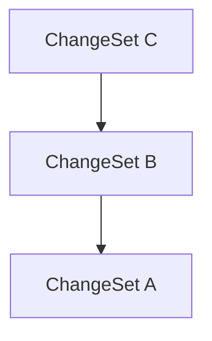

# Lix SDK API Reference

## applyAccountDatabaseSchema

[**@lix-js/sdk**](../README.md)

***

[@lix-js/sdk](../README.md) / applyAccountDatabaseSchema

# Function: applyAccountDatabaseSchema()

> **applyAccountDatabaseSchema**(`sqlite`): `void`

Defined in: [packages/lix-sdk/src/account/schema.ts:11](https://github.com/opral/monorepo/blob/b744c06f94e2e95227e07cc6016002a653e430d8/packages/lix-sdk/src/account/schema.ts#L11)

## Parameters

### sqlite

`SqliteWasmDatabase`

## Returns

`void`

---

## applyChangeDatabaseSchema

[**@lix-js/sdk**](../README.md)

***

[@lix-js/sdk](../README.md) / applyChangeDatabaseSchema

# Function: applyChangeDatabaseSchema()

> **applyChangeDatabaseSchema**(`sqlite`): `SqliteWasmDatabase`

Defined in: [packages/lix-sdk/src/change/schema.ts:4](https://github.com/opral/monorepo/blob/b744c06f94e2e95227e07cc6016002a653e430d8/packages/lix-sdk/src/change/schema.ts#L4)

## Parameters

### sqlite

`SqliteWasmDatabase`

## Returns

`SqliteWasmDatabase`

---

## applyChangeSet

[**@lix-js/sdk**](../README.md)

***

[@lix-js/sdk](../README.md) / applyChangeSet

# Function: applyChangeSet()

> **applyChangeSet**(`args`): `Promise`\<`void`\>

Defined in: [packages/lix-sdk/src/change-set/apply-change-set.ts:9](https://github.com/opral/monorepo/blob/b744c06f94e2e95227e07cc6016002a653e430d8/packages/lix-sdk/src/change-set/apply-change-set.ts#L9)

Applies a change set to the lix.

## Parameters

### args

#### changeSet

`Pick`\<[`ChangeSet`](../type-aliases/ChangeSet.md), `"id"`\>

#### lix

[`Lix`](../type-aliases/Lix.md)

## Returns

`Promise`\<`void`\>

---

## applyChangeSetDatabaseSchema

[**@lix-js/sdk**](../README.md)

***

[@lix-js/sdk](../README.md) / applyChangeSetDatabaseSchema

# Function: applyChangeSetDatabaseSchema()

> **applyChangeSetDatabaseSchema**(`sqlite`): `SqliteWasmDatabase`

Defined in: [packages/lix-sdk/src/change-set/schema.ts:9](https://github.com/opral/monorepo/blob/b744c06f94e2e95227e07cc6016002a653e430d8/packages/lix-sdk/src/change-set/schema.ts#L9)

## Parameters

### sqlite

`SqliteWasmDatabase`

## Returns

`SqliteWasmDatabase`

---

## applyFileDatabaseSchema

[**@lix-js/sdk**](../README.md)

***

[@lix-js/sdk](../README.md) / applyFileDatabaseSchema

# Function: applyFileDatabaseSchema()

> **applyFileDatabaseSchema**(`lix`): `void`

Defined in: [packages/lix-sdk/src/file/schema.ts:10](https://github.com/opral/monorepo/blob/b744c06f94e2e95227e07cc6016002a653e430d8/packages/lix-sdk/src/file/schema.ts#L10)

## Parameters

### lix

`Pick`\<[`Lix`](../type-aliases/Lix.md), `"sqlite"` \| `"db"` \| `"plugin"`\>

## Returns

`void`

---

## applyKeyValueDatabaseSchema

[**@lix-js/sdk**](../README.md)

***

[@lix-js/sdk](../README.md) / applyKeyValueDatabaseSchema

# Function: applyKeyValueDatabaseSchema()

> **applyKeyValueDatabaseSchema**(`sqlite`): `void`

Defined in: [packages/lix-sdk/src/key-value/schema.ts:9](https://github.com/opral/monorepo/blob/b744c06f94e2e95227e07cc6016002a653e430d8/packages/lix-sdk/src/key-value/schema.ts#L9)

## Parameters

### sqlite

`SqliteWasmDatabase`

## Returns

`void`

---

## applyLabelDatabaseSchema

[**@lix-js/sdk**](../README.md)

***

[@lix-js/sdk](../README.md) / applyLabelDatabaseSchema

# Function: applyLabelDatabaseSchema()

> **applyLabelDatabaseSchema**(`sqlite`): `SqliteWasmDatabase`

Defined in: [packages/lix-sdk/src/label/schema.ts:9](https://github.com/opral/monorepo/blob/b744c06f94e2e95227e07cc6016002a653e430d8/packages/lix-sdk/src/label/schema.ts#L9)

## Parameters

### sqlite

`SqliteWasmDatabase`

## Returns

`SqliteWasmDatabase`

---

## applyLogDatabaseSchema

[**@lix-js/sdk**](../README.md)

***

[@lix-js/sdk](../README.md) / applyLogDatabaseSchema

# Function: applyLogDatabaseSchema()

> **applyLogDatabaseSchema**(`sqlite`): `SqliteWasmDatabase`

Defined in: [packages/lix-sdk/src/log/schema.ts:9](https://github.com/opral/monorepo/blob/b744c06f94e2e95227e07cc6016002a653e430d8/packages/lix-sdk/src/log/schema.ts#L9)

## Parameters

### sqlite

`SqliteWasmDatabase`

## Returns

`SqliteWasmDatabase`

---

## applySnapshotDatabaseSchema

[**@lix-js/sdk**](../README.md)

***

[@lix-js/sdk](../README.md) / applySnapshotDatabaseSchema

# Function: applySnapshotDatabaseSchema()

> **applySnapshotDatabaseSchema**(`sqlite`): `SqliteWasmDatabase`

Defined in: [packages/lix-sdk/src/snapshot/schema.ts:9](https://github.com/opral/monorepo/blob/b744c06f94e2e95227e07cc6016002a653e430d8/packages/lix-sdk/src/snapshot/schema.ts#L9)

## Parameters

### sqlite

`SqliteWasmDatabase`

## Returns

`SqliteWasmDatabase`

---

## applyThreadDatabaseSchema

[**@lix-js/sdk**](../README.md)

***

[@lix-js/sdk](../README.md) / applyThreadDatabaseSchema

# Function: applyThreadDatabaseSchema()

> **applyThreadDatabaseSchema**(`sqlite`): `SqliteWasmDatabase`

Defined in: [packages/lix-sdk/src/thread/schema.ts:9](https://github.com/opral/monorepo/blob/b744c06f94e2e95227e07cc6016002a653e430d8/packages/lix-sdk/src/thread/schema.ts#L9)

## Parameters

### sqlite

`SqliteWasmDatabase`

## Returns

`SqliteWasmDatabase`

---

## applyVersionDatabaseSchema

[**@lix-js/sdk**](../README.md)

***

[@lix-js/sdk](../README.md) / applyVersionDatabaseSchema

# Function: applyVersionDatabaseSchema()

> **applyVersionDatabaseSchema**(`sqlite`): `void`

Defined in: [packages/lix-sdk/src/version/schema.ts:18](https://github.com/opral/monorepo/blob/b744c06f94e2e95227e07cc6016002a653e430d8/packages/lix-sdk/src/version/schema.ts#L18)

## Parameters

### sqlite

`SqliteWasmDatabase`

## Returns

`void`

---

## changeHasLabel

[**@lix-js/sdk**](../README.md)

***

[@lix-js/sdk](../README.md) / changeHasLabel

# Function: changeHasLabel()

> **changeHasLabel**(`label`): (`eb`) => `ExpressionWrapper`\<[`LixDatabaseSchema`](../type-aliases/LixDatabaseSchema.md), `"change"`, `SqlBool`\>

Defined in: [packages/lix-sdk/src/query-filter/change-has-label.ts:25](https://github.com/opral/monorepo/blob/b744c06f94e2e95227e07cc6016002a653e430d8/packages/lix-sdk/src/query-filter/change-has-label.ts#L25)

Selects changes that have a label with the given name.

## Parameters

### label

\{ `id`: `string`; `name?`: `string`; \} | \{ `id?`: `string`; `name`: `string`; \}

## Returns

> (`eb`): `ExpressionWrapper`\<[`LixDatabaseSchema`](../type-aliases/LixDatabaseSchema.md), `"change"`, `SqlBool`\>

### Parameters

#### eb

`ExpressionBuilder`\<[`LixDatabaseSchema`](../type-aliases/LixDatabaseSchema.md), `"change"`\>

### Returns

`ExpressionWrapper`\<[`LixDatabaseSchema`](../type-aliases/LixDatabaseSchema.md), `"change"`, `SqlBool`\>

## Examples

```ts
  await lix.db.selectFrom("change")
     .where(changeHasLabel({ name: "checkpoint" }))
     .selectAll()
     .execute();
  ```

You can use eb.not() to negate the filter.

  ```ts
  await lix.db.selectFrom("change")
		.where((eb) => eb.not(changeHasLabel({ name: "checkpoint"})))
		.selectAll()
		.execute();
  ```

---

## changeSetElementInAncestryOf

[**@lix-js/sdk**](../README.md)

***

[@lix-js/sdk](../README.md) / changeSetElementInAncestryOf

# Function: changeSetElementInAncestryOf()

> **changeSetElementInAncestryOf**(`target`, `options?`): (`eb`) => `ExpressionWrapper`\<[`LixDatabaseSchema`](../type-aliases/LixDatabaseSchema.md), `"change_set_element"`, `SqlBool`\>

Defined in: [packages/lix-sdk/src/query-filter/change-set-element-in-ancestry-of.ts:33](https://github.com/opral/monorepo/blob/b744c06f94e2e95227e07cc6016002a653e430d8/packages/lix-sdk/src/query-filter/change-set-element-in-ancestry-of.ts#L33)

Filters elements that are in the ancestry of the given change set(s).

## Parameters

### target

A target change set object (or its id), or an array of such objects/ids.

`Pick`\<\{ `id`: [`LixGenerated`](../type-aliases/LixGenerated.md)\<`string`\>; `metadata?`: `null` \| `Record`\<`string`, `any`\>; \}, `"id"`\> | `Pick`\<\{ `id`: [`LixGenerated`](../type-aliases/LixGenerated.md)\<`string`\>; `metadata?`: `null` \| `Record`\<`string`, `any`\>; \}, `"id"`\>[]

### options?

Optional options object (e.g., depth limit)

#### depth?

`number`

## Returns

A Kysely ExpressionBuilder function for filtering.

> (`eb`): `ExpressionWrapper`\<[`LixDatabaseSchema`](../type-aliases/LixDatabaseSchema.md), `"change_set_element"`, `SqlBool`\>

### Parameters

#### eb

`ExpressionBuilder`\<[`LixDatabaseSchema`](../type-aliases/LixDatabaseSchema.md), `"change_set_element"`\>

### Returns

`ExpressionWrapper`\<[`LixDatabaseSchema`](../type-aliases/LixDatabaseSchema.md), `"change_set_element"`, `SqlBool`\>

## Example

```ts
// Elements from the history of cs2 (object)
db.selectFrom("change_set_element")
  .where(changeSetElementInAncestryOf(cs2))
  .selectAll()

// Elements from the history of cs2 (id)
db.selectFrom("change_set_element")
  .where(changeSetElementInAncestryOf(cs2.id))
  .selectAll()

// Elements from the combined history of cs2 and cs4 (divergent branches)
db.selectFrom("change_set_element")
  .where(changeSetElementInAncestryOf([cs2, cs4]))
  .selectAll()
```

---

## changeSetElementInSymmetricDifference

[**@lix-js/sdk**](../README.md)

***

[@lix-js/sdk](../README.md) / changeSetElementInSymmetricDifference

# Function: changeSetElementInSymmetricDifference()

> **changeSetElementInSymmetricDifference**(`a`, `b`): (`eb`) => `ExpressionWrapper`\<[`LixDatabaseSchema`](../type-aliases/LixDatabaseSchema.md), `"change_set_element"`, `SqlBool`\>

Defined in: [packages/lix-sdk/src/query-filter/change-set-element-in-symmetric-difference.ts:20](https://github.com/opral/monorepo/blob/b744c06f94e2e95227e07cc6016002a653e430d8/packages/lix-sdk/src/query-filter/change-set-element-in-symmetric-difference.ts#L20)

Returns the symmetric difference between two change sets.

The symmetric difference is the set of changes
that exist in either one version but not both.
Modeled after https://developer.mozilla.org/en-US/docs/Web/JavaScript/Reference/Global_Objects/Set/symmetricDifference

## Parameters

### a

`Pick`\<[`ChangeSet`](../type-aliases/ChangeSet.md), `"id"`\>

### b

`Pick`\<[`ChangeSet`](../type-aliases/ChangeSet.md), `"id"`\>

## Returns

> (`eb`): `ExpressionWrapper`\<[`LixDatabaseSchema`](../type-aliases/LixDatabaseSchema.md), `"change_set_element"`, `SqlBool`\>

### Parameters

#### eb

`ExpressionBuilder`\<[`LixDatabaseSchema`](../type-aliases/LixDatabaseSchema.md), `"change_set_element"`\>

### Returns

`ExpressionWrapper`\<[`LixDatabaseSchema`](../type-aliases/LixDatabaseSchema.md), `"change_set_element"`, `SqlBool`\>

## Example

```ts
  await lix.db.selectFrom("change_set_element")
    .where(changeSetElementInSymmetricDifference(a: changeSetA, b: changeSetB))
    .selectAll()
    .execute();
  ```

---

## changeSetElementIsLeafOf

[**@lix-js/sdk**](../README.md)

***

[@lix-js/sdk](../README.md) / changeSetElementIsLeafOf

# Function: changeSetElementIsLeafOf()

> **changeSetElementIsLeafOf**(`target`): (`eb`) => `ExpressionWrapper`\<[`LixDatabaseSchema`](../type-aliases/LixDatabaseSchema.md), `"change_set_element"`, `SqlBool`\>

Defined in: [packages/lix-sdk/src/query-filter/change-set-element-is-leaf-of.ts:34](https://github.com/opral/monorepo/blob/b744c06f94e2e95227e07cc6016002a653e430d8/packages/lix-sdk/src/query-filter/change-set-element-is-leaf-of.ts#L34)

Filters the leaves of the given change set(s).

An element is considered a **leaf** if no other element in the combined ancestry
of the target change sets redefines the same entity at a later point in the graph.

## Parameters

### target

A target change set object (or its id), or an array of such objects/ids.

`Pick`\<\{ `id`: [`LixGenerated`](../type-aliases/LixGenerated.md)\<`string`\>; `metadata?`: `null` \| `Record`\<`string`, `any`\>; \}, `"id"`\> | `Pick`\<\{ `id`: [`LixGenerated`](../type-aliases/LixGenerated.md)\<`string`\>; `metadata?`: `null` \| `Record`\<`string`, `any`\>; \}, `"id"`\>[]

## Returns

> (`eb`): `ExpressionWrapper`\<[`LixDatabaseSchema`](../type-aliases/LixDatabaseSchema.md), `"change_set_element"`, `SqlBool`\>

### Parameters

#### eb

`ExpressionBuilder`\<[`LixDatabaseSchema`](../type-aliases/LixDatabaseSchema.md), `"change_set_element"`\>

### Returns

`ExpressionWrapper`\<[`LixDatabaseSchema`](../type-aliases/LixDatabaseSchema.md), `"change_set_element"`, `SqlBool`\>

## Example

```ts
// Find leaves relative to a single change set (object)
db.selectFrom("change_set_element")
  .where(changeSetElementIsLeafOf(cs))
  .selectAll()

// Find leaves relative to a single change set (id)
db.selectFrom("change_set_element")
  .where(changeSetElementIsLeafOf(cs.id))
  .selectAll()

// Find leaves relative to multiple change sets
db.selectFrom("change_set_element")
  .where(changeSetElementIsLeafOf([cs_source, cs_target]))
  .selectAll()
```

---

## changeSetHasLabel

[**@lix-js/sdk**](../README.md)

***

[@lix-js/sdk](../README.md) / changeSetHasLabel

# Function: changeSetHasLabel()

> **changeSetHasLabel**(`label`): (`eb`) => `ExpressionWrapper`\<[`LixDatabaseSchema`](../type-aliases/LixDatabaseSchema.md), `"change_set"`, `SqlBool`\>

Defined in: [packages/lix-sdk/src/query-filter/change-set-has-label.ts:35](https://github.com/opral/monorepo/blob/b744c06f94e2e95227e07cc6016002a653e430d8/packages/lix-sdk/src/query-filter/change-set-has-label.ts#L35)

Selects change sets that have a label with the given name.

## Parameters

### label

\{ `id`: `string`; `name?`: `string`; \} | \{ `id?`: `string`; `name`: `string`; \}

## Returns

> (`eb`): `ExpressionWrapper`\<[`LixDatabaseSchema`](../type-aliases/LixDatabaseSchema.md), `"change_set"`, `SqlBool`\>

### Parameters

#### eb

`ExpressionBuilder`\<[`LixDatabaseSchema`](../type-aliases/LixDatabaseSchema.md), `"change_set"`\>

### Returns

`ExpressionWrapper`\<[`LixDatabaseSchema`](../type-aliases/LixDatabaseSchema.md), `"change_set"`, `SqlBool`\>

## Examples

```ts
  await lix.db.selectFrom("change_set")
     .where(changeSetHasLabel({ name: "checkpoint" }))
     .selectAll()
     .execute();
  ```

You can use eb.not() to negate the filter.

  ```ts
  await lix.db.selectFrom("change_set")
		.where((eb) => eb.not(changeSetHasLabel({ name: "checkpoint" })))
		.selectAll()
		.execute();
  ```

Id lookup also works:

  ```ts
  await lix.db.selectFrom("change_set")
		.where(changeSetHasLabel({ id: "39j9afj2" }))
		.selectAll()
		.execute();
  ```

---

## changeSetIsAncestorOf

[**@lix-js/sdk**](../README.md)

***

[@lix-js/sdk](../README.md) / changeSetIsAncestorOf

# Function: changeSetIsAncestorOf()

> **changeSetIsAncestorOf**(`changeSet`, `options?`): (`eb`) => `ExpressionWrapper`\<[`LixDatabaseSchema`](../type-aliases/LixDatabaseSchema.md), `"change_set"`, `SqlBool`\>

Defined in: [packages/lix-sdk/src/query-filter/change-set-is-ancestor-of.ts:53](https://github.com/opral/monorepo/blob/b744c06f94e2e95227e07cc6016002a653e430d8/packages/lix-sdk/src/query-filter/change-set-is-ancestor-of.ts#L53)

Filters change sets that are ancestors of the given change set.

By default, this is **exclusive**, meaning it returns only change sets strictly
*before* the provided change set in the graph.

Traverses the `change_set_edge` graph recursively, starting from the provided change set
(or its parents if exclusive), and returns all change sets reachable via parent edges.

This filter is typically used to scope the graph before applying filters like `changeIsLeaf()`.

⚠️ This filter only defines the traversal scope — it does not filter changes directly.

--- Options ---
- `includeSelf`: If `true`, includes the starting `changeSet` in the results. Defaults to `false`.
- `depth`: Limits the traversal depth. `depth: 1` selects only immediate parents (if exclusive)
  or the starting node and its immediate parents (if inclusive).

--- Examples ---

## Parameters

### changeSet

`Pick`\<[`ChangeSet`](../type-aliases/ChangeSet.md), `"id"`\>

### options?

#### depth?

`number`

#### includeSelf?

`boolean`

## Returns

> (`eb`): `ExpressionWrapper`\<[`LixDatabaseSchema`](../type-aliases/LixDatabaseSchema.md), `"change_set"`, `SqlBool`\>

### Parameters

#### eb

`ExpressionBuilder`\<[`LixDatabaseSchema`](../type-aliases/LixDatabaseSchema.md), `"change_set"`\>

### Returns

`ExpressionWrapper`\<[`LixDatabaseSchema`](../type-aliases/LixDatabaseSchema.md), `"change_set"`, `SqlBool`\>

## Examples

```ts
db.selectFrom("change_set")
  .where(changeSetIsAncestorOf({ id: "cs3" }))
  .selectAll()
```

```ts
db.selectFrom("change_set")
  .where(changeSetIsAncestorOf({ id: "cs3" }, { includeSelf: true }))
  .selectAll()
```

```ts
// Select all change sets between startPoint and endPoint (inclusive)
db.selectFrom("change_set")
  .where(changeSetIsDescendantOf({ id: "startPoint" }))
  .where(changeSetIsAncestorOf({ id: "endPoint" }))
  .selectAll()
```

---

## changeSetIsDescendantOf

[**@lix-js/sdk**](../README.md)

***

[@lix-js/sdk](../README.md) / changeSetIsDescendantOf

# Function: changeSetIsDescendantOf()

> **changeSetIsDescendantOf**(`changeSet`, `options?`): (`eb`) => `ExpressionWrapper`\<[`LixDatabaseSchema`](../type-aliases/LixDatabaseSchema.md), `"change_set"`, `SqlBool`\>

Defined in: [packages/lix-sdk/src/query-filter/change-set-is-descendant-of.ts:46](https://github.com/opral/monorepo/blob/b744c06f94e2e95227e07cc6016002a653e430d8/packages/lix-sdk/src/query-filter/change-set-is-descendant-of.ts#L46)

Filters change sets that are descendants of the given change set.

By default, this is **exclusive**, meaning it returns only change sets strictly
*after* the provided change set in the graph.

Traverses the `change_set_edge` graph recursively, starting from the provided change set
(or its children if exclusive), and returns all change sets reachable via child edges.

This filter is useful for finding changes made *after* a specific point in time (e.g., a checkpoint).

⚠️ This filter only defines the traversal scope — it does not filter changes directly.

--- Options ---
- `includeSelf`: If `true`, includes the starting `changeSet` in the results. Defaults to `false`.
- `depth`: Limits the traversal depth. `depth: 1` selects only immediate children (if exclusive)
  or the starting node and its immediate children (if includeSelf is true).

--- Examples ---

## Parameters

### changeSet

`Pick`\<[`ChangeSet`](../type-aliases/ChangeSet.md), `"id"`\>

### options?

#### depth?

`number`

#### includeSelf?

`boolean`

## Returns

> (`eb`): `ExpressionWrapper`\<[`LixDatabaseSchema`](../type-aliases/LixDatabaseSchema.md), `"change_set"`, `SqlBool`\>

### Parameters

#### eb

`ExpressionBuilder`\<[`LixDatabaseSchema`](../type-aliases/LixDatabaseSchema.md), `"change_set"`\>

### Returns

`ExpressionWrapper`\<[`LixDatabaseSchema`](../type-aliases/LixDatabaseSchema.md), `"change_set"`, `SqlBool`\>

## Examples

```ts
db.selectFrom("change_set")
  .where(changeSetIsDescendantOf({ id: "cs1" }))
  .selectAll()
```

```ts
// Select all change sets between startPoint and endPoint (inclusive)
db.selectFrom("change_set")
  .where(changeSetIsDescendantOf({ id: "startPoint" }))
  .where(changeSetIsAncestorOf({ id: "endPoint" }))
  .selectAll()
```

---

## closeLix

[**@lix-js/sdk**](../README.md)

***

[@lix-js/sdk](../README.md) / closeLix

# Function: closeLix()

> **closeLix**(`args`): `Promise`\<`void`\>

Defined in: [packages/lix-sdk/src/lix/close-lix.ts:15](https://github.com/opral/monorepo/blob/b744c06f94e2e95227e07cc6016002a653e430d8/packages/lix-sdk/src/lix/close-lix.ts#L15)

Destroys the underlying database connection.

After closing the Lix instance all subsequent operations on it
will fail. Call this when your application no longer needs access
to the file.

## Parameters

### args

#### lix

`Pick`\<[`Lix`](../type-aliases/Lix.md), `"db"`\>

## Returns

`Promise`\<`void`\>

## Example

```ts
await closeLix({ lix })
```

---

## createAccount

[**@lix-js/sdk**](../README.md)

***

[@lix-js/sdk](../README.md) / createAccount

# Function: createAccount()

> **createAccount**(`args`): `Promise`\<\{ `id`: [`LixGenerated`](../type-aliases/LixGenerated.md)\<`string`\>; `name`: `string`; \}\>

Defined in: [packages/lix-sdk/src/account/create-account.ts:18](https://github.com/opral/monorepo/blob/b744c06f94e2e95227e07cc6016002a653e430d8/packages/lix-sdk/src/account/create-account.ts#L18)

Inserts a new account into the Lix database.

Accounts represent different identities working with the same Lix
file. Switching the active account is handled separately via
[switchAccount](switchAccount.md).

## Parameters

### args

#### id?

[`LixGenerated`](../type-aliases/LixGenerated.md)\<`string`\>

#### lix

`Pick`\<[`Lix`](../type-aliases/Lix.md), `"db"`\>

#### lixcol_version_id?

`string`

#### name

`string`

## Returns

`Promise`\<\{ `id`: [`LixGenerated`](../type-aliases/LixGenerated.md)\<`string`\>; `name`: `string`; \}\>

## Example

```ts
const account = await createAccount({ lix, name: "Jane" })
```

---

## createChange

[**@lix-js/sdk**](../README.md)

***

[@lix-js/sdk](../README.md) / createChange

# Function: createChange()

> **createChange**(`args`): `Promise`\<\{ `created_at`: `string`; `entity_id`: `string`; `file_id`: `string`; `id`: `string`; `plugin_key`: `string`; `schema_key`: `string`; `schema_version`: `string`; `snapshot_id`: `string`; \}\>

Defined in: [packages/lix-sdk/src/change/create-change.ts:9](https://github.com/opral/monorepo/blob/b744c06f94e2e95227e07cc6016002a653e430d8/packages/lix-sdk/src/change/create-change.ts#L9)

## Parameters

### args

#### authors?

`Pick`\<\{ `id`: [`LixGenerated`](../type-aliases/LixGenerated.md)\<`string`\>; `name`: `string`; \}, `"id"`\>[]

#### entity_id

`string`

#### file_id

`string`

#### id?

`string`

#### lix

`Pick`\<[`Lix`](../type-aliases/Lix.md), `"db"` \| `"sqlite"`\>

#### plugin_key

`string`

#### schema_key

`string`

#### schema_version

`string`

#### snapshot

`Omit`\<[`Snapshot`](../type-aliases/Snapshot.md), `"id"`\>

## Returns

`Promise`\<\{ `created_at`: `string`; `entity_id`: `string`; `file_id`: `string`; `id`: `string`; `plugin_key`: `string`; `schema_key`: `string`; `schema_version`: `string`; `snapshot_id`: `string`; \}\>

---

## createChangeSet

[**@lix-js/sdk**](../README.md)

***

[@lix-js/sdk](../README.md) / createChangeSet

# Function: createChangeSet()

> **createChangeSet**(`args`): `Promise`\<`object` & `object`\>

Defined in: [packages/lix-sdk/src/change-set/create-change-set.ts:20](https://github.com/opral/monorepo/blob/b744c06f94e2e95227e07cc6016002a653e430d8/packages/lix-sdk/src/change-set/create-change-set.ts#L20)

Creates a change set and optionally attaches elements, labels and parents.

Change sets are the building blocks of versions and checkpoints. This
function inserts all provided relations in a single transaction and
returns the newly created record.

## Parameters

### args

#### elements?

`Omit`\<[`NewState`](../type-aliases/NewState.md)\<\{ `change_id`: `string`; `change_set_id`: `string`; `entity_id`: `string`; `file_id`: `string`; `schema_key`: `string`; \}\>, `"change_set_id"`\>[]

#### id?

`string`

#### labels?

`Pick`\<\{ `id`: [`LixGenerated`](../type-aliases/LixGenerated.md)\<`string`\>; `name`: `string`; \}, `"id"`\>[]

#### lix

`Pick`\<[`Lix`](../type-aliases/Lix.md), `"db"`\>

#### lixcol_version_id?

`string`

Version ID where the change set should be stored. Defaults to active version

#### parents?

`Pick`\<\{ `id`: [`LixGenerated`](../type-aliases/LixGenerated.md)\<`string`\>; `metadata?`: `null` \| `Record`\<`string`, `any`\>; \}, `"id"`\>[]

Parent change sets that this change set will be a child of

## Returns

`Promise`\<`object` & `object`\>

## Example

```ts
const cs = await createChangeSet({ lix, elements: [{ change_id, entity_id }] })
```

---

## createCheckpoint

[**@lix-js/sdk**](../README.md)

***

[@lix-js/sdk](../README.md) / createCheckpoint

# Function: createCheckpoint()

> **createCheckpoint**(`args`): `Promise`\<\{ `id`: `string`; \}\>

Defined in: [packages/lix-sdk/src/change-set/create-checkpoint.ts:17](https://github.com/opral/monorepo/blob/b744c06f94e2e95227e07cc6016002a653e430d8/packages/lix-sdk/src/change-set/create-checkpoint.ts#L17)

Converts the current working change set into a checkpoint.

The working change set becomes immutable and receives the
`checkpoint` label. A fresh empty working change set is created so
that new changes can continue to accumulate.

## Parameters

### args

#### lix

[`Lix`](../type-aliases/Lix.md)

## Returns

`Promise`\<\{ `id`: `string`; \}\>

## Example

```ts
const { id } = await createCheckpoint({ lix })
```

---

## createLabel

[**@lix-js/sdk**](../README.md)

***

[@lix-js/sdk](../README.md) / createLabel

# Function: createLabel()

> **createLabel**(`args`): `Promise`\<\{ `id`: [`LixGenerated`](../type-aliases/LixGenerated.md)\<`string`\>; `name`: `string`; \}\>

Defined in: [packages/lix-sdk/src/label/create-label.ts:17](https://github.com/opral/monorepo/blob/b744c06f94e2e95227e07cc6016002a653e430d8/packages/lix-sdk/src/label/create-label.ts#L17)

Creates a label that can be attached to change sets.

Labels help categorise change sets, for example "checkpoint" or
"reviewed". They are simple name identifiers stored per version.

## Parameters

### args

#### id?

[`LixGenerated`](../type-aliases/LixGenerated.md)\<`string`\>

#### lix

`Pick`\<[`Lix`](../type-aliases/Lix.md), `"db"`\>

#### lixcol_version_id?

`string`

#### name

`string`

## Returns

`Promise`\<\{ `id`: [`LixGenerated`](../type-aliases/LixGenerated.md)\<`string`\>; `name`: `string`; \}\>

## Example

```ts
const label = await createLabel({ lix, name: "checkpoint" })
```

---

## createLog

[**@lix-js/sdk**](../README.md)

***

[@lix-js/sdk](../README.md) / createLog

# Function: createLog()

> **createLog**(`args`): `Promise`\<[`LixSelectable`](../type-aliases/LixSelectable.md)\<[`EntityStateView`](../type-aliases/EntityStateView.md)\<\{ `id`: [`LixGenerated`](../type-aliases/LixGenerated.md)\<`string`\>; `key`: `string`; `level`: `string`; `message`: `string`; \}\>\>\>

Defined in: [packages/lix-sdk/src/log/create-log.ts:28](https://github.com/opral/monorepo/blob/b744c06f94e2e95227e07cc6016002a653e430d8/packages/lix-sdk/src/log/create-log.ts#L28)

Directly creates a log entry in the Lix database without applying any filters.

This function inserts the log entry regardless of the `lix_log_levels` setting
in the key-value store. It is the responsibility of the calling application
to implement any desired log level filtering before invoking this function.

It is recommended to use dot notation for log keys (e.g., 'app.module.component').

## Parameters

### args

#### key

`string`

#### level

`string`

#### lix

`Pick`\<[`Lix`](../type-aliases/Lix.md), `"sqlite"` \| `"db"`\>

#### message

`string`

## Returns

`Promise`\<[`LixSelectable`](../type-aliases/LixSelectable.md)\<[`EntityStateView`](../type-aliases/EntityStateView.md)\<\{ `id`: [`LixGenerated`](../type-aliases/LixGenerated.md)\<`string`\>; `key`: `string`; `level`: `string`; `message`: `string`; \}\>\>\>

A promise that resolves with the created log entry.

## Example

```ts
// Directly log an info message

if (shouldLog) {
  await createLog({
    lix,
    key: 'app.init',
    level: 'info',
    message: 'Application initialized'
});
```

---

## createLspInMemoryEnvironment

[**@lix-js/sdk**](../README.md)

***

[@lix-js/sdk](../README.md) / createLspInMemoryEnvironment

# Function: createLspInMemoryEnvironment()

> **createLspInMemoryEnvironment**(): `LspEnvironment`

Defined in: [packages/lix-sdk/src/server-protocol-handler/environment/create-in-memory-environment.ts:12](https://github.com/opral/monorepo/blob/b744c06f94e2e95227e07cc6016002a653e430d8/packages/lix-sdk/src/server-protocol-handler/environment/create-in-memory-environment.ts#L12)

Create an in-memory storage.

Great for testing or quick prototyping.

## Returns

`LspEnvironment`

---

## createMergeChangeSet

[**@lix-js/sdk**](../README.md)

***

[@lix-js/sdk](../README.md) / createMergeChangeSet

# Function: createMergeChangeSet()

> **createMergeChangeSet**(`args`): `Promise`\<\{ `id`: [`LixGenerated`](../type-aliases/LixGenerated.md)\<`string`\>; `metadata?`: `null` \| `Record`\<`string`, `any`\>; \}\>

Defined in: [packages/lix-sdk/src/change-set/create-merge-change-set.ts:22](https://github.com/opral/monorepo/blob/b744c06f94e2e95227e07cc6016002a653e430d8/packages/lix-sdk/src/change-set/create-merge-change-set.ts#L22)

Merges two change sets using a "source wins" strategy (until lix models conflicts).

Creates a new change set containing the merged result. If an element
(identified by entity_id, file_id, schema_key) exists in both the source
and target change sets (considering their respective histories), the element
from the source change set's history takes precedence.

## Parameters

### args

The arguments for the merge operation.

#### lix

[`Lix`](../type-aliases/Lix.md)

The Lix instance.

#### source

`Pick`\<[`ChangeSet`](../type-aliases/ChangeSet.md), `"id"`\>

The source change set (only `id` is needed).

#### target

`Pick`\<[`ChangeSet`](../type-aliases/ChangeSet.md), `"id"`\>

The target change set (only `id` is needed).

## Returns

`Promise`\<\{ `id`: [`LixGenerated`](../type-aliases/LixGenerated.md)\<`string`\>; `metadata?`: `null` \| `Record`\<`string`, `any`\>; \}\>

A Promise resolving to the newly created ChangeSet representing the merged state.

---

## createServerProtocolHandler

[**@lix-js/sdk**](../README.md)

***

[@lix-js/sdk](../README.md) / createServerProtocolHandler

# Function: createServerProtocolHandler()

> **createServerProtocolHandler**(`args`): `Promise`\<`LixServerProtocolHandler`\>

Defined in: [packages/lix-sdk/src/server-protocol-handler/create-server-protocol-handler.ts:55](https://github.com/opral/monorepo/blob/b744c06f94e2e95227e07cc6016002a653e430d8/packages/lix-sdk/src/server-protocol-handler/create-server-protocol-handler.ts#L55)

The handler for the lix server protocol.

## Parameters

### args

#### environment

`LspEnvironment`

## Returns

`Promise`\<`LixServerProtocolHandler`\>

## Examples

Usage with a server framework.

  ```ts
	 // any server framework goes
  // here, like express, polka, etc.
  // frameworks that do not use
  // web standard Request and Response
  // objects will need to be mapped.
  const app = new Hono();

  const lspHandler = createServerProtocolHandler({ storage });

  app.use('/lsp/*', async (req) => {
     await lspHandler(req);
  });
  ```

Testing the handler.

  ```ts
  const lspHandler = createServerProtocolHandler({ storage });
  const request = new Request('/lsp/new', {
    method: 'POST',
    body: new Blob(['...']),
  });

  const response = await lspHandler(request);

  expect(response).to(...);
  ```

---

## createSnapshot

[**@lix-js/sdk**](../README.md)

***

[@lix-js/sdk](../README.md) / createSnapshot

# Function: createSnapshot()

> **createSnapshot**(`args`): `Promise`\<[`Snapshot`](../type-aliases/Snapshot.md)\>

Defined in: [packages/lix-sdk/src/snapshot/create-snapshot.ts:7](https://github.com/opral/monorepo/blob/b744c06f94e2e95227e07cc6016002a653e430d8/packages/lix-sdk/src/snapshot/create-snapshot.ts#L7)

## Parameters

### args

#### content

`null` \| `Record`\<`string`, `any`\>

#### lix

`Pick`\<[`Lix`](../type-aliases/Lix.md), `"db"` \| `"sqlite"`\>

## Returns

`Promise`\<[`Snapshot`](../type-aliases/Snapshot.md)\>

---

## createThread

[**@lix-js/sdk**](../README.md)

***

[@lix-js/sdk](../README.md) / createThread

# Function: createThread()

> **createThread**(`args`): `Promise`\<`object` & `object`\>

Defined in: [packages/lix-sdk/src/thread/create-thread.ts:19](https://github.com/opral/monorepo/blob/b744c06f94e2e95227e07cc6016002a653e430d8/packages/lix-sdk/src/thread/create-thread.ts#L19)

Starts a new discussion thread.

Threads allow collaborators to attach comments to a specific
version or entity. Initial comments can be provided and will be
inserted sequentially.

## Parameters

### args

#### comments?

`Pick`\<[`NewState`](../type-aliases/NewState.md)\<[`ThreadComment`](../type-aliases/ThreadComment.md)\>, `"body"`\>[]

#### id?

`string`

#### lix

[`Lix`](../type-aliases/Lix.md)

#### versionId?

`string`

defaults to global

## Returns

`Promise`\<`object` & `object`\>

## Example

```ts
const thread = await createThread({ lix, comments: [{ body: "Hello" }] })
```

---

## createThreadComment

[**@lix-js/sdk**](../README.md)

***

[@lix-js/sdk](../README.md) / createThreadComment

# Function: createThreadComment()

> **createThreadComment**(`args`): `Promise`\<[`LixSelectable`](../type-aliases/LixSelectable.md)\<[`EntityStateView`](../type-aliases/EntityStateView.md)\<[`ThreadComment`](../type-aliases/ThreadComment.md)\>\>\>

Defined in: [packages/lix-sdk/src/thread/create-thread-comment.ts:18](https://github.com/opral/monorepo/blob/b744c06f94e2e95227e07cc6016002a653e430d8/packages/lix-sdk/src/thread/create-thread-comment.ts#L18)

Adds a comment to an existing thread.

The comment inherits the version context from the thread and can
be nested by supplying a parent id.

## Parameters

### args

`object` & `object` & `object`

## Returns

`Promise`\<[`LixSelectable`](../type-aliases/LixSelectable.md)\<[`EntityStateView`](../type-aliases/EntityStateView.md)\<[`ThreadComment`](../type-aliases/ThreadComment.md)\>\>\>

## Example

```ts
await createThreadComment({ lix, thread_id, body: "Thanks" })
```

---

## createTransitionChangeSet

[**@lix-js/sdk**](../README.md)

***

[@lix-js/sdk](../README.md) / createTransitionChangeSet

# Function: createTransitionChangeSet()

> **createTransitionChangeSet**(`args`): `Promise`\<\{ `id`: [`LixGenerated`](../type-aliases/LixGenerated.md)\<`string`\>; `metadata?`: `null` \| `Record`\<`string`, `any`\>; \}\>

Defined in: [packages/lix-sdk/src/change-set/create-transition-change-set.ts:17](https://github.com/opral/monorepo/blob/b744c06f94e2e95227e07cc6016002a653e430d8/packages/lix-sdk/src/change-set/create-transition-change-set.ts#L17)

Creates a change set that enables a transition from a source state
(defined by `sourceChangeSet`) to a target state (defined by `targetChangeSet`).

Applying the returned change set to the source state will result in a state
that matches the target state.

- switch between state (switching versions, checkpoints, etc.)
- restore old state (applying the transition set on top of current state)

## Parameters

### args

#### lix

[`Lix`](../type-aliases/Lix.md)

#### sourceChangeSet

`Pick`\<[`ChangeSet`](../type-aliases/ChangeSet.md), `"id"`\>

#### targetChangeSet

`Pick`\<[`ChangeSet`](../type-aliases/ChangeSet.md), `"id"`\>

## Returns

`Promise`\<\{ `id`: [`LixGenerated`](../type-aliases/LixGenerated.md)\<`string`\>; `metadata?`: `null` \| `Record`\<`string`, `any`\>; \}\>

---

## createUndoChangeSet

[**@lix-js/sdk**](../README.md)

***

[@lix-js/sdk](../README.md) / createUndoChangeSet

# Function: createUndoChangeSet()

> **createUndoChangeSet**(`args`): `Promise`\<\{ `id`: [`LixGenerated`](../type-aliases/LixGenerated.md)\<`string`\>; `metadata?`: `null` \| `Record`\<`string`, `any`\>; \}\>

Defined in: [packages/lix-sdk/src/change-set/create-undo-change-set.ts:26](https://github.com/opral/monorepo/blob/b744c06f94e2e95227e07cc6016002a653e430d8/packages/lix-sdk/src/change-set/create-undo-change-set.ts#L26)

Creates a "reverse" change set that undoes the changes made by the specified change set.

## Parameters

### args

#### changeSet

`Pick`\<[`ChangeSet`](../type-aliases/ChangeSet.md), `"id"`\>

#### labels?

`Pick`\<\{ `id`: [`LixGenerated`](../type-aliases/LixGenerated.md)\<`string`\>; `name`: `string`; \}, `"id"`\>[]

#### lix

[`Lix`](../type-aliases/Lix.md)

## Returns

`Promise`\<\{ `id`: [`LixGenerated`](../type-aliases/LixGenerated.md)\<`string`\>; `metadata?`: `null` \| `Record`\<`string`, `any`\>; \}\>

The newly created change set that contains the undo operations

## Example

```ts
  const undoChangeSet = await createUndoChangeSet({
    lix,
    changeSet: targetChangeSet
  });

  await applyChangeSet({
    lix,
    changeSet: undoChangeSet
  });
  ```

---

## createVersion

[**@lix-js/sdk**](../README.md)

***

[@lix-js/sdk](../README.md) / createVersion

# Function: createVersion()

> **createVersion**(`args`): `Promise`\<\{ `change_set_id`: `string`; `hidden?`: [`LixGenerated`](../type-aliases/LixGenerated.md)\<`undefined` \| `boolean`\>; `id`: [`LixGenerated`](../type-aliases/LixGenerated.md)\<`string`\>; `inherits_from_version_id?`: `string` & `object`; `name`: [`LixGenerated`](../type-aliases/LixGenerated.md)\<`string`\>; `working_change_set_id`: [`LixGenerated`](../type-aliases/LixGenerated.md)\<`string`\>; \}\>

Defined in: [packages/lix-sdk/src/version/create-version.ts:15](https://github.com/opral/monorepo/blob/b744c06f94e2e95227e07cc6016002a653e430d8/packages/lix-sdk/src/version/create-version.ts#L15)

Creates a new version.

The changeSet can be any change set e.g. another version, a checkpoint, etc.

## Parameters

### args

#### changeSet?

`Pick`\<\{ `id`: [`LixGenerated`](../type-aliases/LixGenerated.md)\<`string`\>; `metadata?`: `null` \| `Record`\<`string`, `any`\>; \}, `"id"`\>

#### id?

[`LixGenerated`](../type-aliases/LixGenerated.md)\<`string`\>

#### inherits_from_version_id?

`string` & `object`

#### lix

[`Lix`](../type-aliases/Lix.md)

#### name?

[`LixGenerated`](../type-aliases/LixGenerated.md)\<`string`\>

## Returns

`Promise`\<\{ `change_set_id`: `string`; `hidden?`: [`LixGenerated`](../type-aliases/LixGenerated.md)\<`undefined` \| `boolean`\>; `id`: [`LixGenerated`](../type-aliases/LixGenerated.md)\<`string`\>; `inherits_from_version_id?`: `string` & `object`; `name`: [`LixGenerated`](../type-aliases/LixGenerated.md)\<`string`\>; `working_change_set_id`: [`LixGenerated`](../type-aliases/LixGenerated.md)\<`string`\>; \}\>

## Example

```ts
const version = await createVersion({ lix, changeSet: otherVersion.change_set_id });
```

---

## executeSync

[**@lix-js/sdk**](../README.md)

***

[@lix-js/sdk](../README.md) / executeSync

# Function: executeSync()

> **executeSync**(`args`): `any`[]

Defined in: [packages/lix-sdk/src/database/execute-sync.ts:21](https://github.com/opral/monorepo/blob/b744c06f94e2e95227e07cc6016002a653e430d8/packages/lix-sdk/src/database/execute-sync.ts#L21)

Execute a query synchronously.

⚠️  MAJOR WARNING: This function is a PURE SQL LAYER without transformations!

- JSON columns return as RAW JSON STRINGS, not parsed objects
- You must manually parse/stringify JSON data
- No automatic type conversions happen
- Results are raw SQLite values

Only use this for triggers, database functions, or when you specifically
need synchronous database access and understand you're working with raw SQL.

## Parameters

### args

#### lix

`Pick`\<[`Lix`](../type-aliases/Lix.md), `"sqlite"`\>

#### query

`any`

## Returns

`any`[]

## Example

```ts
// JSON columns are returned as strings - you must parse manually:
  const result = executeSync({ lix, query });
  result[0].metadata = JSON.parse(result[0].metadata);
```

---

## jsonArrayFrom

[**@lix-js/sdk**](../README.md)

***

[@lix-js/sdk](../README.md) / jsonArrayFrom

# Function: jsonArrayFrom()

> **jsonArrayFrom**\<`O`\>(`expr`): `RawBuilder`\<`Simplify`\<`O`\>[]\>

Defined in: node\_modules/.pnpm/kysely@0.27.4/node\_modules/kysely/dist/esm/helpers/sqlite.d.ts:58

A SQLite helper for aggregating a subquery into a JSON array.

NOTE: This helper only works correctly if you've installed the `ParseJSONResultsPlugin`.
Otherwise the nested selections will be returned as JSON strings.

The plugin can be installed like this:

```ts
const db = new Kysely({
  dialect: new SqliteDialect(config),
  plugins: [new ParseJSONResultsPlugin()]
})
```

### Examples

```ts
const result = await db
  .selectFrom('person')
  .select((eb) => [
    'id',
    jsonArrayFrom(
      eb.selectFrom('pet')
        .select(['pet.id as pet_id', 'pet.name'])
        .whereRef('pet.owner_id', '=', 'person.id')
        .orderBy('pet.name')
    ).as('pets')
  ])
  .execute()

result[0].id
result[0].pets[0].pet_id
result[0].pets[0].name
```

The generated SQL (SQLite):

```sql
select "id", (
  select coalesce(json_group_array(json_object(
    'pet_id', "agg"."pet_id",
    'name', "agg"."name"
  )), '[]') from (
    select "pet"."id" as "pet_id", "pet"."name"
    from "pet"
    where "pet"."owner_id" = "person"."id"
    order by "pet"."name"
  ) as "agg"
) as "pets"
from "person"
```

## Type Parameters

### O

`O`

## Parameters

### expr

`SelectQueryBuilderExpression`\<`O`\>

## Returns

`RawBuilder`\<`Simplify`\<`O`\>[]\>

---

## jsonObjectFrom

[**@lix-js/sdk**](../README.md)

***

[@lix-js/sdk](../README.md) / jsonObjectFrom

# Function: jsonObjectFrom()

> **jsonObjectFrom**\<`O`\>(`expr`): `RawBuilder`\<`null` \| `Simplify`\<`O`\>\>

Defined in: node\_modules/.pnpm/kysely@0.27.4/node\_modules/kysely/dist/esm/helpers/sqlite.d.ts:114

A SQLite helper for turning a subquery into a JSON object.

The subquery must only return one row.

NOTE: This helper only works correctly if you've installed the `ParseJSONResultsPlugin`.
Otherwise the nested selections will be returned as JSON strings.

The plugin can be installed like this:

```ts
const db = new Kysely({
  dialect: new SqliteDialect(config),
  plugins: [new ParseJSONResultsPlugin()]
})
```

### Examples

```ts
const result = await db
  .selectFrom('person')
  .select((eb) => [
    'id',
    jsonObjectFrom(
      eb.selectFrom('pet')
        .select(['pet.id as pet_id', 'pet.name'])
        .whereRef('pet.owner_id', '=', 'person.id')
        .where('pet.is_favorite', '=', true)
    ).as('favorite_pet')
  ])
  .execute()

result[0].id
result[0].favorite_pet.pet_id
result[0].favorite_pet.name
```

The generated SQL (SQLite):

```sql
select "id", (
  select json_object(
    'pet_id', "obj"."pet_id",
    'name', "obj"."name"
  ) from (
    select "pet"."id" as "pet_id", "pet"."name"
    from "pet"
    where "pet"."owner_id" = "person"."id"
    and "pet"."is_favorite" = ?
  ) as obj
) as "favorite_pet"
from "person";
```

## Type Parameters

### O

`O`

## Parameters

### expr

`SelectQueryBuilderExpression`\<`O`\>

## Returns

`RawBuilder`\<`null` \| `Simplify`\<`O`\>\>

---

## mockJsonSnapshot

[**@lix-js/sdk**](../README.md)

***

[@lix-js/sdk](../README.md) / mockJsonSnapshot

# Function: mockJsonSnapshot()

> **mockJsonSnapshot**(`content`): [`Snapshot`](../type-aliases/Snapshot.md)

Defined in: [packages/lix-sdk/src/snapshot/mock-json-snapshot.ts:9](https://github.com/opral/monorepo/blob/b744c06f94e2e95227e07cc6016002a653e430d8/packages/lix-sdk/src/snapshot/mock-json-snapshot.ts#L9)

Util function for tests that creates a snapshot that looks like one you got returned from the database after inserting

## Parameters

### content

`Record`\<`string`, `any`\>

## Returns

[`Snapshot`](../type-aliases/Snapshot.md)

---

## newLixFile

[**@lix-js/sdk**](../README.md)

***

[@lix-js/sdk](../README.md) / newLixFile

# Function: newLixFile()

> **newLixFile**(): `Promise`\<`Blob`\>

Defined in: [packages/lix-sdk/src/lix/new-lix.ts:44](https://github.com/opral/monorepo/blob/b744c06f94e2e95227e07cc6016002a653e430d8/packages/lix-sdk/src/lix/new-lix.ts#L44)

Returns a new empty Lix file as a Blob.

The function bootstraps an in‑memory SQLite database with all
required tables, change sets and metadata so that it represents
a valid Lix project. The caller is responsible for persisting the
resulting blob to disk, IndexedDB or any other storage location.

## Returns

`Promise`\<`Blob`\>

## Example

```ts
const blob = await newLixFile()
await saveToDisk(blob)
```

---

## openLix

[**@lix-js/sdk**](../README.md)

***

[@lix-js/sdk](../README.md) / openLix

# Function: openLix()

> **openLix**(`args`): `Promise`\<[`Lix`](../type-aliases/Lix.md)\>

Defined in: [packages/lix-sdk/src/lix/open-lix.ts:46](https://github.com/opral/monorepo/blob/b744c06f94e2e95227e07cc6016002a653e430d8/packages/lix-sdk/src/lix/open-lix.ts#L46)

Opens a Lix instance using an existing SQLite database.

The database may originate from a file, IndexedDB or an
in‑memory instance. During opening all required schemas are
applied, optional plugins are initialised and provided key‑values
are written to the database.

## Parameters

### args

#### account?

\{ `id`: [`LixGenerated`](../type-aliases/LixGenerated.md)\<`string`\>; `name`: `string`; \}

The account that is opening this lix.

Lix will automatically set the active account to the provided account.

**Example**

```ts
const account = localStorage.getItem("account")
  const lix = await openLix({ account })
```

#### account.id

[`LixGenerated`](../type-aliases/LixGenerated.md)\<`string`\>

#### account.name

`string`

#### database

`SqliteWasmDatabase`

#### keyValues?

[`NewState`](../type-aliases/NewState.md)\<[`KeyValue`](../type-aliases/KeyValue.md)\>[]

Set the key values when opening the lix.

**Example**

```ts
const lix = await openLix({ keyValues: [{ key: "lix_sync", value: "false" }] })
```

#### providePlugins?

[`LixPlugin`](../type-aliases/LixPlugin.md)[]

Usecase are lix apps that define their own file format,
like inlang (unlike a markdown, csv, or json plugin).

(+) avoids separating app code from plugin code and
    resulting bundling logic.

(-) such a file format must always be opened with the
    file format sdk. the file is not portable

**Example**

```ts
const lix = await openLixInMemory({ providePlugins: [myPlugin] })
```

## Returns

`Promise`\<[`Lix`](../type-aliases/Lix.md)\>

## Example

```ts
const db = await createInMemoryDatabase({ readOnly: false })
const lix = await openLix({ database: db })
```

---

## openLixInMemory

[**@lix-js/sdk**](../README.md)

***

[@lix-js/sdk](../README.md) / openLixInMemory

# Function: openLixInMemory()

> **openLixInMemory**(`args`): `Promise`\<`Promise`\<[`Lix`](../type-aliases/Lix.md)\>\>

Defined in: [packages/lix-sdk/src/lix/open-lix-in-memory.ts:17](https://github.com/opral/monorepo/blob/b744c06f94e2e95227e07cc6016002a653e430d8/packages/lix-sdk/src/lix/open-lix-in-memory.ts#L17)

Loads a Lix file into a temporary in‑memory database.

The returned instance behaves like [openLix](openLix.md) but keeps all
data only for the lifetime of the current JavaScript context. If no
blob is provided a fresh Lix project is created automatically.

## Parameters

### args

`object` & `Omit`\<\{ `account?`: \{ `id`: [`LixGenerated`](../type-aliases/LixGenerated.md)\<`string`\>; `name`: `string`; \}; `database`: `SqliteWasmDatabase`; `keyValues?`: [`NewState`](../type-aliases/NewState.md)\<[`KeyValue`](../type-aliases/KeyValue.md)\>[]; `providePlugins?`: [`LixPlugin`](../type-aliases/LixPlugin.md)[]; \}, `"database"`\>

## Returns

`Promise`\<`Promise`\<[`Lix`](../type-aliases/Lix.md)\>\>

## Example

```ts
const lix = await openLixInMemory({})
```

---

## populateLabelRecords

[**@lix-js/sdk**](../README.md)

***

[@lix-js/sdk](../README.md) / populateLabelRecords

# Function: populateLabelRecords()

> **populateLabelRecords**(`sqlite`): `SqliteWasmDatabase`

Defined in: [packages/lix-sdk/src/label/schema.ts:25](https://github.com/opral/monorepo/blob/b744c06f94e2e95227e07cc6016002a653e430d8/packages/lix-sdk/src/label/schema.ts#L25)

## Parameters

### sqlite

`SqliteWasmDatabase`

## Returns

`SqliteWasmDatabase`

---

## switchAccount

[**@lix-js/sdk**](../README.md)

***

[@lix-js/sdk](../README.md) / switchAccount

# Function: switchAccount()

> **switchAccount**(`args`): `Promise`\<`void`\>

Defined in: [packages/lix-sdk/src/account/switch-account.ts:23](https://github.com/opral/monorepo/blob/b744c06f94e2e95227e07cc6016002a653e430d8/packages/lix-sdk/src/account/switch-account.ts#L23)

Switch the current account to the provided account.

## Parameters

### args

#### lix

`Pick`\<[`Lix`](../type-aliases/Lix.md), `"db"`\>

#### to

`Pick`\<\{ `id`: [`LixGenerated`](../type-aliases/LixGenerated.md)\<`string`\>; `name`: `string`; \}, `"id"` \| `"name"`\>[]

## Returns

`Promise`\<`void`\>

## Examples

One active account

  ```ts
  await switchAccount({ lix, to: [otherAccount] });
  ```

Multiple active accounts

  ```ts
  await switchAccount({ lix, to: [account1, account2] });
  ```

---

## switchVersion

[**@lix-js/sdk**](../README.md)

***

[@lix-js/sdk](../README.md) / switchVersion

# Function: switchVersion()

> **switchVersion**(`args`): `Promise`\<`void`\>

Defined in: [packages/lix-sdk/src/version/switch-version.ts:24](https://github.com/opral/monorepo/blob/b744c06f94e2e95227e07cc6016002a653e430d8/packages/lix-sdk/src/version/switch-version.ts#L24)

Switches the current Version to the given Version.

The Version must already exist before calling this function.

## Parameters

### args

#### lix

[`Lix`](../type-aliases/Lix.md)

#### to

`Pick`\<[`Version`](../type-aliases/Version.md), `"id"`\>

## Returns

`Promise`\<`void`\>

## Examples

```ts
  await switchVersion({ lix, to: otherVersion });
  ```

Switching to a newly created version.

  ```ts
  await lix.db.transaction().execute(async (trx) => {
     const newVersion = await createVersion({ lix: { db: trx }, changeSet: { id: currentVersion.change_set_id } });
     await switchVersion({ lix: { db: trx }, to: newVersion });
  });
  ```

---

## toBlob

[**@lix-js/sdk**](../README.md)

***

[@lix-js/sdk](../README.md) / toBlob

# Function: toBlob()

> **toBlob**(`args`): `Promise`\<`Blob`\>

Defined in: [packages/lix-sdk/src/lix/to-blob.ts:17](https://github.com/opral/monorepo/blob/b744c06f94e2e95227e07cc6016002a653e430d8/packages/lix-sdk/src/lix/to-blob.ts#L17)

Serialises the Lix database into a Blob.

Use this helper to persist the current state to disk or send it to a
server. The blob contains the raw SQLite file representing the Lix
project.

## Parameters

### args

#### lix

`Pick`\<[`Lix`](../type-aliases/Lix.md), `"db"` \| `"sqlite"`\>

## Returns

`Promise`\<`Blob`\>

## Example

```ts
const blob = await toBlob({ lix })
download(blob)
```

---

## Account

[**@lix-js/sdk**](../README.md)

***

[@lix-js/sdk](../README.md) / Account

# Type Alias: Account

> **Account** = [`FromLixSchemaDefinition`](FromLixSchemaDefinition.md)\<*typeof* [`LixAccountSchema`](../variables/LixAccountSchema.md)\>

Defined in: [packages/lix-sdk/src/account/schema.ts:68](https://github.com/opral/monorepo/blob/b744c06f94e2e95227e07cc6016002a653e430d8/packages/lix-sdk/src/account/schema.ts#L68)

---

## ActiveAccount

[**@lix-js/sdk**](../README.md)

***

[@lix-js/sdk](../README.md) / ActiveAccount

# Type Alias: ActiveAccount

> **ActiveAccount** = `Selectable`\<[`ActiveAccountTable`](ActiveAccountTable.md)\>

Defined in: [packages/lix-sdk/src/account/schema.ts:76](https://github.com/opral/monorepo/blob/b744c06f94e2e95227e07cc6016002a653e430d8/packages/lix-sdk/src/account/schema.ts#L76)

---

## ActiveAccountTable

[**@lix-js/sdk**](../README.md)

***

[@lix-js/sdk](../README.md) / ActiveAccountTable

# Type Alias: ActiveAccountTable

> **ActiveAccountTable** = `object`

Defined in: [packages/lix-sdk/src/account/schema.ts:71](https://github.com/opral/monorepo/blob/b744c06f94e2e95227e07cc6016002a653e430d8/packages/lix-sdk/src/account/schema.ts#L71)

## Properties

### id

> **id**: `string`

Defined in: [packages/lix-sdk/src/account/schema.ts:72](https://github.com/opral/monorepo/blob/b744c06f94e2e95227e07cc6016002a653e430d8/packages/lix-sdk/src/account/schema.ts#L72)

***

### name

> **name**: `string`

Defined in: [packages/lix-sdk/src/account/schema.ts:73](https://github.com/opral/monorepo/blob/b744c06f94e2e95227e07cc6016002a653e430d8/packages/lix-sdk/src/account/schema.ts#L73)

---

## ActiveVersion

[**@lix-js/sdk**](../README.md)

***

[@lix-js/sdk](../README.md) / ActiveVersion

# Type Alias: ActiveVersion

> **ActiveVersion** = `Selectable`\<[`ActiveVersionTable`](ActiveVersionTable.md)\>

Defined in: [packages/lix-sdk/src/version/schema.ts:89](https://github.com/opral/monorepo/blob/b744c06f94e2e95227e07cc6016002a653e430d8/packages/lix-sdk/src/version/schema.ts#L89)

---

## ActiveVersionTable

[**@lix-js/sdk**](../README.md)

***

[@lix-js/sdk](../README.md) / ActiveVersionTable

# Type Alias: ActiveVersionTable

> **ActiveVersionTable** = `object`

Defined in: [packages/lix-sdk/src/version/schema.ts:84](https://github.com/opral/monorepo/blob/b744c06f94e2e95227e07cc6016002a653e430d8/packages/lix-sdk/src/version/schema.ts#L84)

## Properties

### version\_id

> **version\_id**: `string`

Defined in: [packages/lix-sdk/src/version/schema.ts:85](https://github.com/opral/monorepo/blob/b744c06f94e2e95227e07cc6016002a653e430d8/packages/lix-sdk/src/version/schema.ts#L85)

---

## ActiveVersionUpdate

[**@lix-js/sdk**](../README.md)

***

[@lix-js/sdk](../README.md) / ActiveVersionUpdate

# Type Alias: ActiveVersionUpdate

> **ActiveVersionUpdate** = `Updateable`\<[`ActiveVersionTable`](ActiveVersionTable.md)\>

Defined in: [packages/lix-sdk/src/version/schema.ts:91](https://github.com/opral/monorepo/blob/b744c06f94e2e95227e07cc6016002a653e430d8/packages/lix-sdk/src/version/schema.ts#L91)

---

## Change

[**@lix-js/sdk**](../README.md)

***

[@lix-js/sdk](../README.md) / Change

# Type Alias: Change

> **Change** = `Selectable`\<[`ChangeView`](ChangeView.md)\>

Defined in: [packages/lix-sdk/src/change/schema.ts:71](https://github.com/opral/monorepo/blob/b744c06f94e2e95227e07cc6016002a653e430d8/packages/lix-sdk/src/change/schema.ts#L71)

---

## ChangeSet

[**@lix-js/sdk**](../README.md)

***

[@lix-js/sdk](../README.md) / ChangeSet

# Type Alias: ChangeSet

> **ChangeSet** = [`FromLixSchemaDefinition`](FromLixSchemaDefinition.md)\<*typeof* [`LixChangeSetSchema`](../variables/LixChangeSetSchema.md)\>

Defined in: [packages/lix-sdk/src/change-set/schema.ts:78](https://github.com/opral/monorepo/blob/b744c06f94e2e95227e07cc6016002a653e430d8/packages/lix-sdk/src/change-set/schema.ts#L78)

---

## ChangeSetEdge

[**@lix-js/sdk**](../README.md)

***

[@lix-js/sdk](../README.md) / ChangeSetEdge

# Type Alias: ChangeSetEdge

> **ChangeSetEdge** = [`FromLixSchemaDefinition`](FromLixSchemaDefinition.md)\<*typeof* [`LixChangeSetEdgeSchema`](../variables/LixChangeSetEdgeSchema.md)\>

Defined in: [packages/lix-sdk/src/change-set/schema.ts:147](https://github.com/opral/monorepo/blob/b744c06f94e2e95227e07cc6016002a653e430d8/packages/lix-sdk/src/change-set/schema.ts#L147)

---

## ChangeSetElement

[**@lix-js/sdk**](../README.md)

***

[@lix-js/sdk](../README.md) / ChangeSetElement

# Type Alias: ChangeSetElement

> **ChangeSetElement** = [`FromLixSchemaDefinition`](FromLixSchemaDefinition.md)\<*typeof* [`LixChangeSetElementSchema`](../variables/LixChangeSetElementSchema.md)\>

Defined in: [packages/lix-sdk/src/change-set/schema.ts:118](https://github.com/opral/monorepo/blob/b744c06f94e2e95227e07cc6016002a653e430d8/packages/lix-sdk/src/change-set/schema.ts#L118)

---

## ChangeSetLabel

[**@lix-js/sdk**](../README.md)

***

[@lix-js/sdk](../README.md) / ChangeSetLabel

# Type Alias: ChangeSetLabel

> **ChangeSetLabel** = [`FromLixSchemaDefinition`](FromLixSchemaDefinition.md)\<*typeof* [`LixChangeSetLabelSchema`](../variables/LixChangeSetLabelSchema.md)\>

Defined in: [packages/lix-sdk/src/change-set/schema.ts:177](https://github.com/opral/monorepo/blob/b744c06f94e2e95227e07cc6016002a653e430d8/packages/lix-sdk/src/change-set/schema.ts#L177)

---

## ChangeSetThread

[**@lix-js/sdk**](../README.md)

***

[@lix-js/sdk](../README.md) / ChangeSetThread

# Type Alias: ChangeSetThread

> **ChangeSetThread** = [`FromLixSchemaDefinition`](FromLixSchemaDefinition.md)\<*typeof* [`LixChangeSetThreadSchema`](../variables/LixChangeSetThreadSchema.md)\>

Defined in: [packages/lix-sdk/src/change-set/schema.ts:205](https://github.com/opral/monorepo/blob/b744c06f94e2e95227e07cc6016002a653e430d8/packages/lix-sdk/src/change-set/schema.ts#L205)

---

## ChangeUpdate

[**@lix-js/sdk**](../README.md)

***

[@lix-js/sdk](../README.md) / ChangeUpdate

# Type Alias: ChangeUpdate

> **ChangeUpdate** = `Updateable`\<[`ChangeView`](ChangeView.md)\>

Defined in: [packages/lix-sdk/src/change/schema.ts:73](https://github.com/opral/monorepo/blob/b744c06f94e2e95227e07cc6016002a653e430d8/packages/lix-sdk/src/change/schema.ts#L73)

---

## ChangeView

[**@lix-js/sdk**](../README.md)

***

[@lix-js/sdk](../README.md) / ChangeView

# Type Alias: ChangeView

> **ChangeView** = `object`

Defined in: [packages/lix-sdk/src/change/schema.ts:74](https://github.com/opral/monorepo/blob/b744c06f94e2e95227e07cc6016002a653e430d8/packages/lix-sdk/src/change/schema.ts#L74)

## Properties

### created\_at

> **created\_at**: `Generated`\<`string`\>

Defined in: [packages/lix-sdk/src/change/schema.ts:82](https://github.com/opral/monorepo/blob/b744c06f94e2e95227e07cc6016002a653e430d8/packages/lix-sdk/src/change/schema.ts#L82)

***

### entity\_id

> **entity\_id**: `string`

Defined in: [packages/lix-sdk/src/change/schema.ts:76](https://github.com/opral/monorepo/blob/b744c06f94e2e95227e07cc6016002a653e430d8/packages/lix-sdk/src/change/schema.ts#L76)

***

### file\_id

> **file\_id**: `string`

Defined in: [packages/lix-sdk/src/change/schema.ts:79](https://github.com/opral/monorepo/blob/b744c06f94e2e95227e07cc6016002a653e430d8/packages/lix-sdk/src/change/schema.ts#L79)

***

### id

> **id**: `Generated`\<`string`\>

Defined in: [packages/lix-sdk/src/change/schema.ts:75](https://github.com/opral/monorepo/blob/b744c06f94e2e95227e07cc6016002a653e430d8/packages/lix-sdk/src/change/schema.ts#L75)

***

### plugin\_key

> **plugin\_key**: `string`

Defined in: [packages/lix-sdk/src/change/schema.ts:80](https://github.com/opral/monorepo/blob/b744c06f94e2e95227e07cc6016002a653e430d8/packages/lix-sdk/src/change/schema.ts#L80)

***

### schema\_key

> **schema\_key**: `string`

Defined in: [packages/lix-sdk/src/change/schema.ts:77](https://github.com/opral/monorepo/blob/b744c06f94e2e95227e07cc6016002a653e430d8/packages/lix-sdk/src/change/schema.ts#L77)

***

### schema\_version

> **schema\_version**: `string`

Defined in: [packages/lix-sdk/src/change/schema.ts:78](https://github.com/opral/monorepo/blob/b744c06f94e2e95227e07cc6016002a653e430d8/packages/lix-sdk/src/change/schema.ts#L78)

***

### snapshot\_id

> **snapshot\_id**: `string`

Defined in: [packages/lix-sdk/src/change/schema.ts:81](https://github.com/opral/monorepo/blob/b744c06f94e2e95227e07cc6016002a653e430d8/packages/lix-sdk/src/change/schema.ts#L81)

---

## DetectedChange

[**@lix-js/sdk**](../README.md)

***

[@lix-js/sdk](../README.md) / DetectedChange

# Type Alias: DetectedChange\<T\>

> **DetectedChange**\<`T`\> = `object`

Defined in: [packages/lix-sdk/src/plugin/lix-plugin.ts:97](https://github.com/opral/monorepo/blob/b744c06f94e2e95227e07cc6016002a653e430d8/packages/lix-sdk/src/plugin/lix-plugin.ts#L97)

A detected change that lix ingests in to the database.

- If the `snapshot` is `undefined`, the change is considered to be a deletion.
- The `schema` type can be narrowed by providing a change schema.

## Example

Type narrowing with a change schema:

  ```
	 const FooV1Schema = {
    key: "plugin-name-foo-v1",
    type: "json",
    schema: {
      type: "object",
      properties: {
        name: { type: "string" },
		   }
    }
  } as const satisfies ChangeSchema;

  const detectedChange: DetectedChange<typeof FooV1Schema>

  detectedChange.snapshot.name // string
  ```

## Type Parameters

### T

`T` = `any`

## Properties

### entity\_id

> **entity\_id**: `string`

Defined in: [packages/lix-sdk/src/plugin/lix-plugin.ts:98](https://github.com/opral/monorepo/blob/b744c06f94e2e95227e07cc6016002a653e430d8/packages/lix-sdk/src/plugin/lix-plugin.ts#L98)

***

### schema

> **schema**: [`LixSchemaDefinition`](LixSchemaDefinition.md)

Defined in: [packages/lix-sdk/src/plugin/lix-plugin.ts:99](https://github.com/opral/monorepo/blob/b744c06f94e2e95227e07cc6016002a653e430d8/packages/lix-sdk/src/plugin/lix-plugin.ts#L99)

***

### snapshot\_content

> **snapshot\_content**: `T` \| `null`

Defined in: [packages/lix-sdk/src/plugin/lix-plugin.ts:103](https://github.com/opral/monorepo/blob/b744c06f94e2e95227e07cc6016002a653e430d8/packages/lix-sdk/src/plugin/lix-plugin.ts#L103)

The change is considered a deletion if `snapshot_content` is `null`.

---

## EntityStateAllView

[**@lix-js/sdk**](../README.md)

***

[@lix-js/sdk](../README.md) / EntityStateAllView

# Type Alias: EntityStateAllView\<T\>

> **EntityStateAllView**\<`T`\> = `T` & `EntityStateAllColumns`

Defined in: [packages/lix-sdk/src/entity-views/types.ts:84](https://github.com/opral/monorepo/blob/b744c06f94e2e95227e07cc6016002a653e430d8/packages/lix-sdk/src/entity-views/types.ts#L84)

View type for entities across all versions.

This type combines your entity properties with Lix operational columns
including the version_id, allowing you to query and manipulate entities
in specific versions.

Use this type when defining database views that need to work across
multiple versions.

## Type Parameters

### T

`T`

## Example

```typescript
// Define a view type for key-value entities across versions
type KeyValueAllView = EntityStateAllView<KeyValue>;

// Query entities in a specific version
await lix.db
  .selectFrom("key_value_all")
  .where("lixcol_version_id", "=", "v2")
  .selectAll()
  .execute();
```

---

## EntityStateHistoryView

[**@lix-js/sdk**](../README.md)

***

[@lix-js/sdk](../README.md) / EntityStateHistoryView

# Type Alias: EntityStateHistoryView\<T\>

> **EntityStateHistoryView**\<`T`\> = `T` & `StateEntityHistoryColumns`

Defined in: [packages/lix-sdk/src/entity-views/types.ts:109](https://github.com/opral/monorepo/blob/b744c06f94e2e95227e07cc6016002a653e430d8/packages/lix-sdk/src/entity-views/types.ts#L109)

View type for entity history (read-only).

This type combines your entity properties with historical tracking columns,
allowing you to see how entities evolved over time through different change sets.

History views are read-only and include change tracking information like
change_id, change_set_id, and depth for blame functionality.

## Type Parameters

### T

`T`

## Example

```typescript
// Define a history view type for key-value entities
type KeyValueHistoryView = EntityStateHistoryView<KeyValue>;

// Query entity state at a specific change set
await lix.db
  .selectFrom("key_value_history")
  .where("lixcol_change_set_id", "=", changeSetId)
  .where("lixcol_depth", "=", 0)
  .selectAll()
  .execute();
```

---

## EntityStateView

[**@lix-js/sdk**](../README.md)

***

[@lix-js/sdk](../README.md) / EntityStateView

# Type Alias: EntityStateView\<T\>

> **EntityStateView**\<`T`\> = `T` & `EntityStateColumns`

Defined in: [packages/lix-sdk/src/entity-views/types.ts:59](https://github.com/opral/monorepo/blob/b744c06f94e2e95227e07cc6016002a653e430d8/packages/lix-sdk/src/entity-views/types.ts#L59)

View type for entities in the active version only.

This type combines your entity properties with Lix operational columns
(file_id, timestamps, etc.) while preserving LixGenerated markers for
database schema compatibility.

Use this type when defining database views that work with the current
active version only.

## Type Parameters

### T

`T`

## Example

```typescript
// Define a view type for key-value entities
type KeyValueView = EntityStateView<KeyValue>;

// The resulting type includes both entity properties and operational columns
// { key: string, value: any, lixcol_file_id: LixGenerated<string>, ... }
```

---

## FromLixSchemaDefinition

[**@lix-js/sdk**](../README.md)

***

[@lix-js/sdk](../README.md) / FromLixSchemaDefinition

# Type Alias: FromLixSchemaDefinition\<T\>

> **FromLixSchemaDefinition**\<`T`\> = `ApplyLixGenerated`\<`T`\>

Defined in: [packages/lix-sdk/src/schema-definition/definition.ts:444](https://github.com/opral/monorepo/blob/b744c06f94e2e95227e07cc6016002a653e430d8/packages/lix-sdk/src/schema-definition/definition.ts#L444)

Convert a LixSchemaDefinition to a TypeScript type.

This type transformation:
1. Converts JSON Schema properties to TypeScript types
2. Wraps properties with `x-lix-generated: true` in LixGenerated markers
3. Transforms `type: "object"` without properties to `Record<string, any>`

The resulting type can be used with LixInsertable, LixUpdateable, and
LixSelectable for database operations.

## Type Parameters

### T

`T` *extends* [`LixSchemaDefinition`](LixSchemaDefinition.md)

## Example

```typescript
const AccountSchema = {
  "x-lix-key": "account",
  "x-lix-version": "1.0",
  "x-lix-primary-key": ["id"],
  type: "object",
  properties: {
    id: { type: "string", "x-lix-generated": true },
    name: { type: "string" },
    email: { type: "string" },
    metadata: { type: "object" },  // Becomes Record<string, any>
    created_at: { type: "string", "x-lix-generated": true }
  },
  required: ["id", "name", "email"],
  additionalProperties: false
} as const satisfies LixSchemaDefinition;

type Account = FromLixSchemaDefinition<typeof AccountSchema>;
// Result: {
//   id: LixGenerated<string>;
//   name: string;
//   email: string;
//   metadata: Record<string, any> | undefined;
//   created_at: LixGenerated<string> | undefined;
// }
```

---

## GraphTraversalMode

[**@lix-js/sdk**](../README.md)

***

[@lix-js/sdk](../README.md) / GraphTraversalMode

# Type Alias: GraphTraversalMode

> **GraphTraversalMode** = [`GraphTraversalModeDirect`](GraphTraversalModeDirect.md) \| [`GraphTraversalModeRecursive`](GraphTraversalModeRecursive.md)

Defined in: [packages/lix-sdk/src/database/graph-traversal-mode.ts:10](https://github.com/opral/monorepo/blob/b744c06f94e2e95227e07cc6016002a653e430d8/packages/lix-sdk/src/database/graph-traversal-mode.ts#L10)

Describes how to traverse a graph structure (such as a change set graph).

- `direct`: [GraphTraversalModeDirect](GraphTraversalModeDirect.md)
- `recursive`: [GraphTraversalModeRecursive](GraphTraversalModeRecursive.md)

This is used throughout Lix to determine how much of the graph should be included
during operations like applying, merging, or analyzing change sets.

---

## GraphTraversalModeDirect

[**@lix-js/sdk**](../README.md)

***

[@lix-js/sdk](../README.md) / GraphTraversalModeDirect

# Type Alias: GraphTraversalModeDirect

> **GraphTraversalModeDirect** = `object`

Defined in: [packages/lix-sdk/src/database/graph-traversal-mode.ts:37](https://github.com/opral/monorepo/blob/b744c06f94e2e95227e07cc6016002a653e430d8/packages/lix-sdk/src/database/graph-traversal-mode.ts#L37)

Direct mode: Only the specified node is included.

No parent or child traversal is performed.



Selected node: A
Included: only A

## Example

```ts
const mode: GraphTraversalMode = { type: "direct" };
```

## Properties

### type

> **type**: `"direct"`

Defined in: [packages/lix-sdk/src/database/graph-traversal-mode.ts:38](https://github.com/opral/monorepo/blob/b744c06f94e2e95227e07cc6016002a653e430d8/packages/lix-sdk/src/database/graph-traversal-mode.ts#L38)

---

## GraphTraversalModeRecursive

[**@lix-js/sdk**](../README.md)

***

[@lix-js/sdk](../README.md) / GraphTraversalModeRecursive

# Type Alias: GraphTraversalModeRecursive

> **GraphTraversalModeRecursive** = `object`

Defined in: [packages/lix-sdk/src/database/graph-traversal-mode.ts:67](https://github.com/opral/monorepo/blob/b744c06f94e2e95227e07cc6016002a653e430d8/packages/lix-sdk/src/database/graph-traversal-mode.ts#L67)

Recursive mode: Includes the specified node and all transitive parents (or children).

Optionally limits depth of traversal.


## Example

```ts
const mode: GraphTraversalMode = { type: "recursive" };
const mode: GraphTraversalMode = { type: "recursive", depth: 1 };
```

Selected node: C
Included:
- If `depth` is undefined: C → B → A
- If `depth` is 1: C → B only

## Properties

### depth?

> `optional` **depth**: `number`

Defined in: [packages/lix-sdk/src/database/graph-traversal-mode.ts:74](https://github.com/opral/monorepo/blob/b744c06f94e2e95227e07cc6016002a653e430d8/packages/lix-sdk/src/database/graph-traversal-mode.ts#L74)

Optional maximum depth to traverse.
- `depth = 0` includes direct parents/children only.
- `undefined` includes full ancestry/descendants.

***

### type

> **type**: `"recursive"`

Defined in: [packages/lix-sdk/src/database/graph-traversal-mode.ts:68](https://github.com/opral/monorepo/blob/b744c06f94e2e95227e07cc6016002a653e430d8/packages/lix-sdk/src/database/graph-traversal-mode.ts#L68)

---

## InternalChange

[**@lix-js/sdk**](../README.md)

***

[@lix-js/sdk](../README.md) / InternalChange

# Type Alias: InternalChange

> **InternalChange** = `Selectable`\<[`InternalChangeTable`](InternalChangeTable.md)\>

Defined in: [packages/lix-sdk/src/change/schema.ts:58](https://github.com/opral/monorepo/blob/b744c06f94e2e95227e07cc6016002a653e430d8/packages/lix-sdk/src/change/schema.ts#L58)

---

## InternalChangeTable

[**@lix-js/sdk**](../README.md)

***

[@lix-js/sdk](../README.md) / InternalChangeTable

# Type Alias: InternalChangeTable

> **InternalChangeTable** = `object`

Defined in: [packages/lix-sdk/src/change/schema.ts:60](https://github.com/opral/monorepo/blob/b744c06f94e2e95227e07cc6016002a653e430d8/packages/lix-sdk/src/change/schema.ts#L60)

## Properties

### created\_at

> **created\_at**: `Generated`\<`string`\>

Defined in: [packages/lix-sdk/src/change/schema.ts:68](https://github.com/opral/monorepo/blob/b744c06f94e2e95227e07cc6016002a653e430d8/packages/lix-sdk/src/change/schema.ts#L68)

***

### entity\_id

> **entity\_id**: `string`

Defined in: [packages/lix-sdk/src/change/schema.ts:62](https://github.com/opral/monorepo/blob/b744c06f94e2e95227e07cc6016002a653e430d8/packages/lix-sdk/src/change/schema.ts#L62)

***

### file\_id

> **file\_id**: `string`

Defined in: [packages/lix-sdk/src/change/schema.ts:65](https://github.com/opral/monorepo/blob/b744c06f94e2e95227e07cc6016002a653e430d8/packages/lix-sdk/src/change/schema.ts#L65)

***

### id

> **id**: `Generated`\<`string`\>

Defined in: [packages/lix-sdk/src/change/schema.ts:61](https://github.com/opral/monorepo/blob/b744c06f94e2e95227e07cc6016002a653e430d8/packages/lix-sdk/src/change/schema.ts#L61)

***

### plugin\_key

> **plugin\_key**: `string`

Defined in: [packages/lix-sdk/src/change/schema.ts:66](https://github.com/opral/monorepo/blob/b744c06f94e2e95227e07cc6016002a653e430d8/packages/lix-sdk/src/change/schema.ts#L66)

***

### schema\_key

> **schema\_key**: `string`

Defined in: [packages/lix-sdk/src/change/schema.ts:63](https://github.com/opral/monorepo/blob/b744c06f94e2e95227e07cc6016002a653e430d8/packages/lix-sdk/src/change/schema.ts#L63)

***

### schema\_version

> **schema\_version**: `string`

Defined in: [packages/lix-sdk/src/change/schema.ts:64](https://github.com/opral/monorepo/blob/b744c06f94e2e95227e07cc6016002a653e430d8/packages/lix-sdk/src/change/schema.ts#L64)

***

### snapshot\_id

> **snapshot\_id**: `string`

Defined in: [packages/lix-sdk/src/change/schema.ts:67](https://github.com/opral/monorepo/blob/b744c06f94e2e95227e07cc6016002a653e430d8/packages/lix-sdk/src/change/schema.ts#L67)

---

## InternalSnapshotTable

[**@lix-js/sdk**](../README.md)

***

[@lix-js/sdk](../README.md) / InternalSnapshotTable

# Type Alias: InternalSnapshotTable

> **InternalSnapshotTable** = `object`

Defined in: [packages/lix-sdk/src/snapshot/schema.ts:66](https://github.com/opral/monorepo/blob/b744c06f94e2e95227e07cc6016002a653e430d8/packages/lix-sdk/src/snapshot/schema.ts#L66)

## Properties

### content

> **content**: `Record`\<`string`, `any`\> \| `null`

Defined in: [packages/lix-sdk/src/snapshot/schema.ts:68](https://github.com/opral/monorepo/blob/b744c06f94e2e95227e07cc6016002a653e430d8/packages/lix-sdk/src/snapshot/schema.ts#L68)

***

### id

> **id**: `Generated`\<`string`\>

Defined in: [packages/lix-sdk/src/snapshot/schema.ts:67](https://github.com/opral/monorepo/blob/b744c06f94e2e95227e07cc6016002a653e430d8/packages/lix-sdk/src/snapshot/schema.ts#L67)

---

## JSONType

[**@lix-js/sdk**](../README.md)

***

[@lix-js/sdk](../README.md) / JSONType

# Type Alias: JSONType

> **JSONType** = `string` \| `number` \| `boolean` \| `null` \| `JSONType`[] \| \{[`key`: `string`]: `JSONType`; \}

Defined in: [packages/lix-sdk/src/schema-definition/json-type.ts:1](https://github.com/opral/monorepo/blob/b744c06f94e2e95227e07cc6016002a653e430d8/packages/lix-sdk/src/schema-definition/json-type.ts#L1)

---

## KeyValue

[**@lix-js/sdk**](../README.md)

***

[@lix-js/sdk](../README.md) / KeyValue

# Type Alias: KeyValue

> **KeyValue** = [`FromLixSchemaDefinition`](FromLixSchemaDefinition.md)\<*typeof* [`LixKeyValueSchema`](../variables/LixKeyValueSchema.md)\> & `object`

Defined in: [packages/lix-sdk/src/key-value/schema.ts:34](https://github.com/opral/monorepo/blob/b744c06f94e2e95227e07cc6016002a653e430d8/packages/lix-sdk/src/key-value/schema.ts#L34)

## Type declaration

### value

> **value**: `any`

---

## Label

[**@lix-js/sdk**](../README.md)

***

[@lix-js/sdk](../README.md) / Label

# Type Alias: Label

> **Label** = [`FromLixSchemaDefinition`](FromLixSchemaDefinition.md)\<*typeof* [`LixLabelSchema`](../variables/LixLabelSchema.md)\>

Defined in: [packages/lix-sdk/src/label/schema.ts:75](https://github.com/opral/monorepo/blob/b744c06f94e2e95227e07cc6016002a653e430d8/packages/lix-sdk/src/label/schema.ts#L75)

---

## Lix

[**@lix-js/sdk**](../README.md)

***

[@lix-js/sdk](../README.md) / Lix

# Type Alias: Lix

> **Lix** = `object`

Defined in: [packages/lix-sdk/src/lix/open-lix.ts:13](https://github.com/opral/monorepo/blob/b744c06f94e2e95227e07cc6016002a653e430d8/packages/lix-sdk/src/lix/open-lix.ts#L13)

## Properties

### db

> **db**: `Kysely`\<[`LixDatabaseSchema`](LixDatabaseSchema.md)\>

Defined in: [packages/lix-sdk/src/lix/open-lix.ts:25](https://github.com/opral/monorepo/blob/b744c06f94e2e95227e07cc6016002a653e430d8/packages/lix-sdk/src/lix/open-lix.ts#L25)

***

### plugin

> **plugin**: `object`

Defined in: [packages/lix-sdk/src/lix/open-lix.ts:26](https://github.com/opral/monorepo/blob/b744c06f94e2e95227e07cc6016002a653e430d8/packages/lix-sdk/src/lix/open-lix.ts#L26)

#### getAll()

> **getAll**: () => `Promise`\<[`LixPlugin`](LixPlugin.md)[]\>

##### Returns

`Promise`\<[`LixPlugin`](LixPlugin.md)[]\>

#### getAllSync()

> **getAllSync**: () => [`LixPlugin`](LixPlugin.md)[]

##### Returns

[`LixPlugin`](LixPlugin.md)[]

***

### sqlite

> **sqlite**: `SqliteWasmDatabase`

Defined in: [packages/lix-sdk/src/lix/open-lix.ts:24](https://github.com/opral/monorepo/blob/b744c06f94e2e95227e07cc6016002a653e430d8/packages/lix-sdk/src/lix/open-lix.ts#L24)

The raw SQLite instance.

Required for advanced use cases that can't be
expressed with the db API.

Use with caution, automatic transformation of
results like parsing json (similar to the db API)
is not guaranteed.

---

## LixDatabaseSchema

[**@lix-js/sdk**](../README.md)

***

[@lix-js/sdk](../README.md) / LixDatabaseSchema

# Type Alias: LixDatabaseSchema

> **LixDatabaseSchema** = `object` & `EntityViews`\<*typeof* [`LixKeyValueSchema`](../variables/LixKeyValueSchema.md), `"key_value"`, \{ `value`: [`KeyValue`](KeyValue.md)\[`"value"`\]; \}\> & `EntityViews`\<*typeof* [`LixAccountSchema`](../variables/LixAccountSchema.md), `"account"`\> & `EntityViews`\<*typeof* [`LixChangeSetSchema`](../variables/LixChangeSetSchema.md), `"change_set"`\> & `EntityViews`\<*typeof* [`LixChangeSetElementSchema`](../variables/LixChangeSetElementSchema.md), `"change_set_element"`\> & `EntityViews`\<*typeof* [`LixChangeSetEdgeSchema`](../variables/LixChangeSetEdgeSchema.md), `"change_set_edge"`\> & `EntityViews`\<*typeof* [`LixChangeSetLabelSchema`](../variables/LixChangeSetLabelSchema.md), `"change_set_label"`\> & `EntityViews`\<*typeof* [`LixChangeSetThreadSchema`](../variables/LixChangeSetThreadSchema.md), `"change_set_thread"`\> & `EntityViews`\<*typeof* `LixChangeAuthorSchema`, `"change_author"`\> & `EntityViews`\<*typeof* [`LixFileSchema`](../variables/LixFileSchema.md), `"file"`, \{ `data`: `Uint8Array`; \}\> & `EntityViews`\<*typeof* [`LixLabelSchema`](../variables/LixLabelSchema.md), `"label"`\> & `EntityViews`\<*typeof* `LixStoredSchemaSchema`, `"stored_schema"`, \{ `value`: `any`; \}\> & `EntityViews`\<*typeof* [`LixLogSchema`](../variables/LixLogSchema.md), `"log"`\> & `EntityViews`\<*typeof* [`LixThreadSchema`](../variables/LixThreadSchema.md), `"thread"`\> & `EntityViews`\<*typeof* [`LixThreadCommentSchema`](../variables/LixThreadCommentSchema.md), `"thread_comment"`, \{ `body`: [`ThreadComment`](ThreadComment.md)\[`"body"`\]; \}\> & `EntityViews`\<*typeof* [`LixVersionSchema`](../variables/LixVersionSchema.md), `"version"`\>

Defined in: [packages/lix-sdk/src/database/schema.ts:74](https://github.com/opral/monorepo/blob/b744c06f94e2e95227e07cc6016002a653e430d8/packages/lix-sdk/src/database/schema.ts#L74)

## Type declaration

### active\_account

> **active\_account**: [`ActiveAccountTable`](ActiveAccountTable.md)

### active\_version

> **active\_version**: [`ActiveVersionTable`](ActiveVersionTable.md)

### change

> **change**: [`ChangeView`](ChangeView.md)

### snapshot

> **snapshot**: [`ToKysely`](ToKysely.md)\<[`Snapshot`](Snapshot.md)\>

### state

> **state**: `StateView`

### state\_active

> **state\_active**: `StateView`

### state\_history

> **state\_history**: `StateHistoryView`

---

## LixFile

[**@lix-js/sdk**](../README.md)

***

[@lix-js/sdk](../README.md) / LixFile

# Type Alias: LixFile

> **LixFile** = [`FromLixSchemaDefinition`](FromLixSchemaDefinition.md)\<*typeof* [`LixFileSchema`](../variables/LixFileSchema.md)\> & `object`

Defined in: [packages/lix-sdk/src/file/schema.ts:277](https://github.com/opral/monorepo/blob/b744c06f94e2e95227e07cc6016002a653e430d8/packages/lix-sdk/src/file/schema.ts#L277)

Pure business logic type inferred from the LixFileSchema.

Uses "Type" suffix to avoid collision with JavaScript's built-in File type,
while maintaining consistency with our naming pattern where schema-derived
types represent the pure business logic without database infrastructure columns.

## Type declaration

### data

> **data**: `Uint8Array`

---

## LixGenerated

[**@lix-js/sdk**](../README.md)

***

[@lix-js/sdk](../README.md) / LixGenerated

# Type Alias: LixGenerated\<T\>

> **LixGenerated**\<`T`\> = `T` & `object`

Defined in: [packages/lix-sdk/src/schema-definition/definition.ts:202](https://github.com/opral/monorepo/blob/b744c06f94e2e95227e07cc6016002a653e430d8/packages/lix-sdk/src/schema-definition/definition.ts#L202)

Marker type for database columns that are auto-generated.

This type brands values as "generated" to enable special handling in insert/update
operations. Generated fields become optional in inserts since the database
provides default values.

The type accepts T values directly for developer convenience while preserving
the generated marker for type transformations.

## Type declaration

### \_\_lixGenerated?

> `readonly` `optional` **\_\_lixGenerated**: `true`

## Type Parameters

### T

`T`

## Example

```typescript
type Account = {
  id: LixGenerated<string>;  // Auto-generated UUID
  name: string;              // User-provided
  created_at: LixGenerated<string>;  // Auto-generated timestamp
};

// In inserts, generated fields are optional
const newAccount: LixInsertable<Account> = {
  name: "John"  // id and created_at are optional
};
```

---

## LixInsertable

[**@lix-js/sdk**](../README.md)

***

[@lix-js/sdk](../README.md) / LixInsertable

# Type Alias: LixInsertable\<T\>

> **LixInsertable**\<`T`\> = `{ [K in NonNullableInsertKeys<T>]: InsertType<T[K]> }` & `{ [K in NullableInsertKeys<T>]?: InsertType<T[K]> }`

Defined in: [packages/lix-sdk/src/schema-definition/definition.ts:293](https://github.com/opral/monorepo/blob/b744c06f94e2e95227e07cc6016002a653e430d8/packages/lix-sdk/src/schema-definition/definition.ts#L293)

Transform a type for insert operations.

This type makes LixGenerated fields optional while keeping other required
fields mandatory. Use this when defining types for creating new entities.

The database will automatically populate generated fields (like IDs,
timestamps) if not provided.

## Type Parameters

### T

`T`

## Example

```typescript
type Account = {
  id: LixGenerated<string>;
  name: string;
  email: string;
  created_at: LixGenerated<string>;
};

type NewAccount = LixInsertable<Account>;
// Result: { name: string; email: string; id?: string; created_at?: string; }

const account: NewAccount = {
  name: "John",
  email: "john@example.com"
  // id and created_at are optional
};
```

---

## LixInternalDatabaseSchema

[**@lix-js/sdk**](../README.md)

***

[@lix-js/sdk](../README.md) / LixInternalDatabaseSchema

# Type Alias: LixInternalDatabaseSchema

> **LixInternalDatabaseSchema** = [`LixDatabaseSchema`](LixDatabaseSchema.md) & `object`

Defined in: [packages/lix-sdk/src/database/schema.ts:48](https://github.com/opral/monorepo/blob/b744c06f94e2e95227e07cc6016002a653e430d8/packages/lix-sdk/src/database/schema.ts#L48)

## Type declaration

### internal\_change

> **internal\_change**: [`InternalChangeTable`](InternalChangeTable.md)

### internal\_change\_in\_transaction

> **internal\_change\_in\_transaction**: `InternalChangeInTransactionTable`

### internal\_snapshot

> **internal\_snapshot**: [`InternalSnapshotTable`](InternalSnapshotTable.md)

### internal\_state\_cache

> **internal\_state\_cache**: `InternalStateCacheTable`

---

## LixPlugin

[**@lix-js/sdk**](../README.md)

***

[@lix-js/sdk](../README.md) / LixPlugin

# Type Alias: LixPlugin

> **LixPlugin** = `object`

Defined in: [packages/lix-sdk/src/plugin/lix-plugin.ts:7](https://github.com/opral/monorepo/blob/b744c06f94e2e95227e07cc6016002a653e430d8/packages/lix-sdk/src/plugin/lix-plugin.ts#L7)

## Properties

### applyChanges()?

> `optional` **applyChanges**: (`{
		file,
		changes,
	}`) => `object`

Defined in: [packages/lix-sdk/src/plugin/lix-plugin.ts:34](https://github.com/opral/monorepo/blob/b744c06f94e2e95227e07cc6016002a653e430d8/packages/lix-sdk/src/plugin/lix-plugin.ts#L34)

#### Parameters

##### \{
		file,
		changes,
	\}

###### changes

[`Change`](Change.md) & `object`[]

###### file

`Omit`\<[`LixFile`](LixFile.md), `"data"`\> & `object`

The file to which the changes should be applied.

The `file.data` might be undefined if the file does not
exist at the time of applying the changes. This can
happen when merging a version that created a new file
that did not exist in the target version. Or, a file
has been deleted and should be restored at a later point.

#### Returns

`object`

##### fileData

> **fileData**: `Uint8Array`

***

### detectChanges()?

> `optional` **detectChanges**: (`{
		before,
		after,
	}`) => [`DetectedChange`](DetectedChange.md)[]

Defined in: [packages/lix-sdk/src/plugin/lix-plugin.ts:27](https://github.com/opral/monorepo/blob/b744c06f94e2e95227e07cc6016002a653e430d8/packages/lix-sdk/src/plugin/lix-plugin.ts#L27)

Detects changes between the `before` and `after` file update(s).

`Before` is `undefined` if the file did not exist before (
the file was created).

`After` is always defined. Either the file was updated, or
deleted. If the file is deleted, lix own change control
will handle the deletion. Hence, `after` is always be defined.

#### Parameters

##### \{
		before,
		after,
	\}

###### after

`Omit`\<[`LixFile`](LixFile.md), `"data"`\> & `object`

###### before?

`Omit`\<[`LixFile`](LixFile.md), `"data"`\> & `object`

#### Returns

[`DetectedChange`](DetectedChange.md)[]

***

### detectChangesGlob?

> `optional` **detectChangesGlob**: `string`

Defined in: [packages/lix-sdk/src/plugin/lix-plugin.ts:16](https://github.com/opral/monorepo/blob/b744c06f94e2e95227e07cc6016002a653e430d8/packages/lix-sdk/src/plugin/lix-plugin.ts#L16)

The glob pattern that should invoke `detectChanges()`.

#### Example

```ts
`**/*.json` for all JSON files
  `**/*.inlang` for all inlang files
```

***

### diffUiComponent?

> `optional` **diffUiComponent**: `CustomElementConstructor`

Defined in: [packages/lix-sdk/src/plugin/lix-plugin.ts:53](https://github.com/opral/monorepo/blob/b744c06f94e2e95227e07cc6016002a653e430d8/packages/lix-sdk/src/plugin/lix-plugin.ts#L53)

UI components that are used to render the diff view.

***

### key

> **key**: `string`

Defined in: [packages/lix-sdk/src/plugin/lix-plugin.ts:8](https://github.com/opral/monorepo/blob/b744c06f94e2e95227e07cc6016002a653e430d8/packages/lix-sdk/src/plugin/lix-plugin.ts#L8)

---

## LixSchemaDefinition

[**@lix-js/sdk**](../README.md)

***

[@lix-js/sdk](../README.md) / LixSchemaDefinition

# Type Alias: LixSchemaDefinition

> **LixSchemaDefinition** = `JSONSchema` & `object`

Defined in: [packages/lix-sdk/src/schema-definition/definition.ts:3](https://github.com/opral/monorepo/blob/b744c06f94e2e95227e07cc6016002a653e430d8/packages/lix-sdk/src/schema-definition/definition.ts#L3)

LixSchema

A superset of JSON Schema (draft-07) that includes Lix-specific metadata
and supports custom extensions.

Custom extensions may be added with any x-* prefix.

## Type declaration

### properties?

> `optional` **properties**: `object`

#### Index Signature

\[`key`: `string`\]: `LixPropertySchema`

### type

> **type**: `"object"`

### x-lix-foreign-keys?

> `optional` **x-lix-foreign-keys**: `object`

Foreign key constraints referencing other schemas.

#### Index Signature

\[`localProperty`: `string`\]: `object`

#### Example

```ts
{
	 *     "x-lix-foreign-keys": {
	 *       "author_id": {
	 *         "schemaKey": "user_profile",
	 *         "property": "id"
	 *       },
	 *       "category_id": {
	 *         "schemaKey": "post_category",
	 *         "property": "id"
	 *       }
	 *     }
	 *   }
```

### x-lix-key

> **x-lix-key**: `string`

The key of the schema.

The key is used to identify the schema. You must use a
unique key for each schema.

#### Example

```ts
"csv_plugin_cell"
```

### x-lix-primary-key?

> `optional` **x-lix-primary-key**: `string`[] \| readonly `string`[]

### x-lix-unique?

> `optional` **x-lix-unique**: `string`[][] \| readonly readonly `string`[][]

Properties that must be unique per version.

Not to be confused by `x-version` which is used for versioning the schema.

#### Example

```ts
{
	 *     "x-lix-unique": [
	 *       // the id must be unique
	 *       ["id"],
	 *       // the name and age must be unique as well
	 *       ["name", "age"],
	 *     ],
	 *     properties: {
	 *       id: { type: "string" },
	 *       name: { type: "string" },
	 *       age: { type: "number" },
	 *     },
	 *   }
```

### x-lix-version

> **x-lix-version**: `string`

The version of the schema.

Use the major version to signal breaking changes.
Use the minor version to signal non-breaking changes.

#### Example

```ts
"1.0"
```

---

## LixSelectable

[**@lix-js/sdk**](../README.md)

***

[@lix-js/sdk](../README.md) / LixSelectable

# Type Alias: LixSelectable\<T\>

> **LixSelectable**\<`T`\> = `{ [K in keyof T]: SelectType<T[K]> }`

Defined in: [packages/lix-sdk/src/schema-definition/definition.ts:363](https://github.com/opral/monorepo/blob/b744c06f94e2e95227e07cc6016002a653e430d8/packages/lix-sdk/src/schema-definition/definition.ts#L363)

Transform a type for select/query operations.

This type unwraps all LixGenerated markers, giving you the actual runtime
types that will be returned from database queries. All fields are required
and have their base types.

Use this type when defining the shape of data returned from queries or
when passing entity data to UI components.

## Type Parameters

### T

`T`

## Example

```typescript
type Account = {
  id: LixGenerated<string>;
  name: string;
  email: string;
  created_at: LixGenerated<string>;
};

type AccountData = LixSelectable<Account>;
// Result: { id: string; name: string; email: string; created_at: string; }

// Query results have this shape
const accounts: AccountData[] = await db
  .selectFrom("account")
  .selectAll()
  .execute();

console.log(accounts[0].id);  // string (not LixGenerated<string>)
```

---

## LixServerProtocolHandlerContext

[**@lix-js/sdk**](../README.md)

***

[@lix-js/sdk](../README.md) / LixServerProtocolHandlerContext

# Type Alias: LixServerProtocolHandlerContext

> **LixServerProtocolHandlerContext** = `object`

Defined in: [packages/lix-sdk/src/server-protocol-handler/create-server-protocol-handler.ts:9](https://github.com/opral/monorepo/blob/b744c06f94e2e95227e07cc6016002a653e430d8/packages/lix-sdk/src/server-protocol-handler/create-server-protocol-handler.ts#L9)

## Properties

### environment

> **environment**: `LspEnvironment`

Defined in: [packages/lix-sdk/src/server-protocol-handler/create-server-protocol-handler.ts:11](https://github.com/opral/monorepo/blob/b744c06f94e2e95227e07cc6016002a653e430d8/packages/lix-sdk/src/server-protocol-handler/create-server-protocol-handler.ts#L11)

***

### params?

> `optional` **params**: `Record`\<`string`, `string` \| `undefined`\>

Defined in: [packages/lix-sdk/src/server-protocol-handler/create-server-protocol-handler.ts:12](https://github.com/opral/monorepo/blob/b744c06f94e2e95227e07cc6016002a653e430d8/packages/lix-sdk/src/server-protocol-handler/create-server-protocol-handler.ts#L12)

***

### request

> **request**: `Request`

Defined in: [packages/lix-sdk/src/server-protocol-handler/create-server-protocol-handler.ts:10](https://github.com/opral/monorepo/blob/b744c06f94e2e95227e07cc6016002a653e430d8/packages/lix-sdk/src/server-protocol-handler/create-server-protocol-handler.ts#L10)

---

## LixUpdateable

[**@lix-js/sdk**](../README.md)

***

[@lix-js/sdk](../README.md) / LixUpdateable

# Type Alias: LixUpdateable\<T\>

> **LixUpdateable**\<`T`\> = `{ [K in keyof T]?: UpdateType<T[K]> }`

Defined in: [packages/lix-sdk/src/schema-definition/definition.ts:328](https://github.com/opral/monorepo/blob/b744c06f94e2e95227e07cc6016002a653e430d8/packages/lix-sdk/src/schema-definition/definition.ts#L328)

Transform a type for update operations.

This type makes all fields optional, allowing partial updates where you
only specify the fields you want to change. LixGenerated markers are
removed since you're providing explicit values.

The database preserves existing values for any fields not included
in the update.

## Type Parameters

### T

`T`

## Example

```typescript
type Account = {
  id: LixGenerated<string>;
  name: string;
  email: string;
  updated_at: LixGenerated<string>;
};

type AccountUpdate = LixUpdateable<Account>;
// Result: { id?: string; name?: string; email?: string; updated_at?: string; }

// Update only the email
const updates: AccountUpdate = {
  email: "newemail@example.com"
  // Other fields remain unchanged
};
```

---

## Log

[**@lix-js/sdk**](../README.md)

***

[@lix-js/sdk](../README.md) / Log

# Type Alias: Log

> **Log** = [`FromLixSchemaDefinition`](FromLixSchemaDefinition.md)\<*typeof* [`LixLogSchema`](../variables/LixLogSchema.md)\>

Defined in: [packages/lix-sdk/src/log/schema.ts:55](https://github.com/opral/monorepo/blob/b744c06f94e2e95227e07cc6016002a653e430d8/packages/lix-sdk/src/log/schema.ts#L55)

---

## NewActiveVersion

[**@lix-js/sdk**](../README.md)

***

[@lix-js/sdk](../README.md) / NewActiveVersion

# Type Alias: NewActiveVersion

> **NewActiveVersion** = `Insertable`\<[`ActiveVersionTable`](ActiveVersionTable.md)\>

Defined in: [packages/lix-sdk/src/version/schema.ts:90](https://github.com/opral/monorepo/blob/b744c06f94e2e95227e07cc6016002a653e430d8/packages/lix-sdk/src/version/schema.ts#L90)

---

## NewChange

[**@lix-js/sdk**](../README.md)

***

[@lix-js/sdk](../README.md) / NewChange

# Type Alias: NewChange

> **NewChange** = `Insertable`\<[`ChangeView`](ChangeView.md)\>

Defined in: [packages/lix-sdk/src/change/schema.ts:72](https://github.com/opral/monorepo/blob/b744c06f94e2e95227e07cc6016002a653e430d8/packages/lix-sdk/src/change/schema.ts#L72)

---

## NewInternalChange

[**@lix-js/sdk**](../README.md)

***

[@lix-js/sdk](../README.md) / NewInternalChange

# Type Alias: NewInternalChange

> **NewInternalChange** = `Insertable`\<[`InternalChangeTable`](InternalChangeTable.md)\>

Defined in: [packages/lix-sdk/src/change/schema.ts:59](https://github.com/opral/monorepo/blob/b744c06f94e2e95227e07cc6016002a653e430d8/packages/lix-sdk/src/change/schema.ts#L59)

---

## NewState

[**@lix-js/sdk**](../README.md)

***

[@lix-js/sdk](../README.md) / NewState

# Type Alias: NewState\<T\>

> **NewState**\<`T`\> = [`LixInsertable`](LixInsertable.md)\<[`EntityStateView`](EntityStateView.md)\<`T`\>\>

Defined in: [packages/lix-sdk/src/entity-views/types.ts:239](https://github.com/opral/monorepo/blob/b744c06f94e2e95227e07cc6016002a653e430d8/packages/lix-sdk/src/entity-views/types.ts#L239)

Type for creating new entities in the active version.

This type makes all LixGenerated columns optional (like id, timestamps),
while keeping other required fields mandatory. The database will
automatically populate generated fields if not provided.

## Type Parameters

### T

`T`

## Example

```typescript
// Use NewState for form data types
interface SettingsFormData {
  setting: NewState<KeyValue>;
}

async function createSetting(formData: SettingsFormData) {
  // Only key and value are required
  const newSetting: NewState<KeyValue> = {
    key: formData.setting.key,
    value: formData.setting.value
    // lixcol_created_at, lixcol_file_id etc. are auto-generated
  };

  await lix.db
    .insertInto("key_value")
    .values(newSetting)
    .execute();
}
```

---

## NewStateAll

[**@lix-js/sdk**](../README.md)

***

[@lix-js/sdk](../README.md) / NewStateAll

# Type Alias: NewStateAll\<T\>

> **NewStateAll**\<`T`\> = [`LixInsertable`](LixInsertable.md)\<[`EntityStateAllView`](EntityStateAllView.md)\<`T`\>\>

Defined in: [packages/lix-sdk/src/entity-views/types.ts:298](https://github.com/opral/monorepo/blob/b744c06f94e2e95227e07cc6016002a653e430d8/packages/lix-sdk/src/entity-views/types.ts#L298)

Type for creating new entities with version control.

This type includes lixcol_version_id for creating entities in specific
versions. Like NewState, it makes LixGenerated columns optional.

## Type Parameters

### T

`T`

## Example

```typescript
// Use NewStateAll for version-specific creation
async function createFeatureFlag(versionId: string, flag: {
  key: string;
  value: boolean;
}) {
  const newFlag: NewStateAll<KeyValue> = {
    key: flag.key,
    value: flag.value,
    lixcol_version_id: versionId  // Create in specific version
  };

  await lix.db
    .insertInto("key_value_all")
    .values(newFlag)
    .execute();
}
```

---

## Snapshot

[**@lix-js/sdk**](../README.md)

***

[@lix-js/sdk](../README.md) / Snapshot

# Type Alias: Snapshot

> **Snapshot** = [`FromLixSchemaDefinition`](FromLixSchemaDefinition.md)\<*typeof* [`LixSnapshotSchema`](../variables/LixSnapshotSchema.md)\> & `object`

Defined in: [packages/lix-sdk/src/snapshot/schema.ts:61](https://github.com/opral/monorepo/blob/b744c06f94e2e95227e07cc6016002a653e430d8/packages/lix-sdk/src/snapshot/schema.ts#L61)

## Type declaration

### content

> **content**: `Record`\<`string`, `any`\> \| `null`

---

## State

[**@lix-js/sdk**](../README.md)

***

[@lix-js/sdk](../README.md) / State

# Type Alias: State\<T\>

> **State**\<`T`\> = [`LixSelectable`](LixSelectable.md)\<[`EntityStateView`](EntityStateView.md)\<`T`\>\>

Defined in: [packages/lix-sdk/src/entity-views/types.ts:146](https://github.com/opral/monorepo/blob/b744c06f94e2e95227e07cc6016002a653e430d8/packages/lix-sdk/src/entity-views/types.ts#L146)

Type for querying entities from the active version.

This type unwraps all LixGenerated markers, giving you the actual runtime types
for entity properties and operational columns. Use this when working with
query results from the database or passing data to UI components.

All properties are required and have their actual types (no LixGenerated wrappers).

## Type Parameters

### T

`T`

## Example

```typescript
// Use State type for UI components that display entity data
interface SettingsCardProps {
  setting: State<KeyValue>;
}

function SettingsCard({ setting }: SettingsCardProps) {
  return (
    <div>
      <h3>{setting.key}</h3>
      <p>{setting.value}</p>
      <time>{setting.lixcol_updated_at}</time>
    </div>
  );
}

// Query and pass to UI
const settings = await lix.db
  .selectFrom("key_value")
  .selectAll()
  .execute();

settings.map(setting => <SettingsCard setting={setting} />);
```

---

## StateAll

[**@lix-js/sdk**](../README.md)

***

[@lix-js/sdk](../README.md) / StateAll

# Type Alias: StateAll\<T\>

> **StateAll**\<`T`\> = [`LixSelectable`](LixSelectable.md)\<[`EntityStateAllView`](EntityStateAllView.md)\<`T`\>\>

Defined in: [packages/lix-sdk/src/entity-views/types.ts:175](https://github.com/opral/monorepo/blob/b744c06f94e2e95227e07cc6016002a653e430d8/packages/lix-sdk/src/entity-views/types.ts#L175)

Type for querying entities across all versions.

This type unwraps all LixGenerated markers and includes the version_id column,
allowing you to work with entities from any version in the database.

All properties are required and have their actual types (no LixGenerated wrappers).

## Type Parameters

### T

`T`

## Example

```typescript
// Use StateAll for version comparison UI
interface VersionDiffProps {
  oldValue: StateAll<KeyValue>;
  newValue: StateAll<KeyValue>;
}

function VersionDiff({ oldValue, newValue }: VersionDiffProps) {
  return (
    <div>
      <h4>{oldValue.key}</h4>
      <div>Version {oldValue.lixcol_version_id}: {oldValue.value}</div>
      <div>Version {newValue.lixcol_version_id}: {newValue.value}</div>
    </div>
  );
}
```

---

## StateAllUpdate

[**@lix-js/sdk**](../README.md)

***

[@lix-js/sdk](../README.md) / StateAllUpdate

# Type Alias: StateAllUpdate\<T\>

> **StateAllUpdate**\<`T`\> = [`LixUpdateable`](LixUpdateable.md)\<[`EntityStateAllView`](EntityStateAllView.md)\<`T`\>\>

Defined in: [packages/lix-sdk/src/entity-views/types.ts:328](https://github.com/opral/monorepo/blob/b744c06f94e2e95227e07cc6016002a653e430d8/packages/lix-sdk/src/entity-views/types.ts#L328)

Type for updating entities in specific versions.

This type makes all columns optional for partial updates and includes
version control. You can update entities in any version or change
an entity's version.

## Type Parameters

### T

`T`

## Example

```typescript
// Use StateAllUpdate for version-specific updates
async function toggleFeatureFlag(
  key: string,
  versionId: string,
  enabled: boolean
) {
  const updates: StateAllUpdate<KeyValue> = {
    value: enabled
  };

  await lix.db
    .updateTable("key_value_all")
    .set(updates)
    .where("key", "=", key)
    .where("lixcol_version_id", "=", versionId)
    .execute();
}
```

---

## StateHistory

[**@lix-js/sdk**](../README.md)

***

[@lix-js/sdk](../README.md) / StateHistory

# Type Alias: StateHistory\<T\>

> **StateHistory**\<`T`\> = [`LixSelectable`](LixSelectable.md)\<[`EntityStateHistoryView`](EntityStateHistoryView.md)\<`T`\>\>

Defined in: [packages/lix-sdk/src/entity-views/types.ts:208](https://github.com/opral/monorepo/blob/b744c06f94e2e95227e07cc6016002a653e430d8/packages/lix-sdk/src/entity-views/types.ts#L208)

Type for querying entity history.

This type unwraps all LixGenerated markers and includes historical tracking
columns like change_id, change_set_id, and depth. Use this for blame
functionality and understanding how entities evolved.

History queries are read-only.

## Type Parameters

### T

`T`

## Example

```typescript
// Use StateHistory for blame UI
interface BlameViewProps {
  history: StateHistory<KeyValue>[];
}

function BlameView({ history }: BlameViewProps) {
  return (
    <ul>
      {history.map(state => (
        <li key={state.lixcol_change_id}>
          <strong>Depth {state.lixcol_depth}:</strong> {state.value}
          <br />
          <small>Change: {state.lixcol_change_id}</small>
        </li>
      ))}
    </ul>
  );
}
```

---

## StateUpdate

[**@lix-js/sdk**](../README.md)

***

[@lix-js/sdk](../README.md) / StateUpdate

# Type Alias: StateUpdate\<T\>

> **StateUpdate**\<`T`\> = [`LixUpdateable`](LixUpdateable.md)\<[`EntityStateView`](EntityStateView.md)\<`T`\>\>

Defined in: [packages/lix-sdk/src/entity-views/types.ts:270](https://github.com/opral/monorepo/blob/b744c06f94e2e95227e07cc6016002a653e430d8/packages/lix-sdk/src/entity-views/types.ts#L270)

Type for updating entities in the active version.

This type makes all columns optional, allowing partial updates.
Only include the fields you want to change - the database will
preserve existing values for omitted fields.

## Type Parameters

### T

`T`

## Example

```typescript
// Use StateUpdate for update form data
interface UpdateSettingData {
  updates: StateUpdate<KeyValue>;
}

async function updateSetting(key: string, updates: UpdateSettingData) {
  // Only update the fields that changed
  const patch: StateUpdate<KeyValue> = {
    value: updates.updates.value
    // key, timestamps, etc. remain unchanged
  };

  await lix.db
    .updateTable("key_value")
    .set(patch)
    .where("key", "=", key)
    .execute();
}
```

---

## Thread

[**@lix-js/sdk**](../README.md)

***

[@lix-js/sdk](../README.md) / Thread

# Type Alias: Thread

> **Thread** = [`FromLixSchemaDefinition`](FromLixSchemaDefinition.md)\<*typeof* [`LixThreadSchema`](../variables/LixThreadSchema.md)\>

Defined in: [packages/lix-sdk/src/thread/schema.ts:80](https://github.com/opral/monorepo/blob/b744c06f94e2e95227e07cc6016002a653e430d8/packages/lix-sdk/src/thread/schema.ts#L80)

---

## ThreadComment

[**@lix-js/sdk**](../README.md)

***

[@lix-js/sdk](../README.md) / ThreadComment

# Type Alias: ThreadComment

> **ThreadComment** = [`FromLixSchemaDefinition`](FromLixSchemaDefinition.md)\<*typeof* [`LixThreadCommentSchema`](../variables/LixThreadCommentSchema.md)\> & `object`

Defined in: [packages/lix-sdk/src/thread/schema.ts:81](https://github.com/opral/monorepo/blob/b744c06f94e2e95227e07cc6016002a653e430d8/packages/lix-sdk/src/thread/schema.ts#L81)

## Type declaration

### body

> **body**: `ZettelDoc`

---

## ToKysely

[**@lix-js/sdk**](../README.md)

***

[@lix-js/sdk](../README.md) / ToKysely

# Type Alias: ToKysely\<T\>

> **ToKysely**\<`T`\> = `{ [K in keyof T]: IsLixGenerated<T[K]> extends true ? KyselyGenerated<SelectType<T[K]>> : T[K] }`

Defined in: [packages/lix-sdk/src/entity-views/types.ts:34](https://github.com/opral/monorepo/blob/b744c06f94e2e95227e07cc6016002a653e430d8/packages/lix-sdk/src/entity-views/types.ts#L34)

Convert our LixGenerated types to Kysely's Generated types.
This adapter is used at the database boundary.

## Type Parameters

### T

`T`

---

## UiDiffComponentProps

[**@lix-js/sdk**](../README.md)

***

[@lix-js/sdk](../README.md) / UiDiffComponentProps

# Type Alias: UiDiffComponentProps

> **UiDiffComponentProps** = `object`

Defined in: [packages/lix-sdk/src/plugin/lix-plugin.ts:117](https://github.com/opral/monorepo/blob/b744c06f94e2e95227e07cc6016002a653e430d8/packages/lix-sdk/src/plugin/lix-plugin.ts#L117)

## Properties

### diffs

> **diffs**: `Pick`\<[`Change`](Change.md), `"entity_id"` \| `"plugin_key"` \| `"schema_key"`\> & `object`[]

Defined in: [packages/lix-sdk/src/plugin/lix-plugin.ts:118](https://github.com/opral/monorepo/blob/b744c06f94e2e95227e07cc6016002a653e430d8/packages/lix-sdk/src/plugin/lix-plugin.ts#L118)

---

## Version

[**@lix-js/sdk**](../README.md)

***

[@lix-js/sdk](../README.md) / Version

# Type Alias: Version

> **Version** = [`FromLixSchemaDefinition`](FromLixSchemaDefinition.md)\<*typeof* [`LixVersionSchema`](../variables/LixVersionSchema.md)\>

Defined in: [packages/lix-sdk/src/version/schema.ts:81](https://github.com/opral/monorepo/blob/b744c06f94e2e95227e07cc6016002a653e430d8/packages/lix-sdk/src/version/schema.ts#L81)

---

## INITIAL_CHANGE_SET_ID

[**@lix-js/sdk**](../README.md)

***

[@lix-js/sdk](../README.md) / INITIAL\_CHANGE\_SET\_ID

# Variable: INITIAL\_CHANGE\_SET\_ID

> `const` **INITIAL\_CHANGE\_SET\_ID**: `"2j9jm90ajc9j90"` = `"2j9jm90ajc9j90"`

Defined in: [packages/lix-sdk/src/version/schema.ts:13](https://github.com/opral/monorepo/blob/b744c06f94e2e95227e07cc6016002a653e430d8/packages/lix-sdk/src/version/schema.ts#L13)

---

## INITIAL_GLOBAL_VERSION_CHANGE_SET_ID

[**@lix-js/sdk**](../README.md)

***

[@lix-js/sdk](../README.md) / INITIAL\_GLOBAL\_VERSION\_CHANGE\_SET\_ID

# Variable: INITIAL\_GLOBAL\_VERSION\_CHANGE\_SET\_ID

> `const` **INITIAL\_GLOBAL\_VERSION\_CHANGE\_SET\_ID**: `"23n0ajsf328ns"` = `"23n0ajsf328ns"`

Defined in: [packages/lix-sdk/src/version/schema.ts:15](https://github.com/opral/monorepo/blob/b744c06f94e2e95227e07cc6016002a653e430d8/packages/lix-sdk/src/version/schema.ts#L15)

---

## INITIAL_GLOBAL_VERSION_WORKING_CHANGE_SET_ID

[**@lix-js/sdk**](../README.md)

***

[@lix-js/sdk](../README.md) / INITIAL\_GLOBAL\_VERSION\_WORKING\_CHANGE\_SET\_ID

# Variable: INITIAL\_GLOBAL\_VERSION\_WORKING\_CHANGE\_SET\_ID

> `const` **INITIAL\_GLOBAL\_VERSION\_WORKING\_CHANGE\_SET\_ID**: `"om3290j08gj8j23"` = `"om3290j08gj8j23"`

Defined in: [packages/lix-sdk/src/version/schema.ts:16](https://github.com/opral/monorepo/blob/b744c06f94e2e95227e07cc6016002a653e430d8/packages/lix-sdk/src/version/schema.ts#L16)

---

## INITIAL_VERSION_ID

[**@lix-js/sdk**](../README.md)

***

[@lix-js/sdk](../README.md) / INITIAL\_VERSION\_ID

# Variable: INITIAL\_VERSION\_ID

> `const` **INITIAL\_VERSION\_ID**: `"BoIaHTW9ePX6pNc8"` = `"BoIaHTW9ePX6pNc8"`

Defined in: [packages/lix-sdk/src/version/schema.ts:12](https://github.com/opral/monorepo/blob/b744c06f94e2e95227e07cc6016002a653e430d8/packages/lix-sdk/src/version/schema.ts#L12)

---

## INITIAL_WORKING_CHANGE_SET_ID

[**@lix-js/sdk**](../README.md)

***

[@lix-js/sdk](../README.md) / INITIAL\_WORKING\_CHANGE\_SET\_ID

# Variable: INITIAL\_WORKING\_CHANGE\_SET\_ID

> `const` **INITIAL\_WORKING\_CHANGE\_SET\_ID**: `"h2h09ha92jfaw2"` = `"h2h09ha92jfaw2"`

Defined in: [packages/lix-sdk/src/version/schema.ts:14](https://github.com/opral/monorepo/blob/b744c06f94e2e95227e07cc6016002a653e430d8/packages/lix-sdk/src/version/schema.ts#L14)

---

## JSONTypeSchema

[**@lix-js/sdk**](../README.md)

***

[@lix-js/sdk](../README.md) / JSONTypeSchema

# Variable: JSONTypeSchema

> `const` **JSONTypeSchema**: `Record`\<`string`, `any`\>

Defined in: [packages/lix-sdk/src/schema-definition/json-type.ts:20](https://github.com/opral/monorepo/blob/b744c06f94e2e95227e07cc6016002a653e430d8/packages/lix-sdk/src/schema-definition/json-type.ts#L20)

JSON schema definition for JSON values (object, array, string, number, boolean, null).

## Example

```ts
const MySchema = {
    type: "object",
    properties: {
      myJsonField: JSONTypeSchema,
    },
  }
```

---

## LixAccountSchema

[**@lix-js/sdk**](../README.md)

***

[@lix-js/sdk](../README.md) / LixAccountSchema

# Variable: LixAccountSchema

> `const` **LixAccountSchema**: `object`

Defined in: [packages/lix-sdk/src/account/schema.ts:53](https://github.com/opral/monorepo/blob/b744c06f94e2e95227e07cc6016002a653e430d8/packages/lix-sdk/src/account/schema.ts#L53)

## Type declaration

### additionalProperties

> `readonly` **additionalProperties**: `false` = `false`

### properties

> `readonly` **properties**: `object`

#### properties.id

> `readonly` **id**: `object`

#### properties.id.type

> `readonly` **type**: `"string"` = `"string"`

#### properties.id.x-lix-generated

> `readonly` **x-lix-generated**: `true` = `true`

#### properties.name

> `readonly` **name**: `object`

#### properties.name.type

> `readonly` **type**: `"string"` = `"string"`

### required

> `readonly` **required**: readonly \[`"id"`, `"name"`\]

### type

> `readonly` **type**: `"object"` = `"object"`

### x-lix-key

> `readonly` **x-lix-key**: `"lix_account"` = `"lix_account"`

### x-lix-primary-key

> `readonly` **x-lix-primary-key**: readonly \[`"id"`\]

### x-lix-version

> `readonly` **x-lix-version**: `"1.0"` = `"1.0"`

---

## LixChangeSetEdgeSchema

[**@lix-js/sdk**](../README.md)

***

[@lix-js/sdk](../README.md) / LixChangeSetEdgeSchema

# Variable: LixChangeSetEdgeSchema

> `const` **LixChangeSetEdgeSchema**: `object`

Defined in: [packages/lix-sdk/src/change-set/schema.ts:122](https://github.com/opral/monorepo/blob/b744c06f94e2e95227e07cc6016002a653e430d8/packages/lix-sdk/src/change-set/schema.ts#L122)

## Type declaration

### additionalProperties

> `readonly` **additionalProperties**: `false` = `false`

### properties

> `readonly` **properties**: `object`

#### properties.child\_id

> `readonly` **child\_id**: `object`

#### properties.child\_id.type

> `readonly` **type**: `"string"` = `"string"`

#### properties.parent\_id

> `readonly` **parent\_id**: `object`

#### properties.parent\_id.type

> `readonly` **type**: `"string"` = `"string"`

### required

> `readonly` **required**: readonly \[`"parent_id"`, `"child_id"`\]

### type

> `readonly` **type**: `"object"` = `"object"`

### x-lix-foreign-keys

> `readonly` **x-lix-foreign-keys**: `object`

#### x-lix-foreign-keys.child\_id

> `readonly` **child\_id**: `object`

#### x-lix-foreign-keys.child\_id.property

> `readonly` **property**: `"id"` = `"id"`

#### x-lix-foreign-keys.child\_id.schemaKey

> `readonly` **schemaKey**: `"lix_change_set"` = `"lix_change_set"`

#### x-lix-foreign-keys.parent\_id

> `readonly` **parent\_id**: `object`

#### x-lix-foreign-keys.parent\_id.property

> `readonly` **property**: `"id"` = `"id"`

#### x-lix-foreign-keys.parent\_id.schemaKey

> `readonly` **schemaKey**: `"lix_change_set"` = `"lix_change_set"`

### x-lix-key

> `readonly` **x-lix-key**: `"lix_change_set_edge"` = `"lix_change_set_edge"`

### x-lix-primary-key

> `readonly` **x-lix-primary-key**: readonly \[`"parent_id"`, `"child_id"`\]

### x-lix-version

> `readonly` **x-lix-version**: `"1.0"` = `"1.0"`

---

## LixChangeSetElementSchema

[**@lix-js/sdk**](../README.md)

***

[@lix-js/sdk](../README.md) / LixChangeSetElementSchema

# Variable: LixChangeSetElementSchema

> `const` **LixChangeSetElementSchema**: `object`

Defined in: [packages/lix-sdk/src/change-set/schema.ts:80](https://github.com/opral/monorepo/blob/b744c06f94e2e95227e07cc6016002a653e430d8/packages/lix-sdk/src/change-set/schema.ts#L80)

## Type declaration

### additionalProperties

> `readonly` **additionalProperties**: `false` = `false`

### properties

> `readonly` **properties**: `object`

#### properties.change\_id

> `readonly` **change\_id**: `object`

#### properties.change\_id.type

> `readonly` **type**: `"string"` = `"string"`

#### properties.change\_set\_id

> `readonly` **change\_set\_id**: `object`

#### properties.change\_set\_id.type

> `readonly` **type**: `"string"` = `"string"`

#### properties.entity\_id

> `readonly` **entity\_id**: `object`

#### properties.entity\_id.type

> `readonly` **type**: `"string"` = `"string"`

#### properties.file\_id

> `readonly` **file\_id**: `object`

#### properties.file\_id.type

> `readonly` **type**: `"string"` = `"string"`

#### properties.schema\_key

> `readonly` **schema\_key**: `object`

#### properties.schema\_key.type

> `readonly` **type**: `"string"` = `"string"`

### required

> `readonly` **required**: readonly \[`"change_set_id"`, `"change_id"`, `"entity_id"`, `"schema_key"`, `"file_id"`\]

### type

> `readonly` **type**: `"object"` = `"object"`

### x-lix-foreign-keys

> `readonly` **x-lix-foreign-keys**: `object`

#### x-lix-foreign-keys.change\_id

> `readonly` **change\_id**: `object`

#### x-lix-foreign-keys.change\_id.property

> `readonly` **property**: `"id"` = `"id"`

#### x-lix-foreign-keys.change\_id.schemaKey

> `readonly` **schemaKey**: `"lix_change"` = `"lix_change"`

#### x-lix-foreign-keys.change\_set\_id

> `readonly` **change\_set\_id**: `object`

#### x-lix-foreign-keys.change\_set\_id.property

> `readonly` **property**: `"id"` = `"id"`

#### x-lix-foreign-keys.change\_set\_id.schemaKey

> `readonly` **schemaKey**: `"lix_change_set"` = `"lix_change_set"`

#### x-lix-foreign-keys.schema\_key

> `readonly` **schema\_key**: `object`

#### x-lix-foreign-keys.schema\_key.property

> `readonly` **property**: `"key"` = `"key"`

#### x-lix-foreign-keys.schema\_key.schemaKey

> `readonly` **schemaKey**: `"lix_stored_schema"` = `"lix_stored_schema"`

### x-lix-key

> `readonly` **x-lix-key**: `"lix_change_set_element"` = `"lix_change_set_element"`

### x-lix-primary-key

> `readonly` **x-lix-primary-key**: readonly \[`"change_set_id"`, `"change_id"`\]

### x-lix-unique

> `readonly` **x-lix-unique**: readonly \[readonly \[`"change_set_id"`, `"entity_id"`, `"schema_key"`, `"file_id"`\]\]

### x-lix-version

> `readonly` **x-lix-version**: `"1.0"` = `"1.0"`

---

## LixChangeSetLabelSchema

[**@lix-js/sdk**](../README.md)

***

[@lix-js/sdk](../README.md) / LixChangeSetLabelSchema

# Variable: LixChangeSetLabelSchema

> `const` **LixChangeSetLabelSchema**: `object`

Defined in: [packages/lix-sdk/src/change-set/schema.ts:151](https://github.com/opral/monorepo/blob/b744c06f94e2e95227e07cc6016002a653e430d8/packages/lix-sdk/src/change-set/schema.ts#L151)

## Type declaration

### additionalProperties

> `readonly` **additionalProperties**: `false` = `false`

### properties

> `readonly` **properties**: `object`

#### properties.change\_set\_id

> `readonly` **change\_set\_id**: `object`

#### properties.change\_set\_id.type

> `readonly` **type**: `"string"` = `"string"`

#### properties.label\_id

> `readonly` **label\_id**: `object`

#### properties.label\_id.type

> `readonly` **type**: `"string"` = `"string"`

#### properties.metadata

> `readonly` **metadata**: `object`

#### properties.metadata.nullable

> `readonly` **nullable**: `true` = `true`

#### properties.metadata.type

> `readonly` **type**: `"object"` = `"object"`

### required

> `readonly` **required**: readonly \[`"change_set_id"`, `"label_id"`\]

### type

> `readonly` **type**: `"object"` = `"object"`

### x-lix-foreign-keys

> `readonly` **x-lix-foreign-keys**: `object`

#### x-lix-foreign-keys.change\_set\_id

> `readonly` **change\_set\_id**: `object`

#### x-lix-foreign-keys.change\_set\_id.property

> `readonly` **property**: `"id"` = `"id"`

#### x-lix-foreign-keys.change\_set\_id.schemaKey

> `readonly` **schemaKey**: `"lix_change_set"` = `"lix_change_set"`

#### x-lix-foreign-keys.label\_id

> `readonly` **label\_id**: `object`

#### x-lix-foreign-keys.label\_id.property

> `readonly` **property**: `"id"` = `"id"`

#### x-lix-foreign-keys.label\_id.schemaKey

> `readonly` **schemaKey**: `"lix_label"` = `"lix_label"`

### x-lix-key

> `readonly` **x-lix-key**: `"lix_change_set_label"` = `"lix_change_set_label"`

### x-lix-primary-key

> `readonly` **x-lix-primary-key**: readonly \[`"change_set_id"`, `"label_id"`\]

### x-lix-version

> `readonly` **x-lix-version**: `"1.0"` = `"1.0"`

---

## LixChangeSetSchema

[**@lix-js/sdk**](../README.md)

***

[@lix-js/sdk](../README.md) / LixChangeSetSchema

# Variable: LixChangeSetSchema

> `const` **LixChangeSetSchema**: `object`

Defined in: [packages/lix-sdk/src/change-set/schema.ts:63](https://github.com/opral/monorepo/blob/b744c06f94e2e95227e07cc6016002a653e430d8/packages/lix-sdk/src/change-set/schema.ts#L63)

## Type declaration

### additionalProperties

> `readonly` **additionalProperties**: `false` = `false`

### properties

> `readonly` **properties**: `object`

#### properties.id

> `readonly` **id**: `object`

#### properties.id.type

> `readonly` **type**: `"string"` = `"string"`

#### properties.id.x-lix-generated

> `readonly` **x-lix-generated**: `true` = `true`

#### properties.metadata

> `readonly` **metadata**: `object`

#### properties.metadata.nullable

> `readonly` **nullable**: `true` = `true`

#### properties.metadata.type

> `readonly` **type**: `"object"` = `"object"`

### required

> `readonly` **required**: readonly \[`"id"`\]

### type

> `readonly` **type**: `"object"` = `"object"`

### x-lix-key

> `readonly` **x-lix-key**: `"lix_change_set"` = `"lix_change_set"`

### x-lix-primary-key

> `readonly` **x-lix-primary-key**: readonly \[`"id"`\]

### x-lix-version

> `readonly` **x-lix-version**: `"1.0"` = `"1.0"`

---

## LixChangeSetThreadSchema

[**@lix-js/sdk**](../README.md)

***

[@lix-js/sdk](../README.md) / LixChangeSetThreadSchema

# Variable: LixChangeSetThreadSchema

> `const` **LixChangeSetThreadSchema**: `object`

Defined in: [packages/lix-sdk/src/change-set/schema.ts:181](https://github.com/opral/monorepo/blob/b744c06f94e2e95227e07cc6016002a653e430d8/packages/lix-sdk/src/change-set/schema.ts#L181)

## Type declaration

### additionalProperties

> `readonly` **additionalProperties**: `false` = `false`

### properties

> `readonly` **properties**: `object`

#### properties.change\_set\_id

> `readonly` **change\_set\_id**: `object`

#### properties.change\_set\_id.type

> `readonly` **type**: `"string"` = `"string"`

#### properties.thread\_id

> `readonly` **thread\_id**: `object`

#### properties.thread\_id.type

> `readonly` **type**: `"string"` = `"string"`

### required

> `readonly` **required**: readonly \[`"change_set_id"`, `"thread_id"`\]

### type

> `readonly` **type**: `"object"` = `"object"`

### x-lix-foreign-keys

> `readonly` **x-lix-foreign-keys**: `object`

#### x-lix-foreign-keys.change\_set\_id

> `readonly` **change\_set\_id**: `object`

#### x-lix-foreign-keys.change\_set\_id.property

> `readonly` **property**: `"id"` = `"id"`

#### x-lix-foreign-keys.change\_set\_id.schemaKey

> `readonly` **schemaKey**: `"lix_change_set"` = `"lix_change_set"`

#### x-lix-foreign-keys.thread\_id

> `readonly` **thread\_id**: `object`

#### x-lix-foreign-keys.thread\_id.property

> `readonly` **property**: `"id"` = `"id"`

#### x-lix-foreign-keys.thread\_id.schemaKey

> `readonly` **schemaKey**: `"lix_thread"` = `"lix_thread"`

### x-lix-key

> `readonly` **x-lix-key**: `"lix_change_set_thread"` = `"lix_change_set_thread"`

### x-lix-primary-key

> `readonly` **x-lix-primary-key**: readonly \[`"change_set_id"`, `"thread_id"`\]

### x-lix-version

> `readonly` **x-lix-version**: `"1.0"` = `"1.0"`

---

## LixDatabaseSchemaJsonColumns

[**@lix-js/sdk**](../README.md)

***

[@lix-js/sdk](../README.md) / LixDatabaseSchemaJsonColumns

# Variable: LixDatabaseSchemaJsonColumns

> `const` **LixDatabaseSchemaJsonColumns**: `object`

Defined in: [packages/lix-sdk/src/database/schema.ts:43](https://github.com/opral/monorepo/blob/b744c06f94e2e95227e07cc6016002a653e430d8/packages/lix-sdk/src/database/schema.ts#L43)

## Type declaration

### change\_set

> `readonly` **change\_set**: readonly \[`"metadata"`\]

### snapshot

> `readonly` **snapshot**: readonly \[`"content"`\]

---

## LixFileSchema

[**@lix-js/sdk**](../README.md)

***

[@lix-js/sdk](../README.md) / LixFileSchema

# Variable: LixFileSchema

> `const` **LixFileSchema**: `object`

Defined in: [packages/lix-sdk/src/file/schema.ts:246](https://github.com/opral/monorepo/blob/b744c06f94e2e95227e07cc6016002a653e430d8/packages/lix-sdk/src/file/schema.ts#L246)

## Type declaration

### additionalProperties

> `readonly` **additionalProperties**: `false` = `false`

### properties

> `readonly` **properties**: `object`

#### properties.id

> `readonly` **id**: `object`

#### properties.id.type

> `readonly` **type**: `"string"` = `"string"`

#### properties.id.x-lix-generated

> `readonly` **x-lix-generated**: `true` = `true`

#### properties.metadata

> `readonly` **metadata**: `object`

#### properties.metadata.nullable

> `readonly` **nullable**: `true` = `true`

#### properties.metadata.type

> `readonly` **type**: `"object"` = `"object"`

#### properties.path

> `readonly` **path**: `object`

#### properties.path.description

> `readonly` **description**: `"File path must start with a slash, not contain backslashes or consecutive slashes, and not end with a slash"` = `"File path must start with a slash, not contain backslashes or consecutive slashes, and not end with a slash"`

#### properties.path.pattern

> `readonly` **pattern**: "^/(?!.\*//\|.\*\\\\)(?!.\*/$\|^/$).+" = `"^/(?!.*//|.*\\\\)(?!.*/$|^/$).+"`

#### properties.path.type

> `readonly` **type**: `"string"` = `"string"`

### required

> `readonly` **required**: readonly \[`"id"`, `"path"`\]

### type

> `readonly` **type**: `"object"` = `"object"`

### x-lix-key

> `readonly` **x-lix-key**: `"lix_file"` = `"lix_file"`

### x-lix-primary-key

> `readonly` **x-lix-primary-key**: readonly \[`"id"`\]

### x-lix-unique

> `readonly` **x-lix-unique**: readonly \[readonly \[`"path"`\]\]

### x-lix-version

> `readonly` **x-lix-version**: `"1.0"` = `"1.0"`

---

## LixKeyValueSchema

[**@lix-js/sdk**](../README.md)

***

[@lix-js/sdk](../README.md) / LixKeyValueSchema

# Variable: LixKeyValueSchema

> `const` **LixKeyValueSchema**: `object`

Defined in: [packages/lix-sdk/src/key-value/schema.ts:19](https://github.com/opral/monorepo/blob/b744c06f94e2e95227e07cc6016002a653e430d8/packages/lix-sdk/src/key-value/schema.ts#L19)

## Type declaration

### additionalProperties

> `readonly` **additionalProperties**: `false` = `false`

### properties

> `readonly` **properties**: `object`

#### properties.key

> `readonly` **key**: `object`

#### properties.key.type

> `readonly` **type**: `"string"` = `"string"`

#### properties.value

> `readonly` **value**: `any`

### required

> `readonly` **required**: readonly \[`"key"`, `"value"`\]

### type

> `readonly` **type**: `"object"` = `"object"`

### x-lix-key

> `readonly` **x-lix-key**: `"lix_key_value"` = `"lix_key_value"`

### x-lix-primary-key

> `readonly` **x-lix-primary-key**: readonly \[`"key"`\]

### x-lix-version

> `readonly` **x-lix-version**: `"1.0"` = `"1.0"`

---

## LixLabelSchema

[**@lix-js/sdk**](../README.md)

***

[@lix-js/sdk](../README.md) / LixLabelSchema

# Variable: LixLabelSchema

> `const` **LixLabelSchema**: `object`

Defined in: [packages/lix-sdk/src/label/schema.ts:60](https://github.com/opral/monorepo/blob/b744c06f94e2e95227e07cc6016002a653e430d8/packages/lix-sdk/src/label/schema.ts#L60)

## Type declaration

### additionalProperties

> `readonly` **additionalProperties**: `false` = `false`

### properties

> `readonly` **properties**: `object`

#### properties.id

> `readonly` **id**: `object`

#### properties.id.type

> `readonly` **type**: `"string"` = `"string"`

#### properties.id.x-lix-generated

> `readonly` **x-lix-generated**: `true` = `true`

#### properties.name

> `readonly` **name**: `object`

#### properties.name.type

> `readonly` **type**: `"string"` = `"string"`

### required

> `readonly` **required**: readonly \[`"id"`, `"name"`\]

### type

> `readonly` **type**: `"object"` = `"object"`

### x-lix-key

> `readonly` **x-lix-key**: `"lix_label"` = `"lix_label"`

### x-lix-primary-key

> `readonly` **x-lix-primary-key**: readonly \[`"id"`\]

### x-lix-version

> `readonly` **x-lix-version**: `"1.0"` = `"1.0"`

---

## LixLogSchema

[**@lix-js/sdk**](../README.md)

***

[@lix-js/sdk](../README.md) / LixLogSchema

# Variable: LixLogSchema

> `const` **LixLogSchema**: `object`

Defined in: [packages/lix-sdk/src/log/schema.ts:25](https://github.com/opral/monorepo/blob/b744c06f94e2e95227e07cc6016002a653e430d8/packages/lix-sdk/src/log/schema.ts#L25)

## Type declaration

### additionalProperties

> `readonly` **additionalProperties**: `false` = `false`

### properties

> `readonly` **properties**: `object`

#### properties.id

> `readonly` **id**: `object`

#### properties.id.description

> `readonly` **description**: `"The unique identifier of the log entry"` = `"The unique identifier of the log entry"`

#### properties.id.type

> `readonly` **type**: `"string"` = `"string"`

#### properties.id.x-lix-generated

> `readonly` **x-lix-generated**: `true` = `true`

#### properties.key

> `readonly` **key**: `object`

#### properties.key.description

> `readonly` **description**: `"The key of the log entry"` = `"The key of the log entry"`

#### properties.key.type

> `readonly` **type**: `"string"` = `"string"`

#### properties.level

> `readonly` **level**: `object`

#### properties.level.description

> `readonly` **description**: `"The level of the log entry"` = `"The level of the log entry"`

#### properties.level.type

> `readonly` **type**: `"string"` = `"string"`

#### properties.message

> `readonly` **message**: `object`

#### properties.message.description

> `readonly` **description**: `"The message of the log entry"` = `"The message of the log entry"`

#### properties.message.type

> `readonly` **type**: `"string"` = `"string"`

### required

> `readonly` **required**: readonly \[`"id"`, `"key"`, `"message"`, `"level"`\]

### type

> `readonly` **type**: `"object"` = `"object"`

### x-lix-key

> `readonly` **x-lix-key**: `"lix_log"` = `"lix_log"`

### x-lix-primary-key

> `readonly` **x-lix-primary-key**: readonly \[`"id"`\]

### x-lix-version

> `readonly` **x-lix-version**: `"1.0"` = `"1.0"`

---

## LixSchemaDefinition

[**@lix-js/sdk**](../README.md)

***

[@lix-js/sdk](../README.md) / LixSchemaDefinition

# Variable: LixSchemaDefinition

> `const` **LixSchemaDefinition**: `object`

Defined in: [packages/lix-sdk/src/schema-definition/definition.ts:3](https://github.com/opral/monorepo/blob/b744c06f94e2e95227e07cc6016002a653e430d8/packages/lix-sdk/src/schema-definition/definition.ts#L3)

## Type declaration

### $schema

> `readonly` **$schema**: `"http://json-schema.org/draft-07/schema#"` = `"http://json-schema.org/draft-07/schema#"`

### allOf

> `readonly` **allOf**: readonly \[\{ `$ref`: `"http://json-schema.org/draft-07/schema#"`; \}, \{ `properties`: \{ `properties`: \{ `additionalProperties`: \{ `allOf`: readonly \[\{ `$ref`: `"http://json-schema.org/draft-07/schema#"`; \}, \{ `properties`: \{ `x-lix-generated`: \{ `description`: `"Whether this property is auto-generated by the database"`; `type`: `"boolean"`; \}; \}; `type`: `"object"`; \}\]; \}; `type`: `"object"`; \}; `x-lix-foreign-keys`: \{ `additionalProperties`: \{ `properties`: \{ `property`: \{ `description`: `"The property name in the referenced schema"`; `type`: `"string"`; \}; `schemaKey`: \{ `description`: `"The x-lix-key of the referenced schema"`; `type`: `"string"`; \}; `schemaVersion`: \{ `description`: `"Optional version of the referenced schema"`; `pattern`: "^\\d+\\.\\d+$"; `type`: `"string"`; \}; \}; `required`: readonly \[`"schemaKey"`, `"property"`\]; `type`: `"object"`; \}; `type`: `"object"`; \}; `x-lix-key`: \{ `description`: `"The key of the schema. The key is used to identify the schema. You must use a unique key for each schema."`; `examples`: readonly \[`"csv_plugin_cell"`\]; `type`: `"string"`; \}; `x-lix-unique`: \{ `items`: \{ `items`: \{ `type`: `"string"`; \}; `type`: `"array"`; \}; `type`: `"array"`; \}; `x-lix-version`: \{ `description`: `"The version of the schema. Use the major version to signal breaking changes. Use the minor version to signal non-breaking changes."`; `examples`: readonly \[`"1.0"`\]; `pattern`: "^\\d+\\.\\d+$"; `type`: `"string"`; \}; `x-primary-key`: \{ `items`: \{ `type`: `"string"`; \}; `type`: `"array"`; \}; \}; `required`: readonly \[`"x-lix-key"`, `"x-lix-version"`\]; `type`: `"object"`; \}\]

### description

> `readonly` **description**: `"A JSON schema document that also includes custom x-key and x-version properties for identification and versioning."` = `"A JSON schema document that also includes custom x-key and x-version properties for identification and versioning."`

### title

> `readonly` **title**: `"Lix Change Schema"` = `"Lix Change Schema"`

---

## LixSchemaViewMap

[**@lix-js/sdk**](../README.md)

***

[@lix-js/sdk](../README.md) / LixSchemaViewMap

# Variable: LixSchemaViewMap

> `const` **LixSchemaViewMap**: `Record`\<`string`, [`LixSchemaDefinition`](../type-aliases/LixSchemaDefinition.md)\>

Defined in: [packages/lix-sdk/src/database/schema.ts:55](https://github.com/opral/monorepo/blob/b744c06f94e2e95227e07cc6016002a653e430d8/packages/lix-sdk/src/database/schema.ts#L55)

---

## LixSnapshotSchema

[**@lix-js/sdk**](../README.md)

***

[@lix-js/sdk](../README.md) / LixSnapshotSchema

# Variable: LixSnapshotSchema

> `const` **LixSnapshotSchema**: `object`

Defined in: [packages/lix-sdk/src/snapshot/schema.ts:46](https://github.com/opral/monorepo/blob/b744c06f94e2e95227e07cc6016002a653e430d8/packages/lix-sdk/src/snapshot/schema.ts#L46)

## Type declaration

### additionalProperties

> `readonly` **additionalProperties**: `false` = `false`

### properties

> `readonly` **properties**: `object`

#### properties.content

> `readonly` **content**: `any`

#### properties.id

> `readonly` **id**: `object`

#### properties.id.type

> `readonly` **type**: `"string"` = `"string"`

#### properties.id.x-lix-generated

> `readonly` **x-lix-generated**: `true` = `true`

### required

> `readonly` **required**: readonly \[`"id"`, `"content"`\]

### type

> `readonly` **type**: `"object"` = `"object"`

### x-lix-key

> `readonly` **x-lix-key**: `"lix_snapshot"` = `"lix_snapshot"`

### x-lix-primary-key

> `readonly` **x-lix-primary-key**: readonly \[`"id"`\]

### x-lix-version

> `readonly` **x-lix-version**: `"1.0"` = `"1.0"`

---

## LixThreadCommentSchema

[**@lix-js/sdk**](../README.md)

***

[@lix-js/sdk](../README.md) / LixThreadCommentSchema

# Variable: LixThreadCommentSchema

> `const` **LixThreadCommentSchema**: `object`

Defined in: [packages/lix-sdk/src/thread/schema.ts:53](https://github.com/opral/monorepo/blob/b744c06f94e2e95227e07cc6016002a653e430d8/packages/lix-sdk/src/thread/schema.ts#L53)

## Type declaration

### additionalProperties

> `readonly` **additionalProperties**: `false` = `false`

### properties

> `readonly` **properties**: `object`

#### properties.body

> `readonly` **body**: `any`

#### properties.id

> `readonly` **id**: `object`

#### properties.id.type

> `readonly` **type**: `"string"` = `"string"`

#### properties.id.x-lix-generated

> `readonly` **x-lix-generated**: `true` = `true`

#### properties.parent\_id

> `readonly` **parent\_id**: `object`

#### properties.parent\_id.nullable

> `readonly` **nullable**: `true` = `true`

#### properties.parent\_id.type

> `readonly` **type**: `"string"` = `"string"`

#### properties.thread\_id

> `readonly` **thread\_id**: `object`

#### properties.thread\_id.type

> `readonly` **type**: `"string"` = `"string"`

### required

> `readonly` **required**: readonly \[`"id"`, `"thread_id"`, `"body"`\]

### type

> `readonly` **type**: `"object"` = `"object"`

### x-lix-foreign-keys

> `readonly` **x-lix-foreign-keys**: `object`

#### x-lix-foreign-keys.parent\_id

> `readonly` **parent\_id**: `object`

#### x-lix-foreign-keys.parent\_id.property

> `readonly` **property**: `"id"` = `"id"`

#### x-lix-foreign-keys.parent\_id.schemaKey

> `readonly` **schemaKey**: `"lix_thread_comment"` = `"lix_thread_comment"`

#### x-lix-foreign-keys.thread\_id

> `readonly` **thread\_id**: `object`

#### x-lix-foreign-keys.thread\_id.property

> `readonly` **property**: `"id"` = `"id"`

#### x-lix-foreign-keys.thread\_id.schemaKey

> `readonly` **schemaKey**: `"lix_thread"` = `"lix_thread"`

### x-lix-key

> `readonly` **x-lix-key**: `"lix_thread_comment"` = `"lix_thread_comment"`

### x-lix-primary-key

> `readonly` **x-lix-primary-key**: readonly \[`"id"`\]

### x-lix-version

> `readonly` **x-lix-version**: `"1.0"` = `"1.0"`

---

## LixThreadSchema

[**@lix-js/sdk**](../README.md)

***

[@lix-js/sdk](../README.md) / LixThreadSchema

# Variable: LixThreadSchema

> `const` **LixThreadSchema**: `object`

Defined in: [packages/lix-sdk/src/thread/schema.ts:39](https://github.com/opral/monorepo/blob/b744c06f94e2e95227e07cc6016002a653e430d8/packages/lix-sdk/src/thread/schema.ts#L39)

## Type declaration

### additionalProperties

> `readonly` **additionalProperties**: `false` = `false`

### properties

> `readonly` **properties**: `object`

#### properties.id

> `readonly` **id**: `object`

#### properties.id.type

> `readonly` **type**: `"string"` = `"string"`

#### properties.id.x-lix-generated

> `readonly` **x-lix-generated**: `true` = `true`

#### properties.metadata

> `readonly` **metadata**: `object`

#### properties.metadata.nullable

> `readonly` **nullable**: `true` = `true`

#### properties.metadata.type

> `readonly` **type**: `"object"` = `"object"`

### required

> `readonly` **required**: readonly \[`"id"`\]

### type

> `readonly` **type**: `"object"` = `"object"`

### x-lix-key

> `readonly` **x-lix-key**: `"lix_thread"` = `"lix_thread"`

### x-lix-primary-key

> `readonly` **x-lix-primary-key**: readonly \[`"id"`\]

### x-lix-version

> `readonly` **x-lix-version**: `"1.0"` = `"1.0"`

---

## LixVersionSchema

[**@lix-js/sdk**](../README.md)

***

[@lix-js/sdk](../README.md) / LixVersionSchema

# Variable: LixVersionSchema

> `const` **LixVersionSchema**: `object`

Defined in: [packages/lix-sdk/src/version/schema.ts:44](https://github.com/opral/monorepo/blob/b744c06f94e2e95227e07cc6016002a653e430d8/packages/lix-sdk/src/version/schema.ts#L44)

## Type declaration

### additionalProperties

> `readonly` **additionalProperties**: `false` = `false`

### properties

> `readonly` **properties**: `object`

#### properties.change\_set\_id

> `readonly` **change\_set\_id**: `object`

#### properties.change\_set\_id.type

> `readonly` **type**: `"string"` = `"string"`

#### properties.hidden

> `readonly` **hidden**: `object`

#### properties.hidden.type

> `readonly` **type**: `"boolean"` = `"boolean"`

#### properties.hidden.x-lix-generated

> `readonly` **x-lix-generated**: `true` = `true`

#### properties.id

> `readonly` **id**: `object`

#### properties.id.type

> `readonly` **type**: `"string"` = `"string"`

#### properties.id.x-lix-generated

> `readonly` **x-lix-generated**: `true` = `true`

#### properties.inherits\_from\_version\_id

> `readonly` **inherits\_from\_version\_id**: `object`

#### properties.inherits\_from\_version\_id.type

> `readonly` **type**: readonly \[`"string"`, `"null"`\]

#### properties.inherits\_from\_version\_id.x-lix-generated

> `readonly` **x-lix-generated**: `true` = `true`

#### properties.name

> `readonly` **name**: `object`

#### properties.name.type

> `readonly` **type**: `"string"` = `"string"`

#### properties.name.x-lix-generated

> `readonly` **x-lix-generated**: `true` = `true`

#### properties.working\_change\_set\_id

> `readonly` **working\_change\_set\_id**: `object`

#### properties.working\_change\_set\_id.type

> `readonly` **type**: `"string"` = `"string"`

#### properties.working\_change\_set\_id.x-lix-generated

> `readonly` **x-lix-generated**: `true` = `true`

### required

> `readonly` **required**: readonly \[`"id"`, `"name"`, `"change_set_id"`, `"working_change_set_id"`\]

### type

> `readonly` **type**: `"object"` = `"object"`

### x-lix-foreign-keys

> `readonly` **x-lix-foreign-keys**: `object`

#### x-lix-foreign-keys.change\_set\_id

> `readonly` **change\_set\_id**: `object`

#### x-lix-foreign-keys.change\_set\_id.property

> `readonly` **property**: `"id"` = `"id"`

#### x-lix-foreign-keys.change\_set\_id.schemaKey

> `readonly` **schemaKey**: `"lix_change_set"` = `"lix_change_set"`

#### x-lix-foreign-keys.inherits\_from\_version\_id

> `readonly` **inherits\_from\_version\_id**: `object`

#### x-lix-foreign-keys.inherits\_from\_version\_id.property

> `readonly` **property**: `"id"` = `"id"`

#### x-lix-foreign-keys.inherits\_from\_version\_id.schemaKey

> `readonly` **schemaKey**: `"lix_version"` = `"lix_version"`

#### x-lix-foreign-keys.working\_change\_set\_id

> `readonly` **working\_change\_set\_id**: `object`

#### x-lix-foreign-keys.working\_change\_set\_id.property

> `readonly` **property**: `"id"` = `"id"`

#### x-lix-foreign-keys.working\_change\_set\_id.schemaKey

> `readonly` **schemaKey**: `"lix_change_set"` = `"lix_change_set"`

### x-lix-key

> `readonly` **x-lix-key**: `"lix_version"` = `"lix_version"`

### x-lix-primary-key

> `readonly` **x-lix-primary-key**: readonly \[`"id"`\]

### x-lix-unique

> `readonly` **x-lix-unique**: readonly \[readonly \[`"working_change_set_id"`\]\]

### x-lix-version

> `readonly` **x-lix-version**: `"1.0"` = `"1.0"`

---

## mockJsonPlugin

[**@lix-js/sdk**](../README.md)

***

[@lix-js/sdk](../README.md) / mockJsonPlugin

# Variable: mockJsonPlugin

> `const` **mockJsonPlugin**: [`LixPlugin`](../type-aliases/LixPlugin.md)

Defined in: [packages/lix-sdk/src/plugin/mock-json-plugin.ts:28](https://github.com/opral/monorepo/blob/b744c06f94e2e95227e07cc6016002a653e430d8/packages/lix-sdk/src/plugin/mock-json-plugin.ts#L28)

A mock plugin that handles JSON data.

Use this mock plugin for testing purposes. Do not
use this plugin in production! It may change at
any time.

## Example

```ts
const lix = await openLixInMemory({
    providePlugins: [mockJsonPlugin],
  });
```

---

## nanoid

[**@lix-js/sdk**](../README.md)

***

[@lix-js/sdk](../README.md) / nanoid

# Variable: nanoid()

> `const` **nanoid**: (`size?`) => `string`

Defined in: [packages/lix-sdk/src/database/nano-id.ts:96](https://github.com/opral/monorepo/blob/b744c06f94e2e95227e07cc6016002a653e430d8/packages/lix-sdk/src/database/nano-id.ts#L96)

Generate secure URL-friendly unique ID.

Use https://zelark.github.io/nano-id-cc/ to calculate the length
of the ID for the use case with the alphabet provided in the
implementation.

## Parameters

### size?

`number`

## Returns

`string`

---

## sql

[**@lix-js/sdk**](../README.md)

***

[@lix-js/sdk](../README.md) / sql

# Variable: sql

> `const` **sql**: `Sql`

Defined in: node\_modules/.pnpm/kysely@0.27.4/node\_modules/kysely/dist/esm/raw-builder/sql.d.ts:347

---

## uuidV7

[**@lix-js/sdk**](../README.md)

***

[@lix-js/sdk](../README.md) / uuidV7

# Variable: uuidV7

> `const` **uuidV7**: `v7`

Defined in: node\_modules/.pnpm/@types+uuid@10.0.0/node\_modules/@types/uuid/index.d.ts:111

---

