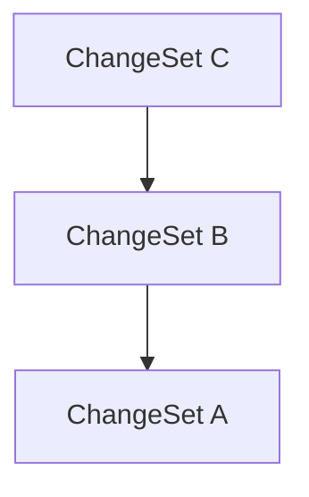

# Lix SDK API Reference

## applyAccountDatabaseSchema

[**@lix-js/sdk**](../README.md)

***

[@lix-js/sdk](../README.md) / applyAccountDatabaseSchema

# Function: applyAccountDatabaseSchema()

> **applyAccountDatabaseSchema**(`sqlite`): `SqliteWasmDatabase`

Defined in: [packages/lix-sdk/src/account/database-schema.ts:5](https://github.com/opral/monorepo/blob/985ffce1eb6542fd7d2a659b02ab83cb2ccd8d57/packages/lix-sdk/src/account/database-schema.ts#L5)

## Parameters

### sqlite

`SqliteWasmDatabase`

## Returns

`SqliteWasmDatabase`

---

## applyChangeSet

[**@lix-js/sdk**](../README.md)

***

[@lix-js/sdk](../README.md) / applyChangeSet

# Function: applyChangeSet()

> **applyChangeSet**(`args`): `Promise`\<`void`\>

Defined in: [packages/lix-sdk/src/change-set/apply-change-set.ts:15](https://github.com/opral/monorepo/blob/985ffce1eb6542fd7d2a659b02ab83cb2ccd8d57/packages/lix-sdk/src/change-set/apply-change-set.ts#L15)

Applies a change set to the lix.

## Parameters

### args

#### changeSet

`Pick`\<\{ `id`: `string`; `immutable_elements`: `boolean`; \}, `"id"`\>

#### lix

[`Lix`](../type-aliases/Lix.md)

#### mode?

[`GraphTraversalMode`](../type-aliases/GraphTraversalMode.md)

The [GraphTraversalMode](../type-aliases/GraphTraversalMode.md) for applying the change set.

**Default**

```ts
"recursive"
```

#### updateVersion?

`boolean`

Whether to update the version to point to the new change set.

**Default**

```ts
true
```

#### version?

`Pick`\<\{ `change_set_id`: `string`; `id`: `string`; `name`: `null` \| `string`; `working_change_set_id`: `string`; \}, `"id"` \| `"change_set_id"`\>

## Returns

`Promise`\<`void`\>

---

## applyChangeSetDatabaseSchema

[**@lix-js/sdk**](../README.md)

***

[@lix-js/sdk](../README.md) / applyChangeSetDatabaseSchema

# Function: applyChangeSetDatabaseSchema()

> **applyChangeSetDatabaseSchema**(`sqlite`): `SqliteWasmDatabase`

Defined in: [packages/lix-sdk/src/change-set/database-schema.ts:4](https://github.com/opral/monorepo/blob/985ffce1eb6542fd7d2a659b02ab83cb2ccd8d57/packages/lix-sdk/src/change-set/database-schema.ts#L4)

## Parameters

### sqlite

`SqliteWasmDatabase`

## Returns

`SqliteWasmDatabase`

---

## applyChangeSetEdgeDatabaseSchema

[**@lix-js/sdk**](../README.md)

***

[@lix-js/sdk](../README.md) / applyChangeSetEdgeDatabaseSchema

# Function: applyChangeSetEdgeDatabaseSchema()

> **applyChangeSetEdgeDatabaseSchema**(`sqlite`): `SqliteWasmDatabase`

Defined in: [packages/lix-sdk/src/change-set-edge/database-schema.ts:4](https://github.com/opral/monorepo/blob/985ffce1eb6542fd7d2a659b02ab83cb2ccd8d57/packages/lix-sdk/src/change-set-edge/database-schema.ts#L4)

## Parameters

### sqlite

`SqliteWasmDatabase`

## Returns

`SqliteWasmDatabase`

---

## applyFileDatabaseSchema

[**@lix-js/sdk**](../README.md)

***

[@lix-js/sdk](../README.md) / applyFileDatabaseSchema

# Function: applyFileDatabaseSchema()

> **applyFileDatabaseSchema**(`sqlite`): `SqliteWasmDatabase`

Defined in: [packages/lix-sdk/src/file/database-schema.ts:8](https://github.com/opral/monorepo/blob/985ffce1eb6542fd7d2a659b02ab83cb2ccd8d57/packages/lix-sdk/src/file/database-schema.ts#L8)

Applies the file table schema to the given sqlite database.

## Parameters

### sqlite

`SqliteWasmDatabase`

## Returns

`SqliteWasmDatabase`

---

## applyFileQueueDatabaseSchema

[**@lix-js/sdk**](../README.md)

***

[@lix-js/sdk](../README.md) / applyFileQueueDatabaseSchema

# Function: applyFileQueueDatabaseSchema()

> **applyFileQueueDatabaseSchema**(`sqlite`): `SqliteWasmDatabase`

Defined in: [packages/lix-sdk/src/file-queue/database-schema.ts:4](https://github.com/opral/monorepo/blob/985ffce1eb6542fd7d2a659b02ab83cb2ccd8d57/packages/lix-sdk/src/file-queue/database-schema.ts#L4)

## Parameters

### sqlite

`SqliteWasmDatabase`

## Returns

`SqliteWasmDatabase`

---

## applyKeyValueDatabaseSchema

[**@lix-js/sdk**](../README.md)

***

[@lix-js/sdk](../README.md) / applyKeyValueDatabaseSchema

# Function: applyKeyValueDatabaseSchema()

> **applyKeyValueDatabaseSchema**(`sqlite`): `SqliteWasmDatabase`

Defined in: [packages/lix-sdk/src/key-value/database-schema.ts:4](https://github.com/opral/monorepo/blob/985ffce1eb6542fd7d2a659b02ab83cb2ccd8d57/packages/lix-sdk/src/key-value/database-schema.ts#L4)

## Parameters

### sqlite

`SqliteWasmDatabase`

## Returns

`SqliteWasmDatabase`

---

## applyLogDatabaseSchema

[**@lix-js/sdk**](../README.md)

***

[@lix-js/sdk](../README.md) / applyLogDatabaseSchema

# Function: applyLogDatabaseSchema()

> **applyLogDatabaseSchema**(`sqlite`): `SqliteWasmDatabase`

Defined in: [packages/lix-sdk/src/log/database-schema.ts:4](https://github.com/opral/monorepo/blob/985ffce1eb6542fd7d2a659b02ab83cb2ccd8d57/packages/lix-sdk/src/log/database-schema.ts#L4)

## Parameters

### sqlite

`SqliteWasmDatabase`

## Returns

`SqliteWasmDatabase`

---

## applySnapshotDatabaseSchema

[**@lix-js/sdk**](../README.md)

***

[@lix-js/sdk](../README.md) / applySnapshotDatabaseSchema

# Function: applySnapshotDatabaseSchema()

> **applySnapshotDatabaseSchema**(`sqlite`): `SqliteWasmDatabase`

Defined in: [packages/lix-sdk/src/snapshot/database-schema.ts:5](https://github.com/opral/monorepo/blob/985ffce1eb6542fd7d2a659b02ab83cb2ccd8d57/packages/lix-sdk/src/snapshot/database-schema.ts#L5)

## Parameters

### sqlite

`SqliteWasmDatabase`

## Returns

`SqliteWasmDatabase`

---

## applyThreadDatabaseSchema

[**@lix-js/sdk**](../README.md)

***

[@lix-js/sdk](../README.md) / applyThreadDatabaseSchema

# Function: applyThreadDatabaseSchema()

> **applyThreadDatabaseSchema**(`sqlite`): `SqliteWasmDatabase`

Defined in: [packages/lix-sdk/src/thread/database-schema.ts:8](https://github.com/opral/monorepo/blob/985ffce1eb6542fd7d2a659b02ab83cb2ccd8d57/packages/lix-sdk/src/thread/database-schema.ts#L8)

## Parameters

### sqlite

`SqliteWasmDatabase`

## Returns

`SqliteWasmDatabase`

---

## applyVersionV2DatabaseSchema

[**@lix-js/sdk**](../README.md)

***

[@lix-js/sdk](../README.md) / applyVersionV2DatabaseSchema

# Function: applyVersionV2DatabaseSchema()

> **applyVersionV2DatabaseSchema**(`sqlite`, `db`): `SqliteWasmDatabase`

Defined in: [packages/lix-sdk/src/version/database-schema.ts:9](https://github.com/opral/monorepo/blob/985ffce1eb6542fd7d2a659b02ab83cb2ccd8d57/packages/lix-sdk/src/version/database-schema.ts#L9)

## Parameters

### sqlite

`SqliteWasmDatabase`

### db

`Kysely`\<[`LixDatabaseSchema`](../type-aliases/LixDatabaseSchema.md)\>

## Returns

`SqliteWasmDatabase`

---

## changeHasLabel

[**@lix-js/sdk**](../README.md)

***

[@lix-js/sdk](../README.md) / changeHasLabel

# Function: changeHasLabel()

> **changeHasLabel**(`label`): (`eb`) => `ExpressionWrapper`\<[`LixDatabaseSchema`](../type-aliases/LixDatabaseSchema.md), `"change"`, `SqlBool`\>

Defined in: [packages/lix-sdk/src/query-filter/change-has-label.ts:25](https://github.com/opral/monorepo/blob/985ffce1eb6542fd7d2a659b02ab83cb2ccd8d57/packages/lix-sdk/src/query-filter/change-has-label.ts#L25)

Selects changes that have a label with the given name.

## Parameters

### label

\{ `id`: `string`; `name?`: `string`; \} | \{ `id?`: `string`; `name`: `string`; \}

## Returns

> (`eb`): `ExpressionWrapper`\<[`LixDatabaseSchema`](../type-aliases/LixDatabaseSchema.md), `"change"`, `SqlBool`\>

### Parameters

#### eb

`ExpressionBuilder`\<[`LixDatabaseSchema`](../type-aliases/LixDatabaseSchema.md), `"change"`\>

### Returns

`ExpressionWrapper`\<[`LixDatabaseSchema`](../type-aliases/LixDatabaseSchema.md), `"change"`, `SqlBool`\>

## Examples

```ts
  await lix.db.selectFrom("change")
     .where(changeHasLabel({ name: "checkpoint" }))
     .selectAll()
     .execute();
  ```

You can use eb.not() to negate the filter.

  ```ts
  await lix.db.selectFrom("change")
		.where((eb) => eb.not(changeHasLabel({ name: "checkpoint"})))
		.selectAll()
		.execute();
  ```

---

## changeIsLowestCommonAncestorOf

[**@lix-js/sdk**](../README.md)

***

[@lix-js/sdk](../README.md) / changeIsLowestCommonAncestorOf

# Function: ~~changeIsLowestCommonAncestorOf()~~

> **changeIsLowestCommonAncestorOf**(`changes`): `ExpressionWrapper`\<[`LixDatabaseSchema`](../type-aliases/LixDatabaseSchema.md), `"change"`, `SqlBool`\>

Defined in: [packages/lix-sdk/src/query-filter/change-is-lowest-common-ancestor-of.ts:21](https://github.com/opral/monorepo/blob/985ffce1eb6542fd7d2a659b02ab83cb2ccd8d57/packages/lix-sdk/src/query-filter/change-is-lowest-common-ancestor-of.ts#L21)

Filters changes that are the lowest common ancestor of the given changes.

## Parameters

### changes

`Pick`\<\{ `created_at`: `string`; `entity_id`: `string`; `file_id`: `string`; `id`: `string`; `plugin_key`: `string`; `schema_key`: `string`; `snapshot_id`: `string`; \}, `"id"`\>[]

## Returns

`ExpressionWrapper`\<[`LixDatabaseSchema`](../type-aliases/LixDatabaseSchema.md), `"change"`, `SqlBool`\>

## Deprecated

No new api exists yet for the change set graph. Write on discord if you need it

## Example

```ts
  const lowestCommonAncestor = await lix.db.selectFrom("change")
     .where(changeIsLowestCommonAncestorOf([change1, change2, change3]))
     .selectAll()
     .executeTakeFirst();
  ```

---

## changeSetElementInAncestryOf

[**@lix-js/sdk**](../README.md)

***

[@lix-js/sdk](../README.md) / changeSetElementInAncestryOf

# Function: changeSetElementInAncestryOf()

> **changeSetElementInAncestryOf**(`target`, `options?`): (`eb`) => `ExpressionWrapper`\<[`LixDatabaseSchema`](../type-aliases/LixDatabaseSchema.md), `"change_set_element"`, `SqlBool`\>

Defined in: [packages/lix-sdk/src/query-filter/change-set-element-in-ancestry-of.ts:33](https://github.com/opral/monorepo/blob/985ffce1eb6542fd7d2a659b02ab83cb2ccd8d57/packages/lix-sdk/src/query-filter/change-set-element-in-ancestry-of.ts#L33)

Filters elements that are in the ancestry of the given change set(s).

## Parameters

### target

A target change set object (or its id), or an array of such objects/ids.

`Pick`\<\{ `id`: `string`; `immutable_elements`: `boolean`; \}, `"id"`\> | `Pick`\<\{ `id`: `string`; `immutable_elements`: `boolean`; \}, `"id"`\>[]

### options?

Optional options object (e.g., depth limit)

#### depth?

`number`

## Returns

A Kysely ExpressionBuilder function for filtering.

> (`eb`): `ExpressionWrapper`\<[`LixDatabaseSchema`](../type-aliases/LixDatabaseSchema.md), `"change_set_element"`, `SqlBool`\>

### Parameters

#### eb

`ExpressionBuilder`\<[`LixDatabaseSchema`](../type-aliases/LixDatabaseSchema.md), `"change_set_element"`\>

### Returns

`ExpressionWrapper`\<[`LixDatabaseSchema`](../type-aliases/LixDatabaseSchema.md), `"change_set_element"`, `SqlBool`\>

## Example

```ts
// Elements from the history of cs2 (object)
db.selectFrom("change_set_element")
  .where(changeSetElementInAncestryOf(cs2))
  .selectAll()

// Elements from the history of cs2 (id)
db.selectFrom("change_set_element")
  .where(changeSetElementInAncestryOf(cs2.id))
  .selectAll()

// Elements from the combined history of cs2 and cs4 (divergent branches)
db.selectFrom("change_set_element")
  .where(changeSetElementInAncestryOf([cs2, cs4]))
  .selectAll()
```

---

## changeSetElementInSymmetricDifference

[**@lix-js/sdk**](../README.md)

***

[@lix-js/sdk](../README.md) / changeSetElementInSymmetricDifference

# Function: changeSetElementInSymmetricDifference()

> **changeSetElementInSymmetricDifference**(`a`, `b`): (`eb`) => `ExpressionWrapper`\<[`LixDatabaseSchema`](../type-aliases/LixDatabaseSchema.md), `"change_set_element"`, `SqlBool`\>

Defined in: [packages/lix-sdk/src/change-set/change-set-element-in-symmetric-difference.ts:20](https://github.com/opral/monorepo/blob/985ffce1eb6542fd7d2a659b02ab83cb2ccd8d57/packages/lix-sdk/src/change-set/change-set-element-in-symmetric-difference.ts#L20)

Returns the symmetric difference between two change sets.

The symmetric difference is the set of changes
that exist in either one version but not both.
Modeled after https://developer.mozilla.org/en-US/docs/Web/JavaScript/Reference/Global_Objects/Set/symmetricDifference

## Parameters

### a

`Pick`\<\{ `id`: `string`; `immutable_elements`: `boolean`; \}, `"id"`\>

### b

`Pick`\<\{ `id`: `string`; `immutable_elements`: `boolean`; \}, `"id"`\>

## Returns

> (`eb`): `ExpressionWrapper`\<[`LixDatabaseSchema`](../type-aliases/LixDatabaseSchema.md), `"change_set_element"`, `SqlBool`\>

### Parameters

#### eb

`ExpressionBuilder`\<[`LixDatabaseSchema`](../type-aliases/LixDatabaseSchema.md), `"change_set_element"`\>

### Returns

`ExpressionWrapper`\<[`LixDatabaseSchema`](../type-aliases/LixDatabaseSchema.md), `"change_set_element"`, `SqlBool`\>

## Example

```ts
  await lix.db.selectFrom("change_set_element")
    .where(changeSetElementInSymmetricDifference(a: changeSetA, b: changeSetB))
    .selectAll()
    .execute();
  ```

---

## changeSetElementIsLeafOf

[**@lix-js/sdk**](../README.md)

***

[@lix-js/sdk](../README.md) / changeSetElementIsLeafOf

# Function: changeSetElementIsLeafOf()

> **changeSetElementIsLeafOf**(`target`): (`eb`) => `ExpressionWrapper`\<[`LixDatabaseSchema`](../type-aliases/LixDatabaseSchema.md), `"change_set_element"`, `SqlBool`\>

Defined in: [packages/lix-sdk/src/query-filter/change-set-element-is-leaf-of.ts:34](https://github.com/opral/monorepo/blob/985ffce1eb6542fd7d2a659b02ab83cb2ccd8d57/packages/lix-sdk/src/query-filter/change-set-element-is-leaf-of.ts#L34)

Filters the leaves of the given change set(s).

An element is considered a **leaf** if no other element in the combined ancestry
of the target change sets redefines the same entity at a later point in the graph.

## Parameters

### target

A target change set object (or its id), or an array of such objects/ids.

`Pick`\<\{ `id`: `string`; `immutable_elements`: `boolean`; \}, `"id"`\> | `Pick`\<\{ `id`: `string`; `immutable_elements`: `boolean`; \}, `"id"`\>[]

## Returns

> (`eb`): `ExpressionWrapper`\<[`LixDatabaseSchema`](../type-aliases/LixDatabaseSchema.md), `"change_set_element"`, `SqlBool`\>

### Parameters

#### eb

`ExpressionBuilder`\<[`LixDatabaseSchema`](../type-aliases/LixDatabaseSchema.md), `"change_set_element"`\>

### Returns

`ExpressionWrapper`\<[`LixDatabaseSchema`](../type-aliases/LixDatabaseSchema.md), `"change_set_element"`, `SqlBool`\>

## Example

```ts
// Find leaves relative to a single change set (object)
db.selectFrom("change_set_element")
  .where(changeSetElementIsLeafOf(cs))
  .selectAll()

// Find leaves relative to a single change set (id)
db.selectFrom("change_set_element")
  .where(changeSetElementIsLeafOf(cs.id))
  .selectAll()

// Find leaves relative to multiple change sets
db.selectFrom("change_set_element")
  .where(changeSetElementIsLeafOf([cs_source, cs_target]))
  .selectAll()
```

---

## changeSetHasLabel

[**@lix-js/sdk**](../README.md)

***

[@lix-js/sdk](../README.md) / changeSetHasLabel

# Function: changeSetHasLabel()

> **changeSetHasLabel**(`label`): (`eb`) => `ExpressionWrapper`\<[`LixDatabaseSchema`](../type-aliases/LixDatabaseSchema.md), `"change_set"`, `SqlBool`\>

Defined in: [packages/lix-sdk/src/query-filter/change-set-has-label.ts:35](https://github.com/opral/monorepo/blob/985ffce1eb6542fd7d2a659b02ab83cb2ccd8d57/packages/lix-sdk/src/query-filter/change-set-has-label.ts#L35)

Selects change sets that have a label with the given name.

## Parameters

### label

\{ `id`: `string`; `name?`: `string`; \} | \{ `id?`: `string`; `name`: `string`; \}

## Returns

> (`eb`): `ExpressionWrapper`\<[`LixDatabaseSchema`](../type-aliases/LixDatabaseSchema.md), `"change_set"`, `SqlBool`\>

### Parameters

#### eb

`ExpressionBuilder`\<[`LixDatabaseSchema`](../type-aliases/LixDatabaseSchema.md), `"change_set"`\>

### Returns

`ExpressionWrapper`\<[`LixDatabaseSchema`](../type-aliases/LixDatabaseSchema.md), `"change_set"`, `SqlBool`\>

## Examples

```ts
  await lix.db.selectFrom("change_set")
     .where(changeSetHasLabel({ name: "checkpoint" }))
     .selectAll()
     .execute();
  ```

You can use eb.not() to negate the filter.

  ```ts
  await lix.db.selectFrom("change_set")
		.where((eb) => eb.not(changeSetHasLabel({ name: "checkpoint" })))
		.selectAll()
		.execute();
  ```

Id lookup also works:

  ```ts
  await lix.db.selectFrom("change_set")
		.where(changeSetHasLabel({ id: "39j9afj2" }))
		.selectAll()
		.execute();
  ```

---

## changeSetIsAncestorOf

[**@lix-js/sdk**](../README.md)

***

[@lix-js/sdk](../README.md) / changeSetIsAncestorOf

# Function: changeSetIsAncestorOf()

> **changeSetIsAncestorOf**(`changeSet`, `options?`): (`eb`) => `ExpressionWrapper`\<[`LixDatabaseSchema`](../type-aliases/LixDatabaseSchema.md), `"change_set"`, `SqlBool`\>

Defined in: [packages/lix-sdk/src/query-filter/change-set-is-ancestor-of.ts:53](https://github.com/opral/monorepo/blob/985ffce1eb6542fd7d2a659b02ab83cb2ccd8d57/packages/lix-sdk/src/query-filter/change-set-is-ancestor-of.ts#L53)

Filters change sets that are ancestors of the given change set.

By default, this is **exclusive**, meaning it returns only change sets strictly
*before* the provided change set in the graph.

Traverses the `change_set_edge` graph recursively, starting from the provided change set
(or its parents if exclusive), and returns all change sets reachable via parent edges.

This filter is typically used to scope the graph before applying filters like `changeIsLeaf()`.

⚠️ This filter only defines the traversal scope — it does not filter changes directly.

--- Options ---
- `includeSelf`: If `true`, includes the starting `changeSet` in the results. Defaults to `false`.
- `depth`: Limits the traversal depth. `depth: 1` selects only immediate parents (if exclusive)
  or the starting node and its immediate parents (if inclusive).

--- Examples ---

## Parameters

### changeSet

`Pick`\<\{ `id`: `string`; `immutable_elements`: `boolean`; \}, `"id"`\>

### options?

#### depth?

`number`

#### includeSelf?

`boolean`

## Returns

> (`eb`): `ExpressionWrapper`\<[`LixDatabaseSchema`](../type-aliases/LixDatabaseSchema.md), `"change_set"`, `SqlBool`\>

### Parameters

#### eb

`ExpressionBuilder`\<[`LixDatabaseSchema`](../type-aliases/LixDatabaseSchema.md), `"change_set"`\>

### Returns

`ExpressionWrapper`\<[`LixDatabaseSchema`](../type-aliases/LixDatabaseSchema.md), `"change_set"`, `SqlBool`\>

## Examples

```ts
db.selectFrom("change_set")
  .where(changeSetIsAncestorOf({ id: "cs3" }))
  .selectAll()
```

```ts
db.selectFrom("change_set")
  .where(changeSetIsAncestorOf({ id: "cs3" }, { includeSelf: true }))
  .selectAll()
```

```ts
// Select all change sets between startPoint and endPoint (inclusive)
db.selectFrom("change_set")
  .where(changeSetIsDescendantOf({ id: "startPoint" }))
  .where(changeSetIsAncestorOf({ id: "endPoint" }))
  .selectAll()
```

---

## changeSetIsDescendantOf

[**@lix-js/sdk**](../README.md)

***

[@lix-js/sdk](../README.md) / changeSetIsDescendantOf

# Function: changeSetIsDescendantOf()

> **changeSetIsDescendantOf**(`changeSet`, `options?`): (`eb`) => `ExpressionWrapper`\<[`LixDatabaseSchema`](../type-aliases/LixDatabaseSchema.md), `"change_set"`, `SqlBool`\>

Defined in: [packages/lix-sdk/src/query-filter/change-set-is-descendant-of.ts:46](https://github.com/opral/monorepo/blob/985ffce1eb6542fd7d2a659b02ab83cb2ccd8d57/packages/lix-sdk/src/query-filter/change-set-is-descendant-of.ts#L46)

Filters change sets that are descendants of the given change set.

By default, this is **exclusive**, meaning it returns only change sets strictly
*after* the provided change set in the graph.

Traverses the `change_set_edge` graph recursively, starting from the provided change set
(or its children if exclusive), and returns all change sets reachable via child edges.

This filter is useful for finding changes made *after* a specific point in time (e.g., a checkpoint).

⚠️ This filter only defines the traversal scope — it does not filter changes directly.

--- Options ---
- `includeSelf`: If `true`, includes the starting `changeSet` in the results. Defaults to `false`.
- `depth`: Limits the traversal depth. `depth: 1` selects only immediate children (if exclusive)
  or the starting node and its immediate children (if includeSelf is true).

--- Examples ---

## Parameters

### changeSet

`Pick`\<\{ `id`: `string`; `immutable_elements`: `boolean`; \}, `"id"`\>

### options?

#### depth?

`number`

#### includeSelf?

`boolean`

## Returns

> (`eb`): `ExpressionWrapper`\<[`LixDatabaseSchema`](../type-aliases/LixDatabaseSchema.md), `"change_set"`, `SqlBool`\>

### Parameters

#### eb

`ExpressionBuilder`\<[`LixDatabaseSchema`](../type-aliases/LixDatabaseSchema.md), `"change_set"`\>

### Returns

`ExpressionWrapper`\<[`LixDatabaseSchema`](../type-aliases/LixDatabaseSchema.md), `"change_set"`, `SqlBool`\>

## Examples

```ts
db.selectFrom("change_set")
  .where(changeSetIsDescendantOf({ id: "cs1" }))
  .selectAll()
```

```ts
// Select all change sets between startPoint and endPoint (inclusive)
db.selectFrom("change_set")
  .where(changeSetIsDescendantOf({ id: "startPoint" }))
  .where(changeSetIsAncestorOf({ id: "endPoint" }))
  .selectAll()
```

---

## closeLix

[**@lix-js/sdk**](../README.md)

***

[@lix-js/sdk](../README.md) / closeLix

# Function: closeLix()

> **closeLix**(`args`): `Promise`\<`void`\>

Defined in: [packages/lix-sdk/src/lix/close-lix.ts:6](https://github.com/opral/monorepo/blob/985ffce1eb6542fd7d2a659b02ab83cb2ccd8d57/packages/lix-sdk/src/lix/close-lix.ts#L6)

Closes the lix.

## Parameters

### args

#### lix

`Pick`\<[`Lix`](../type-aliases/Lix.md), `"db"`\>

## Returns

`Promise`\<`void`\>

---

## createAccount

[**@lix-js/sdk**](../README.md)

***

[@lix-js/sdk](../README.md) / createAccount

# Function: createAccount()

> **createAccount**(`args`): `Promise`\<\{ `id`: `string`; `name`: `string`; \}\>

Defined in: [packages/lix-sdk/src/account/create-account.ts:4](https://github.com/opral/monorepo/blob/985ffce1eb6542fd7d2a659b02ab83cb2ccd8d57/packages/lix-sdk/src/account/create-account.ts#L4)

## Parameters

### args

#### lix

[`Lix`](../type-aliases/Lix.md)

#### name

`string`

## Returns

`Promise`\<\{ `id`: `string`; `name`: `string`; \}\>

---

## createChange

[**@lix-js/sdk**](../README.md)

***

[@lix-js/sdk](../README.md) / createChange

# Function: createChange()

> **createChange**(`args`): `Promise`\<\{ `created_at`: `string`; `entity_id`: `string`; `file_id`: `string`; `id`: `string`; `plugin_key`: `string`; `schema_key`: `string`; `snapshot_id`: `string`; \}\>

Defined in: [packages/lix-sdk/src/change/create-change.ts:13](https://github.com/opral/monorepo/blob/985ffce1eb6542fd7d2a659b02ab83cb2ccd8d57/packages/lix-sdk/src/change/create-change.ts#L13)

Programatically create a change in the database.

Use this function to directly create a change from a lix app
with bypassing of file-based change detection.

## Parameters

### args

#### authors

`Pick`\<\{ `id`: `string`; `name`: `string`; \}, `"id"`\>[]

#### entityId

`string`

#### fileId

`string`

#### lix

`Pick`\<[`Lix`](../type-aliases/Lix.md), `"db"` \| `"sqlite"`\>

#### pluginKey

`string`

#### schemaKey

`string`

#### snapshotContent

`null` \| `Record`\<`string`, `any`\>

## Returns

`Promise`\<\{ `created_at`: `string`; `entity_id`: `string`; `file_id`: `string`; `id`: `string`; `plugin_key`: `string`; `schema_key`: `string`; `snapshot_id`: `string`; \}\>

---

## createChangeSet

[**@lix-js/sdk**](../README.md)

***

[@lix-js/sdk](../README.md) / createChangeSet

# Function: createChangeSet()

> **createChangeSet**(`args`): `Promise`\<\{ `id`: `string`; `immutable_elements`: `boolean`; \}\>

Defined in: [packages/lix-sdk/src/change-set/create-change-set.ts:36](https://github.com/opral/monorepo/blob/985ffce1eb6542fd7d2a659b02ab83cb2ccd8d57/packages/lix-sdk/src/change-set/create-change-set.ts#L36)

Creates a change set with the given elements, optionally within an open transaction.

## Parameters

### args

#### elements?

`Pick`\<[`ChangeSetElementTable`](../type-aliases/ChangeSetElementTable.md), `"entity_id"` \| `"file_id"` \| `"schema_key"` \| `"change_id"`\>[]

#### id?

`string`

#### immutableElements?

`boolean`

If true, all elements of the change set will be immutable after creation.

Immutable change set elements is required to create change set edges (the graph).

WARNING: The SQL schema defaults to false to allow crating change sets
and inserting elements. For ease of use, the `createChangeSet()` utility
defaults to true because in the majority of cases change set elements should be immutable.

**Default**

```ts
true
```

#### labels?

`Pick`\<\{ `id`: `string`; `name`: `string`; \}, `"id"`\>[]

#### lix

`Pick`\<[`Lix`](../type-aliases/Lix.md), `"db"`\>

#### parents?

`Pick`\<\{ `id`: `string`; `immutable_elements`: `boolean`; \}, `"id"`\>[]

Parent change sets that this change set will be a child of

## Returns

`Promise`\<\{ `id`: `string`; `immutable_elements`: `boolean`; \}\>

## Examples

```ts
  const elements = await lix.db.selectFrom("change_set_element").selectAll().execute();
  const changeSet = await createChangeSet({ db: lix.db, elements });
  ```

```ts
  // Create a change set with labels
  const labels = await lix.db.selectFrom("label").selectAll().execute();
  const changeSet = await createChangeSet({
    lix,
    elements: [],
    labels
  });
  ```

```ts
  // Create a change set with parent change sets
  const parentChangeSet = await createChangeSet({ lix, elements: [] });
  const childChangeSet = await createChangeSet({
    lix,
    elements: [],
    parents: [parentChangeSet]
  });
  ```

---

## createCheckpoint

[**@lix-js/sdk**](../README.md)

***

[@lix-js/sdk](../README.md) / createCheckpoint

# Function: createCheckpoint()

> **createCheckpoint**(`args`): `Promise`\<\{ `id`: `string`; `immutable_elements`: `boolean`; \}\>

Defined in: [packages/lix-sdk/src/change-set/create-checkpoint.ts:5](https://github.com/opral/monorepo/blob/985ffce1eb6542fd7d2a659b02ab83cb2ccd8d57/packages/lix-sdk/src/change-set/create-checkpoint.ts#L5)

## Parameters

### args

#### lix

[`Lix`](../type-aliases/Lix.md)

#### version?

`Pick`\<\{ `change_set_id`: `string`; `id`: `string`; `name`: `null` \| `string`; `working_change_set_id`: `string`; \}, `"id"`\>

Optional version to create checkpoint from.

**Default**

```ts
The active version
```

## Returns

`Promise`\<\{ `id`: `string`; `immutable_elements`: `boolean`; \}\>

---

## createLog

[**@lix-js/sdk**](../README.md)

***

[@lix-js/sdk](../README.md) / createLog

# Function: createLog()

> **createLog**(`args`): `Promise`\<\{ `created_at`: `string`; `key`: `string`; `level`: `string`; `message`: `string`; \}\>

Defined in: [packages/lix-sdk/src/log/create-log.ts:26](https://github.com/opral/monorepo/blob/985ffce1eb6542fd7d2a659b02ab83cb2ccd8d57/packages/lix-sdk/src/log/create-log.ts#L26)

Directly creates a log entry in the Lix database without applying any filters.

This function inserts the log entry regardless of the `lix_log_levels` setting
in the key-value store. It is the responsibility of the calling application
to implement any desired log level filtering before invoking this function.

It is recommended to use dot notation for log keys (e.g., 'app.module.component').

## Parameters

### args

#### key

`string`

#### level

`string`

#### lix

`Pick`\<[`Lix`](../type-aliases/Lix.md), `"db"` \| `"sqlite"`\>

#### message

`string`

## Returns

`Promise`\<\{ `created_at`: `string`; `key`: `string`; `level`: `string`; `message`: `string`; \}\>

A promise that resolves with the created log entry.

## Example

```ts
// Directly log an info message

if (shouldLog) {
  await createLog({
    lix,
    key: 'app.init',
    level: 'info',
    message: 'Application initialized'
});
```

---

## createLspInMemoryEnvironment

[**@lix-js/sdk**](../README.md)

***

[@lix-js/sdk](../README.md) / createLspInMemoryEnvironment

# Function: createLspInMemoryEnvironment()

> **createLspInMemoryEnvironment**(): `LspEnvironment`

Defined in: [packages/lix-sdk/src/server-protocol-handler/environment/create-in-memory-environment.ts:13](https://github.com/opral/monorepo/blob/985ffce1eb6542fd7d2a659b02ab83cb2ccd8d57/packages/lix-sdk/src/server-protocol-handler/environment/create-in-memory-environment.ts#L13)

Create an in-memory storage.

Great for testing or quick prototyping.

## Returns

`LspEnvironment`

---

## createMergeChangeSet

[**@lix-js/sdk**](../README.md)

***

[@lix-js/sdk](../README.md) / createMergeChangeSet

# Function: createMergeChangeSet()

> **createMergeChangeSet**(`args`): `Promise`\<\{ `id`: `string`; `immutable_elements`: `boolean`; \}\>

Defined in: [packages/lix-sdk/src/change-set/create-merge-change-set.ts:22](https://github.com/opral/monorepo/blob/985ffce1eb6542fd7d2a659b02ab83cb2ccd8d57/packages/lix-sdk/src/change-set/create-merge-change-set.ts#L22)

Merges two change sets using a "source wins" strategy (until lix models conflicts).

Creates a new change set containing the merged result. If an element
(identified by entity_id, file_id, schema_key) exists in both the source
and target change sets (considering their respective histories), the element
from the source change set's history takes precedence.

## Parameters

### args

The arguments for the merge operation.

#### lix

[`Lix`](../type-aliases/Lix.md)

The Lix instance.

#### source

`Pick`\<\{ `id`: `string`; `immutable_elements`: `boolean`; \}, `"id"`\>

The source change set (only `id` is needed).

#### target

`Pick`\<\{ `id`: `string`; `immutable_elements`: `boolean`; \}, `"id"`\>

The target change set (only `id` is needed).

## Returns

`Promise`\<\{ `id`: `string`; `immutable_elements`: `boolean`; \}\>

A Promise resolving to the newly created ChangeSet representing the merged state.

---

## createServerProtocolHandler

[**@lix-js/sdk**](../README.md)

***

[@lix-js/sdk](../README.md) / createServerProtocolHandler

# Function: createServerProtocolHandler()

> **createServerProtocolHandler**(`args`): `Promise`\<`LixServerProtocolHandler`\>

Defined in: [packages/lix-sdk/src/server-protocol-handler/create-server-protocol-handler.ts:55](https://github.com/opral/monorepo/blob/985ffce1eb6542fd7d2a659b02ab83cb2ccd8d57/packages/lix-sdk/src/server-protocol-handler/create-server-protocol-handler.ts#L55)

The handler for the lix server protocol.

## Parameters

### args

#### environment

`LspEnvironment`

## Returns

`Promise`\<`LixServerProtocolHandler`\>

## Examples

Usage with a server framework.

  ```ts
	 // any server framework goes
  // here, like express, polka, etc.
  // frameworks that do not use
  // web standard Request and Response
  // objects will need to be mapped.
  const app = new Hono();

  const lspHandler = createServerProtocolHandler({ storage });

  app.use('/lsp/*', async (req) => {
     await lspHandler(req);
  });
  ```

Testing the handler.

  ```ts
  const lspHandler = createServerProtocolHandler({ storage });
  const request = new Request('/lsp/new', {
    method: 'POST',
    body: new Blob(['...']),
  });

  const response = await lspHandler(request);

  expect(response).to(...);
  ```

---

## createSnapshot

[**@lix-js/sdk**](../README.md)

***

[@lix-js/sdk](../README.md) / createSnapshot

# Function: createSnapshot()

> **createSnapshot**(`args`): `Promise`\<\{ `content`: `null` \| `Record`\<`string`, `any`\>; `id`: `string`; \}\>

Defined in: [packages/lix-sdk/src/snapshot/create-snapshot.ts:15](https://github.com/opral/monorepo/blob/985ffce1eb6542fd7d2a659b02ab83cb2ccd8d57/packages/lix-sdk/src/snapshot/create-snapshot.ts#L15)

Creates a snapshot and inserts it or retrieves the existing snapshot from the database.

Snapshots are content-addressed to avoid storing the same snapshot multiple times.
Hence, an insert might not actually insert a new snapshot but return an existing one.

## Parameters

### args

#### content?

`null` \| `Record`\<`string`, `any`\>

#### lix

`Pick`\<[`Lix`](../type-aliases/Lix.md), `"db"`\>

## Returns

`Promise`\<\{ `content`: `null` \| `Record`\<`string`, `any`\>; `id`: `string`; \}\>

## Example

```ts
  const snapshot = await createSnapshot({ lix, content });
  ```

---

## createThread

[**@lix-js/sdk**](../README.md)

***

[@lix-js/sdk](../README.md) / createThread

# Function: createThread()

> **createThread**(`args`): `Promise`\<`object` & `object`\>

Defined in: [packages/lix-sdk/src/thread/create-thread.ts:8](https://github.com/opral/monorepo/blob/985ffce1eb6542fd7d2a659b02ab83cb2ccd8d57/packages/lix-sdk/src/thread/create-thread.ts#L8)

## Parameters

### args

#### comments?

`Pick`\<`object` & `object`, `"body"`\>[]

#### id?

`string`

#### lix

[`Lix`](../type-aliases/Lix.md)

## Returns

`Promise`\<`object` & `object`\>

---

## createThreadComment

[**@lix-js/sdk**](../README.md)

***

[@lix-js/sdk](../README.md) / createThreadComment

# Function: createThreadComment()

> **createThreadComment**(`args`): `Promise`\<\{ `body`: \{ `content`: (\{ `children`: `object`[]; `metadata?`: \{[`key`: `string`]: `unknown`; \}; `style`: `string`; `type`: `"zettel_text_block"`; `zettel_key`: `string`; \} \| `object` & `object`)[]; `type`: `"zettel_doc"`; \}; `id`: `string`; `parent_id`: `null` \| `string`; `thread_id`: `string`; \}\>

Defined in: [packages/lix-sdk/src/thread/create-thread-comment.ts:4](https://github.com/opral/monorepo/blob/985ffce1eb6542fd7d2a659b02ab83cb2ccd8d57/packages/lix-sdk/src/thread/create-thread-comment.ts#L4)

## Parameters

### args

`object` & `object` & `object`

## Returns

`Promise`\<\{ `body`: \{ `content`: (\{ `children`: `object`[]; `metadata?`: \{[`key`: `string`]: `unknown`; \}; `style`: `string`; `type`: `"zettel_text_block"`; `zettel_key`: `string`; \} \| `object` & `object`)[]; `type`: `"zettel_doc"`; \}; `id`: `string`; `parent_id`: `null` \| `string`; `thread_id`: `string`; \}\>

---

## createUndoChangeSet

[**@lix-js/sdk**](../README.md)

***

[@lix-js/sdk](../README.md) / createUndoChangeSet

# Function: createUndoChangeSet()

> **createUndoChangeSet**(`args`): `Promise`\<\{ `id`: `string`; `immutable_elements`: `boolean`; \}\>

Defined in: [packages/lix-sdk/src/change-set/create-undo-change-set.ts:26](https://github.com/opral/monorepo/blob/985ffce1eb6542fd7d2a659b02ab83cb2ccd8d57/packages/lix-sdk/src/change-set/create-undo-change-set.ts#L26)

Creates a "reverse" change set that undoes the changes made by the specified change set.

## Parameters

### args

#### changeSet

`Pick`\<\{ `id`: `string`; `immutable_elements`: `boolean`; \}, `"id"`\>

#### labels?

`Pick`\<\{ `id`: `string`; `name`: `string`; \}, `"id"`\>[]

#### lix

[`Lix`](../type-aliases/Lix.md)

## Returns

`Promise`\<\{ `id`: `string`; `immutable_elements`: `boolean`; \}\>

The newly created change set that contains the undo operations

## Example

```ts
  const undoChangeSet = await createUndoChangeSet({
    lix,
    changeSet: targetChangeSet
  });

  await applyChangeSet({
    lix,
    changeSet: undoChangeSet
  });
  ```

---

## createVersion

[**@lix-js/sdk**](../README.md)

***

[@lix-js/sdk](../README.md) / createVersion

# Function: createVersion()

> **createVersion**(`args`): `Promise`\<\{ `change_set_id`: `string`; `id`: `string`; `name`: `null` \| `string`; `working_change_set_id`: `string`; \}\>

Defined in: [packages/lix-sdk/src/version/create-version.ts:14](https://github.com/opral/monorepo/blob/985ffce1eb6542fd7d2a659b02ab83cb2ccd8d57/packages/lix-sdk/src/version/create-version.ts#L14)

Creates a new version.

The changeSet can be any change set e.g. another version, a checkpoint, etc.

## Parameters

### args

#### changeSet

`Pick`\<\{ `id`: `string`; `immutable_elements`: `boolean`; \}, `"id"`\>

#### id?

`string`

#### lix

[`Lix`](../type-aliases/Lix.md)

#### name?

`null` \| `string`

## Returns

`Promise`\<\{ `change_set_id`: `string`; `id`: `string`; `name`: `null` \| `string`; `working_change_set_id`: `string`; \}\>

## Example

```ts
const version = await createVersion({ lix, changeSet: otherVersion.change_set_id });
```

---

## executeSync

[**@lix-js/sdk**](../README.md)

***

[@lix-js/sdk](../README.md) / executeSync

# Function: executeSync()

> **executeSync**(`args`): `any`[]

Defined in: [packages/lix-sdk/src/database/execute-sync.ts:15](https://github.com/opral/monorepo/blob/985ffce1eb6542fd7d2a659b02ab83cb2ccd8d57/packages/lix-sdk/src/database/execute-sync.ts#L15)

Execute a query synchronously.

WARNING: This function is not recommended for general use.
Only if you need sync queries, like in a trigger for exmaple,
you should use this function. The function is not transforming
the query or the result as the db API does. You get raw SQL.

## Parameters

### args

#### lix

`Pick`\<[`Lix`](../type-aliases/Lix.md), `"sqlite"`\>

#### query

`any`

## Returns

`any`[]

## Example

```ts
const query = lix.db.selectFrom("key_value").selectAll();
  const result = executeSync({ lix, query }) as KeyValue[];
```

---

## fileQueueSettled

[**@lix-js/sdk**](../README.md)

***

[@lix-js/sdk](../README.md) / fileQueueSettled

# Function: fileQueueSettled()

> **fileQueueSettled**(`args`): `Promise`\<`void`\>

Defined in: [packages/lix-sdk/src/file-queue/file-queue-settled.ts:11](https://github.com/opral/monorepo/blob/985ffce1eb6542fd7d2a659b02ab83cb2ccd8d57/packages/lix-sdk/src/file-queue/file-queue-settled.ts#L11)

Waits until the file queue is settled.

## Parameters

### args

#### lix

`Pick`\<[`Lix`](../type-aliases/Lix.md), `"db"`\>

## Returns

`Promise`\<`void`\>

## Example

```ts
  await fileQueueSettled({ lix });
  ```

---

## getBeforeAfterOfFile

[**@lix-js/sdk**](../README.md)

***

[@lix-js/sdk](../README.md) / getBeforeAfterOfFile

# Function: getBeforeAfterOfFile()

> **getBeforeAfterOfFile**(`args`): `Promise`\<\{ `after?`: \{ `data`: `Uint8Array`\<`ArrayBufferLike`\>; `id`: `string`; `metadata`: `null` \| `Record`\<`string`, `any`\>; `path`: `string`; \}; `before?`: \{ `data`: `Uint8Array`\<`ArrayBufferLike`\>; `id`: `string`; `metadata`: `null` \| `Record`\<`string`, `any`\>; `path`: `string`; \}; \}\>

Defined in: [packages/lix-sdk/src/change-set/get-before-after-of-file.ts:29](https://github.com/opral/monorepo/blob/985ffce1eb6542fd7d2a659b02ab83cb2ccd8d57/packages/lix-sdk/src/change-set/get-before-after-of-file.ts#L29)

Interim utility function until https://github.com/opral/lix-sdk/issues/252 arrives.

Use this function to get the file contents before and after for diffing purposes.

## Parameters

### args

#### changeSetAfter?

`Pick`\<\{ `id`: `string`; `immutable_elements`: `boolean`; \}, `"id"`\>

#### changeSetBefore?

`Pick`\<\{ `id`: `string`; `immutable_elements`: `boolean`; \}, `"id"`\>

#### file

`Pick`\<\{ `data`: `Uint8Array`\<`ArrayBufferLike`\>; `id`: `string`; `metadata`: `null` \| `Record`\<`string`, `any`\>; `path`: `string`; \}, `"id"`\>

#### lix

[`Lix`](../type-aliases/Lix.md)

## Returns

`Promise`\<\{ `after?`: \{ `data`: `Uint8Array`\<`ArrayBufferLike`\>; `id`: `string`; `metadata`: `null` \| `Record`\<`string`, `any`\>; `path`: `string`; \}; `before?`: \{ `data`: `Uint8Array`\<`ArrayBufferLike`\>; `id`: `string`; `metadata`: `null` \| `Record`\<`string`, `any`\>; `path`: `string`; \}; \}\>

## Example

```ts
const { before, after } = await diffForFile({
    lix,
    changeSetBefore,
    changeSetAfter,
    file: { id: "XYZ" },
  });

  console.log("Before:", before);
  console.log("After:", after);

  renderDiff(before, after);
```

---

## isValidFilePath

[**@lix-js/sdk**](../README.md)

***

[@lix-js/sdk](../README.md) / isValidFilePath

# Function: isValidFilePath()

> **isValidFilePath**(`path`): `boolean`

Defined in: [packages/lix-sdk/src/file/validate-file-path.ts:53](https://github.com/opral/monorepo/blob/985ffce1eb6542fd7d2a659b02ab83cb2ccd8d57/packages/lix-sdk/src/file/validate-file-path.ts#L53)

## Parameters

### path

`string`

## Returns

`boolean`

---

## jsonArrayFrom

[**@lix-js/sdk**](../README.md)

***

[@lix-js/sdk](../README.md) / jsonArrayFrom

# Function: jsonArrayFrom()

> **jsonArrayFrom**\<`O`\>(`expr`): `RawBuilder`\<`Simplify`\<`O`\>[]\>

Defined in: node\_modules/.pnpm/kysely@0.27.4/node\_modules/kysely/dist/esm/helpers/sqlite.d.ts:58

A SQLite helper for aggregating a subquery into a JSON array.

NOTE: This helper only works correctly if you've installed the `ParseJSONResultsPlugin`.
Otherwise the nested selections will be returned as JSON strings.

The plugin can be installed like this:

```ts
const db = new Kysely({
  dialect: new SqliteDialect(config),
  plugins: [new ParseJSONResultsPlugin()]
})
```

### Examples

```ts
const result = await db
  .selectFrom('person')
  .select((eb) => [
    'id',
    jsonArrayFrom(
      eb.selectFrom('pet')
        .select(['pet.id as pet_id', 'pet.name'])
        .whereRef('pet.owner_id', '=', 'person.id')
        .orderBy('pet.name')
    ).as('pets')
  ])
  .execute()

result[0].id
result[0].pets[0].pet_id
result[0].pets[0].name
```

The generated SQL (SQLite):

```sql
select "id", (
  select coalesce(json_group_array(json_object(
    'pet_id', "agg"."pet_id",
    'name', "agg"."name"
  )), '[]') from (
    select "pet"."id" as "pet_id", "pet"."name"
    from "pet"
    where "pet"."owner_id" = "person"."id"
    order by "pet"."name"
  ) as "agg"
) as "pets"
from "person"
```

## Type Parameters

### O

`O`

## Parameters

### expr

`SelectQueryBuilderExpression`\<`O`\>

## Returns

`RawBuilder`\<`Simplify`\<`O`\>[]\>

---

## jsonObjectFrom

[**@lix-js/sdk**](../README.md)

***

[@lix-js/sdk](../README.md) / jsonObjectFrom

# Function: jsonObjectFrom()

> **jsonObjectFrom**\<`O`\>(`expr`): `RawBuilder`\<`null` \| `Simplify`\<`O`\>\>

Defined in: node\_modules/.pnpm/kysely@0.27.4/node\_modules/kysely/dist/esm/helpers/sqlite.d.ts:114

A SQLite helper for turning a subquery into a JSON object.

The subquery must only return one row.

NOTE: This helper only works correctly if you've installed the `ParseJSONResultsPlugin`.
Otherwise the nested selections will be returned as JSON strings.

The plugin can be installed like this:

```ts
const db = new Kysely({
  dialect: new SqliteDialect(config),
  plugins: [new ParseJSONResultsPlugin()]
})
```

### Examples

```ts
const result = await db
  .selectFrom('person')
  .select((eb) => [
    'id',
    jsonObjectFrom(
      eb.selectFrom('pet')
        .select(['pet.id as pet_id', 'pet.name'])
        .whereRef('pet.owner_id', '=', 'person.id')
        .where('pet.is_favorite', '=', true)
    ).as('favorite_pet')
  ])
  .execute()

result[0].id
result[0].favorite_pet.pet_id
result[0].favorite_pet.name
```

The generated SQL (SQLite):

```sql
select "id", (
  select json_object(
    'pet_id', "obj"."pet_id",
    'name', "obj"."name"
  ) from (
    select "pet"."id" as "pet_id", "pet"."name"
    from "pet"
    where "pet"."owner_id" = "person"."id"
    and "pet"."is_favorite" = ?
  ) as obj
) as "favorite_pet"
from "person";
```

## Type Parameters

### O

`O`

## Parameters

### expr

`SelectQueryBuilderExpression`\<`O`\>

## Returns

`RawBuilder`\<`null` \| `Simplify`\<`O`\>\>

---

## mockJsonSnapshot

[**@lix-js/sdk**](../README.md)

***

[@lix-js/sdk](../README.md) / mockJsonSnapshot

# Function: mockJsonSnapshot()

> **mockJsonSnapshot**(`content`): `object`

Defined in: [packages/lix-sdk/src/snapshot/mock-json-snapshot.ts:9](https://github.com/opral/monorepo/blob/985ffce1eb6542fd7d2a659b02ab83cb2ccd8d57/packages/lix-sdk/src/snapshot/mock-json-snapshot.ts#L9)

Util function for tests that creates a snapshot that looks like one you got returned from the database after inserting

## Parameters

### content

`Record`\<`string`, `any`\>

## Returns

`object`

### content

> **content**: `null` \| `Record`\<`string`, `any`\>

### id

> **id**: `string`

---

## newLixFile

[**@lix-js/sdk**](../README.md)

***

[@lix-js/sdk](../README.md) / newLixFile

# Function: newLixFile()

> **newLixFile**(): `Promise`\<`Blob`\>

Defined in: [packages/lix-sdk/src/lix/new-lix.ts:14](https://github.com/opral/monorepo/blob/985ffce1eb6542fd7d2a659b02ab83cb2ccd8d57/packages/lix-sdk/src/lix/new-lix.ts#L14)

Creates a new lix file.

The app is responsible for saving the project "whereever"
e.g. the user's computer, cloud storage, or OPFS in the browser.

## Returns

`Promise`\<`Blob`\>

---

## openLix

[**@lix-js/sdk**](../README.md)

***

[@lix-js/sdk](../README.md) / openLix

# Function: openLix()

> **openLix**(`args`): `Promise`\<[`Lix`](../type-aliases/Lix.md)\>

Defined in: [packages/lix-sdk/src/lix/open-lix.ts:33](https://github.com/opral/monorepo/blob/985ffce1eb6542fd7d2a659b02ab83cb2ccd8d57/packages/lix-sdk/src/lix/open-lix.ts#L33)

Common setup between different lix environments.

## Parameters

### args

#### account?

\{ `id`: `string`; `name`: `string`; \}

The account that is opening this lix.

Lix will automatically set the active account to the provided account.

**Example**

```ts
const account = localStorage.getItem("account")
  const lix = await openLix({ account })
```

#### account.id

`string`

#### account.name

`string`

#### database

`SqliteWasmDatabase`

#### keyValues?

`object` & `object`[]

Set the key values when opening the lix.

**Example**

```ts
const lix = await openLix({ keyValues: [{ key: "lix_sync", value: "false" }] })
```

#### providePlugins?

[`LixPlugin`](../type-aliases/LixPlugin.md)[]

Usecase are lix apps that define their own file format,
like inlang (unlike a markdown, csv, or json plugin).

(+) avoids separating app code from plugin code and
    resulting bundling logic.

(-) such a file format must always be opened with the
    file format sdk. the file is not portable

**Example**

```ts
const lix = await openLixInMemory({ providePlugins: [myPlugin] })
```

## Returns

`Promise`\<[`Lix`](../type-aliases/Lix.md)\>

---

## openLixInMemory

[**@lix-js/sdk**](../README.md)

***

[@lix-js/sdk](../README.md) / openLixInMemory

# Function: openLixInMemory()

> **openLixInMemory**(`args`): `Promise`\<`Promise`\<[`Lix`](../type-aliases/Lix.md)\>\>

Defined in: [packages/lix-sdk/src/lix/open-lix-in-memory.ts:8](https://github.com/opral/monorepo/blob/985ffce1eb6542fd7d2a659b02ab83cb2ccd8d57/packages/lix-sdk/src/lix/open-lix-in-memory.ts#L8)

Opens a lix in memory.

## Parameters

### args

`object` & `Omit`\<\{ `account?`: \{ `id`: `string`; `name`: `string`; \}; `database`: `SqliteWasmDatabase`; `keyValues?`: `object` & `object`[]; `providePlugins?`: [`LixPlugin`](../type-aliases/LixPlugin.md)[]; \}, `"database"`\>

## Returns

`Promise`\<`Promise`\<[`Lix`](../type-aliases/Lix.md)\>\>

---

## switchAccount

[**@lix-js/sdk**](../README.md)

***

[@lix-js/sdk](../README.md) / switchAccount

# Function: switchAccount()

> **switchAccount**(`args`): `Promise`\<`void`\>

Defined in: [packages/lix-sdk/src/account/switch-account.ts:23](https://github.com/opral/monorepo/blob/985ffce1eb6542fd7d2a659b02ab83cb2ccd8d57/packages/lix-sdk/src/account/switch-account.ts#L23)

Switch the current account to the provided account.

## Parameters

### args

#### lix

`Pick`\<[`Lix`](../type-aliases/Lix.md), `"db"`\>

#### to

`object`[]

## Returns

`Promise`\<`void`\>

## Examples

One active account

  ```ts
  await switchAccount({ lix, to: [otherAccount] });
  ```

Multiple active accounts

  ```ts
  await switchAccount({ lix, to: [account1, account2] });
  ```

---

## switchVersion

[**@lix-js/sdk**](../README.md)

***

[@lix-js/sdk](../README.md) / switchVersion

# Function: switchVersion()

> **switchVersion**(`args`): `Promise`\<`void`\>

Defined in: [packages/lix-sdk/src/version/switch-version.ts:29](https://github.com/opral/monorepo/blob/985ffce1eb6542fd7d2a659b02ab83cb2ccd8d57/packages/lix-sdk/src/version/switch-version.ts#L29)

Switches the current Version to the given Version.

The Version must already exist before calling this function.

## Parameters

### args

#### lix

[`Lix`](../type-aliases/Lix.md)

#### to

`Pick`\<\{ `change_set_id`: `string`; `id`: `string`; `name`: `null` \| `string`; `working_change_set_id`: `string`; \}, `"id"`\>

## Returns

`Promise`\<`void`\>

## Examples

```ts
  await switchVersion({ lix, to: otherVersion });
  ```

Switching Versiones to a newly created Version.

  ```ts
  await lix.db.transaction().execute(async (trx) => {
     const newVersion = await createVersion({ lix: { db: trx }, parent: currentVersion });
     await switchVersion({ lix: { db: trx }, to: newVersion });
  });
  ```

---

## toBlob

[**@lix-js/sdk**](../README.md)

***

[@lix-js/sdk](../README.md) / toBlob

# Function: toBlob()

> **toBlob**(`args`): `Promise`\<`Blob`\>

Defined in: [packages/lix-sdk/src/lix/to-blob.ts:10](https://github.com/opral/monorepo/blob/985ffce1eb6542fd7d2a659b02ab83cb2ccd8d57/packages/lix-sdk/src/lix/to-blob.ts#L10)

Convert the lix to a blob.

## Parameters

### args

#### lix

`Pick`\<[`Lix`](../type-aliases/Lix.md), `"db"` \| `"sqlite"`\>

## Returns

`Promise`\<`Blob`\>

## Example

```ts
const blob = await toBlob({ lix })
```

---

## validateFilePath

[**@lix-js/sdk**](../README.md)

***

[@lix-js/sdk](../README.md) / validateFilePath

# Function: validateFilePath()

> **validateFilePath**(`path`): `void`

Defined in: [packages/lix-sdk/src/file/validate-file-path.ts:12](https://github.com/opral/monorepo/blob/985ffce1eb6542fd7d2a659b02ab83cb2ccd8d57/packages/lix-sdk/src/file/validate-file-path.ts#L12)

Validates a file path.

## Parameters

### path

`string`

## Returns

`void`

## Throws

If the file path is invalid.

---

## withSkipOwnChangeControl

[**@lix-js/sdk**](../README.md)

***

[@lix-js/sdk](../README.md) / withSkipOwnChangeControl

# Function: withSkipOwnChangeControl()

> **withSkipOwnChangeControl**\<`T`\>(`db`, `operation`): `Promise`\<`T`\>

Defined in: [packages/lix-sdk/src/own-change-control/with-skip-own-change-control.ts:3](https://github.com/opral/monorepo/blob/985ffce1eb6542fd7d2a659b02ab83cb2ccd8d57/packages/lix-sdk/src/own-change-control/with-skip-own-change-control.ts#L3)

## Type Parameters

### T

`T`

## Parameters

### db

`Kysely`\<[`LixDatabaseSchema`](../type-aliases/LixDatabaseSchema.md)\>

### operation

(`trx`) => `Promise`\<`T`\>

## Returns

`Promise`\<`T`\>

---

## Account

[**@lix-js/sdk**](../README.md)

***

[@lix-js/sdk](../README.md) / Account

# Type Alias: Account

> **Account** = `Selectable`\<[`AccountTable`](AccountTable.md)\>

Defined in: [packages/lix-sdk/src/account/database-schema.ts:40](https://github.com/opral/monorepo/blob/985ffce1eb6542fd7d2a659b02ab83cb2ccd8d57/packages/lix-sdk/src/account/database-schema.ts#L40)

---

## AccountTable

[**@lix-js/sdk**](../README.md)

***

[@lix-js/sdk](../README.md) / AccountTable

# Type Alias: AccountTable

> **AccountTable** = `object`

Defined in: [packages/lix-sdk/src/account/database-schema.ts:43](https://github.com/opral/monorepo/blob/985ffce1eb6542fd7d2a659b02ab83cb2ccd8d57/packages/lix-sdk/src/account/database-schema.ts#L43)

## Properties

### id

> **id**: `Generated`\<`string`\>

Defined in: [packages/lix-sdk/src/account/database-schema.ts:44](https://github.com/opral/monorepo/blob/985ffce1eb6542fd7d2a659b02ab83cb2ccd8d57/packages/lix-sdk/src/account/database-schema.ts#L44)

***

### name

> **name**: `string`

Defined in: [packages/lix-sdk/src/account/database-schema.ts:45](https://github.com/opral/monorepo/blob/985ffce1eb6542fd7d2a659b02ab83cb2ccd8d57/packages/lix-sdk/src/account/database-schema.ts#L45)

---

## AccountUpdate

[**@lix-js/sdk**](../README.md)

***

[@lix-js/sdk](../README.md) / AccountUpdate

# Type Alias: AccountUpdate

> **AccountUpdate** = `Updateable`\<[`AccountTable`](AccountTable.md)\>

Defined in: [packages/lix-sdk/src/account/database-schema.ts:42](https://github.com/opral/monorepo/blob/985ffce1eb6542fd7d2a659b02ab83cb2ccd8d57/packages/lix-sdk/src/account/database-schema.ts#L42)

---

## ActiveAccount

[**@lix-js/sdk**](../README.md)

***

[@lix-js/sdk](../README.md) / ActiveAccount

# Type Alias: ActiveAccount

> **ActiveAccount** = `Selectable`\<[`ActiveAccountTable`](ActiveAccountTable.md)\>

Defined in: [packages/lix-sdk/src/account/database-schema.ts:48](https://github.com/opral/monorepo/blob/985ffce1eb6542fd7d2a659b02ab83cb2ccd8d57/packages/lix-sdk/src/account/database-schema.ts#L48)

---

## ActiveAccountTable

[**@lix-js/sdk**](../README.md)

***

[@lix-js/sdk](../README.md) / ActiveAccountTable

# Type Alias: ActiveAccountTable

> **ActiveAccountTable** = `object`

Defined in: [packages/lix-sdk/src/account/database-schema.ts:51](https://github.com/opral/monorepo/blob/985ffce1eb6542fd7d2a659b02ab83cb2ccd8d57/packages/lix-sdk/src/account/database-schema.ts#L51)

## Properties

### id

> **id**: `string`

Defined in: [packages/lix-sdk/src/account/database-schema.ts:52](https://github.com/opral/monorepo/blob/985ffce1eb6542fd7d2a659b02ab83cb2ccd8d57/packages/lix-sdk/src/account/database-schema.ts#L52)

***

### name

> **name**: `string`

Defined in: [packages/lix-sdk/src/account/database-schema.ts:53](https://github.com/opral/monorepo/blob/985ffce1eb6542fd7d2a659b02ab83cb2ccd8d57/packages/lix-sdk/src/account/database-schema.ts#L53)

---

## ActiveAccountUpdate

[**@lix-js/sdk**](../README.md)

***

[@lix-js/sdk](../README.md) / ActiveAccountUpdate

# Type Alias: ActiveAccountUpdate

> **ActiveAccountUpdate** = `Updateable`\<[`ActiveAccountTable`](ActiveAccountTable.md)\>

Defined in: [packages/lix-sdk/src/account/database-schema.ts:50](https://github.com/opral/monorepo/blob/985ffce1eb6542fd7d2a659b02ab83cb2ccd8d57/packages/lix-sdk/src/account/database-schema.ts#L50)

---

## ActiveVersion

[**@lix-js/sdk**](../README.md)

***

[@lix-js/sdk](../README.md) / ActiveVersion

# Type Alias: ActiveVersion

> **ActiveVersion** = `Selectable`\<[`ActiveVersionTable`](ActiveVersionTable.md)\>

Defined in: [packages/lix-sdk/src/version/database-schema.ts:224](https://github.com/opral/monorepo/blob/985ffce1eb6542fd7d2a659b02ab83cb2ccd8d57/packages/lix-sdk/src/version/database-schema.ts#L224)

---

## ActiveVersionTable

[**@lix-js/sdk**](../README.md)

***

[@lix-js/sdk](../README.md) / ActiveVersionTable

# Type Alias: ActiveVersionTable

> **ActiveVersionTable** = `object`

Defined in: [packages/lix-sdk/src/version/database-schema.ts:227](https://github.com/opral/monorepo/blob/985ffce1eb6542fd7d2a659b02ab83cb2ccd8d57/packages/lix-sdk/src/version/database-schema.ts#L227)

## Properties

### version\_id

> **version\_id**: `Generated`\<`string`\>

Defined in: [packages/lix-sdk/src/version/database-schema.ts:228](https://github.com/opral/monorepo/blob/985ffce1eb6542fd7d2a659b02ab83cb2ccd8d57/packages/lix-sdk/src/version/database-schema.ts#L228)

---

## ActiveVersionUpdate

[**@lix-js/sdk**](../README.md)

***

[@lix-js/sdk](../README.md) / ActiveVersionUpdate

# Type Alias: ActiveVersionUpdate

> **ActiveVersionUpdate** = `Updateable`\<[`ActiveVersionTable`](ActiveVersionTable.md)\>

Defined in: [packages/lix-sdk/src/version/database-schema.ts:226](https://github.com/opral/monorepo/blob/985ffce1eb6542fd7d2a659b02ab83cb2ccd8d57/packages/lix-sdk/src/version/database-schema.ts#L226)

---

## Change

[**@lix-js/sdk**](../README.md)

***

[@lix-js/sdk](../README.md) / Change

# Type Alias: Change

> **Change** = `Selectable`\<`ChangeTable`\>

Defined in: [packages/lix-sdk/src/database/schema.ts:69](https://github.com/opral/monorepo/blob/985ffce1eb6542fd7d2a659b02ab83cb2ccd8d57/packages/lix-sdk/src/database/schema.ts#L69)

---

## ChangeAuthor

[**@lix-js/sdk**](../README.md)

***

[@lix-js/sdk](../README.md) / ChangeAuthor

# Type Alias: ChangeAuthor

> **ChangeAuthor** = `Selectable`\<`ChangeAuthorTable`\>

Defined in: [packages/lix-sdk/src/database/schema.ts:96](https://github.com/opral/monorepo/blob/985ffce1eb6542fd7d2a659b02ab83cb2ccd8d57/packages/lix-sdk/src/database/schema.ts#L96)

---

## ChangeSet

[**@lix-js/sdk**](../README.md)

***

[@lix-js/sdk](../README.md) / ChangeSet

# Type Alias: ChangeSet

> **ChangeSet** = `Selectable`\<[`ChangeSetTable`](ChangeSetTable.md)\>

Defined in: [packages/lix-sdk/src/change-set/database-schema.ts:93](https://github.com/opral/monorepo/blob/985ffce1eb6542fd7d2a659b02ab83cb2ccd8d57/packages/lix-sdk/src/change-set/database-schema.ts#L93)

---

## ChangeSetEdge

[**@lix-js/sdk**](../README.md)

***

[@lix-js/sdk](../README.md) / ChangeSetEdge

# Type Alias: ChangeSetEdge

> **ChangeSetEdge** = `Selectable`\<[`ChangeSetEdgeTable`](ChangeSetEdgeTable.md)\>

Defined in: [packages/lix-sdk/src/change-set-edge/database-schema.ts:36](https://github.com/opral/monorepo/blob/985ffce1eb6542fd7d2a659b02ab83cb2ccd8d57/packages/lix-sdk/src/change-set-edge/database-schema.ts#L36)

---

## ChangeSetEdgeTable

[**@lix-js/sdk**](../README.md)

***

[@lix-js/sdk](../README.md) / ChangeSetEdgeTable

# Type Alias: ChangeSetEdgeTable

> **ChangeSetEdgeTable** = `object`

Defined in: [packages/lix-sdk/src/change-set-edge/database-schema.ts:39](https://github.com/opral/monorepo/blob/985ffce1eb6542fd7d2a659b02ab83cb2ccd8d57/packages/lix-sdk/src/change-set-edge/database-schema.ts#L39)

## Properties

### child\_id

> **child\_id**: `string`

Defined in: [packages/lix-sdk/src/change-set-edge/database-schema.ts:41](https://github.com/opral/monorepo/blob/985ffce1eb6542fd7d2a659b02ab83cb2ccd8d57/packages/lix-sdk/src/change-set-edge/database-schema.ts#L41)

***

### parent\_id

> **parent\_id**: `string`

Defined in: [packages/lix-sdk/src/change-set-edge/database-schema.ts:40](https://github.com/opral/monorepo/blob/985ffce1eb6542fd7d2a659b02ab83cb2ccd8d57/packages/lix-sdk/src/change-set-edge/database-schema.ts#L40)

---

## ChangeSetEdgeUpdate

[**@lix-js/sdk**](../README.md)

***

[@lix-js/sdk](../README.md) / ChangeSetEdgeUpdate

# Type Alias: ChangeSetEdgeUpdate

> **ChangeSetEdgeUpdate** = `Updateable`\<[`ChangeSetEdgeTable`](ChangeSetEdgeTable.md)\>

Defined in: [packages/lix-sdk/src/change-set-edge/database-schema.ts:38](https://github.com/opral/monorepo/blob/985ffce1eb6542fd7d2a659b02ab83cb2ccd8d57/packages/lix-sdk/src/change-set-edge/database-schema.ts#L38)

---

## ChangeSetElement

[**@lix-js/sdk**](../README.md)

***

[@lix-js/sdk](../README.md) / ChangeSetElement

# Type Alias: ChangeSetElement

> **ChangeSetElement** = `Selectable`\<[`ChangeSetElementTable`](ChangeSetElementTable.md)\>

Defined in: [packages/lix-sdk/src/change-set/database-schema.ts:105](https://github.com/opral/monorepo/blob/985ffce1eb6542fd7d2a659b02ab83cb2ccd8d57/packages/lix-sdk/src/change-set/database-schema.ts#L105)

---

## ChangeSetElementTable

[**@lix-js/sdk**](../README.md)

***

[@lix-js/sdk](../README.md) / ChangeSetElementTable

# Type Alias: ChangeSetElementTable

> **ChangeSetElementTable** = `object`

Defined in: [packages/lix-sdk/src/change-set/database-schema.ts:108](https://github.com/opral/monorepo/blob/985ffce1eb6542fd7d2a659b02ab83cb2ccd8d57/packages/lix-sdk/src/change-set/database-schema.ts#L108)

## Properties

### change\_id

> **change\_id**: `string`

Defined in: [packages/lix-sdk/src/change-set/database-schema.ts:110](https://github.com/opral/monorepo/blob/985ffce1eb6542fd7d2a659b02ab83cb2ccd8d57/packages/lix-sdk/src/change-set/database-schema.ts#L110)

***

### change\_set\_id

> **change\_set\_id**: `string`

Defined in: [packages/lix-sdk/src/change-set/database-schema.ts:109](https://github.com/opral/monorepo/blob/985ffce1eb6542fd7d2a659b02ab83cb2ccd8d57/packages/lix-sdk/src/change-set/database-schema.ts#L109)

***

### entity\_id

> **entity\_id**: `string`

Defined in: [packages/lix-sdk/src/change-set/database-schema.ts:111](https://github.com/opral/monorepo/blob/985ffce1eb6542fd7d2a659b02ab83cb2ccd8d57/packages/lix-sdk/src/change-set/database-schema.ts#L111)

***

### file\_id

> **file\_id**: `string`

Defined in: [packages/lix-sdk/src/change-set/database-schema.ts:113](https://github.com/opral/monorepo/blob/985ffce1eb6542fd7d2a659b02ab83cb2ccd8d57/packages/lix-sdk/src/change-set/database-schema.ts#L113)

***

### schema\_key

> **schema\_key**: `string`

Defined in: [packages/lix-sdk/src/change-set/database-schema.ts:112](https://github.com/opral/monorepo/blob/985ffce1eb6542fd7d2a659b02ab83cb2ccd8d57/packages/lix-sdk/src/change-set/database-schema.ts#L112)

---

## ChangeSetElementUpdate

[**@lix-js/sdk**](../README.md)

***

[@lix-js/sdk](../README.md) / ChangeSetElementUpdate

# Type Alias: ChangeSetElementUpdate

> **ChangeSetElementUpdate** = `Updateable`\<[`ChangeSetElementTable`](ChangeSetElementTable.md)\>

Defined in: [packages/lix-sdk/src/change-set/database-schema.ts:107](https://github.com/opral/monorepo/blob/985ffce1eb6542fd7d2a659b02ab83cb2ccd8d57/packages/lix-sdk/src/change-set/database-schema.ts#L107)

---

## ChangeSetLabel

[**@lix-js/sdk**](../README.md)

***

[@lix-js/sdk](../README.md) / ChangeSetLabel

# Type Alias: ChangeSetLabel

> **ChangeSetLabel** = `Selectable`\<[`ChangeSetLabelTable`](ChangeSetLabelTable.md)\>

Defined in: [packages/lix-sdk/src/change-set/database-schema.ts:116](https://github.com/opral/monorepo/blob/985ffce1eb6542fd7d2a659b02ab83cb2ccd8d57/packages/lix-sdk/src/change-set/database-schema.ts#L116)

---

## ChangeSetLabelTable

[**@lix-js/sdk**](../README.md)

***

[@lix-js/sdk](../README.md) / ChangeSetLabelTable

# Type Alias: ChangeSetLabelTable

> **ChangeSetLabelTable** = `object`

Defined in: [packages/lix-sdk/src/change-set/database-schema.ts:119](https://github.com/opral/monorepo/blob/985ffce1eb6542fd7d2a659b02ab83cb2ccd8d57/packages/lix-sdk/src/change-set/database-schema.ts#L119)

## Properties

### change\_set\_id

> **change\_set\_id**: `string`

Defined in: [packages/lix-sdk/src/change-set/database-schema.ts:121](https://github.com/opral/monorepo/blob/985ffce1eb6542fd7d2a659b02ab83cb2ccd8d57/packages/lix-sdk/src/change-set/database-schema.ts#L121)

***

### label\_id

> **label\_id**: `string`

Defined in: [packages/lix-sdk/src/change-set/database-schema.ts:120](https://github.com/opral/monorepo/blob/985ffce1eb6542fd7d2a659b02ab83cb2ccd8d57/packages/lix-sdk/src/change-set/database-schema.ts#L120)

---

## ChangeSetLabelUpdate

[**@lix-js/sdk**](../README.md)

***

[@lix-js/sdk](../README.md) / ChangeSetLabelUpdate

# Type Alias: ChangeSetLabelUpdate

> **ChangeSetLabelUpdate** = `Updateable`\<[`ChangeSetLabelTable`](ChangeSetLabelTable.md)\>

Defined in: [packages/lix-sdk/src/change-set/database-schema.ts:118](https://github.com/opral/monorepo/blob/985ffce1eb6542fd7d2a659b02ab83cb2ccd8d57/packages/lix-sdk/src/change-set/database-schema.ts#L118)

---

## ChangeSetTable

[**@lix-js/sdk**](../README.md)

***

[@lix-js/sdk](../README.md) / ChangeSetTable

# Type Alias: ChangeSetTable

> **ChangeSetTable** = `object`

Defined in: [packages/lix-sdk/src/change-set/database-schema.ts:96](https://github.com/opral/monorepo/blob/985ffce1eb6542fd7d2a659b02ab83cb2ccd8d57/packages/lix-sdk/src/change-set/database-schema.ts#L96)

## Properties

### id

> **id**: `Generated`\<`string`\>

Defined in: [packages/lix-sdk/src/change-set/database-schema.ts:97](https://github.com/opral/monorepo/blob/985ffce1eb6542fd7d2a659b02ab83cb2ccd8d57/packages/lix-sdk/src/change-set/database-schema.ts#L97)

***

### immutable\_elements

> **immutable\_elements**: `Generated`\<`boolean`\>

Defined in: [packages/lix-sdk/src/change-set/database-schema.ts:102](https://github.com/opral/monorepo/blob/985ffce1eb6542fd7d2a659b02ab83cb2ccd8d57/packages/lix-sdk/src/change-set/database-schema.ts#L102)

Carefull (!) when querying the database. The return value will be `0` or `1`.
SQLite does not have a boolean select type https://www.sqlite.org/datatype3.html.

---

## ChangeSetThread

[**@lix-js/sdk**](../README.md)

***

[@lix-js/sdk](../README.md) / ChangeSetThread

# Type Alias: ChangeSetThread

> **ChangeSetThread** = `Selectable`\<[`ChangeSetThreadTable`](ChangeSetThreadTable.md)\>

Defined in: [packages/lix-sdk/src/change-set/database-schema.ts:124](https://github.com/opral/monorepo/blob/985ffce1eb6542fd7d2a659b02ab83cb2ccd8d57/packages/lix-sdk/src/change-set/database-schema.ts#L124)

---

## ChangeSetThreadTable

[**@lix-js/sdk**](../README.md)

***

[@lix-js/sdk](../README.md) / ChangeSetThreadTable

# Type Alias: ChangeSetThreadTable

> **ChangeSetThreadTable** = `object`

Defined in: [packages/lix-sdk/src/change-set/database-schema.ts:127](https://github.com/opral/monorepo/blob/985ffce1eb6542fd7d2a659b02ab83cb2ccd8d57/packages/lix-sdk/src/change-set/database-schema.ts#L127)

## Properties

### change\_set\_id

> **change\_set\_id**: `string`

Defined in: [packages/lix-sdk/src/change-set/database-schema.ts:128](https://github.com/opral/monorepo/blob/985ffce1eb6542fd7d2a659b02ab83cb2ccd8d57/packages/lix-sdk/src/change-set/database-schema.ts#L128)

***

### thread\_id

> **thread\_id**: `string`

Defined in: [packages/lix-sdk/src/change-set/database-schema.ts:129](https://github.com/opral/monorepo/blob/985ffce1eb6542fd7d2a659b02ab83cb2ccd8d57/packages/lix-sdk/src/change-set/database-schema.ts#L129)

---

## ChangeSetThreadUpdate

[**@lix-js/sdk**](../README.md)

***

[@lix-js/sdk](../README.md) / ChangeSetThreadUpdate

# Type Alias: ChangeSetThreadUpdate

> **ChangeSetThreadUpdate** = `Updateable`\<[`ChangeSetThreadTable`](ChangeSetThreadTable.md)\>

Defined in: [packages/lix-sdk/src/change-set/database-schema.ts:126](https://github.com/opral/monorepo/blob/985ffce1eb6542fd7d2a659b02ab83cb2ccd8d57/packages/lix-sdk/src/change-set/database-schema.ts#L126)

---

## ChangeSetUpdate

[**@lix-js/sdk**](../README.md)

***

[@lix-js/sdk](../README.md) / ChangeSetUpdate

# Type Alias: ChangeSetUpdate

> **ChangeSetUpdate** = `Updateable`\<[`ChangeSetTable`](ChangeSetTable.md)\>

Defined in: [packages/lix-sdk/src/change-set/database-schema.ts:95](https://github.com/opral/monorepo/blob/985ffce1eb6542fd7d2a659b02ab83cb2ccd8d57/packages/lix-sdk/src/change-set/database-schema.ts#L95)

---

## DetectedChange

[**@lix-js/sdk**](../README.md)

***

[@lix-js/sdk](../README.md) / DetectedChange

# Type Alias: DetectedChange\<Schema\>

> **DetectedChange**\<`Schema`\> = `object`

Defined in: [packages/lix-sdk/src/plugin/lix-plugin.ts:98](https://github.com/opral/monorepo/blob/985ffce1eb6542fd7d2a659b02ab83cb2ccd8d57/packages/lix-sdk/src/plugin/lix-plugin.ts#L98)

A detected change that lix ingests in to the database.

- If the `snapshot` is `undefined`, the change is considered to be a deletion.
- The `schema` type can be narrowed by providing a change schema.

## Example

Type narrowing with a change schema:

  ```
	 const FooV1Schema = {
    key: "plugin-name-foo-v1",
    type: "json",
    schema: {
      type: "object",
      properties: {
        name: { type: "string" },
		   }
    }
  } as const satisfies ChangeSchema;

  const detectedChange: DetectedChange<typeof FooV1Schema>

  detectedChange.snapshot.name // string
  ```

## Type Parameters

### Schema

`Schema` *extends* [`ExperimentalChangeSchema`](ExperimentalChangeSchema.md) = `any`

## Properties

### entity\_id

> **entity\_id**: `string`

Defined in: [packages/lix-sdk/src/plugin/lix-plugin.ts:99](https://github.com/opral/monorepo/blob/985ffce1eb6542fd7d2a659b02ab83cb2ccd8d57/packages/lix-sdk/src/plugin/lix-plugin.ts#L99)

***

### schema

> **schema**: `Omit`\<[`ExperimentalChangeSchema`](ExperimentalChangeSchema.md), `"schema"`\>

Defined in: [packages/lix-sdk/src/plugin/lix-plugin.ts:100](https://github.com/opral/monorepo/blob/985ffce1eb6542fd7d2a659b02ab83cb2ccd8d57/packages/lix-sdk/src/plugin/lix-plugin.ts#L100)

***

### snapshot?

> `optional` **snapshot**: [`ExperimentalInferType`](ExperimentalInferType.md)\<`Schema`\>

Defined in: [packages/lix-sdk/src/plugin/lix-plugin.ts:105](https://github.com/opral/monorepo/blob/985ffce1eb6542fd7d2a659b02ab83cb2ccd8d57/packages/lix-sdk/src/plugin/lix-plugin.ts#L105)

The change is considered a deletion if `snapshot` is `undefined`.

---

## DetectedConflict

[**@lix-js/sdk**](../README.md)

***

[@lix-js/sdk](../README.md) / DetectedConflict

# Type Alias: DetectedConflict

> **DetectedConflict** = `object`

Defined in: [packages/lix-sdk/src/plugin/lix-plugin.ts:108](https://github.com/opral/monorepo/blob/985ffce1eb6542fd7d2a659b02ab83cb2ccd8d57/packages/lix-sdk/src/plugin/lix-plugin.ts#L108)

## Properties

### conflictingChangeIds

> **conflictingChangeIds**: `Set`\<[`Change`](Change.md)\[`"id"`\]\>

Defined in: [packages/lix-sdk/src/plugin/lix-plugin.ts:116](https://github.com/opral/monorepo/blob/985ffce1eb6542fd7d2a659b02ab83cb2ccd8d57/packages/lix-sdk/src/plugin/lix-plugin.ts#L116)

The changes that are conflicting.

***

### key

> **key**: `string`

Defined in: [packages/lix-sdk/src/plugin/lix-plugin.ts:112](https://github.com/opral/monorepo/blob/985ffce1eb6542fd7d2a659b02ab83cb2ccd8d57/packages/lix-sdk/src/plugin/lix-plugin.ts#L112)

#### See

---

## ExperimentalChangeSchema

[**@lix-js/sdk**](../README.md)

***

[@lix-js/sdk](../README.md) / ExperimentalChangeSchema

# Type Alias: ExperimentalChangeSchema

> **ExperimentalChangeSchema** = \{ `key`: `string`; `schema`: `JSONSchema`; `type`: `"json"`; \} \| \{ `key`: `string`; `schema?`: `undefined`; `type`: `"blob"`; \}

Defined in: [packages/lix-sdk/src/change-schema/types.ts:43](https://github.com/opral/monorepo/blob/985ffce1eb6542fd7d2a659b02ab83cb2ccd8d57/packages/lix-sdk/src/change-schema/types.ts#L43)

The schema of a detected change.

The key is used to identify the schema. It is highly
recommended to use a unique key for each schema and
include a version number in the key when breaking
changes are made.

- use `as const` to narrow the types
- use `... satisfies ChangeSchema` to get autocomplete

## Example

```ts
const FooV1 = {
     key: "csv-plugin-foo-v1",
     type: "json",
     schema: jsonSchema,
  } as const satisfies ChangeSchema;
```

---

## ExperimentalInferType

[**@lix-js/sdk**](../README.md)

***

[@lix-js/sdk](../README.md) / ExperimentalInferType

# Type Alias: ExperimentalInferType\<ChangeSchema\>

> **ExperimentalInferType**\<`ChangeSchema`\> = `ChangeSchema` *extends* `object` ? `FromSchema`\<`ChangeSchema`\[`"schema"`\]\> : `ChangeSchema` *extends* `object` ? `any` : `ChangeSchema` *extends* `object` ? `ArrayBuffer` : `never`

Defined in: [packages/lix-sdk/src/change-schema/types.ts:6](https://github.com/opral/monorepo/blob/985ffce1eb6542fd7d2a659b02ab83cb2ccd8d57/packages/lix-sdk/src/change-schema/types.ts#L6)

Infers the snapshot content type from the schema.

## Type Parameters

### ChangeSchema

`ChangeSchema`

---

## FileQueueEntry

[**@lix-js/sdk**](../README.md)

***

[@lix-js/sdk](../README.md) / FileQueueEntry

# Type Alias: FileQueueEntry

> **FileQueueEntry** = `Selectable`\<[`FileQueueTable`](FileQueueTable.md)\>

Defined in: [packages/lix-sdk/src/file-queue/database-schema.ts:59](https://github.com/opral/monorepo/blob/985ffce1eb6542fd7d2a659b02ab83cb2ccd8d57/packages/lix-sdk/src/file-queue/database-schema.ts#L59)

---

## FileQueueEntryUpdate

[**@lix-js/sdk**](../README.md)

***

[@lix-js/sdk](../README.md) / FileQueueEntryUpdate

# Type Alias: FileQueueEntryUpdate

> **FileQueueEntryUpdate** = `Updateable`\<[`FileQueueTable`](FileQueueTable.md)\>

Defined in: [packages/lix-sdk/src/file-queue/database-schema.ts:61](https://github.com/opral/monorepo/blob/985ffce1eb6542fd7d2a659b02ab83cb2ccd8d57/packages/lix-sdk/src/file-queue/database-schema.ts#L61)

---

## FileQueueTable

[**@lix-js/sdk**](../README.md)

***

[@lix-js/sdk](../README.md) / FileQueueTable

# Type Alias: FileQueueTable

> **FileQueueTable** = `object`

Defined in: [packages/lix-sdk/src/file-queue/database-schema.ts:62](https://github.com/opral/monorepo/blob/985ffce1eb6542fd7d2a659b02ab83cb2ccd8d57/packages/lix-sdk/src/file-queue/database-schema.ts#L62)

## Properties

### data\_after

> **data\_after**: `Uint8Array` \| `null`

Defined in: [packages/lix-sdk/src/file-queue/database-schema.ts:66](https://github.com/opral/monorepo/blob/985ffce1eb6542fd7d2a659b02ab83cb2ccd8d57/packages/lix-sdk/src/file-queue/database-schema.ts#L66)

***

### data\_before

> **data\_before**: `Uint8Array` \| `null`

Defined in: [packages/lix-sdk/src/file-queue/database-schema.ts:65](https://github.com/opral/monorepo/blob/985ffce1eb6542fd7d2a659b02ab83cb2ccd8d57/packages/lix-sdk/src/file-queue/database-schema.ts#L65)

***

### file\_id

> **file\_id**: `string`

Defined in: [packages/lix-sdk/src/file-queue/database-schema.ts:64](https://github.com/opral/monorepo/blob/985ffce1eb6542fd7d2a659b02ab83cb2ccd8d57/packages/lix-sdk/src/file-queue/database-schema.ts#L64)

***

### id

> **id**: `Generated`\<`number`\>

Defined in: [packages/lix-sdk/src/file-queue/database-schema.ts:63](https://github.com/opral/monorepo/blob/985ffce1eb6542fd7d2a659b02ab83cb2ccd8d57/packages/lix-sdk/src/file-queue/database-schema.ts#L63)

***

### metadata\_after

> **metadata\_after**: `Uint8Array` \| `null`

Defined in: [packages/lix-sdk/src/file-queue/database-schema.ts:70](https://github.com/opral/monorepo/blob/985ffce1eb6542fd7d2a659b02ab83cb2ccd8d57/packages/lix-sdk/src/file-queue/database-schema.ts#L70)

***

### metadata\_before

> **metadata\_before**: `Uint8Array` \| `null`

Defined in: [packages/lix-sdk/src/file-queue/database-schema.ts:69](https://github.com/opral/monorepo/blob/985ffce1eb6542fd7d2a659b02ab83cb2ccd8d57/packages/lix-sdk/src/file-queue/database-schema.ts#L69)

***

### path\_after

> **path\_after**: `string` \| `null`

Defined in: [packages/lix-sdk/src/file-queue/database-schema.ts:68](https://github.com/opral/monorepo/blob/985ffce1eb6542fd7d2a659b02ab83cb2ccd8d57/packages/lix-sdk/src/file-queue/database-schema.ts#L68)

***

### path\_before

> **path\_before**: `string` \| `null`

Defined in: [packages/lix-sdk/src/file-queue/database-schema.ts:67](https://github.com/opral/monorepo/blob/985ffce1eb6542fd7d2a659b02ab83cb2ccd8d57/packages/lix-sdk/src/file-queue/database-schema.ts#L67)

---

## GraphTraversalMode

[**@lix-js/sdk**](../README.md)

***

[@lix-js/sdk](../README.md) / GraphTraversalMode

# Type Alias: GraphTraversalMode

> **GraphTraversalMode** = [`GraphTraversalModeDirect`](GraphTraversalModeDirect.md) \| [`GraphTraversalModeRecursive`](GraphTraversalModeRecursive.md)

Defined in: [packages/lix-sdk/src/database/graph-traversal-mode.ts:10](https://github.com/opral/monorepo/blob/985ffce1eb6542fd7d2a659b02ab83cb2ccd8d57/packages/lix-sdk/src/database/graph-traversal-mode.ts#L10)

Describes how to traverse a graph structure (such as a change set graph).

- `direct`: [GraphTraversalModeDirect](GraphTraversalModeDirect.md)
- `recursive`: [GraphTraversalModeRecursive](GraphTraversalModeRecursive.md)

This is used throughout Lix to determine how much of the graph should be included
during operations like applying, merging, or analyzing change sets.

---

## GraphTraversalModeDirect

[**@lix-js/sdk**](../README.md)

***

[@lix-js/sdk](../README.md) / GraphTraversalModeDirect

# Type Alias: GraphTraversalModeDirect

> **GraphTraversalModeDirect** = `object`

Defined in: [packages/lix-sdk/src/database/graph-traversal-mode.ts:37](https://github.com/opral/monorepo/blob/985ffce1eb6542fd7d2a659b02ab83cb2ccd8d57/packages/lix-sdk/src/database/graph-traversal-mode.ts#L37)

Direct mode: Only the specified node is included.

No parent or child traversal is performed.



Selected node: A
Included: only A

## Example

```ts
const mode: GraphTraversalMode = { type: "direct" };
```

## Properties

### type

> **type**: `"direct"`

Defined in: [packages/lix-sdk/src/database/graph-traversal-mode.ts:38](https://github.com/opral/monorepo/blob/985ffce1eb6542fd7d2a659b02ab83cb2ccd8d57/packages/lix-sdk/src/database/graph-traversal-mode.ts#L38)

---

## GraphTraversalModeRecursive

[**@lix-js/sdk**](../README.md)

***

[@lix-js/sdk](../README.md) / GraphTraversalModeRecursive

# Type Alias: GraphTraversalModeRecursive

> **GraphTraversalModeRecursive** = `object`

Defined in: [packages/lix-sdk/src/database/graph-traversal-mode.ts:67](https://github.com/opral/monorepo/blob/985ffce1eb6542fd7d2a659b02ab83cb2ccd8d57/packages/lix-sdk/src/database/graph-traversal-mode.ts#L67)

Recursive mode: Includes the specified node and all transitive parents (or children).

Optionally limits depth of traversal.


## Example

```ts
const mode: GraphTraversalMode = { type: "recursive" };
const mode: GraphTraversalMode = { type: "recursive", depth: 1 };
```

Selected node: C
Included:
- If `depth` is undefined: C → B → A
- If `depth` is 1: C → B only

## Properties

### depth?

> `optional` **depth**: `number`

Defined in: [packages/lix-sdk/src/database/graph-traversal-mode.ts:74](https://github.com/opral/monorepo/blob/985ffce1eb6542fd7d2a659b02ab83cb2ccd8d57/packages/lix-sdk/src/database/graph-traversal-mode.ts#L74)

Optional maximum depth to traverse.
- `depth = 0` includes direct parents/children only.
- `undefined` includes full ancestry/descendants.

***

### type

> **type**: `"recursive"`

Defined in: [packages/lix-sdk/src/database/graph-traversal-mode.ts:68](https://github.com/opral/monorepo/blob/985ffce1eb6542fd7d2a659b02ab83cb2ccd8d57/packages/lix-sdk/src/database/graph-traversal-mode.ts#L68)

---

## KeyValue

[**@lix-js/sdk**](../README.md)

***

[@lix-js/sdk](../README.md) / KeyValue

# Type Alias: KeyValue

> **KeyValue** = `Selectable`\<[`KeyValueTable`](KeyValueTable.md)\>

Defined in: [packages/lix-sdk/src/key-value/database-schema.ts:27](https://github.com/opral/monorepo/blob/985ffce1eb6542fd7d2a659b02ab83cb2ccd8d57/packages/lix-sdk/src/key-value/database-schema.ts#L27)

---

## KeyValueTable

[**@lix-js/sdk**](../README.md)

***

[@lix-js/sdk](../README.md) / KeyValueTable

# Type Alias: KeyValueTable

> **KeyValueTable** = `object`

Defined in: [packages/lix-sdk/src/key-value/database-schema.ts:30](https://github.com/opral/monorepo/blob/985ffce1eb6542fd7d2a659b02ab83cb2ccd8d57/packages/lix-sdk/src/key-value/database-schema.ts#L30)

## Properties

### key

> **key**: `KeyValueKeys`

Defined in: [packages/lix-sdk/src/key-value/database-schema.ts:39](https://github.com/opral/monorepo/blob/985ffce1eb6542fd7d2a659b02ab83cb2ccd8d57/packages/lix-sdk/src/key-value/database-schema.ts#L39)

The key of the key-value pair.

Lix prefixes its keys with "lix-" to avoid conflicts with user-defined keys.

#### Example

```ts
"namespace-cool-key"
```

***

### skip\_change\_control

> **skip\_change\_control**: `Generated`\<`boolean`\>

Defined in: [packages/lix-sdk/src/key-value/database-schema.ts:59](https://github.com/opral/monorepo/blob/985ffce1eb6542fd7d2a659b02ab83cb2ccd8d57/packages/lix-sdk/src/key-value/database-schema.ts#L59)

If `true`, the key-value pair is not tracked with own change control.

Carefull (!) when querying the database. The return value will be `0` or `1`.
SQLite does not have a boolean select type https://www.sqlite.org/datatype3.html.

#### Default

```ts
false
```

***

### value

> **value**: `JSON`

Defined in: [packages/lix-sdk/src/key-value/database-schema.ts:50](https://github.com/opral/monorepo/blob/985ffce1eb6542fd7d2a659b02ab83cb2ccd8d57/packages/lix-sdk/src/key-value/database-schema.ts#L50)

The value of the key-value pair.

Must be a string. A JSON is a string too ;)

#### Example

```ts
"some value"
  "{ "foo": "bar" }"
```

---

## KeyValueUpdate

[**@lix-js/sdk**](../README.md)

***

[@lix-js/sdk](../README.md) / KeyValueUpdate

# Type Alias: KeyValueUpdate

> **KeyValueUpdate** = `Updateable`\<[`KeyValueTable`](KeyValueTable.md)\>

Defined in: [packages/lix-sdk/src/key-value/database-schema.ts:29](https://github.com/opral/monorepo/blob/985ffce1eb6542fd7d2a659b02ab83cb2ccd8d57/packages/lix-sdk/src/key-value/database-schema.ts#L29)

---

## Label

[**@lix-js/sdk**](../README.md)

***

[@lix-js/sdk](../README.md) / Label

# Type Alias: Label

> **Label** = `Selectable`\<`LabelTable`\>

Defined in: [packages/lix-sdk/src/database/schema.ts:105](https://github.com/opral/monorepo/blob/985ffce1eb6542fd7d2a659b02ab83cb2ccd8d57/packages/lix-sdk/src/database/schema.ts#L105)

---

## LabelUpdate

[**@lix-js/sdk**](../README.md)

***

[@lix-js/sdk](../README.md) / LabelUpdate

# Type Alias: LabelUpdate

> **LabelUpdate** = `Updateable`\<`LabelTable`\>

Defined in: [packages/lix-sdk/src/database/schema.ts:107](https://github.com/opral/monorepo/blob/985ffce1eb6542fd7d2a659b02ab83cb2ccd8d57/packages/lix-sdk/src/database/schema.ts#L107)

---

## Lix

[**@lix-js/sdk**](../README.md)

***

[@lix-js/sdk](../README.md) / Lix

# Type Alias: Lix

> **Lix** = `object`

Defined in: [packages/lix-sdk/src/lix/open-lix.ts:12](https://github.com/opral/monorepo/blob/985ffce1eb6542fd7d2a659b02ab83cb2ccd8d57/packages/lix-sdk/src/lix/open-lix.ts#L12)

## Properties

### db

> **db**: `Kysely`\<[`LixDatabaseSchema`](LixDatabaseSchema.md)\>

Defined in: [packages/lix-sdk/src/lix/open-lix.ts:24](https://github.com/opral/monorepo/blob/985ffce1eb6542fd7d2a659b02ab83cb2ccd8d57/packages/lix-sdk/src/lix/open-lix.ts#L24)

***

### plugin

> **plugin**: `object`

Defined in: [packages/lix-sdk/src/lix/open-lix.ts:25](https://github.com/opral/monorepo/blob/985ffce1eb6542fd7d2a659b02ab83cb2ccd8d57/packages/lix-sdk/src/lix/open-lix.ts#L25)

#### getAll()

> **getAll**: () => `Promise`\<[`LixPlugin`](LixPlugin.md)[]\>

##### Returns

`Promise`\<[`LixPlugin`](LixPlugin.md)[]\>

***

### sqlite

> **sqlite**: `SqliteWasmDatabase`

Defined in: [packages/lix-sdk/src/lix/open-lix.ts:23](https://github.com/opral/monorepo/blob/985ffce1eb6542fd7d2a659b02ab83cb2ccd8d57/packages/lix-sdk/src/lix/open-lix.ts#L23)

The raw SQLite instance.

Required for advanced use cases that can't be
expressed with the db API.

Use with caution, automatic transformation of
results like parsing json (similar to the db API)
is not guaranteed.

---

## LixDatabaseSchema

[**@lix-js/sdk**](../README.md)

***

[@lix-js/sdk](../README.md) / LixDatabaseSchema

# Type Alias: LixDatabaseSchema

> **LixDatabaseSchema** = `object`

Defined in: [packages/lix-sdk/src/database/schema.ts:27](https://github.com/opral/monorepo/blob/985ffce1eb6542fd7d2a659b02ab83cb2ccd8d57/packages/lix-sdk/src/database/schema.ts#L27)

## Properties

### account

> **account**: [`AccountTable`](AccountTable.md)

Defined in: [packages/lix-sdk/src/database/schema.ts:29](https://github.com/opral/monorepo/blob/985ffce1eb6542fd7d2a659b02ab83cb2ccd8d57/packages/lix-sdk/src/database/schema.ts#L29)

***

### active\_account

> **active\_account**: [`ActiveAccountTable`](ActiveAccountTable.md)

Defined in: [packages/lix-sdk/src/database/schema.ts:30](https://github.com/opral/monorepo/blob/985ffce1eb6542fd7d2a659b02ab83cb2ccd8d57/packages/lix-sdk/src/database/schema.ts#L30)

***

### active\_version

> **active\_version**: [`ActiveVersionTable`](ActiveVersionTable.md)

Defined in: [packages/lix-sdk/src/database/schema.ts:63](https://github.com/opral/monorepo/blob/985ffce1eb6542fd7d2a659b02ab83cb2ccd8d57/packages/lix-sdk/src/database/schema.ts#L63)

***

### change

> **change**: `ChangeTable`

Defined in: [packages/lix-sdk/src/database/schema.ts:41](https://github.com/opral/monorepo/blob/985ffce1eb6542fd7d2a659b02ab83cb2ccd8d57/packages/lix-sdk/src/database/schema.ts#L41)

***

### change\_author

> **change\_author**: `ChangeAuthorTable`

Defined in: [packages/lix-sdk/src/database/schema.ts:42](https://github.com/opral/monorepo/blob/985ffce1eb6542fd7d2a659b02ab83cb2ccd8d57/packages/lix-sdk/src/database/schema.ts#L42)

***

### change\_set

> **change\_set**: [`ChangeSetTable`](ChangeSetTable.md)

Defined in: [packages/lix-sdk/src/database/schema.ts:45](https://github.com/opral/monorepo/blob/985ffce1eb6542fd7d2a659b02ab83cb2ccd8d57/packages/lix-sdk/src/database/schema.ts#L45)

***

### change\_set\_edge

> **change\_set\_edge**: [`ChangeSetEdgeTable`](ChangeSetEdgeTable.md)

Defined in: [packages/lix-sdk/src/database/schema.ts:48](https://github.com/opral/monorepo/blob/985ffce1eb6542fd7d2a659b02ab83cb2ccd8d57/packages/lix-sdk/src/database/schema.ts#L48)

***

### change\_set\_element

> **change\_set\_element**: [`ChangeSetElementTable`](ChangeSetElementTable.md)

Defined in: [packages/lix-sdk/src/database/schema.ts:46](https://github.com/opral/monorepo/blob/985ffce1eb6542fd7d2a659b02ab83cb2ccd8d57/packages/lix-sdk/src/database/schema.ts#L46)

***

### change\_set\_label

> **change\_set\_label**: [`ChangeSetLabelTable`](ChangeSetLabelTable.md)

Defined in: [packages/lix-sdk/src/database/schema.ts:47](https://github.com/opral/monorepo/blob/985ffce1eb6542fd7d2a659b02ab83cb2ccd8d57/packages/lix-sdk/src/database/schema.ts#L47)

***

### change\_set\_thread

> **change\_set\_thread**: [`ChangeSetThreadTable`](ChangeSetThreadTable.md)

Defined in: [packages/lix-sdk/src/database/schema.ts:49](https://github.com/opral/monorepo/blob/985ffce1eb6542fd7d2a659b02ab83cb2ccd8d57/packages/lix-sdk/src/database/schema.ts#L49)

***

### file

> **file**: [`LixFileTable`](LixFileTable.md)

Defined in: [packages/lix-sdk/src/database/schema.ts:37](https://github.com/opral/monorepo/blob/985ffce1eb6542fd7d2a659b02ab83cb2ccd8d57/packages/lix-sdk/src/database/schema.ts#L37)

***

### file\_queue

> **file\_queue**: [`FileQueueTable`](FileQueueTable.md)

Defined in: [packages/lix-sdk/src/database/schema.ts:38](https://github.com/opral/monorepo/blob/985ffce1eb6542fd7d2a659b02ab83cb2ccd8d57/packages/lix-sdk/src/database/schema.ts#L38)

***

### key\_value

> **key\_value**: [`KeyValueTable`](KeyValueTable.md)

Defined in: [packages/lix-sdk/src/database/schema.ts:52](https://github.com/opral/monorepo/blob/985ffce1eb6542fd7d2a659b02ab83cb2ccd8d57/packages/lix-sdk/src/database/schema.ts#L52)

***

### label

> **label**: `LabelTable`

Defined in: [packages/lix-sdk/src/database/schema.ts:34](https://github.com/opral/monorepo/blob/985ffce1eb6542fd7d2a659b02ab83cb2ccd8d57/packages/lix-sdk/src/database/schema.ts#L34)

***

### log

> **log**: [`LogTable`](LogTable.md)

Defined in: [packages/lix-sdk/src/database/schema.ts:66](https://github.com/opral/monorepo/blob/985ffce1eb6542fd7d2a659b02ab83cb2ccd8d57/packages/lix-sdk/src/database/schema.ts#L66)

***

### snapshot

> **snapshot**: [`SnapshotTable`](SnapshotTable.md)

Defined in: [packages/lix-sdk/src/database/schema.ts:33](https://github.com/opral/monorepo/blob/985ffce1eb6542fd7d2a659b02ab83cb2ccd8d57/packages/lix-sdk/src/database/schema.ts#L33)

***

### thread

> **thread**: [`ThreadTable`](ThreadTable.md)

Defined in: [packages/lix-sdk/src/database/schema.ts:58](https://github.com/opral/monorepo/blob/985ffce1eb6542fd7d2a659b02ab83cb2ccd8d57/packages/lix-sdk/src/database/schema.ts#L58)

***

### thread\_comment

> **thread\_comment**: [`ThreadCommentTable`](ThreadCommentTable.md)

Defined in: [packages/lix-sdk/src/database/schema.ts:59](https://github.com/opral/monorepo/blob/985ffce1eb6542fd7d2a659b02ab83cb2ccd8d57/packages/lix-sdk/src/database/schema.ts#L59)

***

### version

> **version**: [`VersionTable`](VersionTable.md)

Defined in: [packages/lix-sdk/src/database/schema.ts:62](https://github.com/opral/monorepo/blob/985ffce1eb6542fd7d2a659b02ab83cb2ccd8d57/packages/lix-sdk/src/database/schema.ts#L62)

---

## LixFile

[**@lix-js/sdk**](../README.md)

***

[@lix-js/sdk](../README.md) / LixFile

# Type Alias: LixFile

> **LixFile** = `Selectable`\<[`LixFileTable`](LixFileTable.md)\>

Defined in: [packages/lix-sdk/src/file/database-schema.ts:34](https://github.com/opral/monorepo/blob/985ffce1eb6542fd7d2a659b02ab83cb2ccd8d57/packages/lix-sdk/src/file/database-schema.ts#L34)

---

## LixFileTable

[**@lix-js/sdk**](../README.md)

***

[@lix-js/sdk](../README.md) / LixFileTable

# Type Alias: LixFileTable

> **LixFileTable** = `object`

Defined in: [packages/lix-sdk/src/file/database-schema.ts:37](https://github.com/opral/monorepo/blob/985ffce1eb6542fd7d2a659b02ab83cb2ccd8d57/packages/lix-sdk/src/file/database-schema.ts#L37)

## Properties

### data

> **data**: `Uint8Array`

Defined in: [packages/lix-sdk/src/file/database-schema.ts:49](https://github.com/opral/monorepo/blob/985ffce1eb6542fd7d2a659b02ab83cb2ccd8d57/packages/lix-sdk/src/file/database-schema.ts#L49)

***

### id

> **id**: `Generated`\<`string`\>

Defined in: [packages/lix-sdk/src/file/database-schema.ts:38](https://github.com/opral/monorepo/blob/985ffce1eb6542fd7d2a659b02ab83cb2ccd8d57/packages/lix-sdk/src/file/database-schema.ts#L38)

***

### metadata

> **metadata**: `Record`\<`string`, `any`\> \| `null`

Defined in: [packages/lix-sdk/src/file/database-schema.ts:50](https://github.com/opral/monorepo/blob/985ffce1eb6542fd7d2a659b02ab83cb2ccd8d57/packages/lix-sdk/src/file/database-schema.ts#L50)

***

### path

> **path**: `string`

Defined in: [packages/lix-sdk/src/file/database-schema.ts:48](https://github.com/opral/monorepo/blob/985ffce1eb6542fd7d2a659b02ab83cb2ccd8d57/packages/lix-sdk/src/file/database-schema.ts#L48)

The path of the file.

The path is currently defined as a subset of RFC 3986.
Any path can be tested with the `isValidFilePath()` function.

#### Example

```ts
- `/path/to/file.txt`
```

---

## LixFileUpdate

[**@lix-js/sdk**](../README.md)

***

[@lix-js/sdk](../README.md) / LixFileUpdate

# Type Alias: LixFileUpdate

> **LixFileUpdate** = `Updateable`\<[`LixFileTable`](LixFileTable.md)\>

Defined in: [packages/lix-sdk/src/file/database-schema.ts:36](https://github.com/opral/monorepo/blob/985ffce1eb6542fd7d2a659b02ab83cb2ccd8d57/packages/lix-sdk/src/file/database-schema.ts#L36)

---

## LixPlugin

[**@lix-js/sdk**](../README.md)

***

[@lix-js/sdk](../README.md) / LixPlugin

# Type Alias: LixPlugin

> **LixPlugin** = `object`

Defined in: [packages/lix-sdk/src/plugin/lix-plugin.ts:10](https://github.com/opral/monorepo/blob/985ffce1eb6542fd7d2a659b02ab83cb2ccd8d57/packages/lix-sdk/src/plugin/lix-plugin.ts#L10)

## Properties

### applyChanges()?

> `optional` **applyChanges**: (`args`) => `Promise`\<\{ `fileData`: [`LixFile`](LixFile.md)\[`"data"`\]; \}\>

Defined in: [packages/lix-sdk/src/plugin/lix-plugin.ts:46](https://github.com/opral/monorepo/blob/985ffce1eb6542fd7d2a659b02ab83cb2ccd8d57/packages/lix-sdk/src/plugin/lix-plugin.ts#L46)

#### Parameters

##### args

###### changes

[`Change`](Change.md)[]

###### file

`Omit`\<[`LixFile`](LixFile.md), `"data"`\> & `object`

The file to which the changes should be applied.

The `file.data` might be undefined if the file does not
exist at the time of applying the changes. This can
happen when merging a version that created a new file
that did not exist in the target version. Or, a file
has been deleted and should be restored at a later point.

###### lix

[`LixReadonly`](LixReadonly.md)

#### Returns

`Promise`\<\{ `fileData`: [`LixFile`](LixFile.md)\[`"data"`\]; \}\>

***

### detectChanges()?

> `optional` **detectChanges**: (`args`) => `Promise`\<[`DetectedChange`](DetectedChange.md)[]\>

Defined in: [packages/lix-sdk/src/plugin/lix-plugin.ts:30](https://github.com/opral/monorepo/blob/985ffce1eb6542fd7d2a659b02ab83cb2ccd8d57/packages/lix-sdk/src/plugin/lix-plugin.ts#L30)

Detects changes between the `before` and `after` file update(s).

`Before` is `undefined` if the file did not exist before (
the file was created).

`After` is always defined. Either the file was updated, or
deleted. If the file is deleted, lix own change control
will handle the deletion. Hence, `after` is always be defined.

#### Parameters

##### args

###### after

[`LixFile`](LixFile.md)

###### before?

[`LixFile`](LixFile.md)

###### lix

[`LixReadonly`](LixReadonly.md)

#### Returns

`Promise`\<[`DetectedChange`](DetectedChange.md)[]\>

***

### detectChangesGlob?

> `optional` **detectChangesGlob**: `string`

Defined in: [packages/lix-sdk/src/plugin/lix-plugin.ts:19](https://github.com/opral/monorepo/blob/985ffce1eb6542fd7d2a659b02ab83cb2ccd8d57/packages/lix-sdk/src/plugin/lix-plugin.ts#L19)

The glob pattern that should invoke `detectChanges()`.

#### Example

```ts
`**/*.json` for all JSON files
  `**/*.inlang` for all inlang files
```

***

### detectConflicts()?

> `optional` **detectConflicts**: (`args`) => `Promise`\<[`DetectedConflict`](DetectedConflict.md)[]\>

Defined in: [packages/lix-sdk/src/plugin/lix-plugin.ts:42](https://github.com/opral/monorepo/blob/985ffce1eb6542fd7d2a659b02ab83cb2ccd8d57/packages/lix-sdk/src/plugin/lix-plugin.ts#L42)

Detects changes from the source lix that conflict with changes in the target lix.

#### Parameters

##### args

###### changes

[`Change`](Change.md)[]

###### lix

[`LixReadonly`](LixReadonly.md)

#### Returns

`Promise`\<[`DetectedConflict`](DetectedConflict.md)[]\>

***

### diffUiComponent?

> `optional` **diffUiComponent**: `CustomElementConstructor`

Defined in: [packages/lix-sdk/src/plugin/lix-plugin.ts:38](https://github.com/opral/monorepo/blob/985ffce1eb6542fd7d2a659b02ab83cb2ccd8d57/packages/lix-sdk/src/plugin/lix-plugin.ts#L38)

UI components that are used to render the diff view.

***

### key

> **key**: `string`

Defined in: [packages/lix-sdk/src/plugin/lix-plugin.ts:11](https://github.com/opral/monorepo/blob/985ffce1eb6542fd7d2a659b02ab83cb2ccd8d57/packages/lix-sdk/src/plugin/lix-plugin.ts#L11)

---

## LixReadonly

[**@lix-js/sdk**](../README.md)

***

[@lix-js/sdk](../README.md) / LixReadonly

# Type Alias: LixReadonly

> **LixReadonly** = `Pick`\<[`Lix`](Lix.md), `"plugin"`\> & `object`

Defined in: [packages/lix-sdk/src/plugin/lix-plugin.ts:119](https://github.com/opral/monorepo/blob/985ffce1eb6542fd7d2a659b02ab83cb2ccd8d57/packages/lix-sdk/src/plugin/lix-plugin.ts#L119)

## Type declaration

### db

> **db**: `object`

#### db.selectFrom

> **selectFrom**: [`Lix`](Lix.md)\[`"db"`\]\[`"selectFrom"`\]

#### db.withRecursive

> **withRecursive**: [`Lix`](Lix.md)\[`"db"`\]\[`"withRecursive"`\]

---

## LixServerProtocolHandlerContext

[**@lix-js/sdk**](../README.md)

***

[@lix-js/sdk](../README.md) / LixServerProtocolHandlerContext

# Type Alias: LixServerProtocolHandlerContext

> **LixServerProtocolHandlerContext** = `object`

Defined in: [packages/lix-sdk/src/server-protocol-handler/create-server-protocol-handler.ts:9](https://github.com/opral/monorepo/blob/985ffce1eb6542fd7d2a659b02ab83cb2ccd8d57/packages/lix-sdk/src/server-protocol-handler/create-server-protocol-handler.ts#L9)

## Properties

### environment

> **environment**: `LspEnvironment`

Defined in: [packages/lix-sdk/src/server-protocol-handler/create-server-protocol-handler.ts:11](https://github.com/opral/monorepo/blob/985ffce1eb6542fd7d2a659b02ab83cb2ccd8d57/packages/lix-sdk/src/server-protocol-handler/create-server-protocol-handler.ts#L11)

***

### params?

> `optional` **params**: `Record`\<`string`, `string` \| `undefined`\>

Defined in: [packages/lix-sdk/src/server-protocol-handler/create-server-protocol-handler.ts:12](https://github.com/opral/monorepo/blob/985ffce1eb6542fd7d2a659b02ab83cb2ccd8d57/packages/lix-sdk/src/server-protocol-handler/create-server-protocol-handler.ts#L12)

***

### request

> **request**: `Request`

Defined in: [packages/lix-sdk/src/server-protocol-handler/create-server-protocol-handler.ts:10](https://github.com/opral/monorepo/blob/985ffce1eb6542fd7d2a659b02ab83cb2ccd8d57/packages/lix-sdk/src/server-protocol-handler/create-server-protocol-handler.ts#L10)

---

## Log

[**@lix-js/sdk**](../README.md)

***

[@lix-js/sdk](../README.md) / Log

# Type Alias: Log

> **Log** = `Selectable`\<[`LogTable`](LogTable.md)\>

Defined in: [packages/lix-sdk/src/log/database-schema.ts:20](https://github.com/opral/monorepo/blob/985ffce1eb6542fd7d2a659b02ab83cb2ccd8d57/packages/lix-sdk/src/log/database-schema.ts#L20)

---

## LogTable

[**@lix-js/sdk**](../README.md)

***

[@lix-js/sdk](../README.md) / LogTable

# Type Alias: LogTable

> **LogTable** = `object`

Defined in: [packages/lix-sdk/src/log/database-schema.ts:23](https://github.com/opral/monorepo/blob/985ffce1eb6542fd7d2a659b02ab83cb2ccd8d57/packages/lix-sdk/src/log/database-schema.ts#L23)

## Properties

### created\_at

> **created\_at**: `Generated`\<`string`\>

Defined in: [packages/lix-sdk/src/log/database-schema.ts:47](https://github.com/opral/monorepo/blob/985ffce1eb6542fd7d2a659b02ab83cb2ccd8d57/packages/lix-sdk/src/log/database-schema.ts#L47)

The timestamp of the log entry.

Automatically generated by the database.

***

### key

> **key**: `string`

Defined in: [packages/lix-sdk/src/log/database-schema.ts:29](https://github.com/opral/monorepo/blob/985ffce1eb6542fd7d2a659b02ab83cb2ccd8d57/packages/lix-sdk/src/log/database-schema.ts#L29)

The key of the log entry.

#### Example

```ts
"lix.file_queue.skipped"
```

***

### level

> **level**: `string`

Defined in: [packages/lix-sdk/src/log/database-schema.ts:41](https://github.com/opral/monorepo/blob/985ffce1eb6542fd7d2a659b02ab83cb2ccd8d57/packages/lix-sdk/src/log/database-schema.ts#L41)

The level of the log entry.

#### Example

```ts
"info", "warn", "error"
```

***

### message

> **message**: `string`

Defined in: [packages/lix-sdk/src/log/database-schema.ts:35](https://github.com/opral/monorepo/blob/985ffce1eb6542fd7d2a659b02ab83cb2ccd8d57/packages/lix-sdk/src/log/database-schema.ts#L35)

The message of the log entry.

#### Example

```ts
"Something went wrong"
```

---

## LogUpdate

[**@lix-js/sdk**](../README.md)

***

[@lix-js/sdk](../README.md) / LogUpdate

# Type Alias: LogUpdate

> **LogUpdate** = `Updateable`\<[`LogTable`](LogTable.md)\>

Defined in: [packages/lix-sdk/src/log/database-schema.ts:22](https://github.com/opral/monorepo/blob/985ffce1eb6542fd7d2a659b02ab83cb2ccd8d57/packages/lix-sdk/src/log/database-schema.ts#L22)

---

## NewAccount

[**@lix-js/sdk**](../README.md)

***

[@lix-js/sdk](../README.md) / NewAccount

# Type Alias: NewAccount

> **NewAccount** = `Insertable`\<[`AccountTable`](AccountTable.md)\>

Defined in: [packages/lix-sdk/src/account/database-schema.ts:41](https://github.com/opral/monorepo/blob/985ffce1eb6542fd7d2a659b02ab83cb2ccd8d57/packages/lix-sdk/src/account/database-schema.ts#L41)

---

## NewActiveAccount

[**@lix-js/sdk**](../README.md)

***

[@lix-js/sdk](../README.md) / NewActiveAccount

# Type Alias: NewActiveAccount

> **NewActiveAccount** = `Insertable`\<[`ActiveAccountTable`](ActiveAccountTable.md)\>

Defined in: [packages/lix-sdk/src/account/database-schema.ts:49](https://github.com/opral/monorepo/blob/985ffce1eb6542fd7d2a659b02ab83cb2ccd8d57/packages/lix-sdk/src/account/database-schema.ts#L49)

---

## NewActiveVersion

[**@lix-js/sdk**](../README.md)

***

[@lix-js/sdk](../README.md) / NewActiveVersion

# Type Alias: NewActiveVersion

> **NewActiveVersion** = `Insertable`\<[`ActiveVersionTable`](ActiveVersionTable.md)\>

Defined in: [packages/lix-sdk/src/version/database-schema.ts:225](https://github.com/opral/monorepo/blob/985ffce1eb6542fd7d2a659b02ab83cb2ccd8d57/packages/lix-sdk/src/version/database-schema.ts#L225)

---

## NewChange

[**@lix-js/sdk**](../README.md)

***

[@lix-js/sdk](../README.md) / NewChange

# Type Alias: NewChange

> **NewChange** = `Insertable`\<`ChangeTable`\>

Defined in: [packages/lix-sdk/src/database/schema.ts:70](https://github.com/opral/monorepo/blob/985ffce1eb6542fd7d2a659b02ab83cb2ccd8d57/packages/lix-sdk/src/database/schema.ts#L70)

---

## NewChangeAuthor

[**@lix-js/sdk**](../README.md)

***

[@lix-js/sdk](../README.md) / NewChangeAuthor

# Type Alias: NewChangeAuthor

> **NewChangeAuthor** = `Insertable`\<`ChangeAuthorTable`\>

Defined in: [packages/lix-sdk/src/database/schema.ts:97](https://github.com/opral/monorepo/blob/985ffce1eb6542fd7d2a659b02ab83cb2ccd8d57/packages/lix-sdk/src/database/schema.ts#L97)

---

## NewChangeSet

[**@lix-js/sdk**](../README.md)

***

[@lix-js/sdk](../README.md) / NewChangeSet

# Type Alias: NewChangeSet

> **NewChangeSet** = `Insertable`\<[`ChangeSetTable`](ChangeSetTable.md)\>

Defined in: [packages/lix-sdk/src/change-set/database-schema.ts:94](https://github.com/opral/monorepo/blob/985ffce1eb6542fd7d2a659b02ab83cb2ccd8d57/packages/lix-sdk/src/change-set/database-schema.ts#L94)

---

## NewChangeSetEdge

[**@lix-js/sdk**](../README.md)

***

[@lix-js/sdk](../README.md) / NewChangeSetEdge

# Type Alias: NewChangeSetEdge

> **NewChangeSetEdge** = `Insertable`\<[`ChangeSetEdgeTable`](ChangeSetEdgeTable.md)\>

Defined in: [packages/lix-sdk/src/change-set-edge/database-schema.ts:37](https://github.com/opral/monorepo/blob/985ffce1eb6542fd7d2a659b02ab83cb2ccd8d57/packages/lix-sdk/src/change-set-edge/database-schema.ts#L37)

---

## NewChangeSetElement

[**@lix-js/sdk**](../README.md)

***

[@lix-js/sdk](../README.md) / NewChangeSetElement

# Type Alias: NewChangeSetElement

> **NewChangeSetElement** = `Insertable`\<[`ChangeSetElementTable`](ChangeSetElementTable.md)\>

Defined in: [packages/lix-sdk/src/change-set/database-schema.ts:106](https://github.com/opral/monorepo/blob/985ffce1eb6542fd7d2a659b02ab83cb2ccd8d57/packages/lix-sdk/src/change-set/database-schema.ts#L106)

---

## NewChangeSetLabel

[**@lix-js/sdk**](../README.md)

***

[@lix-js/sdk](../README.md) / NewChangeSetLabel

# Type Alias: NewChangeSetLabel

> **NewChangeSetLabel** = `Insertable`\<[`ChangeSetLabelTable`](ChangeSetLabelTable.md)\>

Defined in: [packages/lix-sdk/src/change-set/database-schema.ts:117](https://github.com/opral/monorepo/blob/985ffce1eb6542fd7d2a659b02ab83cb2ccd8d57/packages/lix-sdk/src/change-set/database-schema.ts#L117)

---

## NewChangeSetThread

[**@lix-js/sdk**](../README.md)

***

[@lix-js/sdk](../README.md) / NewChangeSetThread

# Type Alias: NewChangeSetThread

> **NewChangeSetThread** = `Insertable`\<[`ChangeSetThreadTable`](ChangeSetThreadTable.md)\>

Defined in: [packages/lix-sdk/src/change-set/database-schema.ts:125](https://github.com/opral/monorepo/blob/985ffce1eb6542fd7d2a659b02ab83cb2ccd8d57/packages/lix-sdk/src/change-set/database-schema.ts#L125)

---

## NewFileQueueEntry

[**@lix-js/sdk**](../README.md)

***

[@lix-js/sdk](../README.md) / NewFileQueueEntry

# Type Alias: NewFileQueueEntry

> **NewFileQueueEntry** = `Insertable`\<[`FileQueueTable`](FileQueueTable.md)\>

Defined in: [packages/lix-sdk/src/file-queue/database-schema.ts:60](https://github.com/opral/monorepo/blob/985ffce1eb6542fd7d2a659b02ab83cb2ccd8d57/packages/lix-sdk/src/file-queue/database-schema.ts#L60)

---

## NewKeyValue

[**@lix-js/sdk**](../README.md)

***

[@lix-js/sdk](../README.md) / NewKeyValue

# Type Alias: NewKeyValue

> **NewKeyValue** = `Insertable`\<[`KeyValueTable`](KeyValueTable.md)\>

Defined in: [packages/lix-sdk/src/key-value/database-schema.ts:28](https://github.com/opral/monorepo/blob/985ffce1eb6542fd7d2a659b02ab83cb2ccd8d57/packages/lix-sdk/src/key-value/database-schema.ts#L28)

---

## NewLabel

[**@lix-js/sdk**](../README.md)

***

[@lix-js/sdk](../README.md) / NewLabel

# Type Alias: NewLabel

> **NewLabel** = `Insertable`\<`LabelTable`\>

Defined in: [packages/lix-sdk/src/database/schema.ts:106](https://github.com/opral/monorepo/blob/985ffce1eb6542fd7d2a659b02ab83cb2ccd8d57/packages/lix-sdk/src/database/schema.ts#L106)

---

## NewLixFile

[**@lix-js/sdk**](../README.md)

***

[@lix-js/sdk](../README.md) / NewLixFile

# Type Alias: NewLixFile

> **NewLixFile** = `Insertable`\<[`LixFileTable`](LixFileTable.md)\>

Defined in: [packages/lix-sdk/src/file/database-schema.ts:35](https://github.com/opral/monorepo/blob/985ffce1eb6542fd7d2a659b02ab83cb2ccd8d57/packages/lix-sdk/src/file/database-schema.ts#L35)

---

## NewLog

[**@lix-js/sdk**](../README.md)

***

[@lix-js/sdk](../README.md) / NewLog

# Type Alias: NewLog

> **NewLog** = `Insertable`\<[`LogTable`](LogTable.md)\>

Defined in: [packages/lix-sdk/src/log/database-schema.ts:21](https://github.com/opral/monorepo/blob/985ffce1eb6542fd7d2a659b02ab83cb2ccd8d57/packages/lix-sdk/src/log/database-schema.ts#L21)

---

## NewSnapshot

[**@lix-js/sdk**](../README.md)

***

[@lix-js/sdk](../README.md) / NewSnapshot

# Type Alias: NewSnapshot

> **NewSnapshot** = `Insertable`\<[`SnapshotTable`](SnapshotTable.md)\>

Defined in: [packages/lix-sdk/src/snapshot/database-schema.ts:44](https://github.com/opral/monorepo/blob/985ffce1eb6542fd7d2a659b02ab83cb2ccd8d57/packages/lix-sdk/src/snapshot/database-schema.ts#L44)

---

## NewThread

[**@lix-js/sdk**](../README.md)

***

[@lix-js/sdk](../README.md) / NewThread

# Type Alias: NewThread

> **NewThread** = `Insertable`\<[`ThreadTable`](ThreadTable.md)\>

Defined in: [packages/lix-sdk/src/thread/database-schema.ts:71](https://github.com/opral/monorepo/blob/985ffce1eb6542fd7d2a659b02ab83cb2ccd8d57/packages/lix-sdk/src/thread/database-schema.ts#L71)

---

## NewThreadComment

[**@lix-js/sdk**](../README.md)

***

[@lix-js/sdk](../README.md) / NewThreadComment

# Type Alias: NewThreadComment

> **NewThreadComment** = `Insertable`\<[`ThreadCommentTable`](ThreadCommentTable.md)\>

Defined in: [packages/lix-sdk/src/thread/database-schema.ts:78](https://github.com/opral/monorepo/blob/985ffce1eb6542fd7d2a659b02ab83cb2ccd8d57/packages/lix-sdk/src/thread/database-schema.ts#L78)

---

## NewVersion

[**@lix-js/sdk**](../README.md)

***

[@lix-js/sdk](../README.md) / NewVersion

# Type Alias: NewVersion

> **NewVersion** = `Insertable`\<[`VersionTable`](VersionTable.md)\>

Defined in: [packages/lix-sdk/src/version/database-schema.ts:215](https://github.com/opral/monorepo/blob/985ffce1eb6542fd7d2a659b02ab83cb2ccd8d57/packages/lix-sdk/src/version/database-schema.ts#L215)

---

## Snapshot

[**@lix-js/sdk**](../README.md)

***

[@lix-js/sdk](../README.md) / Snapshot

# Type Alias: Snapshot

> **Snapshot** = `Selectable`\<[`SnapshotTable`](SnapshotTable.md)\>

Defined in: [packages/lix-sdk/src/snapshot/database-schema.ts:43](https://github.com/opral/monorepo/blob/985ffce1eb6542fd7d2a659b02ab83cb2ccd8d57/packages/lix-sdk/src/snapshot/database-schema.ts#L43)

---

## SnapshotTable

[**@lix-js/sdk**](../README.md)

***

[@lix-js/sdk](../README.md) / SnapshotTable

# Type Alias: SnapshotTable

> **SnapshotTable** = `object`

Defined in: [packages/lix-sdk/src/snapshot/database-schema.ts:45](https://github.com/opral/monorepo/blob/985ffce1eb6542fd7d2a659b02ab83cb2ccd8d57/packages/lix-sdk/src/snapshot/database-schema.ts#L45)

## Properties

### content

> **content**: `Record`\<`string`, `any`\> \| `null`

Defined in: [packages/lix-sdk/src/snapshot/database-schema.ts:56](https://github.com/opral/monorepo/blob/985ffce1eb6542fd7d2a659b02ab83cb2ccd8d57/packages/lix-sdk/src/snapshot/database-schema.ts#L56)

The value of the change.

Lix interprets an undefined value as delete operation.

#### Example

```ts
- For a csv cell change, the value would be the new cell value.
  - For an inlang message change, the value would be the new message.
```

***

### id

> **id**: `Generated`\<`string`\>

Defined in: [packages/lix-sdk/src/snapshot/database-schema.ts:46](https://github.com/opral/monorepo/blob/985ffce1eb6542fd7d2a659b02ab83cb2ccd8d57/packages/lix-sdk/src/snapshot/database-schema.ts#L46)

---

## Thread

[**@lix-js/sdk**](../README.md)

***

[@lix-js/sdk](../README.md) / Thread

# Type Alias: Thread

> **Thread** = `Selectable`\<[`ThreadTable`](ThreadTable.md)\>

Defined in: [packages/lix-sdk/src/thread/database-schema.ts:70](https://github.com/opral/monorepo/blob/985ffce1eb6542fd7d2a659b02ab83cb2ccd8d57/packages/lix-sdk/src/thread/database-schema.ts#L70)

---

## ThreadComment

[**@lix-js/sdk**](../README.md)

***

[@lix-js/sdk](../README.md) / ThreadComment

# Type Alias: ThreadComment

> **ThreadComment** = `Selectable`\<[`ThreadCommentTable`](ThreadCommentTable.md)\>

Defined in: [packages/lix-sdk/src/thread/database-schema.ts:77](https://github.com/opral/monorepo/blob/985ffce1eb6542fd7d2a659b02ab83cb2ccd8d57/packages/lix-sdk/src/thread/database-schema.ts#L77)

---

## ThreadCommentTable

[**@lix-js/sdk**](../README.md)

***

[@lix-js/sdk](../README.md) / ThreadCommentTable

# Type Alias: ThreadCommentTable

> **ThreadCommentTable** = `object`

Defined in: [packages/lix-sdk/src/thread/database-schema.ts:80](https://github.com/opral/monorepo/blob/985ffce1eb6542fd7d2a659b02ab83cb2ccd8d57/packages/lix-sdk/src/thread/database-schema.ts#L80)

## Properties

### body

> **body**: `ZettelDoc`

Defined in: [packages/lix-sdk/src/thread/database-schema.ts:84](https://github.com/opral/monorepo/blob/985ffce1eb6542fd7d2a659b02ab83cb2ccd8d57/packages/lix-sdk/src/thread/database-schema.ts#L84)

***

### id

> **id**: `Generated`\<`string`\>

Defined in: [packages/lix-sdk/src/thread/database-schema.ts:81](https://github.com/opral/monorepo/blob/985ffce1eb6542fd7d2a659b02ab83cb2ccd8d57/packages/lix-sdk/src/thread/database-schema.ts#L81)

***

### parent\_id

> **parent\_id**: `string` \| `null`

Defined in: [packages/lix-sdk/src/thread/database-schema.ts:83](https://github.com/opral/monorepo/blob/985ffce1eb6542fd7d2a659b02ab83cb2ccd8d57/packages/lix-sdk/src/thread/database-schema.ts#L83)

***

### thread\_id

> **thread\_id**: `string`

Defined in: [packages/lix-sdk/src/thread/database-schema.ts:82](https://github.com/opral/monorepo/blob/985ffce1eb6542fd7d2a659b02ab83cb2ccd8d57/packages/lix-sdk/src/thread/database-schema.ts#L82)

---

## ThreadCommentUpdate

[**@lix-js/sdk**](../README.md)

***

[@lix-js/sdk](../README.md) / ThreadCommentUpdate

# Type Alias: ThreadCommentUpdate

> **ThreadCommentUpdate** = `Updateable`\<[`ThreadCommentTable`](ThreadCommentTable.md)\>

Defined in: [packages/lix-sdk/src/thread/database-schema.ts:79](https://github.com/opral/monorepo/blob/985ffce1eb6542fd7d2a659b02ab83cb2ccd8d57/packages/lix-sdk/src/thread/database-schema.ts#L79)

---

## ThreadTable

[**@lix-js/sdk**](../README.md)

***

[@lix-js/sdk](../README.md) / ThreadTable

# Type Alias: ThreadTable

> **ThreadTable** = `object`

Defined in: [packages/lix-sdk/src/thread/database-schema.ts:73](https://github.com/opral/monorepo/blob/985ffce1eb6542fd7d2a659b02ab83cb2ccd8d57/packages/lix-sdk/src/thread/database-schema.ts#L73)

## Properties

### id

> **id**: `Generated`\<`string`\>

Defined in: [packages/lix-sdk/src/thread/database-schema.ts:74](https://github.com/opral/monorepo/blob/985ffce1eb6542fd7d2a659b02ab83cb2ccd8d57/packages/lix-sdk/src/thread/database-schema.ts#L74)

---

## ThreadUpdate

[**@lix-js/sdk**](../README.md)

***

[@lix-js/sdk](../README.md) / ThreadUpdate

# Type Alias: ThreadUpdate

> **ThreadUpdate** = `Updateable`\<[`ThreadTable`](ThreadTable.md)\>

Defined in: [packages/lix-sdk/src/thread/database-schema.ts:72](https://github.com/opral/monorepo/blob/985ffce1eb6542fd7d2a659b02ab83cb2ccd8d57/packages/lix-sdk/src/thread/database-schema.ts#L72)

---

## UiDiffComponentProps

[**@lix-js/sdk**](../README.md)

***

[@lix-js/sdk](../README.md) / UiDiffComponentProps

# Type Alias: UiDiffComponentProps

> **UiDiffComponentProps** = `object`

Defined in: [packages/lix-sdk/src/plugin/lix-plugin.ts:126](https://github.com/opral/monorepo/blob/985ffce1eb6542fd7d2a659b02ab83cb2ccd8d57/packages/lix-sdk/src/plugin/lix-plugin.ts#L126)

## Properties

### diffs

> **diffs**: `Pick`\<[`Change`](Change.md), `"entity_id"` \| `"plugin_key"` \| `"schema_key"`\> & `object`[]

Defined in: [packages/lix-sdk/src/plugin/lix-plugin.ts:127](https://github.com/opral/monorepo/blob/985ffce1eb6542fd7d2a659b02ab83cb2ccd8d57/packages/lix-sdk/src/plugin/lix-plugin.ts#L127)

---

## Version

[**@lix-js/sdk**](../README.md)

***

[@lix-js/sdk](../README.md) / Version

# Type Alias: Version

> **Version** = `Selectable`\<[`VersionTable`](VersionTable.md)\>

Defined in: [packages/lix-sdk/src/version/database-schema.ts:214](https://github.com/opral/monorepo/blob/985ffce1eb6542fd7d2a659b02ab83cb2ccd8d57/packages/lix-sdk/src/version/database-schema.ts#L214)

---

## VersionTable

[**@lix-js/sdk**](../README.md)

***

[@lix-js/sdk](../README.md) / VersionTable

# Type Alias: VersionTable

> **VersionTable** = `object`

Defined in: [packages/lix-sdk/src/version/database-schema.ts:217](https://github.com/opral/monorepo/blob/985ffce1eb6542fd7d2a659b02ab83cb2ccd8d57/packages/lix-sdk/src/version/database-schema.ts#L217)

## Properties

### change\_set\_id

> **change\_set\_id**: `string`

Defined in: [packages/lix-sdk/src/version/database-schema.ts:220](https://github.com/opral/monorepo/blob/985ffce1eb6542fd7d2a659b02ab83cb2ccd8d57/packages/lix-sdk/src/version/database-schema.ts#L220)

***

### id

> **id**: `Generated`\<`string`\>

Defined in: [packages/lix-sdk/src/version/database-schema.ts:218](https://github.com/opral/monorepo/blob/985ffce1eb6542fd7d2a659b02ab83cb2ccd8d57/packages/lix-sdk/src/version/database-schema.ts#L218)

***

### name

> **name**: `string` \| `null`

Defined in: [packages/lix-sdk/src/version/database-schema.ts:219](https://github.com/opral/monorepo/blob/985ffce1eb6542fd7d2a659b02ab83cb2ccd8d57/packages/lix-sdk/src/version/database-schema.ts#L219)

***

### working\_change\_set\_id

> **working\_change\_set\_id**: `string`

Defined in: [packages/lix-sdk/src/version/database-schema.ts:221](https://github.com/opral/monorepo/blob/985ffce1eb6542fd7d2a659b02ab83cb2ccd8d57/packages/lix-sdk/src/version/database-schema.ts#L221)

---

## VersionUpdate

[**@lix-js/sdk**](../README.md)

***

[@lix-js/sdk](../README.md) / VersionUpdate

# Type Alias: VersionUpdate

> **VersionUpdate** = `Updateable`\<[`VersionTable`](VersionTable.md)\>

Defined in: [packages/lix-sdk/src/version/database-schema.ts:216](https://github.com/opral/monorepo/blob/985ffce1eb6542fd7d2a659b02ab83cb2ccd8d57/packages/lix-sdk/src/version/database-schema.ts#L216)

---

## mockJsonPlugin

[**@lix-js/sdk**](../README.md)

***

[@lix-js/sdk](../README.md) / mockJsonPlugin

# Variable: mockJsonPlugin

> `const` **mockJsonPlugin**: [`LixPlugin`](../type-aliases/LixPlugin.md)

Defined in: [packages/lix-sdk/src/plugin/mock-json-plugin.ts:16](https://github.com/opral/monorepo/blob/985ffce1eb6542fd7d2a659b02ab83cb2ccd8d57/packages/lix-sdk/src/plugin/mock-json-plugin.ts#L16)

A mock plugin that handles JSON data.

Use this mock plugin for testing purposes. Do not
use this plugin in production! It may change at
any time.

## Example

```ts
const lix = await openLixInMemory({
    providePlugins: [mockJsonPlugin],
  });
```

---

## sql

[**@lix-js/sdk**](../README.md)

***

[@lix-js/sdk](../README.md) / sql

# Variable: sql

> `const` **sql**: `Sql`

Defined in: node\_modules/.pnpm/kysely@0.27.4/node\_modules/kysely/dist/esm/raw-builder/sql.d.ts:347

---

