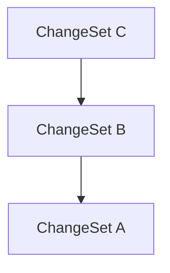

[**@lix-js/sdk**](../README.md)

***

[@lix-js/sdk](../README.md) / GraphTraversalModeDirect

# Type Alias: GraphTraversalModeDirect

> **GraphTraversalModeDirect** = `object`

Defined in: [packages/lix-sdk/src/database/graph-traversal-mode.ts:37](https://github.com/opral/monorepo/blob/affb4c9a3f726a3aa66c498084ff5c7f09d2d503/packages/lix-sdk/src/database/graph-traversal-mode.ts#L37)

Direct mode: Only the specified node is included.

No parent or child traversal is performed.



Selected node: A
Included: only A

## Example

```ts
const mode: GraphTraversalMode = { type: "direct" };
```

## Properties

### type

> **type**: `"direct"`

Defined in: [packages/lix-sdk/src/database/graph-traversal-mode.ts:38](https://github.com/opral/monorepo/blob/affb4c9a3f726a3aa66c498084ff5c7f09d2d503/packages/lix-sdk/src/database/graph-traversal-mode.ts#L38)
