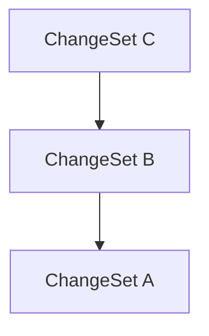

[**@lix-js/sdk**](../README.md)

***

[@lix-js/sdk](../README.md) / GraphTraversalModeRecursive

# Type Alias: GraphTraversalModeRecursive

> **GraphTraversalModeRecursive** = `object`

Defined in: [packages/lix-sdk/src/database/graph-traversal-mode.ts:67](https://github.com/opral/monorepo/blob/e71bdb871680205b7a92b34085dd7fe79344e0d0/packages/lix-sdk/src/database/graph-traversal-mode.ts#L67)

Recursive mode: Includes the specified node and all transitive parents (or children).

Optionally limits depth of traversal.



## Example

```ts
const mode: GraphTraversalMode = { type: "recursive" };
const mode: GraphTraversalMode = { type: "recursive", depth: 1 };
```

Selected node: C
Included:
- If `depth` is undefined: C → B → A
- If `depth` is 1: C → B only

## Properties

### depth?

> `optional` **depth**: `number`

Defined in: [packages/lix-sdk/src/database/graph-traversal-mode.ts:74](https://github.com/opral/monorepo/blob/e71bdb871680205b7a92b34085dd7fe79344e0d0/packages/lix-sdk/src/database/graph-traversal-mode.ts#L74)

Optional maximum depth to traverse.
- `depth = 0` includes direct parents/children only.
- `undefined` includes full ancestry/descendants.

***

### type

> **type**: `"recursive"`

Defined in: [packages/lix-sdk/src/database/graph-traversal-mode.ts:68](https://github.com/opral/monorepo/blob/e71bdb871680205b7a92b34085dd7fe79344e0d0/packages/lix-sdk/src/database/graph-traversal-mode.ts#L68)
