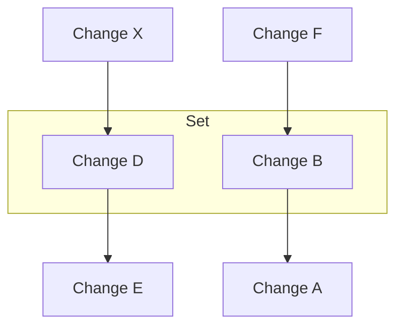

# Change Set

## Purpose

Group related changes.

## Description  

Changes in a set are treated as a single unit. They are merged, applied, described (commentied) and undone together. 

## Graph 

Changes D and B are in a set.



## Examples

### Discussions/Commenting

A [discussion](./90-discussion.md) points to a change set. A change set can contain 1 or many changes. 

### Inventory of a deparment store

A department store sells three types of shoes: **Shoe A**, **Shoe B**, and **Shoe C**. After each day, the inventory manager updates the stock levels and re-stocking dates in a CSV file.

#### Initial Table

| Product  | In Stock | Price |
|----------|----------|-------------------------------|
| Shoe A  | 120      | $89                    |
| Shoe B  | 150      | $124                    |
| Shoe C  | 200      | $78                    |

#### Changes

1. Change H - Update stock of **Shoe A** from 120 to 80 units.

2. Change L - Update stock of **Shoe B** from 150 to 100 units.

3. Change R - Update price of **Shoe C** from $78 to $89.

#### Change Sets

Both inventory stock changes are related because they reflect the stock level after 2022-09-01. If someone looks at the stock levels on 2022-09-01, they should see both changes.

However, the price change the manager made right after updating the stock levels is an independent change, and therefore, the store manager decided to not group it with the stock changes.

```plaintext
Change Set 1

- Comment: Update Stock Levels - date 2022-09-01
- Changes: [Change H, Change L]
```

```plaintext
Change Set 2

- Comment: Increased the price due to high demand  
- Changes: [Change R]
```

