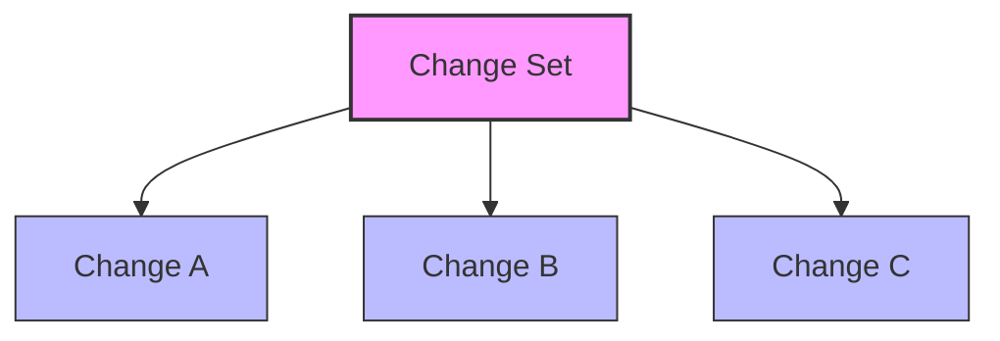
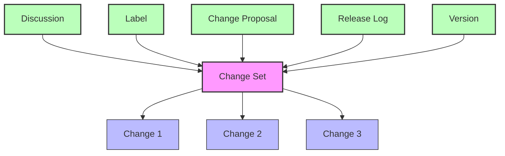
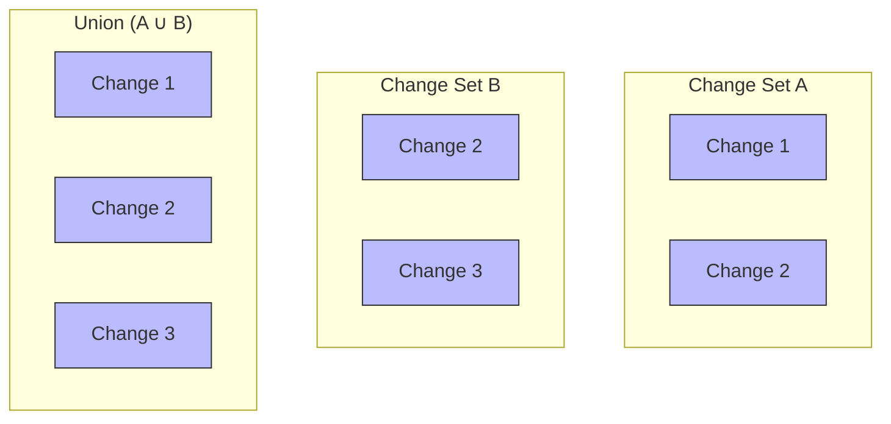
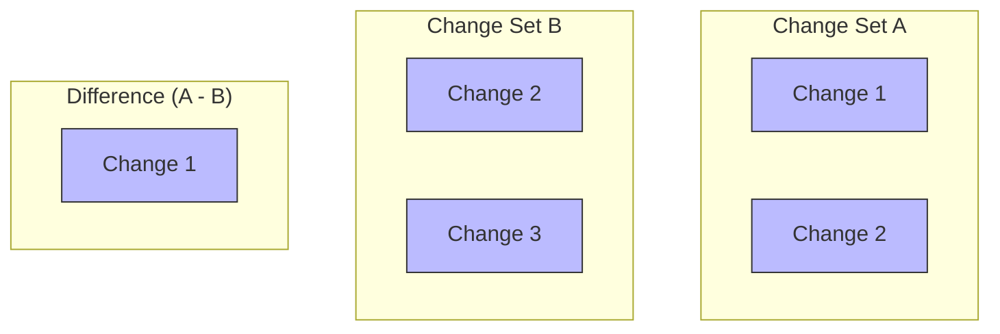
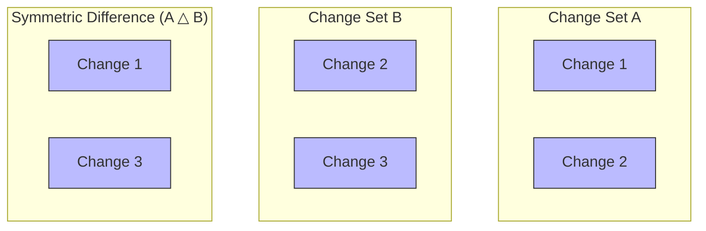

# Change Set

## Purpose

Change sets provide a unified way to group changes that can be referenced by various other concepts.

## Description  

**Change sets serve as a fundamental building block in the Lix system.** 

Many features need to express a set of changes. Change sets provide a unified way to do this and avoid the duplication of logic. 

> [!NOTE]
> By modeling Lix after set theory, Lix offers a simple mental model for complex operations. Set theory provides a mathematical foundation that eases reasoning about changes and features like merging, diffing, and change proposals.

## Diagrams

## Use Cases

Change sets enable various use cases:

1. **Discussions** - Attaching comments and feedback to a specific set of changes
2. **Tags** - Labeling sets of changes for easier querying and history tracking
3. **Change Proposals** - Proposing changes from one context to another
4. **Release Notes/Change Logs** - Documenting changes included in a release
5. **Versions** - Filtering applied changes in a specific development context

## Change Sets and Set Theory

Change sets in Lix follow the principles of mathematical set theory, making reasoning about changes simple and intuitive. This approach enables powerful operations through familiar set operations.

### Union (A ∪ B)

The union of two change sets contains all changes from both sets.

**Use case:** Combining changes from multiple sources, such as merging changes from different versions.

### Intersection (A ∩ B)

The intersection of two change sets contains only the changes present in both sets.

**Use case:** Finding common changes between two versions.

### Difference (A - B)

The difference contains changes that are in set A but not in set B.

**Use case:** Identifying changes unique to a version, proposal, or merge.

### Symmetric Difference (A △ B)

The symmetric difference contains changes that are in either set but not in both.

**Use case:** Creating change proposals by identifying changes that need to be merged from one version to another.

## Relationship to Other Concepts

- **[Changes](./50-change.md)**: Change sets group multiple changes together.
- **[Discussions](./110-discussion.md)**: Discussions can reference change sets to facilitate conversations about specific changes.
- **[Labels](./40-label.md)**: Labels can reference change sets for easier querying and history tracking.
- **[Change Proposals](./80-change-proposal.md)**: Change proposals use change sets to represent the source, target, and proposed changes.
- **[Merge](./70-merge.md)**: Merging typically involves combining changes from different change sets.