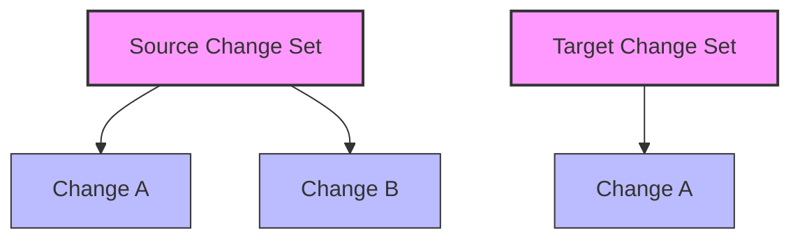
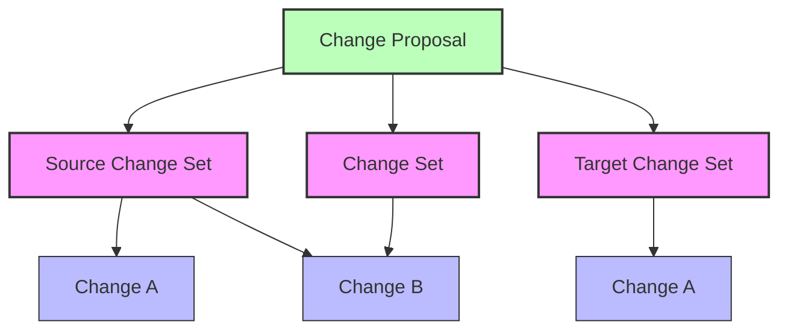
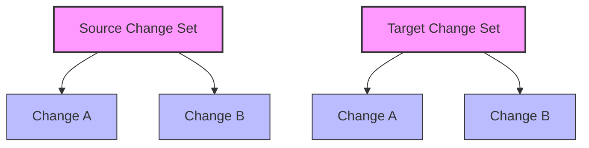

# Change Proposal

## Purpose

Enable collaborators to propose, discuss, and review changes.

## Description

Change proposals are particularly useful in collaborative environments where changes need to be reviewed, discussed, and approved before being merged.

A change proposal consists of:

1. A source change set pointer - a reference to the change set where the changes came from
2. A target change set pointer - a reference to the change set where the changes are proposed to be merged
3. A change set with the proposed changes.

Initially, the change set with the proposed changes is the symmetric difference between the source and target change sets.  

## Diagrams

### Change Proposal Workflow

The following diagrams illustrate the change proposal workflow:

#### 1. Initial State

Two change sets exist: Source and Target. Source has Changes A & B while Target only has Change A.

#### 2. Create Change Proposal

A change proposal is created from Source to Target, which creates a new change set. The new change set is initially set to the symmetric difference between Source and Target (Change B).

Users can now discuss, review, and approve the changes in the change proposal. Namely, that Change B should be merged into the Target change set. 

> [!NOTE]
> The source and target change sets can update during the change proposal process. Applications can notify users that the source or target change set has changed, and prompt if the change proposal (change set) should be updated.

#### 3. Merge Change Proposal

Merging a change proposal updates the target change set with the changes from the change proposal. 

> [!NOTE]
> Applications can offer UIs to selectively merge changes from the change proposal. There is no requirement to merge all changes.

## Relationship to Other Concepts

- **[Change Sets](./60-change-set.md)**: A change proposal references three change sets: source, target, and the symmetric difference.
- **[Discussion](./90-discussion.md)**: Change proposals can have associated discussions for review and feedback.
- **[Merge](./70-merge.md)**: After a change proposal is approved, the changes can be merged from the source to the target change set.