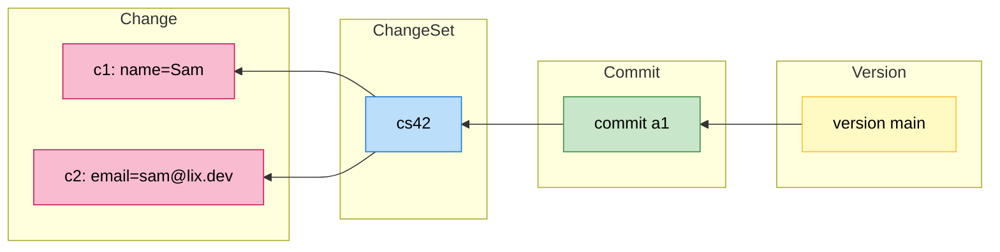
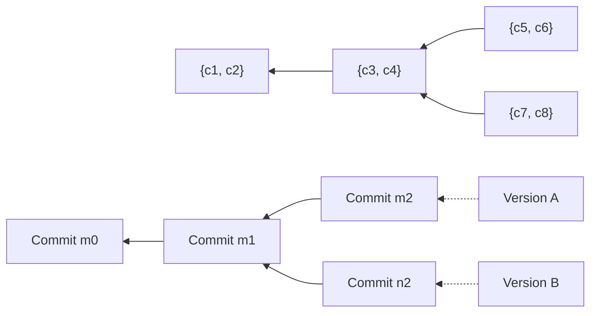
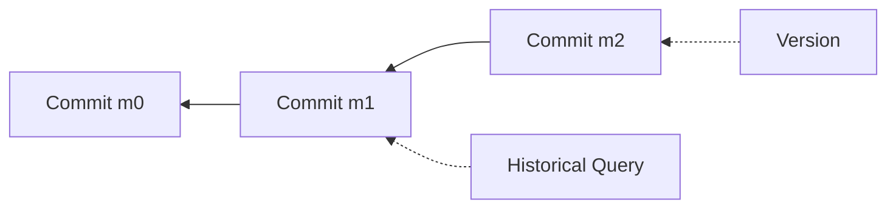
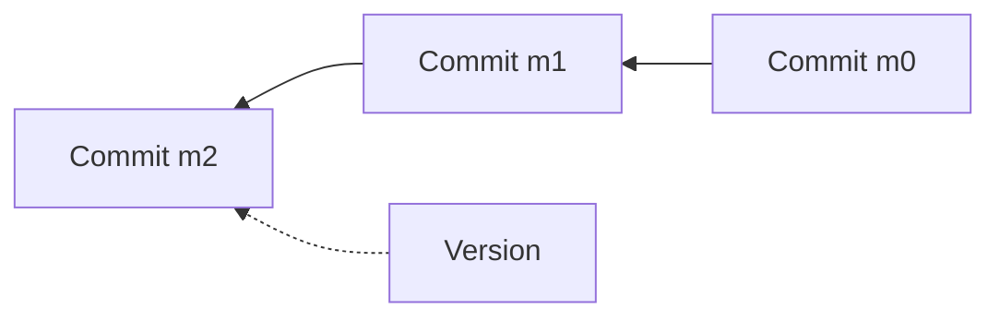
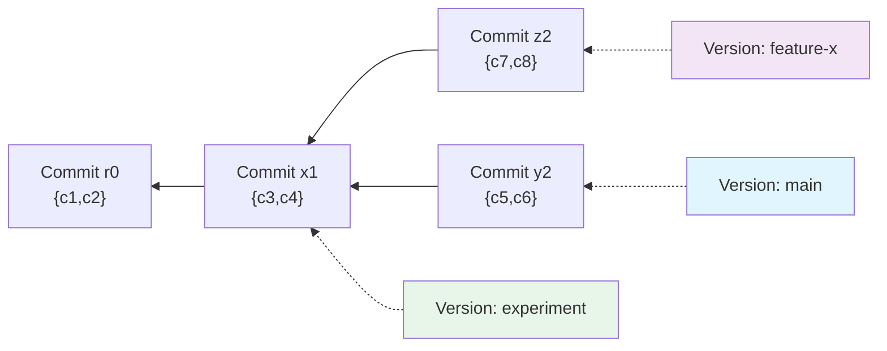

# Architecture

## Core Concepts

Lix represents all data through four fundamental concepts that build upon each other:

1. **Change** – the atomic unit.
2. **Change set** – groups related changes.
3. **Commit** – forms a graph of change sets that define state.
4. **Version** – points to a specific state by referencing a commit.

In this example, two changes (`c1`, `c2`) serve as atomic units—enabling fine-grained diffing and cherry-picking—while the change set `cs42` groups them together, signaling they belong together while preserving their individual atomicity. The commit `a1` materializes this change set into state, forming a point in time that can be referenced, traversed, and compared. The version `main` acts as a named pointer to this commit, defining what state is currently visible.

## Advanced Concepts

### Divergent Versions

Multiple versions can point at different commits, creating divergent histories that remain isolated until you merge them.

Here, Versions A and B share commit `m1` and then diverge. Each version maintains its own pointer until you review and merge the changes.

### Historical State

Inspecting history means selecting a commit (or its change set) and rehydrating the state that existed there. Any commit in the DAG can be materialised even if no version currently points at it.

## On Demand State Materialisation

Lix does not persist full snapshots. Instead it stores:

- raw changes with their payload,
- membership of each change in a change set,
- commits that materialise change sets and point to parents,
- and a lightweight pointer from each version to its tip commit (plus the working commit used for drafts).

When you request state, the engine walks the commit graph, gathers the change sets that are reachable from the target commit, and applies the newest change for every entity. The traversal is cached internally so queries stay fast without materialising full snapshots.

### Materialisation Logic

Conceptually, materialisation follows three steps:

1. Collect every change set reachable from the target commit.
2. Take the union of the underlying changes along that path.
3. Select the leaf change per entity/schema/file so only the most recent edit survives.

Consider this example with two entities (`e1`, `e2`). The lineage of change sets might look like this:

1. The union of all change sets in the lineage is taken:

   `CS1 ∪ CS2 ∪ CS3 = { e1: "benn", e1: "julia", e2: "gunther" }`

2. Filter for leaf changes, which are the latest changes for each entity:
   - For `e1`, the latest change is `"julia"` from `CS2`.
   - For `e2`, the latest change is `"gunther"` from `CS3`.

3. The resulting state is:

   `State = { e1: "julia", e2: "gunther" }`

## Commit Graph

State is expressed by the commit graph. Each commit packages the change set that advanced the system and links it to earlier commits, so walking the graph tells you exactly how a piece of state came to be. Versions are simply named pointers into that graph, and moving a version pointer just selects which commit’s state is visible.

The commit graph is global, so any version can walk parents, replay change sets, and understand how another version reached its state.

## Foreign Keys

Lix supports foreign key constraints to maintain referential integrity between entities.

For simplicity, Lix only allows foreign keys on entities in the same version scope, with the exception of references to changes themselves. This avoids cascading effects across versions and acknowledges that changes are versionless—they live outside the version system as the immutable source of truth tracked by commits.

| Rule                                                  | Rationale                                                                        | Engine behaviour                                                                   |
| ----------------------------------------------------- | -------------------------------------------------------------------------------- | ---------------------------------------------------------------------------------- |
| **1. Version‑scoped → change**                        | Changes live outside any version, so the reference is valid across all versions. | Validator skips the `version_id = ?` check when the target schema is `lix_change`. |
| **2. Version‑scoped → version‑scoped (same version)** | Keeps each version self‑contained and makes deletes cheap.                       | Current logic stands: both rows must share the same `version_id`.                  |
| **3. Change → version‑scoped**                        | Would immediately violate Rule 2.                                                | Disallowed at schema‑registration time.                                            |

> **Result:** An example_entity or comment lives inside a specific version, but can freely point at any `lix_change.id` without special handling. System metadata like commits and change-set elements stay in the global scope and follow the same rules when they reference `lix_change`.
