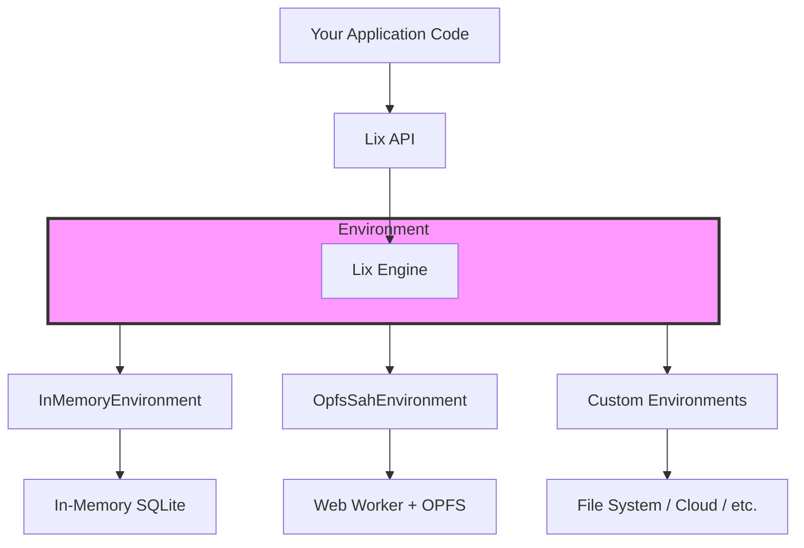

# Environment API

The Environment API is Lix's abstraction layer that lets you run the same code everywhere — from browser tabs to Node.js servers to test suites. Each Environment is a container where the Lix Engine runs alongside SQLite, handling both where your data lives and how your code executes, so you don't have to worry about platform differences.

## Why Environments Matter

When building applications with Lix, you need different storage and runtime strategies depending on where your code runs:

- **In tests**: You want fast, isolated, in-memory databases
- **In browsers**: You need persistent storage that doesn't block the UI
- **In Node.js**: You might want file-based SQLite or custom backends
- **In development**: You want easy debugging and quick iteration

Environments solve this by providing a consistent interface while handling platform-specific details under the hood.

## Architecture Overview



## Available Environments

The Lix SDK provides two built-in environments that cover most use cases:

### InMemoryEnvironment (Default)

The simplest environment that runs everything in memory on the current thread.

**When to use:**

- Unit tests and test suites
- CLI tools and scripts
- Development and prototyping
- Quick operations where persistence isn't needed

**Characteristics:**

- ✅ Zero setup required
- ✅ Fastest for small operations
- ✅ Perfect for testing
- ⚠️ No persistence (data lost on reload)
- ⚠️ Blocks the browser UI thread for heavy operations

### OpfsSahEnvironment

A production-ready browser environment using Web Workers and [OPFS SAH (Origin Private File System with Synchronous Access Handles)](https://sqlite.org/wasm/doc/tip/persistence.md#vfs-opfs-sahpool).

**When to use:**

- Production web applications
- Browser extensions
- PWAs and offline-first apps
- Any browser app needing persistent storage

**Characteristics:**

- ✅ Non-blocking (runs in Web Worker)
- ✅ Persistent storage across sessions
- ✅ Fastest performance in the browser
- ⚠️ Browser-only (requires OPFS support)

## How Environments Work

Each environment is a runtime container that hosts the Lix Engine and manages two key responsibilities:

### 1. Storage Management

Environments decide where and how your SQLite database lives — whether that's in memory, in browser storage, or on disk. They handle creating, loading, and persisting your data.

### 2. Engine Isolation

Environments determine where the Lix Engine executes. The InMemoryEnvironment runs the engine on your main thread (simple but can block UI), while OpfsSahEnvironment runs the engine in a Web Worker (non-blocking but requires message passing). The engine always runs inside the environment, never separately.

## Practical Examples

### Basic Usage with openLix()

Most applications should use `openLix()` which automatically selects the right environment:

```typescript
import { openLix } from "@lix/sdk";

// Automatically uses OpfsSahEnvironment in browsers,
// InMemoryEnvironment in Node.js
const lix = await openLix();
```

### Explicit Environment Selection

When you need specific control:

```typescript
import { openLix, OpfsSahEnvironment, InMemoryEnvironment } from "@lix/sdk";

// For production browser apps
const lix = await openLix({
  environment: new OpfsSahEnvironment({ key: "my-app" }),
});

// For tests
const lix = await openLix({
  environment: new InMemoryEnvironment(),
});
```
