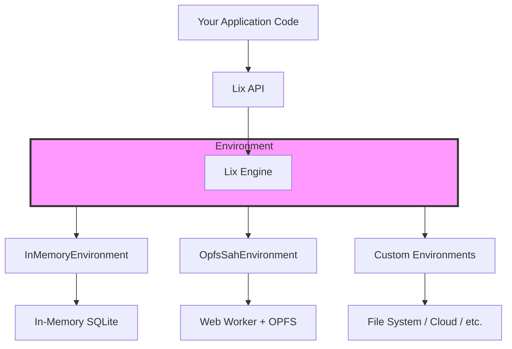

# Environment API

The Environment API lets you use Lix across different platforms: browser tabs, Node.js servers, or test suites.

Environments define where the Lix engine executes and how data is stored. You can run Lix in-memory for testing, use OPFS for browser persistence, or build custom integrations for your own backend.

## Why Environments Matter

When building applications with Lix, you need different storage and runtime strategies depending on where your code runs:

- **In tests**: You want fast, isolated, in-memory databases
- **In browsers**: You need persistent storage that doesn't block the UI
- **In Node.js**: You might want file-based SQLite or custom backends
- **In development**: You want easy debugging and quick iteration

Environments solve this by providing a consistent interface while handling platform-specific details under the hood.

## Architecture Overview



## Available Environments

The Lix SDK provides two built-in environments that cover most use cases:

### InMemoryEnvironment (Default)

The simplest environment that runs everything in memory on the current thread.

**When to use:**

- Unit tests and test suites
- CLI tools and scripts
- Development and prototyping
- Quick operations where persistence isn't needed

**Characteristics:**

- ✅ Zero setup required
- ✅ Fastest for small operations
- ✅ Perfect for testing
- ⚠️ No persistence (data lost on reload)
- ⚠️ Blocks the browser UI thread for heavy operations

### OpfsSahEnvironment

A production-ready browser environment using Web Workers and [OPFS SAH](https://sqlite.org/wasm/doc/tip/persistence.md#vfs-opfs-sahpool) (Origin Private File System with Synchronous Access Handles). SAH provides the fastest SQLite performance in browsers by allowing synchronous file operations in a worker.

**When to use:**

- Production web applications
- Browser extensions
- PWAs and offline-first apps
- Any browser app needing persistent storage

**Characteristics:**

- ✅ Non-blocking (runs in Web Worker)
- ✅ Persistent storage across sessions
- ✅ Fastest performance in the browser
- ⚠️ Browser-only (requires OPFS support)

## How Environments Work

Each environment is a runtime container that hosts the Lix Engine and manages two key responsibilities:

### 1. Storage Management

Environments decide where and how your SQLite database lives: in memory, in browser storage, or on disk. They handle creating, loading, and persisting your data.

### 2. Engine Isolation

Environments determine where the Lix engine executes:

- **InMemoryEnvironment**: Runs on your main thread. Simple, but can block the UI during heavy operations.
- **OpfsSahEnvironment**: Runs in a Web Worker. Non-blocking, but communication happens through message passing between threads.

The engine always runs inside the environment, never separately.

## Practical Examples

### Basic Usage with openLix()

Most applications should use `openLix()` which automatically selects the right environment:

```typescript
import { openLix } from "@lix/sdk";

// Automatically uses OpfsSahEnvironment in browsers,
// InMemoryEnvironment in Node.js
const lix = await openLix();
```

### Explicit Environment Selection

When you need specific control:

```typescript
import { openLix, OpfsSahEnvironment, InMemoryEnvironment } from "@lix/sdk";

// For production browser apps
const lix = await openLix({
  environment: new OpfsSahEnvironment({ key: "my-app" }),
});

// For tests
const lix = await openLix({
  environment: new InMemoryEnvironment(),
});
```

## Writing a Custom Environment

If you need to run Lix somewhere else (another storage backend, a specialized worker, a native shell), you can implement your own environment by satisfying the `LixEnvironment` interface.

At minimum you must provide persistence primitives (`create`, `exists`, `exec`, `export`, `close`) and implement `open()` so the SDK can boot the engine next to your database. The `call()` method must forward engine RPCs across your boundary (e.g. to a worker thread or other process).

Environments that support isolated execution can additionally expose `spawnActor(opts)`:

```ts
const actor = await environment.spawnActor?.({
  entryModule: new URL("./diff-worker.js", import.meta.url).href,
  name: "diff-render",
});

actor?.subscribe((message) => console.log("actor message", message));
actor?.post({ type: "render", payload: diffs });
```

The SDK uses this capability to offload work (for example, diff rendering) when available, but will fall back to running tasks inline when `spawnActor` is absent. When authoring a custom environment you only need to implement this hook if you can actually spawn workers in your target runtime; otherwise, you can omit it.
