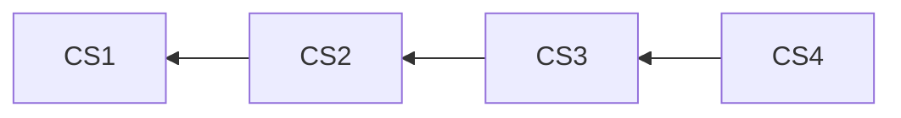

import CodeSnippet from "./components/code-snippet";
import * as example from "./examples/history.ts";
import exampleSrcCode from "./examples/history.ts?raw";

# History

Lix provides history APIs built on automatically captured changes in state. This enables the creation of powerful features like [audit trails](./attribution), [version](./versions) history, or [restore](./restore) functionality.

## Examples

> [!NOTE]
> The change set graph in Lix is global and shared across all versions. This means you don't need to provide a version ID when querying history—you simply query at a specific change set. All versions share the same understanding of history because they all reference the same [global change set graph](../architecture.md#core-data-model).

### Get history for a specific file

To query the history of a file, you need to specify which commit you want to view the history from. The `lixcol_root_commit_id` field is used to filter the results to a specific point in the commit graph.

> Tip: Always filter by `lixcol_root_commit_id` (and usually `lixcol_depth = 0` for the head) to avoid mixing multiple timelines in a single query result.

<CodeSnippet
  module={example}
  srcCode={exampleSrcCode}
  sections={["file-history"]}
/>

### Get history for a specific entity

You can also query the history of a single entity, like a paragraph in a Markdown file or a row in a CSV. This is useful for building features like comment threads or fine-grained audit trails.

<CodeSnippet
  module={example}
  srcCode={exampleSrcCode}
  sections={["entity-history"]}
/>

### Get history for a file within a specific version

To get the history of a file for a specific version, you simply query using that version's change set ID as the root. The history view will automatically traverse the change set graph to show all historical states.

<CodeSnippet
  module={example}
  srcCode={exampleSrcCode}
  sections={["version-specific-history"]}
/>

## Data Model

History is simply querying state at a specific change set. Because the change set graph is global, no version needs to be specified when querying history. Every change set is part of the same unified structure, allowing you to traverse the history without worrying about which version you are in.

### Example

Imagine a file, `config.json`, changes over time. Each change creates a new change set that points to its predecessor:

- **CS1:** `config.json` is created with `{ "setting": "A" }`.
- **CS2:** `config.json` is updated to `{ "setting": "B" }`.
- **CS3:** `config.json` is updated to `{ "setting": "C" }`.
- **CS4:** `config.json` is updated to `{ "setting": "D" }`.

Querying the history at change set CS3 entails traversing the graph backward from that point:

<CodeSnippet
  module={example}
  srcCode={exampleSrcCode}
  sections={["history-data-model"]}
/>
