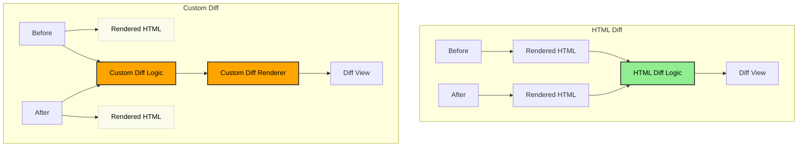

# 🧬 (Experimental) Lix HTML Diff

Build a diff view in your app with this HTML differ ✨

This package offers a simple way to generate and display diffs for any app UI using the "HTML trick" - since most apps ultimately render to HTML, you can use this HTML diff to visualize changes in your application's interface.

- ✅ Universal: Works for any app that renders to HTML (which is most apps!)
- ✅ Simple: No need for renderer-specific diff logic.
- ✅ Styling: Uses your existing CSS.
- ✅ Works in any framework (React, Vue, Svelte, Angular, etc.)

## How Does It Work? (The Rendered HTML Trick)

The core idea is to diff the _rendered HTML output_ instead of source data structures, given that anything is rendered as HTML anyway. This bypasses the need for custom diff implementations.

**Legend:**

- 🟧 Custom development effort required
- 🟩 No custom development required (reusable)
- ⚪ Unused in the diffing process



### Comparison

#### Custom Diff Approach (🟧)

- Creates a new "diff" AST specific to what should be diffed
- Requires modifying the renderer to understand the custom diff
- One-off solution not generalizable to other document types

#### HTML Diff Approach (🟩)

- requires no adjustments from developers (!) in terms of creating a diffed AST and adjusting the renderer
- generalizes across any app UI that renders to HTML (leveraging the "HTML trick" that most apps ultimately produce HTML)

## Usage

1. Add `data-diff-id` attributes to your rendered HTML elements.
2. Use `renderHtmlDiff` to generate a diff HTML string.
3. Display the diff HTML string in your app.

```typescript
import { renderHtmlDiff } from "@lix-js/html-diff";

const beforeHtml = "<p data-diff-id='p1'>Old text.</p>";
const afterHtml =
  "<p data-diff-id='p1'>New text!</p><p data-diff-id='p2'>Added.</p>";

const diffHtmlString = renderHtmlDiff({ beforeHtml, afterHtml });

document.getElementById("diff-container")!.innerHTML = diffHtmlString;
```

## ⚠️ Limitations

**`data-diff-id` Required:** Diff quality depends on stable `data-diff-id` attributes being present in the rendered HTML.

---

<details>
<summary>🧪 Development & Visual Testing</summary>

This package includes a Vite-based visual test website to help develop and debug the `renderHtmlDiff` function.

**Running the Test Website:**

1.  Ensure monorepo dependencies are installed (`pnpm install` from root).
2.  Start the dev server:

    ```bash
    # From monorepo root
    pnpm --filter html-diff dev

    # Or from this package directory
    pnpm dev
    ```

</details>

## Styling the Diff Output

The diff renderer uses semantic CSS classes to style changes:

- `.diff-before` — applied to elements representing removed or old content
- `.diff-after` — applied to elements representing added or new content

### Default Styles

A default stylesheet is provided with the package:

```js
import "@lix-js/html-diff/default.css";
```

Or, add it to your HTML:

```html
<link rel="stylesheet" href="/node_modules/@lix-js/html-diff/default.css" />
```

This file provides sensible defaults:

```css
.diff-before {
  color: red;
  text-decoration: none;
  outline: none;
}
.diff-after {
  color: green;
  text-decoration: none;
  outline: none;
}
```

You can override these styles in your own CSS for custom themes or branding:

```css
.diff-before {
  color: #b00;
  background: #fee;
}
.diff-after {
  color: #080;
  background: #efe;
}
```

### Merging with Existing Classes

If your original elements have classes, the diff classes will be merged (e.g. `<p class="foo diff-after">`).
