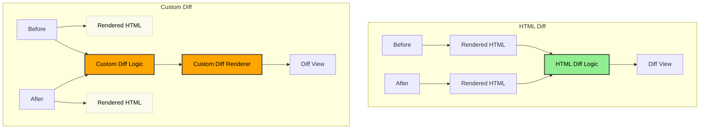

import { Showcase } from "../components/showcase";

# How it Works

The core idea is to diff the _rendered HTML output_ instead of source data structures, given that apps render UI as HTML anyway. This bypasses the need for custom diff implementations.

**Legend:**

- 🟧 Custom development effort required
- 🟩 No custom development required (reusable)
- ⚪ Unused in the diffing process

The diagram above shows two approaches to building diff views. The **Custom Diff** approach (🟧) requires building and maintaining specialized diff logic and custom renderers for each document type. This means more development effort and one-off solutions that don't generalize.

In contrast, the **HTML Diff** approach (🟩) leverages the fact that most applications ultimately render to HTML. Rather than building custom diff logic, it works directly with the rendered HTML output. This requires no adjustments from developers in terms of creating diffed data structures or modifying renderers - it simply takes your existing HTML and adds CSS classes to highlight changes. This approach generalizes across any application UI that renders to HTML, making it a reusable solution.

## How Elements Are Tracked

HTML diff uses `data-diff-key` attributes to track elements across before/after states. Here's what happens:

### Structure Preservation

Adding `data-diff-key` to elements **only adds CSS classes** - it doesn't modify the HTML structure:

- ✅ **No structural changes**: Elements keep their original structure, attributes, and content
- ✅ **Only CSS classes added**: Elements get `diff-created`, `diff-updated`, or `diff-deleted` classes
- ✅ **Preserves layout**: No new elements inserted, so CSS layouts (tables, flexbox, grid) remain intact

<Showcase
  before={`<table class="pricing-table">
  <tr>
    <td data-diff-key="cost">$8</td>
    <td data-diff-key="price">$40</td>
  </tr>
</table>`}
  after={`<table class="pricing-table">
  <tr>
    <td data-diff-key="cost">$6</td>
    <td data-diff-key="price">$45</td>
  </tr>
</table>`}
  css={`
    .pricing-table {
      border-collapse: collapse;
    }
    .pricing-table td {
      border: 1px solid #ccc;
      padding: 8px;
    }
    .diff-updated {
      background-color: #fff3cd;
      color: #856404;
    }
  `}
/>

Notice how in the diff result:

- Table structure remains intact (no broken layout)
- Only CSS classes are added to the `<td>` elements
- No wrapper elements or structural modifications

### Diffing Modes

The progression of diffing granularity:

1. **No attributes**: No diffing, HTML unchanged
2. **`data-diff-key` only**: CSS classes added to changed elements
3. **`data-diff-key` + `data-diff-mode="element"`**: Explicit atomic element diffing (entire element marked as updated)
4. **`data-diff-key` + `data-diff-mode="words"`**: Granular word-level diffing with spans

This approach makes `data-diff-key` safe for complex layouts like tables, where inserting wrapper elements would break the structure.
