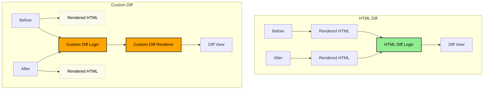

# Why HTML Diff?

The core idea is to diff the _rendered HTML output_ instead of source data structures, given that anything is rendered as HTML anyway. This bypasses the need for custom diff implementations.

**Legend:**

- 🟧 Custom development effort required
- 🟩 No custom development required (reusable)
- ⚪ Unused in the diffing process

## Comparison

### Custom Diff Approach (🟧)

- Creates a new "diff" AST specific to what should be diffed
- Requires modifying the renderer to understand the custom diff
- One-off solution not generalizable to other document types

### HTML Diff Approach (🟩)

- requires no adjustments from developers (!) in terms of creating a diffed AST and adjusting the renderer
- generalizes across any app UI that renders to HTML (leveraging the "HTML trick" that most apps ultimately produce HTML)