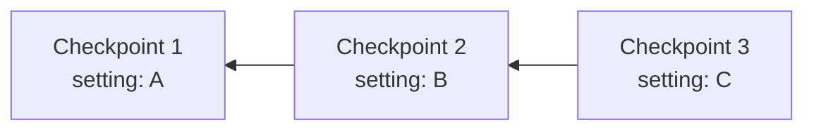

# History

Query complete change history for files and entities using SQL.

## How History Works

History walks the commit graph backwards from a starting point:

Querying from Checkpoint 3 traverses backwards, showing states at C3, C2, and C1. The `lixcol_depth` field indicates distance from the starting point (0 = starting point, 1 = one step back, etc.).

> [!NOTE]
> The commit graph is global and shared across all versions. You query at a specific commit, not a version. All versions reference the same unified graph structure.

## File History

Query file state at specific checkpoints to see how it changed over time:

<CodeSnippet
module={example}
srcCode={exampleSrcCode}
sections={["file-history"]}
/>

Query `file_history` with `lixcol_root_commit_id = checkpoint.id` and `lixcol_depth = 0` to get the file state at that specific checkpoint.

## Entity History

Query history for specific entities like key-value pairs, custom data types, or plugin-defined entities:

<CodeSnippet
module={example}
srcCode={exampleSrcCode}
sections={["entity-history"]}
/>

Entity-level history enables fine-grained audit trails and tracking for individual data points beyond files.

## Query History at Checkpoints

Query file state at any specific checkpoint:

<CodeSnippet
module={example}
srcCode={exampleSrcCode}
sections={["checkpoint-history"]}
/>

Use `lixcol_depth = 0` to get the state at that exact checkpoint.

> [!TIP]
> Lix automatically commits every change. Checkpoints are optional labels for important moments. Always filter by `lixcol_root_commit_id` to scope history to a specific point and avoid mixing timelines.
